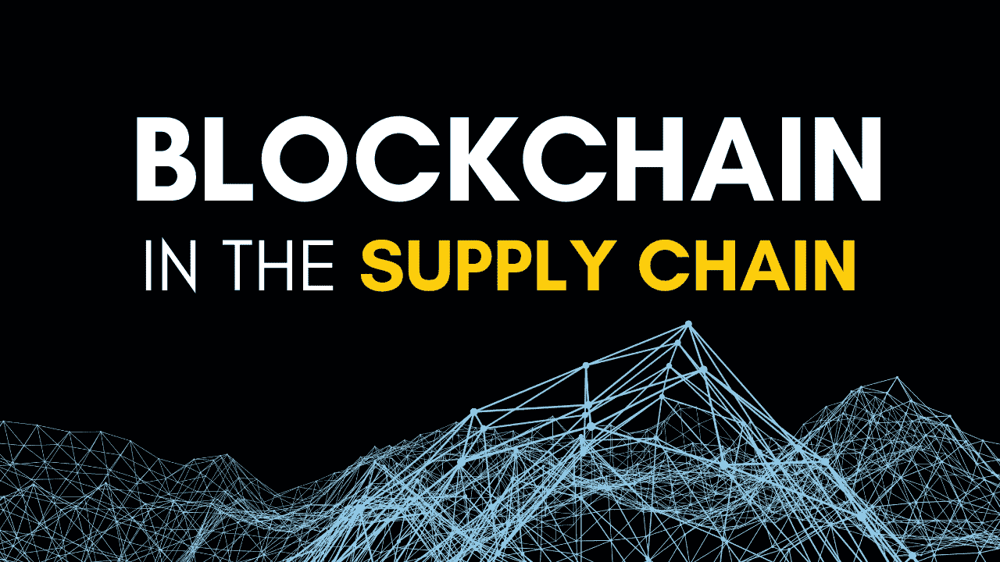
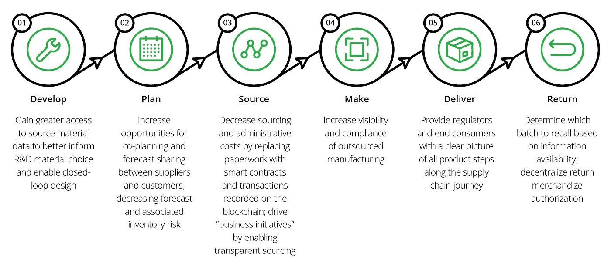
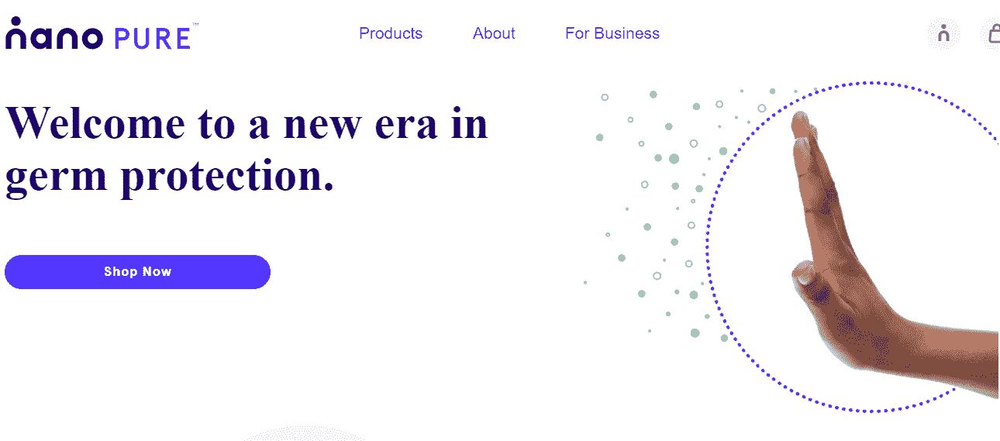
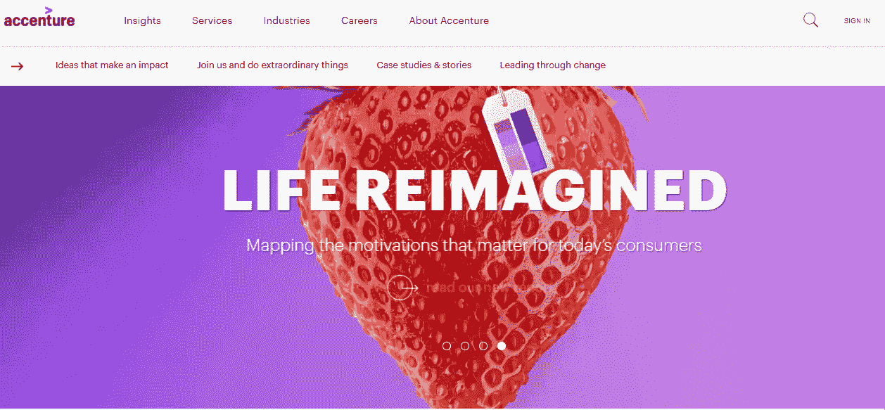

# 区块链是如何重塑供应链行业的？

> 原文：<https://medium.com/nerd-for-tech/how-is-blockchain-reshaping-the-supply-chain-industry-2bb4f6519ff9?source=collection_archive---------10----------------------->

供应链是一个复杂的系统，已经存在了几个世纪。它管理商品从制造商到零售商和消费者的流动，提供一种跟踪库存、发货等的方法。

供应链行业已经存在很长时间了。它是管理货物、服务或信息从一个地点到另一个地点的流动和分配的过程，以保持一切井然有序。参与这一系统的包括制造商、供应商、分销商/批发公司、零售商(作为客户)和消费者。它也被称为供应链管理系统或 SCMS。

[区块链技术](https://emma347.medium.com/what-is-blockchain-how-is-blockchain-technology-going-to-help-e0593a60a046)打破了这种传统模式，为公司提供了一种无需依赖第三方供应商就能跟踪其产品的有效手段。这篇博文将讨论区块链如何帮助你控制你的供应链！

这项技术已经彻底改变了人们和公司开展业务的方式，尤其是在这个行业。这种新的软件开发平台提供了一种有效的方式来跟踪库存、发货等，而无需其他第三方供应商参与该过程。大规模协作验证了这些交易，这允许业务伙伴更公开地共享信息，并建立一个分散的系统。

# **区块链在供应链管理中的优势**

区块链为公司提供了一种高效的方式来跟踪库存、发货等。，没有第三方厂商。区块链技术有可能通过提高整个供应链的透明度和问责制来改变这个行业(例如:减少纠纷)。

区块链的使用正在迅速扩大，但它仍处于初级阶段-对于那些希望现在就实施它的公司来说，有很多机会！因此，让我们了解区块链在供应链管理系统中的应用:

**主要潜在利益:**

*   区块链通过提高材料供应链的可追溯性，确保符合企业标准。
*   它增强了对外包合同制造的可见性和合规性，以获得对流程的更多控制。
*   它通过减少灰色市场交易或伪造的损失来拯救公司。通过在业务流程中引入透明度，这是可能的。
*   与区块链软件开发，你不需要通过文书工作的混乱。由于文书工作和数字可见性的减少，简化管理流程变得更加容易。

**次要潜在优势:**

*   如你所知，区块链提供了产品所用材料的透明度。它帮助你建立一个强大的公司声誉。
*   它还能让你避免因供应链中的不当行为而引发的潜在公共关系风险。
*   通过数据安全，公司提高了可信度和公众信任度。它超越了他们的声誉，有助于提供值得信赖的服务。
*   如果您选择在供应链中实施区块链解决方案，您需要利益相关方的合作。它有助于建立一个更具协作性的生态系统，并吸引利益相关者。

## **区块链将如何简化供应链？**

在管理供应链时，公司需要处理许多文档和巨大的复杂性。跟踪发货、核实采购、开账单、对账和收货似乎很有挑战性。通过集成区块链技术，您可以提高业务流程的效率和速度。

供应链中的领导力将激励你抓住可持续发展的机会。在这个过程中，你需要在供应链管理的核心流程中实现区块链来简化它。让我们来理解这是怎么可能的:

**智能合同**:智能合同的创建简化了供应链管理。在区块链软件开发中，智能合同反映了在满足预定条件时运行的简单程序。来自分类帐的任何输入都会在需要时触发事件。

**没有文书工作**:通过删除文书工作的要求，供应链中的事情变得容易管理。在区块链的帮助下，你可以在交易双方之间创建防篡改的“总账”。它也让你免于不正确的发票。

**单一系统:**使用该技术，您可以从多个系统转换到单一系统。区块链支持单一系统概念。这意味着只为每个伙伴生成一个访问点。但是，该链在管理系统中的所有伙伴节点之间复制。

在商业中使用预先定义的和组织良好的方法将有助于行业实现其目标。通过包含区块链技术的上述方面，供应链超越了效率并加速了公司的发展。

## **供应链应用**

图片来源:[德勤](https://www2.deloitte.com/us/en/pages/operations/articles/blockchain-supply-chain-innovation.html)

上述步骤是供应链的组成部分。通过区块链，公司毫不费力地增加了每一步的透明度。它还降低了欺诈和假冒采购的风险。

这将提升你作为负责任制造的领导者的地位。多关注你的竞争对手，开发一个区块链原型来增加你的成功率。

## **区块链技术的实际例子**

继比特币和加密货币之后，区块链科技已经准备好在不同行业大干一场。理解区块链在商业发展中的重要性的一些最佳例子是:

## **1。医疗保健**

**MedicalChain** :通过整合区块链技术，MedicalChain 成为首个使用该技术促进电子健康记录管理的医疗行业。

**纳米视觉:**纳米视觉体现了区块链和人工智能在纳米令牌上收集分子级数据的美丽融合。他们的努力推进了医疗信息和管理数据记录。

## **2。保险**

**埃森哲:**埃森哲紧跟技术进步的步伐，将区块链技术应用到保险项目中。这有助于他们建立客户的信任因素。

**3。房地产**

**建议:**提供良好的房地产佣金，为购房者和卖家提供新的方式。

**无处不在:**作为软件即服务(Saas)的区块链平台，它提供了轻松的用户体验来管理物业信息。它还确保所有权的适当记录。

## **结论**

区块链技术在比特币上的应用展现了它的重要性。因此，公司试图实施该技术来获得预期的结果。通过供应链管理中的[区块链技术解决方案](https://www.valuecoders.com/blockchain-development-company?utm_source=medium-blockchain&utm_medium=d7)，您可以处理日期、质量、认证、价格和其他必要的细节。因此，与区块链顶级发展公司联系，简化供应链管理中的业务流程。