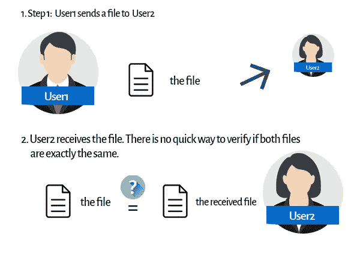
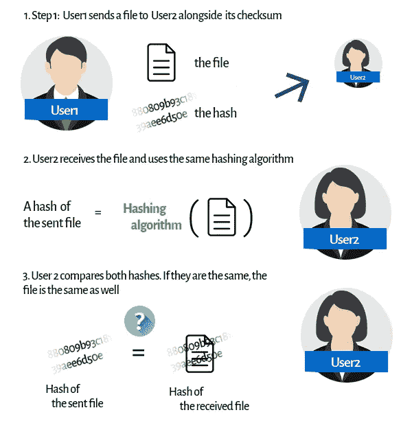
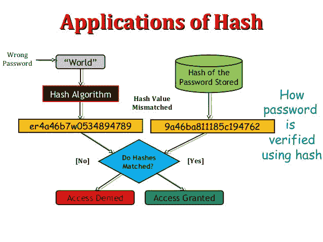
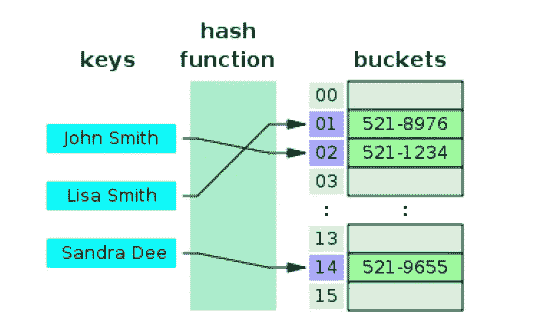

# JavaScript 如何使用散列法

> 原文：<https://medium.com/nerd-for-tech/how-javascript-uses-hashing-ecad106b2e31?source=collection_archive---------8----------------------->

**TLDR —** 哈希处理是指获取某个值(例如您的密码)，对其应用某种数学运算(MD5、SHA-1、SHA-2 ),称为哈希算法或哈希函数，并获得最终更改的值(称为哈希或哈希值或摘要消息)。这通常用于密码和检查文档准确性。请参见下图:


[*来源*](https://blog.jscrambler.com/hashing-algorithms/#:~:text=A%20hashing%20algorithm%20is%20a,way%20function%2C%20infeasible%20to%20invert.)

它们是哈希的三个主要用途，即用于确保准确性的文档哈希、用于提高安全性的密码哈希和用于索引数据的哈希表。

# 1.确保准确性的文档哈希

文档散列法解决的问题是这样的:假设你有一份很大的法律文档正在通过电子邮件发送，而收据无法判断是否有人修改了文档中的某一页。也许有人在销售价格上加了一个“0”或者去掉了一个条款。你怎么会知道？



[*来源*](https://blog.jscrambler.com/hashing-algorithms/#:~:text=A%20hashing%20algorithm%20is%20a,way%20function%2C%20infeasible%20to%20invert.)

文档散列可以解决这个问题，因为发送者可以通过键入以下内容来产生文档的散列值:

```
(Example in Lunix)#Input
sha256sum /path/to/file#RESULTING HASH VALUE
c01b39c7a35ccc3b081a3e83d2c71fa9a767ebfeb45c69f08e17dfe3ef375a7b
```

一旦完成，发送者就可以正常发送文件和哈希值。文档的接收可以重复上述步骤，然后比较散列值。如果它们不一样，你知道文件是不一样的，发送的文件在某些方面被改变了，见下面的例子。



[*来源*](https://blog.jscrambler.com/hashing-algorithms/#:~:text=A%20hashing%20algorithm%20is%20a,way%20function%2C%20infeasible%20to%20invert.)

一个真实的例子可以在 Ubuntu 的网站上看到，他们的操作系统的 ISO 带有一个哈希值，所以如果你想检查，你可以确定你拥有的是他们发布的相同版本。[点击此处了解更多信息](https://ubuntu.com/tutorials/how-to-verify-ubuntu#1-overview)

# 2.提高安全性的密码散列法

出于安全原因，您可能希望将密码存储为哈希值(将密码存储在哈希值中是行业标准)。这些措施可以防止未经授权访问数据库的人获取系统中每个用户的密码。哈希对密码执行一个**单向**转换，将密码转换成另一个字符串，称为**哈希密码**。“单向”意味着实际上不可能走另一条路——将散列密码变回原始密码。

请参见下面的 Node.js 示例。

```
// Node.js using the crypto moduleconst crypto = require ( 'crypto' ); //line 1const hash = crypto.createHash( 'sha256' ); //line 2hash.update( 'some data to hash' ); //line 4console .log(hash.digest( 'hex' )); //line 5// Prints:// 6a2da20943931e9834fc12cfe5bb47bbd9ae43489a30726962b576f4e3993e50
```

当成员尝试登录时，个性化模块获取提供的密码，执行类似的单向散列，并将其与数据库值进行比较。如果密码匹配，则登录成功，否则会出现登录错误。参见下面的例子。



[来源](https://www.slideshare.net/shimulsakhawat/hashing-51192541)

# 3.用于快速数据索引的哈希表

您还可以使用哈希函数，该函数接收字符串或数值作为输入，并生成整数作为输出。这些类型的哈希算法用于创建哈希表。哈希表存储键值对。例如，假设您想要存储一组人的姓名和电话号码。键可以是人的名字，值可以是电话号码(见下图)。



[来源](https://users.cs.fiu.edu/~giri/teach/3530/f16/Lectures/LecX-Hashing.pdf)

要创建一个散列表来存储这些信息，需要将密钥传递给哈希函数。散列函数将产生一个整数作为输出。这个数字将用作值在哈希表中存储位置的索引。当你想查找一个人的电话号码时，你可以散列这个人的名字，并且准确地知道在散列表中的什么地方(在哪个索引处)可以找到这个号码。

**碰撞**

当填充散列表时，可能会出现冲突。冲突是指两个或多个键具有相同的哈希值，因此在哈希表中具有相同的索引号。可以通过使用**单独链接**(如果该位置已经满了，则将该值放入与该索引相关联的列表中)或**开放寻址**(如果该位置已经被占用，将该值放入哈希表中的另一个开放位置)来处理冲突。


[cs.usfca.edu](https://www.cs.usfca.edu/~galles/visualization/ClosedHash.html)

上面的这个工具可以帮助我们直观地了解每种不同的开放式寻址方法是如何工作的。最好的方法是放慢速度，看看正在发生的数学运算，理解正在发生的事情，然后再次输入相同的数字。看看它如何解决与**开放寻址的冲突。**

感谢你阅读这篇文章，我希望它能帮助你理解哈希的基础知识。

点击[T5【领英】T6](https://www.linkedin.com/in/danielleitch/)T8T10**GitHub**

**资源**

[哈希与加密的区别](https://www.youtube.com/watch?v=GI790E1JMgw)

[Oracle.com](https://docs.oracle.com/cd/E26180_01/Platform.94/ATGPersProgGuide/html/s0506passwordhashing01.html#:~:text=Hashing%20performs%20a%20one%2Dway,back%20into%20the%20original%20password.)