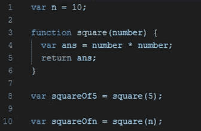
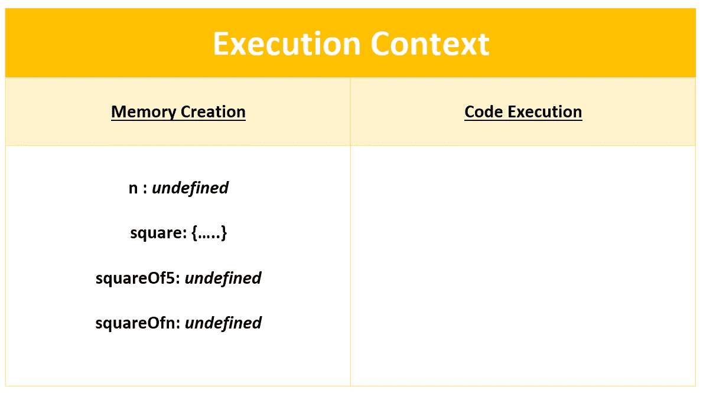
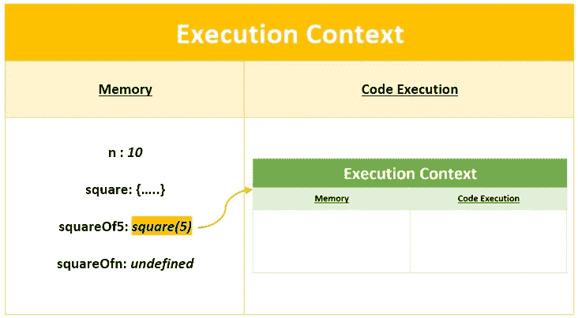
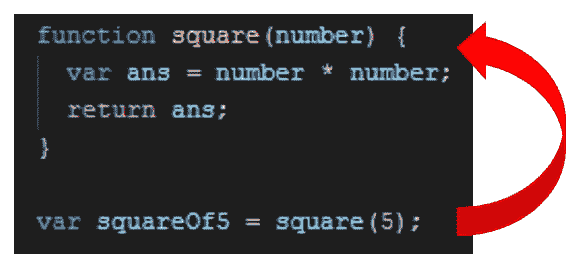
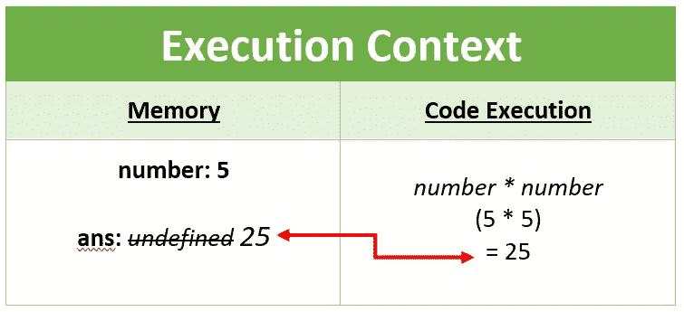
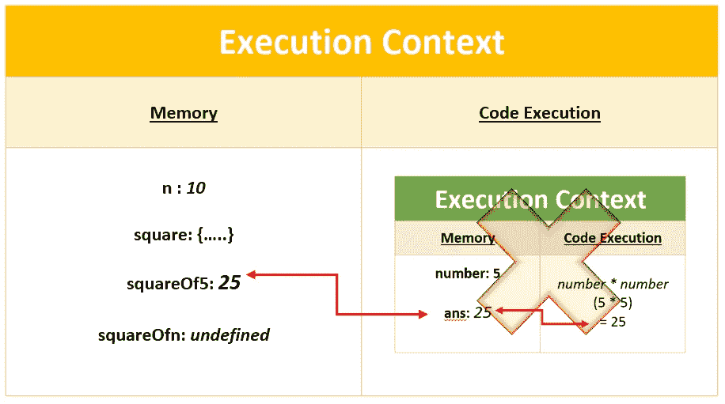
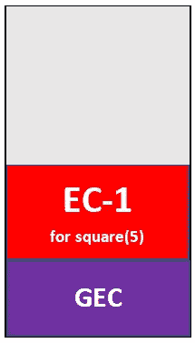

# JavaScript 中的执行上下文和调用堆栈

> 原文：<https://medium.com/nerd-for-tech/how-javascript-works-3b5e4054dc2d?source=collection_archive---------3----------------------->

听说过 JavaScript 但是，不知道基础知识？不知道幕后发生了什么？破解采访有困难吗？别担心。这篇文章将帮助你了解 JavaScript 的基本概念。这些概念在你的日常活动中可能会用到，也可能不会，但是如果你很好奇，想要深入 JavaScript 的世界，那么我确信你会发现这些东西真的很有趣。这篇文章将涉及 JS 最基本的主题之一——执行上下文。所以，事不宜迟，让我们开始吧。

# **您听说过“执行上下文”吗？**

**执行上下文**是 JS 中最基本的概念之一。让我这么说吧。

> **JS 中的一切都发生在执行上下文中。**

让我们借助一个例子来理解这一点。下面显示的代码寻找给定数字的平方。

一个简单的 JS 程序来理解执行上下文是如何工作的。

当我们运行一个 JS 程序时，一个**执行上下文**被创建。这个过程包括两个阶段。第一阶段称为**内存创建**阶段，第二阶段称为**代码执行**阶段。

***存储器创建*** 阶段的表示

在**内存创建**阶段，JS 解析程序，寻找变量和函数定义。在变量的情况下，会分配一个名为 ***undefined*** 的特殊关键字，在函数的情况下，JS 会存储整个函数定义的副本。(查看图表)。

> 注意: ***未定义*** 不是数值。它是 JS 中使用的一个特殊的关键字，表示变量没有被定义或赋值。

第二阶段是**代码执行**阶段。在此阶段，JS 从头开始，并以*同步*的方式进行(一次一行)。

> 注意:这可能是你的第一个面试问题。**JavaScript 是同步语言还是异步语言**’。我想你现在知道答案了。

一个简单的 JS 程序来理解执行上下文是如何工作的。

在第 1 行，“n”的值设置为 10，因此 JS 删除了关键字*未定义的*，并将值设置为 10 *。*现在控制转到下一个代码块。因为这是一个函数定义，这里没有代码执行，所以 JS 跳过函数定义，将控制权转移到第 8 行。JS 一遇到函数调用[***square(5)***]，就创建一个新的执行上下文，如下所示。

函数调用创建了一个**新的执行上下文**

现在，执行上下文的整个过程针对该函数调用重复进行。让我们看看功能块是如何执行的。

在内存创建阶段，我们会有两个变量，‘*number’*是你的函数参数，‘*ans*是局部变量。两者都将值设置为“*未定义*”。在这个当前执行上下文的第二阶段，JS 从这个函数声明的第一行开始。因为我们在函数调用中将 5 作为参数传递，所以 5 被指定为变量 number 的值。现在控制转到下一行。

为 square(5)函数调用创建的执行上下文

在下一行，JS 执行[***number * number****]行的一部分，这个操作的结果(也就是 25)存储在变量‘ans’中。现在下一行有一个关键字‘return’。一旦 JS 遇到*‘return’关键字，*它就将控制移回父执行上下文。因为我们要返回“ans”的值，所以返回值 25 并存储在变量“squareOf5”中。现在记住这个。*

***当控制移回到进行函数调用的地方时，新创建的执行上下文被删除。***

*看看下面的图表。*

**

*函数调用中到底发生了什么的表示*

*现在，控制转到下一行，这又是一个函数调用，执行上下文的整个过程再次重复。*

# ***JS 如何跟踪这些执行上下文？***

*这是通过所谓的**调用堆栈**或**执行堆栈**来实现的。它像一个普通的堆栈，但主要用于跟踪执行上下文。*

**

*当 JS 引擎第一次遇到脚本时，它会创建一个**全局执行上下文(GEC)** 并被推送到调用堆栈上。在 GEC 的代码执行部分，每当 JS engine 遇到函数调用时，它都会创建一个新的执行上下文，并将其推送到调用堆栈。*

*引擎执行其执行上下文位于堆栈顶部的函数。当这个函数完成时，它的执行栈从栈中弹出，这个过程继续到脚本的剩余部分。*

***最终想法***

*我希望现在您已经很好地理解了执行上下文。如果非要用简单的语言来解释执行上下文的重要性，我可以说 ***执行上下文是 JS*** 的心脏。*

*让我也提一下，我没有讲太多，但是有很多概念可以涵盖。*

*感谢您阅读这篇文章。请在评论区告诉我你的想法。*

****参考文献:****

1.  *JavaScript 代码是如何执行的？& https://www.youtube.com/watch?v=iLWTnMzWtj4·阿克谢·塞尼的呼叫堆栈*
2.  *[Sukhjinder Arora](/@Sukhjinder?source=post_page-----1c9ea8642dd0--------------------------------)
    的一篇文章 https://blog . bitsrc . io/understanding-execution-context-and-execution-stack-in-JavaScript-1c 9 ea 8642 DD 0*