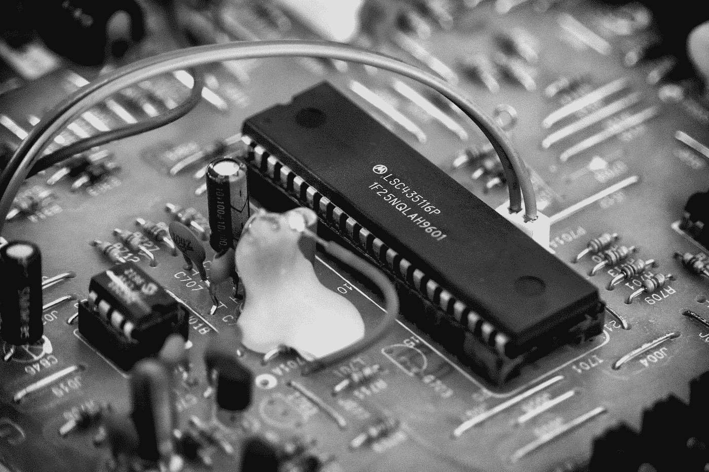

# HDL 中如何推断锁存器？

> 原文：<https://medium.com/nerd-for-tech/how-latches-are-inferred-in-hdl-90c5ec77fbb6?source=collection_archive---------5----------------------->

大家好，

今天的话题是大规模集成电路面试中面试官最常问和最喜欢问的问题。
让我们一起来了解这是如何发生的，这种情况的缺点是什么，以及在设计任何硬件时为什么要避免。

[丹尼·米勒](https://unsplash.com/@redaquamedia?utm_source=medium&utm_medium=referral)在 [Unsplash](https://unsplash.com?utm_source=medium&utm_medium=referral) 拍摄的照片

在 Verilog 中，如果没有在 **always** 块中给变量赋值，变量将保持原来的值。必须创建一个锁存器来存储这个现值。“锁存器”与“触发器”的不同之处在于，FF 仅响应于时钟沿而改变其输出。锁存器可以改变其输出以响应除时钟之外的其他事物。例如，SR 锁存器有一个置位和一个复位输入，如果其中任何一个有效，则输出会改变。其中 SR-FF 仅在还有时钟沿时响应置位或复位。

在 FPGA 中，您希望逻辑完全同步。这意味着所有存储元件(如 FF)都是由单个时钟源计时的。任何与该时钟不同步的东西都需要非常小心地处理，否则会发生定时误差。

马库斯·斯皮斯克在 [Unsplash](https://unsplash.com?utm_source=medium&utm_medium=referral) 上拍摄的照片

锁存器基本上是一个异步存储元件。它没有时钟输入，因此不能与任何时钟同步。我应该注意到，有些 FF 具有异步复位和复位输入，应该像对待普通锁存器一样小心对待。

如果该错误或警告是由工具给出的，那么应该首先盲目地检查代码中使用的 IF-ELSE 语句和 CASE 语句，然后检查是否所有的输出都在每个分支上分配了值。
如果遗漏了 if 块的 else 语句或者遗漏了 HDL 代码中的 default 语句，通常会发生这种情况。

让我们看看代码:-

> IF-ELSE 语句
> 
> 始终@(negedge clk)
> 
> 开始
> 
> 如果(！重置)
> 
> q≤0；
> 
> 结束

这种情况将使额外的锁存作为模拟器不知道它！重置值不是它必须做的，如果这种情况发生，它会将以前的值存储到一个锁存器中，在您的设计中发出锁存器推断警告。
如果我们忘记给出默认条件或没有涵盖所有可能的输出，case 语句也会发生同样的情况。

> 案例陈述:-
> 
> always @(neg edge clk)begin
> q≤0；
> 案例(Sel)
> 0:q≤In；
> 结束

如果我们在上面的代码中给出默认语句，它可以被纠正。

***为什么推断锁存器不好？***
推断的锁存器可以作为逻辑设计可能不会按预期实现的“警告信号”。设计中可能缺少关键的 *if-else* 或 *case* 语句。

闩锁会导致计时问题和争用情况。它们可能会导致反馈——将输出路由回输入——这是不可预测的。

***避免创建推断锁存器:***

*   包含一个 *if* 或 *case* 语句的所有分支
*   给每个分支中的每个输出信号赋值
*   在程序开始时使用默认分配，这样每个信号都会被分配。

希望这篇文章对你有所帮助。一定要关注我，因为这些有趣的帖子与不同的技术有关。

感谢阅读。