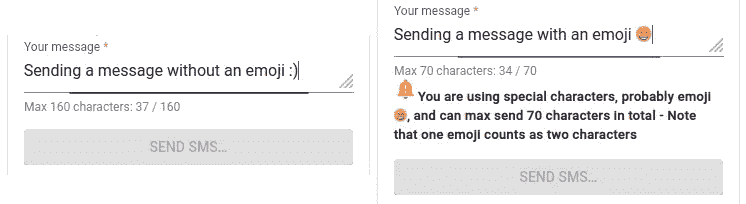

# 一条短信有多长？以及如何最好地处理 UX。

> 原文：<https://medium.com/nerd-for-tech/how-long-is-an-sms-and-how-to-best-handle-the-ux-88a75e161f43?source=collection_archive---------10----------------------->

这是另一个有趣的挑战，我最近重构了一个客户的短信服务，遇到了不少问题。(哦，顺便说一句，SMS 是你通常在手机上发送的文本消息——可能不会考虑它的长度😉)


**关于短信长度的一些背景信息**

一条标准短信最多可以容纳 160 个字符。如果你输入 161 个字符，从技术上讲，你将发送 2 条短信，但这些短信将无缝连接，因此接收者会将其视为一条短信。这听起来很简单，但有趣的地方就在这里🙃

这取决于…几件事。

像一些短信提供商保留字符/字节用于拼接多条短信，因此每条标准短信只需要 153 个字符…

如果你用西班牙语写你的情书，你可能最多有 155 个字符——减去一些其他的东西…

如果您选择插入一个💕你的莎士比亚才能将不得不在仅仅 70 个字符中显露出来🤔

问题是，用户不能直接看到这一点。因此，如果唐璜(在这个例子中是英国人)用 159 个字符(1 条短信)发送他的爱，并以一个漂亮的结尾💕他现在将被收取 3 条短信共 160 封“信”的费用。

**搞什么鬼？为什么这很重要？**

当你使用的智能手机不具备包含短信的昂贵服务，而是需要一个 API 来向成百上千的短信接收者发送短信时，你将不得不为每条短信付费。大量的这些并不便宜。所以你基本上想避免为每条短信支付 2 或 3 条短信的费用。

首先，你将不得不看看你的短信 API，看看他们有什么缺陷或不包括。

第二，你必须决定如何处理这个 UX。

**简单易行的解决方案**

"我不在乎，我会支付额外的费用."

**几乎一样简单的解决方案**

“我只需‘询问’API，然后在 1 条短信后删除文本”

**趣味解决方案(带更好的 UX)**

范围:我们希望实时通知用户，而不会有太多的麻烦。

免责声明:您可以通过为每个字符请求 SMS API 来解决以下问题。但那有什么好玩的🤭

***允许 160 char 标准短信。***
这意味着“仅”使用+128 字符的标准 GSM-7 字符集。

```
this.gsm7 = ['@', '£', '$', '¥', 'è', 'é', 'ù', 'ì', 'ò', 'Ç', 'Ø', 'ø', 'Å', 'å', 'Δ', '_', 'Φ', 'Γ', 'Λ', 'Ω', 'Π', 'Ψ', 'Σ', 'Θ', 'Ξ', '^', '{', '}', '\\', '[', '~', ']', '|', '€', 'Æ', 'æ', 'ß', 'É', '!', '"', '#', '¤', '%', '&', '\'', '(', ')', '*', '+', ',', '-', '.', '/', '0', '1', '2', '3', '4', '5', '6', '7', '8', '9', ':', ';', '<', '=', '>', '?', '¡', 'A', 'B', 'C', 'D', 'E', 'F', 'G', 'H', 'I', 'J', 'K', 'L', 'M', 'N', 'O', 'P', 'Q', 'R', 'S', 'T', 'U', 'V', 'W', 'X', 'Y', 'Z', 'Ä', 'Ö', 'Ñ', 'Ü', '§', '¿', 'a', 'b', 'c', 'd', 'e', 'f', 'g', 'h', 'i', 'j', 'k', 'l', 'm', 'n', 'o', 'p', 'q', 'r', 's', 't', 'u', 'v', 'w', 'x', 'y', 'z', 'ä', 'ö', 'ñ', 'ü', 'à', ' ']
```

标准 GSM-7 上 SMS 的长度。
这里我们取消息字段，每次修改时，我们检查 gsm7 数组中的整个字符串。这在添加和删除字段中的字符时有效。

```
gsm7: string[];onValueChanges(): void {
  this.message.valueChanges.pipe(
    tap((value: string) => {
      [...value].forEach((char: string) => {
        if (this.gsm7.find(element => element === char)) {
          this.maxAllowed = 160;
        }
      });
    }),
  ).subscribe();
}
```

***允许非标准短信。***

这里，我们必须决定如何处理 gsm7 数组之外的消息字符串。我们可以去所有的细节，并找出究竟是哪些字符导致每条短信字符较少，但我决定如下。

当处理 gsm7 之外的 2 字节字符(即一些西班牙字符，如ú)时，我们有最大 145–155 个字符范围内的消息，而在 gsm7 之外，我们有最大 70 个字符和 4 字节字符(表情符号等)的消息。

因此，我测量 4 字节字符

```
(new Blob([char]).size === 4)
```

并将这些消息的最大长度设置为 70，否则我会将固定长度设置为 140，如下所示。

```
gsm7: string[];onValueChanges(): void {
  this.message.valueChanges.pipe(
    tap((value: string) => {
      this.maxAllowed = 160;
      [...value].forEach((char: string) => {
        if (!this.gsm7.find(element => element === char)) {
          if (new Blob([char]).size === 4) {
            this.maxAllowed = 70;
          } else if (this.maxAllowed >= 140) {
            this.maxAllowed = 140;
          }
        }
      });
    }),
  ).subscribe();
}
```

你也可以进一步简化，允许 140 个字符的表情信息，并提示用户确认他们想给每个收件人发送 2 条信息。

在我的解决方案中，如果他们有很多 2 字节字符，他们可能在很少的情况下发送 2 条消息，但除此之外，他们将总是只发送 1 条消息。这里的另一个权衡是 140 个字符的限制，有时他们可以发送稍微多一点的字符(实际上从不超过 154 个字符)。

***界面中的信息***

我想在最大长度减少时通知用户，所以当这种情况发生时，我会插入一个通知图标和解释文本。
注意，一个 4 字节的字符算作两个 1 字节的字符。



***我的解决方案中的最终代码***

此处未显示导入和表单。

```
template: `
...
<mat-form-field fxFlex>
  <mat-label i18n>Your message</mat-label> <textarea matInput #message maxlength="{{ maxAllowed }}" rows="5" required formControlName="message"></textarea> <mat-hint><span i18n>Max</span><span> {{ maxAllowed }} </span><span i18n>characters</span>: {{ message.value.length }} / {{ maxAllowed }}</mat-hint></mat-form-field><div *ngIf="maxAllowed === 140">
  <mat-icon color="warn" aria-hidden="false" aria-label="Warning for short message"> notification_important </mat-icon> <span style="font-size: small"><strong i18n>You are using special characters and can max send 140 characters in total</strong></span>
</div><div *ngIf="maxAllowed === 70">
  <mat-icon color="warn" aria-hidden="false" aria-label="Warning for shortest message"> notification_important </mat-icon> <span style="font-size: small"><strong i18n>You are using special characters, probably emoji 😁, and can max send 70 characters in total - Note that one emoji counts as two characters</strong></span>
</div><div fxFlex="16px"></div><button mat-flat-button type="submit" color="primary" fxFlex class="mat-body uppercase" [disabled]="smsForm.invalid || avoidDoubleClick" i18n>Send SMS&#x2026;</button>
...
`export class SmsCardComponent implements OnInit, OnDestroy {
  gsm7: string[];
  maxAllowed: number;
  messageLengthObservable: Subscription; // eslint-disable-next-line max-len
  this.gsm7 = ['@', '£', '$', '¥', 'è', 'é', 'ù', 'ì', 'ò', 'Ç', 'Ø', 'ø', 'Å', 'å', 'Δ', '_', 'Φ', 'Γ', 'Λ', 'Ω', 'Π', 'Ψ', 'Σ', 'Θ', 'Ξ', '^', '{', '}', '\\', '[', '~', ']', '|', '€', 'Æ', 'æ', 'ß', 'É', '!', '"', '#', '¤', '%', '&', '\'', '(', ')', '*', '+', ',', '-', '.', '/', '0', '1', '2', '3', '4', '5', '6', '7', '8', '9', ':', ';', '<', '=', '>', '?', '¡', 'A', 'B', 'C', 'D', 'E', 'F', 'G', 'H', 'I', 'J', 'K', 'L', 'M', 'N', 'O', 'P', 'Q', 'R', 'S', 'T', 'U', 'V', 'W', 'X', 'Y', 'Z', 'Ä', 'Ö', 'Ñ', 'Ü', '§', '¿', 'a', 'b', 'c', 'd', 'e', 'f', 'g', 'h', 'i', 'j', 'k', 'l', 'm', 'n', 'o', 'p', 'q', 'r', 's', 't', 'u', 'v', 'w', 'x', 'y', 'z', 'ä', 'ö', 'ñ', 'ü', 'à', ' ']; constructor() { this.maxAllowed = 160; }
  get message() { return this.smsForm.get('message'); } ngOnInit(): void { this.onValueChanges(); } ngOnDestroy() {
    // unsubscribing to avoid memory leak
    this.messageLengthObservable.unsubscribe();
  } onValueChanges(): void {
    this.messageLengthObservable = this.message.valueChanges.pipe(
      tap((value: string) => {
        this.maxAllowed = 160;
        [...value].forEach((char: string) => {
          if (!this.gsm7.find(element => element === char)) {
            if (new Blob([char]).size === 4) {
              this.maxAllowed = 70;
            } else if (this.maxAllowed >= 140) {
              this.maxAllowed = 140;
            }
          }
        });
      }),
    ).subscribe();
  }
```

我希望这能激发你对短信和随之而来的 UX 的创造力。

玩得开心🤗