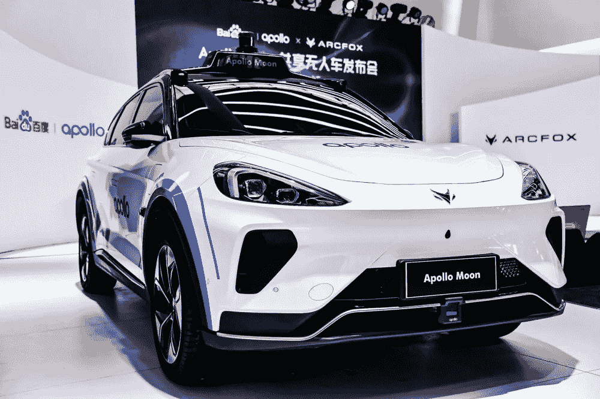

# 我们现在能买自动驾驶汽车吗？

> 原文：<https://medium.com/nerd-for-tech/how-long-will-the-mass-production-of-self-driving-cars-take-and-how-much-it-will-cost-150d09385aaf?source=collection_archive---------20----------------------->

## 远方有多远？

来源:阿波罗月球

## 新一代量产共享无人车阿波罗月球

2021 年 6 月 17 日，百度 Apollo 与 Arcfox 联合发布新一代量产共享无人车 Apollo moon，运营周期超过五年，可提供长期稳定的自动驾驶出行服务。**百度计划在未来三年内发射 1000 个阿波罗月亮，支持自动驾驶运营团队。**

百度首次披露阿波罗登月的成本为 48 万人民币(74160 美元)。百度副总裁、自动驾驶技术总经理王先生表示，48 万人民币包含汽车和无人驾驶套件，是全球成本最低的无人驾驶汽车，也是无人驾驶汽车首次进入普通量产乘用车的价格区间。

与行业内数百万自动驾驶车辆的成本相比，Apollo moon 48 万人民币(74160 美元)的更低成本优势似乎让自动驾驶离商业化更近了一步。

Tier1、OEM 厂商、科技公司都在探索如何实现自动驾驶的商业化。但是这个过程需要多长时间很难预测。

这次 48 万人民币的价格应该满足了。但对于普通消费者来说，还是不够友好，很难推向普通市场，大规模普及还为时过早。

## 自动驾驶的商业应用过程并不顺利

即使不提成本，近年来自动驾驶的商业应用进程并不顺利，应用场景有限，诸多事故的发生也让人们对自动驾驶的信任度不断降低。

最近，Waymo 的无人驾驶汽车与一辆电动滑板车相撞。幸运的是，没有人受伤。此外，据路透社报道，美国汽车安全监管机构表示，自 2016 年以来，已对涉嫌使用高级驾驶辅助系统的特斯拉车祸展开 30 起调查，涉及 10 人死亡。

**一些分析师认为，自动驾驶的商业化受到许多因素的影响，如政策、感知系统(系统冗余)、包括芯片(软件)和数据在内的技术、高精度地图、基础设施(v2x)。**

政策方面，从自动驾驶推进计划和目前世界主要国家的发展阶段来看，自动驾驶规则和原则都在不断优化中，争取在 2025 年左右实现 L4 级别的高自动驾驶。美国、中国和日本都在积极稳步地前进(都已经开放了道路测试)。欧盟更加谨慎。目前，只有德国、瑞典、荷兰、奥地利和比利时允许开放道路测试。

**更多信息:** [**全球首个无人驾驶法律允许 L4 级自动驾驶上路**](https://tinyurl.com/s6yva66e)

## 结论

由于自动驾驶的安全责任方从单一的驾驶员转变为包括主机厂(硬件高度集成)、软件、零配件、整车在内的多方主体，叠加的产业链较长，目前仍处于技术孵化阶段。政策监管的规范化、合理化，将在准入门槛、技术推广、商业化落地等方面起到决定性作用。

## 自动驾驶的关键技术

目前，自动驾驶的关键技术包括环境感知、精确定位、决策和规划、控制和执行、高精度测绘和车联网 V2X、驾驶车辆测试、验证技术。

在该技术体系和关键软硬件设备的支持下，自动驾驶车辆可以通过车载摄像头、激光雷达、毫米波雷达、超声波传感器等传感器感知周围环境，并根据获得的信息做出决策，形成安全合理的路径规划。规划好路径后，车辆执行系统会控制车辆沿着规划好的路径完成行驶。

自动驾驶的这套核心技术体系可以简单概括为“感知、决策、执行”。

**其中，传感器承担传感工作。**

传感系统也称为“中间控制系统”，负责感知周围环境，收集和处理环境信息和车内信息，主要涉及道路边界监控、车辆检测、行人检测等技术。

**要实现自动驾驶，首先要解决一个问题:行车安全。**为了保证自主车在各种场景下都能做出正确的决策，需要实现对周围环境数据的实时动态采集和识别，包括但不限于车辆状态、交通流量、路况、交通标志等。,

**换句话说，环境感知的作用类似于人类驾驶员的眼睛和耳朵。**

为了满足环境感知的需要，自动驾驶汽车配备了许多车载传感器，如摄像头、激光雷达、毫米波雷达、超声波等等。在这些传感器和 V2X 的配合下，可以实时获取交通环境、车辆状态等多源信息，为决策提供支持。

**更多信息:** [**三维点云标注在自动驾驶领域的应用**](https://tinyurl.com/yxfms9en)

## 激光雷达的应用

激光雷达从多个激光器高频发射获得的数据中生成周围物体的高清 3D“点云”图像。激光雷达被广泛认为是实现无人驾驶的必要传感器。

## 什么是 3D 点云？

3D 点云是分布在 3D 空间中的大量点(数据点)的协作，其中数据点是通过激光雷达等传感器收集的。传感器发出光，并计算光被反射回来形成每个点所需的时间。收集到的点被合成，呈现出一个完整的图像，如下图所示。

[**关于激光雷达和 3D 点云的更多信息**](https://tinyurl.com/w3kav68k)

来源:威力登激光雷达

3D 点云广泛用于建筑、航空航天、驾驶、交通、医疗设备、常规消费品等领域的产品开发和分析。预计未来潜在的使用案例和应用只会增加。

# 结束

将你的数据标注任务外包给 [ByteBridge](https://tinyurl.com/yc5cjddk) ，你可以更便宜更快的获得高质量的 ML 训练数据集！

*   无需信用卡的免费试用:您可以快速获得样品结果，检查输出，并直接向我们的项目经理反馈。
*   100%人工验证
*   透明和标准定价:[有明确的定价](https://www.bytebridge.io/#/?module=price)(含人工成本)

为什么不试一试呢？

来源:http://www . myza ker . com/article/60 CEE 0268 e9f 0913 f 4009 bcc