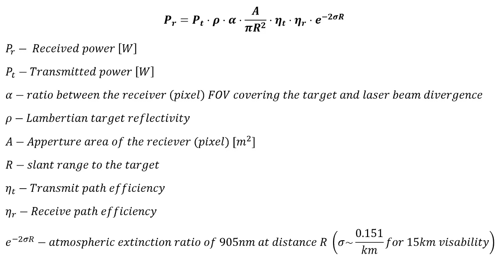
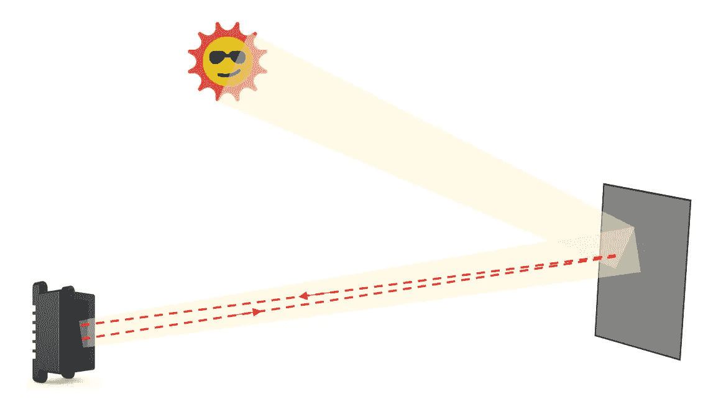
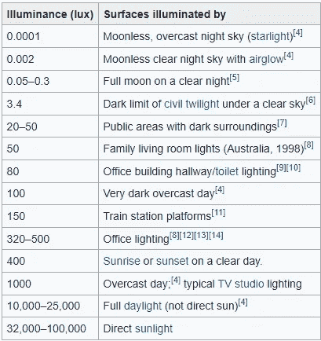
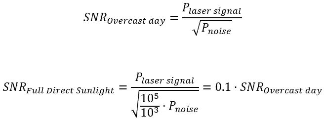
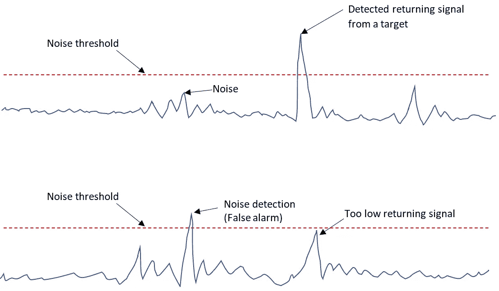

# 如何“神奇地”增加激光雷达的范围？

> 原文：<https://medium.com/nerd-for-tech/how-magically-increase-lidars-range-c990cd948873?source=collection_archive---------1----------------------->

在我之前的文章“[中，激光雷达应该“看”多远？](/self-driving-cars/how-far-should-a-lidar-see-866b9debac7f?source=friends_link&sk=7bcb8c69bdd06a7504461bb58e3a2a94)”我提了两个问题:

1.  汽车应用中的激光雷达系统所需的探测范围是多少？
2.  我们应该如何定义激光雷达系统的目标探测范围，以及什么是合适的测试条件？

现在是偿还债务和回答第二个问题的时候了，当我们希望比较“苹果与苹果”，评估两个不同系统的性能时，这是至关重要的。

人们可能想知道为什么这是一个如此重要的问题？例如，当您希望比较不同汽车的加速度时，可以查看数据手册中的数字。那么为什么你不能用激光雷达做同样的事情呢？

原因是[在测量加速度时，车辆和测试场景](https://en.wikipedia.org/wiki/List_of_fastest_production_cars_by_acceleration)都有一套标准要求。然而，当测量激光雷达系统的性能时，目前[根本没有标准](https://dimasosnovsky.medium.com/the-need-for-standardization-in-automotive-lidars-787dc3997745?source=friends_link&sk=66e2f473e5a8261880b8d5df05e16944)。

有时，市场部理所当然地要求 R&D 的工程师展示超越竞争对手的性能结果。然而，并非所有的激光雷达都是相同的，其中一些激光雷达的物理特性不允许完全符合这样的性能要求。

怎么叫与物理相矛盾的东西？对，魔法。

因此，这些 R&D 的工程师需要运用一些“魔法”来满足市场需求并支持他们公司的繁荣，除非他们有足够的时间从头开始。然而，由于我还没有看到一家激光雷达公司在其工作描述中要求从霍格沃茨的魔法学校毕业，这些工程师需要寻找另一种魔法。因此，他们实践数学的魔力，并利用激光雷达标准化的缺乏来实现他们的目标。

本文将讨论读者在数据手册中应该寻找的主要特征，以验证他获得了激光雷达系统距离探测性能的准确图片，揭示了任何“神奇”的遮蔽。

这篇文章有两个主要目标:

1.  描述在激光雷达系统数据表的各行之间应该寻找的主要参数，以提取实际的探测范围性能。
2.  鼓励行业专家就测试和报告激光雷达系统性能值的通用标准达成一致。

让我们假设一个普通的激光雷达系统可以探测到 150 米远的朗伯目标，但需要探测 200 米。标称测试条件为:

*目标:*

*   反射率:10%(返回 10%的入射光)

*环境条件:*

*   太阳光照度:100klux，在 [37 度倾角](https://www.astm.org/Standards/G173)

*检测置信度:*

*   检测概率:> 95%
*   虚警率:<0.1%

*激光雷达系统模式:*

*   帧速率:25Hz
*   角度分辨率:0.1 度 x 0.1 度

在接下来的章节中，我将描述改变上面的每个参数如何影响最终的探测范围，在大多数情况下，不需要改变激光雷达系统本身的任何一点。

# 目标

目标的探测范围与从该目标返回的激光功率成正比。因此，我们可以通过反射功率的变化来估计各种参数对检测范围的影响。我们可以使用[通用激光雷达方程](https://nps.edu/documents/106458200/109356514/IntroductiontoLIDAR.pdf/b7cc03e4-8a30-4f5d-b13d-660b47d6cc49?t=1452144297000)轻松计算返回功率:

因此，如果我们假设目标的反射率为 50%，而不是 10%，我们将通过 x5 提高接收功率，或通过 sqrt(5)提高探测范围 R，将其从 150 米提高到 335 米，而不改变系统中的任何东西！

**结论:**通过将参考目标反射率从 10%更改为 18%，我们可以将激光雷达的报告探测范围从 150 米“神奇地提高”到 200 米。

# 环境条件

与需要外部光源来检测视图的相机系统不同，激光雷达系统正好相反。环境光是激光雷达的主要噪声源之一，因此降低了系统的整体信噪比和最大探测距离。

阳光从目标反射，并以与激光束相同的角度进入激光雷达系统。由于系统传感器无法区分太阳光子和激光光子，信号可能无法与噪声区分开来。这是阳光直射的情况。

激光雷达系统中的环境噪声

由于您可能希望在晴天使用激光雷达系统，因此它必须符合阳光直射场景的要求。环境噪声单位面积的[光通量](https://en.wikipedia.org/wiki/Luminous_flux)以[勒克斯](https://en.wikipedia.org/wiki/Lux)为单位测量。全直射阳光被认为是 100klux:

各种条件下照度的一些例子。来源:维基百科

虽然随机阳光噪声仅通过 2 的平方根影响 SNR，但在全直射阳光(100 Klux)和阴天(1 Klux)下，激光雷达性能的差异是巨大的:

这意味着，在阴天，激光雷达的性能比完全直射阳光所需的条件好十倍。

**结论:**通过将参考环境光强度从 100 Klux 改变为 56 Klux，我们可以将我们的激光雷达的报告探测范围从 150m“神奇地提高”到 200m。

# 检测置信度

检测置信水平描述了检测目标的概率与呈现假警报的概率。例如，假设我们需要 95%的检测概率。在这种情况下，这意味着 1000 次中有 950 次我们向特定像素中的目标发射激光脉冲，我们将充分区分其返回信号。另一方面，0.1%的错误警报率意味着在这 1000 次测量中只有 1 次我们的系统在某个随机范围呈现错误的距离，该距离远离实际目标范围。在其余的 49 次中，系统在该像素中根本没有显示任何目标。

置信度是根据噪声阈值定义的。高于此阈值的测量值被视为目标，并显示在激光雷达的点云中。当低于噪声阈值时，不显示测量结果。

因此，我们可以通过改变噪声阈值的高度来放松我们的置信度要求。例如，如果我们只需要 50%的检测概率，以及 5%的虚警率，我们可以接受低得多的 SNR 值，这对应于更长的检测范围。

变化置信水平和检测范围改进之间的关系没有前面的情况那么直接，因此超出了本文的范围，但是趋势是相似的。

**结论:**通过放宽置信水平要求，允许更低的探测概率和更高的虚警率，我们可以“神奇地将”我们的激光雷达的报告探测范围从 150m 提高到 200m。

# 激光雷达系统模式

在“系统模式”方面，我们将考虑两个参数的可能变化:系统帧速率和角分辨率(宁滨配置)。

*帧速率*

让我们假设我们的系统每像素发射 N 个激光脉冲。将系统帧速率降低 x2.5 意味着将每个像素的持续时间增加相同的倍数。如果我们不改变激光器的占空比(DC)，我们可以每像素发射 2.5*N 个脉冲。因此，累积的信号功率高 2.5 倍，系统的 SNR 增加了 sqrt(2.5)。

因此，一旦我们以 25Hz 的帧速率评估系统性能，我们就不能直接将其与另一个以 10Hz 帧速率工作的系统性能进行比较。

**结论:**通过将系统的帧速率从 25Hz 更改为 14Hz，我们可以将激光雷达的报告探测范围从 150m“神奇地提高”到 200m。

*角分辨率*

一些激光雷达系统包括角度宁滨的特征。角度宁滨意味着几个相邻像素的 SW 总和:

角宁滨

这样，就有可能增加每个像素的总接收信号(在上图中增加了四倍)。因此，由于我们对信号和噪声(随机的)求和，我们仅通过 sqrt(4)=2 来提高 SNR。

因此，一旦我们评估了一个具有特定角分辨率的系统的距离性能，就不能直接将其与另一个具有另一个角分辨率的系统的距离性能进行比较。

类似地，例如，一个 FOV 为 120x25 度的系统不能与另一个 FOV 仅为 40x25 度的系统相比较。这是因为覆盖整个 120 度 FOV 所需的功率是覆盖 40 度 FOV 所需功率的 3 倍。因此，一些系统提供不同的配置。一种配置具有较窄的 FOV，但探测范围更大。另一种配置具有宽 FOV 但短距离检测。

**结论:**通过将角分辨率降低 2(例如，通过将每两个相邻像素相加)，我们可以“神奇地将”我们的激光雷达的报告探测范围从 150 米提高到 212 米。

由于本文的范围有限，我省略了额外的系统/测试设置参数，例如:

*   激光束和目标之间的重叠率
*   环境温度
*   目标在 FOV 中的定位及其倾斜角

# 摘要

在本文中，我展示了根据市场需求“调整”激光雷达系统性能的简单方法，只需调整测试条件，而无需改变系统设计本身。

因此，在所有行业参与者就表示和测量激光雷达性能的通用标准达成一致之前，我们需要深入了解数据手册的内容，以了解每个系统的实际性能。

欢迎在评论中分享你的想法，并在 LinkedIn 上联系我。