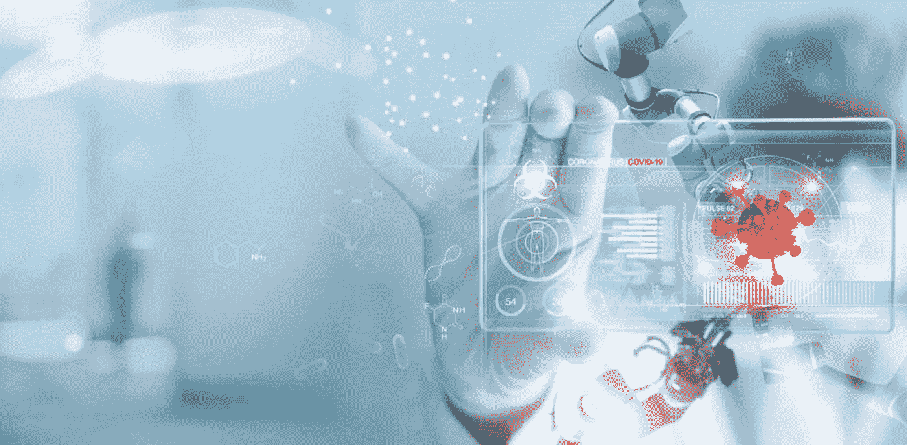
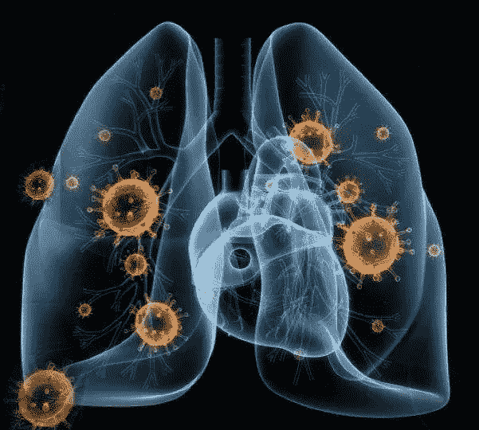
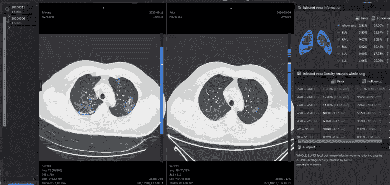
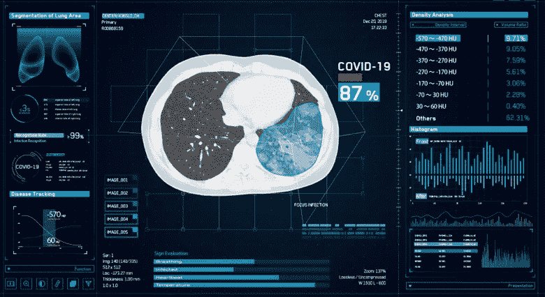
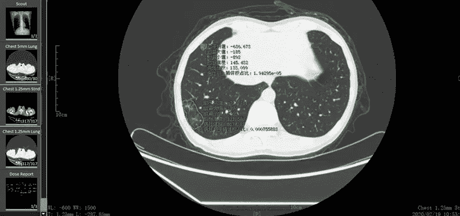
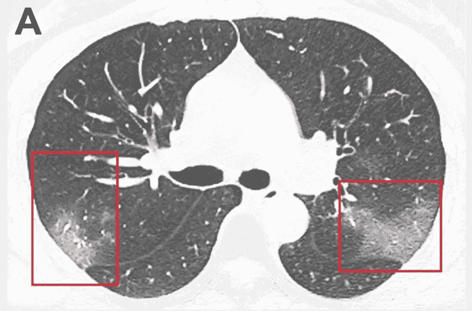

# 医学成像数据集如何帮助人工智能诊断新冠肺炎病毒？

> 原文：<https://medium.com/nerd-for-tech/how-medical-imaging-datasets-can-help-ai-to-diagnosis-the-covid-19-like-deadly-virus-9db3ca35ac0f?source=collection_archive---------0----------------------->

快速传播的高传染性疾病冠状病毒或新冠肺炎使全球医疗保健专业人员面临前所未有的临床试验和诊断挑战。他们在努力应对这种高传染性疾病的同时，还继续照顾患者，并及时诊断有感染风险的新患者。

在这里，人工智能可以在检测受感染患者的新冠肺炎样疾病方面发挥重要作用，帮助其他人在没有放射科医生帮助的情况下进行早期诊断。事实上，在过去几年中，人工智能算法，特别是深度学习，已经在图像识别任务中取得了显著进展，在医学成像分析中取得了惊人的成果。

# 医疗保健中的人工智能

尽管如此，人工智能在机器学习和医疗保健行业的 [**大数据**](https://www.cogitotech.com/blog/top-benefits-of-big-data-analytics-in-healthcare-industry/) 的帮助下，已经通过各种计算机系统、应用程序和人工智能设备发挥了至关重要的作用，这些计算机系统、应用程序和人工智能设备全天候工作，以帮助患者、控制疾病、运送医疗用品和自动消毒医院场所、建筑物和其他地方，而无需人类的帮助，使他们远离此类感染。

***也可阅读:*** [**大数据& AI 如何用于医疗保健系统抗击冠状病毒疫情**](https://www.anolytics.ai/blog/how-big-data-ai-used-in-healthcare-system-to-combat-coronavirus-outbreak/) ？

[**AI in robotics**](https://www.cogitotech.com/use-cases/robotics/) ， [**自主飞行无人机**](https://www.cogitotech.com/use-cases/autonomous-flying/) ， [**AI 安防摄像头**](https://www.cogitotech.com/use-cases/security-surveillance/) ， [**自动驾驶汽车**](https://www.anolytics.ai/solutions/self-driving/) 都在提供自动化解决方案，与像致命疾病一样的新冠肺炎作战。 [**人工智能在医疗保健行业的应用**](https://www.cogitotech.com/blog/top-four-applications-of-artificial-intelligence-in-healthcare/) 是巨大的，从发现和开发针对新疾病的有效药物和疫苗，到达到最佳准确度。因此，在放射科，让我们看看医学成像中的人工智能如何帮助诊断和治愈像致命疾病一样的新冠肺炎。

# 放射学中的人工智能

放射学中的人工智能像人工智能一样工作，以可接受的准确度检测疾病。人工智能机器或医疗系统不仅可以检测疾病，还可以根据患者的生物状况和医生或医护人员在诊断初期明显的综合征类型建议药物。

当人工智能设备或计算机系统用大量带注释的 [**医学成像数据集**](https://www.cogitotech.com/use-cases/medical/) 进行训练时，通过正确的算法，它可以在没有放射科医生帮助的情况下诊断这种疾病。同样，为了避免人类接触，放射学中的人工智能可以用于诊断新冠肺炎，就像一种致命的疾病一样，具有很高的准确性。

在早期的放射学实践中，医学成像分析专家医生或者你可以说放射科医生通过视觉评估医学图像来检测、表征和监控疾病。但现在，人工智能系统可以自动识别成像数据中的复杂模式，并提供定量而非定性的射线照相特征评估。

# 流行病学中的人工智能

同样，流行病学中的 AI 可以帮助医生和医学专家在致命疾病爆发前将其对人民的影响降至最低。但是这里再次说明 [**AI 医疗诊断**](https://www.cogitotech.com/use-cases/diagnostics/) 系统可以精确地完成这项工作，如果模型是用正确质量和数量的医学成像训练数据集训练的，这些数据集是用感染患者的 CT 扫描、MRI 或超声医学成像报告准备的。

在一个地方托管这些图像以及注释和分析框架，将使研究人员能够了解流行病学趋势，并生成新的人工智能算法，以帮助检测新冠肺炎病，与其他肺炎进行区分，并在 CT 上量化肺部受累情况，以提前进行预测或治疗计划。

除了医学成像，流行病学中的人工智能还可以通过各种其他类型的数据来实现，只有大数据专家或数据科学家才能分析改变人们行为的某些趋势或其他类型的经济活动的突然变化或特定药物或医疗保健产品需求的意外增长等。

# 人工智能在冠状病毒诊断中的应用

在新冠肺炎疫情爆发的情况下，大多数感染到肺部的患者开始患有肺炎或普通感冒，打喷嚏和喉咙感染伴有呼吸急促。所有这些症状的诊断都可以通过成像技术来实现，如 X 射线、CT 扫描或患者胸部或肺部的 MRI，放射科医师可以通过分析来了解感染的严重程度。

# 用于新冠肺炎诊断的人工智能医学成像分析:使用案例

一家加拿大初创公司和滑铁卢大学的研究人员正在开源 COVID-Net，这是一种卷积神经网络，旨在检测 X 射线图像中的新冠肺炎。作为对疫情的回应，全球医疗保健和人工智能研究人员社区已经开发了许多人工智能系统，用于在 CT 扫描中识别新冠肺炎。

同样，雅虎和人工智能初创公司等科技巨头声称，他们已经创建了能够在 X 射线或 CT 扫描中识别新冠肺炎的系统，准确率超过 90%。同样，一种新的人工智能驱动的深度学习模型帮助中国的放射科医生在胸部 CT 成像中区分新冠肺炎与社区获得性肺炎和其他肺部疾病。

***也可阅读:*** [**牙科中的机器学习如何提高牙齿成像分析**](https://www.cogitotech.com/blog/how-machine-learning-in-dentistry-can-improve-the-dental-imaging-analysis/)

这项研究是一项六家医院研究的一部分，研究人员利用 3322 名患者的 4356 次检查完善了模型。新冠肺炎检测神经网络得分很高，诊断冠状病毒感染的灵敏度为 90%，特异性为 96%。

这种惊人的结果表明，正确使用卷积网络模型的**机器学习数据集可以区分新冠肺炎和社区获得性肺炎。该模型在区分此类疾病和新型冠状病毒方面也获得了高分，其灵敏度为 87%，特异性为 92%。**

*****也读作:*** [**机器学习中使用的各类数据集有哪些**](https://www.cogitotech.com/blog/what-are-the-various-types-of-data-sets-used-in-machine-learning/)**

# **人工智能可实现更快的高精度检测**

**人工智能检测感染的速度比医生更快，准确率更高。在中国，科学家利用 5000 例确诊病例作为训练数据，建立了一种算法，声称它可以在 20 秒内通过 ct 扫描检测冠状病毒感染，准确率达到 96%。**

****

**放射学家表示，结果是使用人工智能提取放射特征进行及时准确的新冠肺炎诊断的原则证明。**

*****也可理解为:*** [**计算机视觉如何提高医学影像分析中诊断的准确性**](https://www.cogitotech.com/blog/how-computer-vision-can-improve-accuracy-of-diagnosis-in-medical-imaging-analysis/)**

**在另一项研究中，研究人员在查看了超过 46，000 张图片后得出了类似的结论。他们表示，深度学习模型显示出与专家放射科医生相当的表现水平，并大大提高了放射科医生在临床实践中的效率。**

**同样，在中国，一家公司推出了一种新的智能图像读取系统，可以通过利用人工智能技术帮助医生进行高效准确的诊断，并通过早期诊断和治疗帮助控制疫情。**

# **人工智能在新冠肺炎安全诊断中的作用**

**正如我们所知，新冠肺炎病毒是一种高度传染性的疾病，因此，医生或放射学家也容易感染这种致命的病毒。但是，在人工智能在医学成像诊断中的帮助下，人工智能的优势找到了自己的方式，解放了医务人员，使他们能够为患者提供更贴心的护理，而人类的存在和干预是不可或缺的，也是无价的。**

**实际上，在处理患者时，放射科医师或技师必须与患者进行身体接触，以获得如何正确定位和呼吸的指导。人工智能用于将人类带到检查室之外，并允许放射科医生在整个过程中无接触地指导患者，最大限度地降低他们被感染的风险。**

# **用于新冠肺炎分析的医学成像数据集**

**为了开发可以通过医学成像分析检测这种疾病的人工智能模型，需要大量的训练数据集。因为新冠肺炎智能图像读取系统已经使用类似的临床数据进行了训练，并且旨在消除这种差距。**

****

**而且，**医学影像与诊断**中的 AI 可以对同一患者的多张 ct 扫描图像进行对比分析，测量感染的变化。这有助于医生跟踪疾病的发展，评估治疗并得出患者的预后。**

*****也读:*** [**人工智能在医疗保健医学影像中的五大最佳用途**](https://www.cogitotech.com/blog/top-five-best-usages-of-artificial-intelligence-in-healthcare-medical-imaging/)**

**它可以帮助医生快速有效地对新冠肺炎患者进行诊断、分型和评估。新冠肺炎智能图像读取系统还支持疫区以外的医疗专业人员远程进行人工智能图像读取。**

**全球医学成像界联合起来，通过使用人工智能对这种疾病进行早期和安全的检测来控制这种疾病。因此，为了创建和共享医学成像数据集，北美放射学会继续利用其广泛的新冠肺炎研究和教育资源，宣布了一项建立新冠肺炎成像数据库的新计划。**

**这个开放的数据存储库将汇集来自世界各地机构、实践和社会的图像和相关数据，为新冠肺炎的研究和教育工作(如培训新的人工智能模型)创建一个全面的来源。**

****

**经验丰富的放射科医师也可以使用这些数据来分析和注释感兴趣的区域，以创建 [**医学成像数据集**](https://www.anolytics.ai/solutions/healthcare/) ，用于开发更可靠的 AI 模型，该模型可以以最佳的准确度轻松、及时地检测这种流行病。**

**为了让机器能够识别新冠肺炎感染或传染，医学图像需要由专家或者有经验的放射科医生人工标记或注释。一旦数据被注释，机器学习算法就可以检测并学习如何识别这些患者中的感染，并通过成功开发的人工智能模型及时诊断疾病。**

**Cogito 正在为 AI 和机器学习开发提供 [**医疗保健训练数据**](https://www.cogitotech.com/services/healthcare-training-data/) 。实际上，它是 [**图像注释服务**](https://www.cogitotech.com/services/image-annotation/) 的专家，具有更高的精度，为基于计算机视觉的 AI 模型提供高质量的训练数据集。**

**对于 [**深度学习**](https://www.cogitotech.com/blog/what-is-deep-learning-and-how-it-helps-to-healthcare-sector/) 医学影像诊断，Cogito 可以成为游戏规则改变者，对经验丰富的放射科医生检测不同类型疾病的医学影像数据集进行注释，使医疗保健中的人工智能更加实用，在不同场景下的预测结果达到可接受的水平。**

***原载于*[*https://www.cogitotech.com*](https://www.cogitotech.com/blog/how-medical-imaging-datasets-can-help-ai-to-diagnosis-covid-19-virus/)*。***