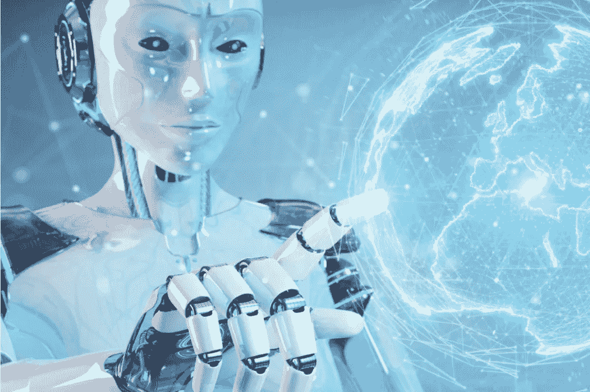
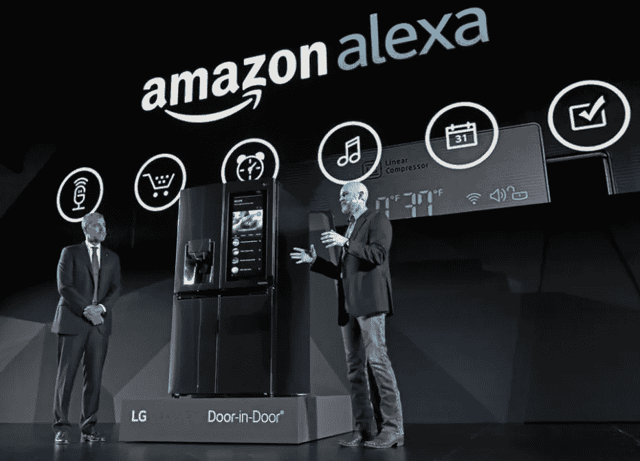
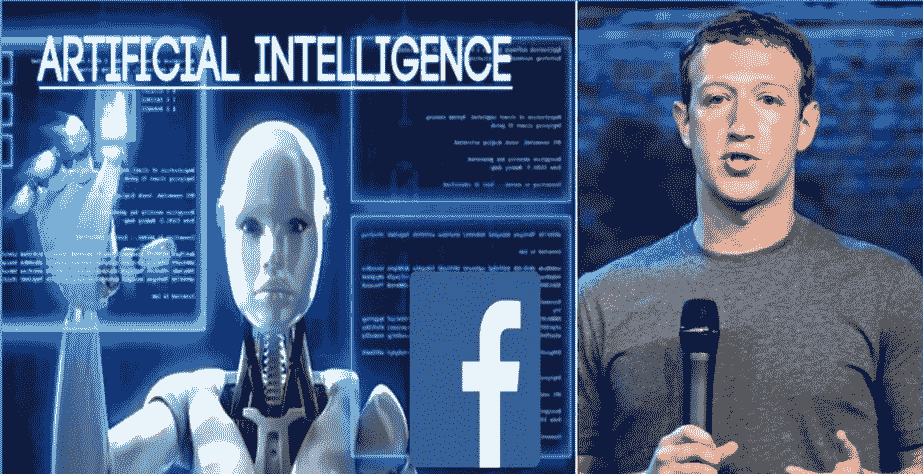
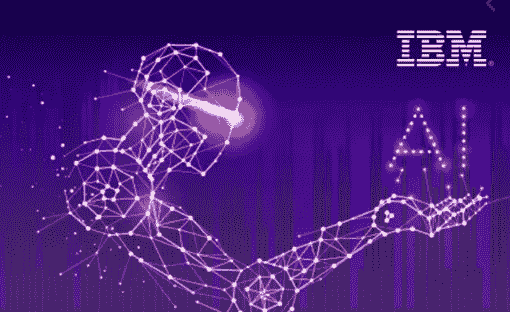
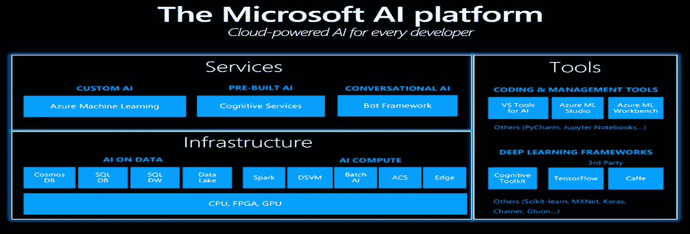
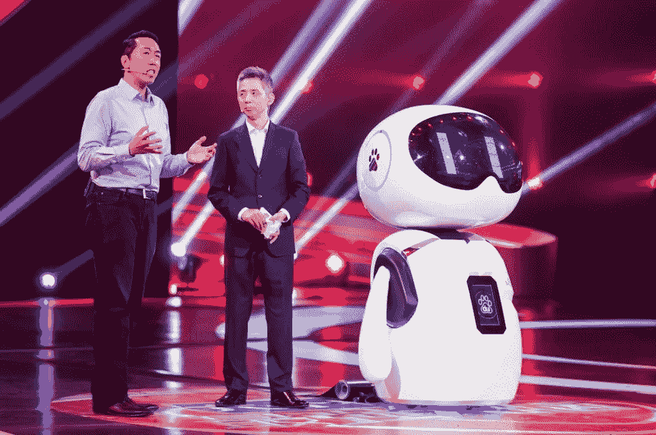
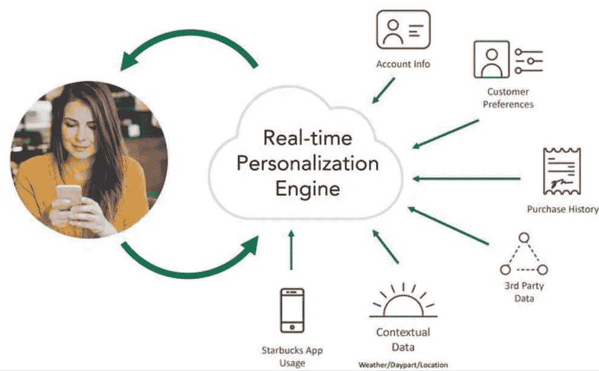

# 跨国公司如何强调提高人工智能，使他们成为这一代的顶尖公司

> 原文：<https://medium.com/nerd-for-tech/how-mncs-are-emphasizing-the-enhancement-of-artificial-intelligence-making-them-top-notch-1c74ad9ee770?source=collection_archive---------14----------------------->

我们先来了解一下什么是人工智能(AI)，什么是机器学习(ML)，什么是深度学习。

# 什么是人工智能？

人工智能(AI)是计算机科学的一个广泛分支，涉及构建能够执行通常需要人类智能的任务的智能机器。人工智能是一门跨学科的科学，有多种方法，但 T2 机器学习和 T4 深度学习的进步正在科技行业的几乎每个领域产生范式转变。

# AI 是如何工作的？

在破解纳粹加密机器 Enigma 并帮助盟军赢得第二次世界大战后不到十年，数学家艾伦·图灵用一个简单的问题第二次改变了历史:“ ***机器能思考吗？*** ”

图灵的论文“**计算机械与智能**”(1950)，及其后续的图灵测试，确立了人工智能的根本目标和愿景。

在其核心，人工智能是计算机科学的分支，旨在肯定地回答图灵的问题。

在他们开创性的教科书《人工智能:现代方法》中，作者斯图尔特·拉塞尔和彼得·诺威格探讨了这个问题

> 人工智能是“对从环境中接收感知并执行动作的智能体的研究”(罗素和诺维格八世)

Norvig 和 Russell 继续探索历史上定义人工智能领域的四种不同方法:

1.  **人性化思考**
2.  **理性思考**
3.  为人处事
4.  **理智行事**

前两个想法涉及思维过程和推理，而其他的则处理行为。

虽然这些定义对普通人来说似乎很抽象，但它们有助于将该领域作为计算机科学的一个领域，并为机器和程序注入机器学习和其他人工智能子集提供了蓝图。

# 人工智能的类型

人工智能通常分为两大类:

狭义人工智能的几个例子包括:

1.  谷歌搜索
2.  图像识别软件
3.  Siri、Alexa 和其他个人助理
4.  无人驾驶汽车
5.  IBM 的沃森

# AI 在日常生活中是如何使用的？

以下是一些你可能没有意识到的人工智能应用:

人工智能被广泛用于向人们提供个性化推荐，例如基于他们之前的搜索和购买或其他在线行为。人工智能在商业中非常重要:优化产品、计划库存、物流等。

搜索引擎从其用户提供的大量输入数据中学习，以提供相关的搜索结果。

智能手机使用人工智能来提供尽可能相关和个性化的服务。虚拟助理回答问题、提供建议、帮助组织日常事务已经变得无处不在。

在新冠肺炎，人工智能已经被用于机场和其他地方的热成像。在医学上，它可以帮助从计算机断层肺部扫描中识别感染。它还被用来提供跟踪疾病传播的数据。

# 什么是机器学习？

ML 是 AI 的一个子集，它使用统计学习算法来构建智能系统。**ML 系统可以自动学习和改进，无需明确编程**。音乐和视频流服务上的*推荐系统*就是 ML 的例子。机器学习算法分为三类:有监督的、无监督的和强化学习*。*

# 什么是深度学习？

人工智能的这一子集是一种受人类大脑过滤信息方式启发的技术。它与从例子中学习有关。DL 系统帮助计算机模型通过层过滤输入数据，以预测和分类信息。**深度学习处理信息的方式和人脑一样**。用于*无人驾驶汽车*等技术。DL 网络架构分为卷积神经网络、递归神经网络和递归神经网络。

*因此，我们知道人工智能是一个总括学科，涵盖了与让机器变得更智能相关的一切。机器学习(ML)通常与人工智能一起使用，但它是人工智能的一个子集。ML 指的是一个可以基于算法自我学习的 AI 系统。深度学习(DL)是应用于大型数据集的机器学习(ML)。*

# 公司如何在实践中使用人工智能

机器学习已被证明是许多行业的游戏规则改变者。ML 技术已经深入到几乎所有主要的垂直行业。难怪，机器学习以其不可思议的潜力彻底改变了商业领域。

> *一份报告称，机器学习市场预计将从 2016 年的 10.3 亿美元增长到 2022 年的 88.1 亿美元，预测期间的复合年增长率(CAGR)为 44.1%。*

**以下是一些公司的名单，这些公司有能力和资源塑造我们互联的未来，并正在大力投资人工智能。**

# 1.亚马孙

**数字语音助手，Alexa**

贸易巨头亚马逊投资了人工智能面向消费者的一面，以及公司及其流程的应用程序。亚马逊不仅凭借其**数字语音助手 Alexa** 参与了人工智能游戏，而且人工智能也是其业务许多方面的一部分。当许多实体商店正在努力寻找如何保持相关性的时候，**美国最大的电子零售商**提供了一种新的便利店概念，称为**亚马逊 Go** 。与其他商店不同，这里不需要结账。这些商店拥有人工智能技术，可以跟踪你挑选的商品，然后通过手机上的 Amazon Go 应用程序自动向你收取这些商品的费用。因为没有收银台，你自己带着包去装东西，有摄像头监视你的一举一动，识别你放进包里的每样东西，最终向你收费。

# 2.脸谱网

脸书使用人工智能和深度学习的主要方式之一是为其非结构化数据添加结构。他们使用 **DeepText，**文本理解引擎，自动理解和解释用户每秒发布的数千条帖子(多种语言)的内容和情感。有了 DeepFace，这家社交媒体巨头可以在分享到其平台上的照片中自动识别你。其实这个技术太好了，比人类更擅长面部识别。该公司还使用人工智能来自动捕捉和删除在其网站上发布的复仇色情图片。

# 3.国际商用机器公司

IBM 多年来一直处于人工智能的前沿。自从 IBM 的**深蓝**计算机成为第一个征服人类国际象棋世界冠军以来，已经过去了 20 多年。该公司继这一壮举之后又举办了另一场人机竞赛，包括其**沃森**计算机，赢得了智力竞赛节目《危险边缘》。IBM 最新的人工智能成就是 **Project Debater。这个人工智能是一个认知计算引擎，它与两位专业辩手进行了比赛，并制定了类似人类的论点。**

# 4.微软

人工智能是出现在微软愿景声明中的一个术语，这表明该公司专注于让智能机器成为他们所做一切的核心。他们正在将**智能功能整合到其所有的产品和服务**中，包括 **Cortana、Skype、Bing 和 Office 365，并且是世界上最大的人工智能即服务(AIaaS)** 供应商之一。

# 5.百度(全球最大的中文搜索引擎)

中国的谷歌，百度，使用一种叫做**深度语音**的工具，它使用人工智能和深度学习，只需要 3.7 秒的音频**就可以克隆一个语音**。**这是** **一种深度神经网络，可以生成完全合成的人声，很难与真正的人语区分开来**。该网络可以“学习”节奏、口音、发音和音高的独特微妙之处，以创造出惊人准确的说话者声音再现。他们使用同样的技术创建了一个工具，用作者的声音给你读书——所有这些都是自动化的，不需要录音室。

# 6.叫喊

Yelp 正在用人工智能帮你找晚餐。对于整整一代食客来说，给他们的食物拍照已经成为他们的第二天性——多亏了他们，Yelp 拥有了一个巨大的照片数据库。虽然之前该公司依赖用户为自己的照片添加“搜索友好的元数据”，但现在它配备了软件智能，可以仅根据照片识别餐厅的信息。

# 7.星巴克

星巴克在全球 25000 家门店每周有超过 9000 万笔交易，它使用机器学习和大数据分析来帮助指导营销、商业决策和销售。通过推出移动应用和奖励计划，他们收集并分析了客户的购买习惯。用户自己通过定义何时何地购买咖啡来创建数据。

星巴克收集顾客购买习惯的信息。因此，即使当顾客访问线下商店时，他们的系统也能够通过智能手机识别他们的偏好。除此之外，该应用程序还可以建议新的美食，这些美食可能会与他们点的饮料搭配。

这一切都是由星巴克的**数字飞轮程序**提供动力。这是一个基于云的人工智能引擎，**向不知道但想尝试新事物的顾客**推荐食物和饮料选项。

这项技术是如此的复杂，以至于这些建议会根据特定一天的天气，或者是假日还是工作日，或者你所在的位置而改变。

星巴克利用人工智能的另一种方式是通过其 Mastrena 浓缩咖啡机，该零售商目前正在美国和国际市场增加这种机器，预计将在未来 12 个月内完成。

这些**机器内置有物联网传感器**，这意味着星巴克从它们那里收集遥测数据，并将其发送到支持中心。“我们可以看到正在提取的每一杯浓缩咖啡，我们可以集中查看是否有机器需要调整或维护，”约翰逊解释说。凭借星巴克的深度酿造能力和预测分析，Johnson 说，该公司“**将能够在机器损坏之前确定它是否需要预防性维护。**

【https://www.linkedin.com】最初发表于**。**