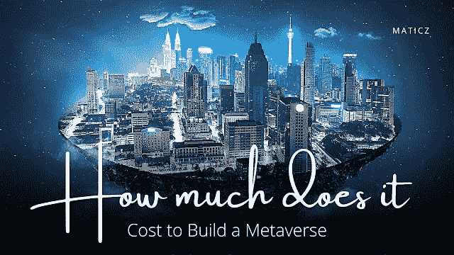

# 建造一个元宇宙要花多少钱？

> 原文：<https://medium.com/nerd-for-tech/how-much-does-it-cost-to-build-a-metaverse-aa3ad2fcd5e2?source=collection_archive---------4----------------------->

在元宇宙创业

元宇宙登上企业头条，处处围绕着你。你永远无法逃脱。因为这是十年内的下一件大事。它为参与者提供了身临其境的体验。在 **2024 年，**预计虚拟世界中元宇宙的市值是**8000 亿美元**到 **30 万亿美元**。

元宇宙可能在市场中有一种新的标准方式，并且通过做一个元宇宙项目赚了很多钱。在疫情时期，人们喜欢虚拟世界。增强现实和虚拟现实等先进技术的结合是元宇宙，这将是加密领域的下一个大事件。越来越多的元宇宙项目正聚焦于 IT 行业，该行业对元宇宙项目和房地产的未来有很大的影响力。

# 有哪些步入虚拟世界的途径？

进入元宇宙商业的几种方法。分散土地、沙盒和 Bloktopia 是各种商业概念非常流行的元宇宙平台。以下是抓住机会赚钱的方法。

*   玩游戏赚取游戏
*   网络购物
*   现场音乐会
*   专业事务
*   投资房地产
*   元宇宙土地
*   非功能性测试及更多

# 建造一个元宇宙要花多少钱？

至于 Maticz 技术私人有限公司，元宇宙平台开发的成本是基于客户的要求和需求。它从 10k 美元开始到 [**创建一个元宇宙平台**](https://bit.ly/3GLa8p1)

元宇宙项目系列的成本为 10，000 美元以上。这完全取决于建造它的时间，规模，想法，工业等等，

# 结论

最有趣的是不用连接加密货币钱包就能进入的虚拟世界。正如你所看到的，元宇宙正在制定一个标准，在未来的日子里为每个人提供多用途的商业机会，成为商业磁铁。