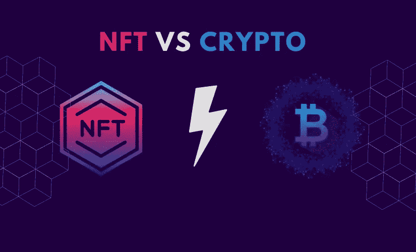

# NFT 与加密货币有何不同

> 原文：<https://medium.com/nerd-for-tech/how-nft-different-from-cryptocurrency-c036cd377d5?source=collection_archive---------4----------------------->

NFT vs 加密

世界正逐渐从传统的交易方式转向既携带货币又携带加密货币的数字钱包。有这么多的可能性，了解各种货币之间的差异是至关重要的。

NFT vs 加密货币是科技界的热门话题。基于区块链的 NFTs 和 Crypto 工作，两者使用相同的技术和原理。因此，他们倾向于吸引相同类型的人。但是它们的身份和功能是完全不同的。

最近，NFT 的销售额从 2021 年初的 9490 万美元飙升至 249 亿美元。它的直接和快速增长只有加密货币的崛起可以媲美，2021 年增长到 187.5%。如今，随着需求和兴趣的快速增长，这两个生态系统仍在蓬勃发展。此时，你可能想知道什么是不可替代的代币或 NFT，以及它们与比特币或其他加密货币有何不同。让我们来了解一下！

# ***什么是加密货币？***

加密货币是数字货币的加密形式，不依赖于任何金融机构来验证交易，并存储在数字钱包中。据《福布斯》报道，有 19，000+种加密货币在流通。

这是一个基于区块链技术的点对点系统，任何人都可以发送和接收付款。另一方面，加密的价值来自交易的加密证明，这些交易在一种称为区块链的特殊类型的数据库中被记录或验证。

一些人使用加密货币就像他们使用美元一样——作为一种交易媒介来购买或出售东西，或者接收产品或服务的付款。然而，大多数人投资加密就像投资股票一样——作为一种证券或商品，他们希望随着时间的推移会增值。

此外，加密比股票更不稳定。他们可以在短时间内失去或获得数百、数千甚至数万个百分点。一些流行的加密货币是比特币、以太坊、莱特币和系绳。

# ***什么是 NFT？***

NFT 是代表音乐、图像和视频剪辑等独特项目所有权的数字令牌。这些物品可以变成 NFT，在加密货币的帮助下可以在线交易。

NFT 与其他数字形式不同，因为它包含了区块链技术。区块链是分布式账本，整个交易将被记录在其中。它类似于你的银行存折，你的交易是透明的，一旦被记录下来，就可以被看到，不能被更改。

# **NFTs 是如何工作的？**

NFT 在区块链上工作，因为它向用户提供数字资产的完全所有权。例如，如果你是一个素描艺术家，如果你把你的数字艺术变成了 NFT，你会得到由区块链提供的所有权证明。

简单地说，当你在市场上列出你的 NFT，你将为使用区块链支付一笔交易费(汽油费)，然后你的数字艺术将被记录在区块链上。这给了你完全的所有权——任何人都不能修改或编辑，包括市场的所有者。

因此，每个加密爱好者创建或铸造一个 NFT，以获得独占的所有权，并且一次只有一个所有者。除了所有权，NFT 所有者还可以自由地对他们的作品进行数字签名，并在他们的 NFTs 元数据中存储特定的信息。这只对购买 NFT 的个人可见。

# ***加密货币是如何工作的？***

加密货币在一个被称为区块链的分布式公共账本上运行，该账本记录了所有更新的交易并由货币持有者持有。交易是使用名为加密货币钱包的软件在对等方之间进行的。交易通过称为挖掘的过程被记录在公共分类账中。这个过程涉及到计算机解决复杂数学问题的能力，以产生硬币。用户也可以从经纪人那里购买货币，然后使用加密钱包储存和消费。

虽然比特币自 2009 年就已经存在，但加密货币和区块链技术的应用在金融领域仍在不断涌现，预计未来会有更多的用途。包括债券、股票和其他金融资产在内的交易最终可以使用该技术进行交易。

# ***NFT 和加密有什么不同？***

加密货币和 NFT 都依赖区块链交易来记录它们的所有权和验证真实性；在大多数情况下，购买 NFT 需要加密。这里列出了一些主要的区别。

1.  加密货币是可替代的，它可以与其他资产交换相同的价值。而 NFT 是独一无二的资产，不能与任何其他同类资产互换。例如，如果你向你的朋友借了一张 100 卢比的钞票，你需要以完全相同的价值还给他，但不一定是相同的钞票。你可以给他两张 50 卢比或 10 张 10 卢比的钞票。但是如果你借了你朋友的车，你不能用别的车来还。所以，一辆车被认为是 NFT，它是独一无二的，这就是为什么它是不可替代的。
2.  加密货币被认为是可分割的资产，只要价值保持不变，它就可以被分成许多单位。而非转移资产是不可分割的资产，表现为一个整体，不能再细分为若干单位。
3.  NFT 有一个单独的比例值，每个令牌都有自己唯一的 ID。另一方面，加密货币是统一的，它们不像 NFT 那样有单独的价值比例。

# ***哪些人可以购买 NFT？***

持有加密货币钱包的人有能力购买 NFT。这是购买 NFT 的唯一必需品。此外，KYC 文件是购买艺术品的必要条件。购买 NFT 的先决条件是一个由 metamask 支持的加密货币钱包和一个可以买卖 NFT 的 NFT 市场。一些最新的和流行的 NFT 市场是 OpenSea.io、Rarible、Foundation 等等。如今，NFT 市场的发展吸引了大多数初创公司。因此，NFT 市场正在发展壮大。如果您想引领 NFT 市场并保持领先，那么请选择最有利和最可靠的 [**NFT 市场发展公司**](https://www.clarisco.com/nft-marketplace-development) ，它可以帮助您获得最佳的 NFT 市场解决方案。

## **总结**

本讨论探讨了 NFT 和加密货币之间的差异。加密货币和 NFT 都依赖区块链交易来验证其真实性并记录其所有权；在大多数情况下，你需要加密来购买 NFT，以便在 NFT 市场进行买卖。

最大的区别是，加密货币的价值是纯经济的——它的价值来自于它作为货币或投资的效用。另一方面，非森林论坛既有经济价值，也有非经济价值。例如，艺术家可以使用 NFTs 来分发、货币化甚至签名他们的作品——一些投资者或收藏家可能会使用加密货币购买这些作品。Crypto 用于收集或购买 NFTs，以便在 NFT 市场上购买或销售产品。