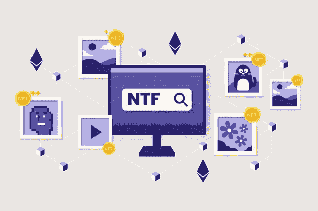
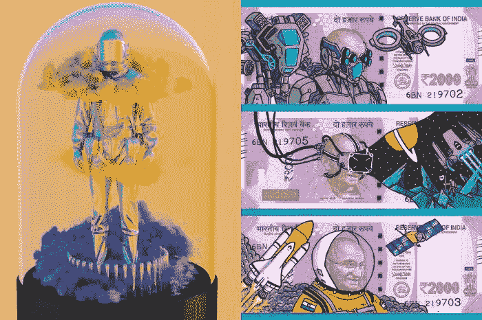
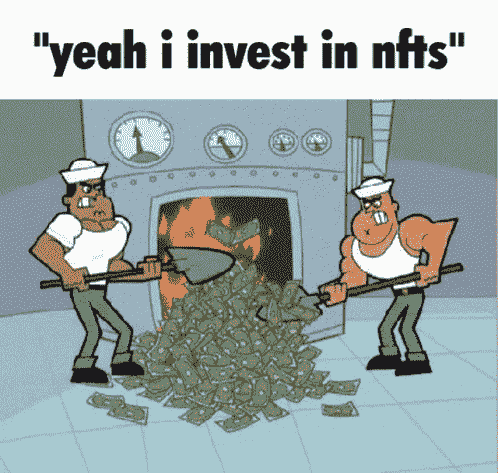

# NFTs 如何振兴印度的数字贸易世界

> 原文：<https://medium.com/nerd-for-tech/how-nfts-are-rejuvenating-the-world-of-digital-trade-in-india-2ddc7ebcd82b?source=collection_archive---------4----------------------->

## NFT 不断增长的市场

在技术发展的快节奏世界中，NFT 是进入在线交易领域的新窗口。虽然这不是一个全新的概念，但在过去几年里，随着可保金额的认可，它已经在行业中蓬勃发展。它已经在世界各地取得了长足的进步，现在它正与一些你从未想到过的大牌公司在印度市场占据一席之地，紧跟潮流，大赚一笔。最近，非关税壁垒 的流行，开启了一个可能性的海洋，什么可能是可贸易和不可贸易的决定因素，以及它对贸易世界可能意味着什么。

**不可替换令牌**

**什么是 NFT？**

*   可替代的定义意味着“相互可互换”，它是指一种产品的价值等于另一种产品的相同价值，而非功能性产品与可替代的产品相反。
*   它们是不可替换的令牌，这意味着它们对彼此具有独特的价值。它们不能互换。这些物品根据其受欢迎程度和稀缺性，以自身价值为代价进行独特估价，可以由艺术家、名人或任何人进行交易和出售，以换取数字货币，这些数字货币可以被称为与其加密对应物等价的流动现金。
*   NFTs 可以指任何奇异的数字化的、可转化的项目。一幅画、音乐、迷因、诗歌，不胜枚举。这并不局限于它在未来的意义，因为每一个成长中的行业都会随着时间的推移而发展和变化。它需要创意者和思想家来实现。

**NFT 对当今世界意味着什么？**

*   坦率地说，他们得到的荣誉比他们所认为的要少。我们中的许多人都听说过绕过加密领域的投资，以及数以百万计的 NFT 和“迷因”的激增，但并不是每个人都知道他们可以获得的好处。如果近期有机会攀登经济增长的阶梯，这可能是错失机会的致命弱点。这给了你一个狭窄的窗口，让你在 NFT 的 [**世界中大步前进。**](https://www.guardianlink.io/)
*   这使得许多未被认可的艺术家、创作者和他们的作品得到了他们应得的认可，特别是在最近世界进入了一个关闭的旋转门，以及美术馆“暂时”关闭以在全球范围内展示他们的作品。

NFT 正在向印度进军。

**印度的 NFTs**

> 互联网时代的世界是一个不断发展的超级磁铁，它弥合了增长、距离和联系的距离。这使得全世界的人都有可能获得和其他人一样的机会。具体来说，对加密货币实施的规则和监管对任何手快的人来说都是一个公平的竞争环境。
> 
> 印度在科技领域并没有退缩，也没有对经济、社会和文化的现代发展做出太多贡献——它已经开始获益。有许多知名人士紧跟时代变化，在数字市场上留下了自己的印记。

**利用这个机会的名人和有影响力的人**

**印度名人和他们的 NFT 热**

*   阿米特巴·巴强、蔡玉洁·马尔霍特拉、桑妮·黎翁只是为印度 [**NFT 收藏品**](https://www.beyondlife.club/) 的未来开拓道路的名人中的几个例子。
*   卡马尔·哈山是第一个进入元宇宙的人，他创建了自己的 NFTs，将他的头衔“ulaga nayagan”货币化，并使一个人可以在 NFTs 的世界中探索的可能性领域多样化
*   不仅仅是电影明星，你认识并喜爱的一些体育明星也在崭露头角。

**现在，这对印度非正规教育的未来意味着什么？**

*   说 NFT 在网上贸易的未来呈指数增长是一种保守的说法。许多传统投资者和企业正在意识到这种变化是如何影响他们的经营方式的。对于更“纯粹”的有形资产投资者来说，这是一个重大的 FOMO。
*   你不需要成为一个主要的技术集团来开始使用 NFTs，甚至不需要为你在你自己的市场或交易中开始做准备。有承诺的产品，使你更容易推出自己的市场，你自己的钱包和模板，你只需要让你的作品开始销售。
*   Guardian Link 是让创意人员有可能开始创作的产品之一，他们是 Amitabh 在 NFT 推出的产品背后的头脑，该产品价值近 80 亿卢比。让你可以利用的优势为你服务是值得的。
*   在印度的 NFT 市场，有很多成功和失败的例子，从中你可以判断你的策略并获得利润。

**结论**

NFT 是你童年时代的新的可交易卡，但它们非常成熟，具有现实生活的后果，有可能获得大量现金。它们触及了怀旧的乐趣——玩弄情感，以及它们对我们成长的影响。随着时间的推移，他们会有更多的机会。越来越多的人开始利用新的交易形式。

印度是一片充满机遇的土地，印度人不会退缩。这可能是这个时空中为数不多的机会均等的时刻之一。这是一个吃到饱的机会自助餐，你可以尽情享用，没有评判。