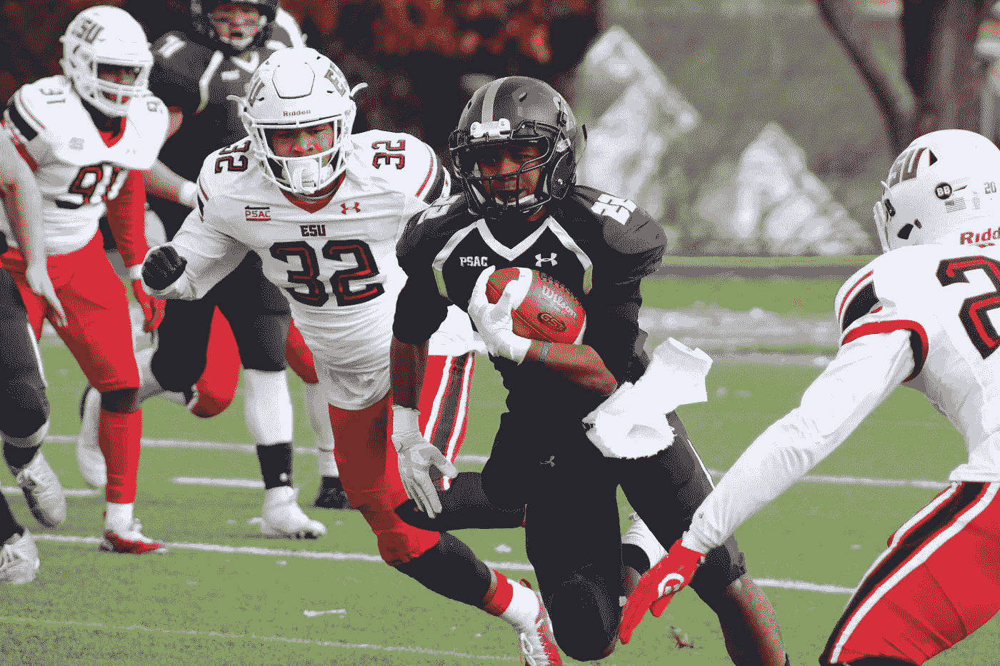
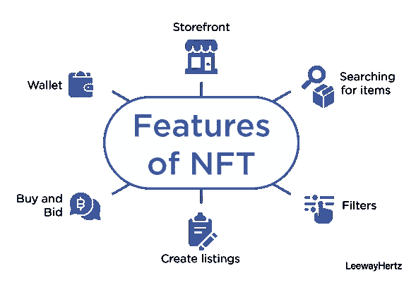

# NFT 如何改变体育产业？

> 原文：<https://medium.com/nerd-for-tech/how-nfts-are-transforming-the-sports-industry-c78b55d8097?source=collection_archive---------8----------------------->

来自[像素](https://www.pexels.com/photo/football-player-carrying-brown-football-1618269/)的图像

随着比特币的成功，区块链获得了巨大的关注，并且没有放缓的迹象。在这种快速发展的区块链发展中，由于代币在数字稀缺性方面受到限制，非功能性交易正在增加。NFTs 将艺术、音乐、体育、游戏等不同收藏品行业的资产与区块链技术联系起来。

虽然多种因素导致了区块链的崛起，但不可替代代币(NFT)和球迷代币的出现正在推动全球职业体育的发展。让我们深入探讨一下什么是 NFT，以及它们对整个体育产业的影响。

# 什么是 NFT？

[NFT](https://www.leewayhertz.com/nft-non-fungible-token/)是存储在区块链上的独特创建的数字资产，代表各种有形或无形的收藏品，从体育赛事到虚拟房地产和数字艺术。NFT 上的可识别信息易于验证，并且不可互换。

每一个被铸造的 NFT 都可以通过区块链平台被追溯到最初的发行者。因此，它消除了对第三方验证的需要，并为身份验证提供了现成的审计跟踪。

# NFT 如何重塑体育产业的面貌？

NFTs 在以下几个方面展示了对体育产业的变革方法。

*   **粉丝代币与订婚** NFTs，在体育产业中找到粉丝代币形式的独特应用。这些可替换的公用令牌为粉丝提供了访问权限，并可以影响运动队、VIP 奖励和促销活动的某些决策。与 NFT 不同，fan tokens 是可以交换和交易的。这些代币类似于加密货币的交易功能。球迷代币的需求很大，因为这些代币的所有者可以影响某些俱乐部事务，如选择制服、有价值的球员等。
*   **运动员推出自己的数字平台** 运动员在推动创新的 NFTs 成为他们的媒体平台方面也不落后。大大小小的球员联盟为明星们在球队之外赚钱做出了贡献。此外，不同的营销企业携手合作，与工会代表运动员与不同的游戏。
*   **以“时刻”为特色的 NBA 顶级镜头** 数字收藏品的一个重要例子是在 NBA Top Shot 平台下销售的“Moment”。Moments 包括球员投篮、抢断、扣篮或盖帽的视频剪辑，以及位于专有文件格式中的关键球员统计数据。可以直接从 NBA Top Shot 购买“包”中的时刻，然后像传统的篮球或棒球卡一样单独出售或交易。这些时刻被完全数字化并存储在软件钱包中。因此，所有主要运动的爱好者都能够购买、收集、出售和交易由 NFTs 保护的数字收藏品。
*   将实物商品与数字代币相结合
    数字代币在推动体育事业方面发挥着至关重要的作用。像耐克这样的大多数运动鞋制造公司都申请了一项专利，该专利使用 NFT 来验证产品的真实性，也被称为 cryptokicks。在购买一双 cryptokicks 时，顾客会收到一个数字令牌，确保在从一个买家到另一个买家的过程中鞋子的真实性。
*   将计算机游戏链接到非功能性桌面平台
    将计算机游戏链接到非功能性桌面平台也提供了有趣的可能性。对于像 Sorare 这样的足球游戏，玩家扮演经理的角色，为他们的物品买卖足球运动员。NFT 也有助于加强与各种俱乐部的合作关系，这使得平台可以在游戏中出售这些球队的球员。
*   拥有的历史给所有的收藏品带来了巨大的价值。由于 NFTs 提供了很高的透明度和资产级别，它提供了简单的所有权验证。通过游戏性和游戏内经济来产生价值需要精心的设计和平衡的游戏。

任何数字收藏品的市场价值取决于下一个拥有者的购买意愿。与官方体育联盟建立伙伴关系降低了数字收藏品平台的竞争性。当数字收藏品用 NFTs 保护时，与复制和伪造攻击相关的风险大大降低。

在体育产业中探索和融合 NFT 有助于创建数字市场，体育迷可以在这里轻松地与他们最喜爱的球员联系。趋势迹象正在见证数字体育收藏品的逐渐变化，但市场继续增长而看不到峰值的时间已经不远了。