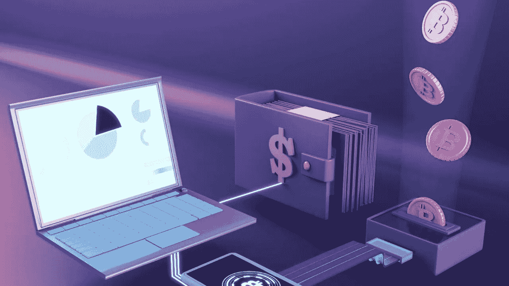

# 在没有密码的情况下，NFTs 如何在中国发生？

> 原文：<https://medium.com/nerd-for-tech/how-nfts-can-happen-in-china-without-crypto-8bacbfa710f5?source=collection_archive---------7----------------------->

根据一位 NFT 专家的说法，NFT 热已经蔓延到中国，尽管几乎没有证据表明其中有秘密。

在专家 [NFT 开发商](https://www.blockchain-council.org/certifications/certified-nft-developer/)的帮助下，中国社交媒体和游戏巨头腾讯开发了一款 NFT 购买和收款应用，电子商务平台阿里巴巴销售了 50 个 NFT 月饼，以促销一种元宇宙产品，六家初创公司正在争夺中国本地化不可替代的代币交易市场的头把交椅。

还没有任何东西能与 NFT 价值 6900 万美元的艺术品购买相提并论，比如毕普的“每一天”然而，一系列重要的中国公司已经加入了 NFT 的潮流，包括大型科技公司、区块链初创公司、艺术品拍卖行和零售品牌。

他们涉足 NFT 作品的许多原因与他们的西方同行相似:区块链授权的知识产权保护，对一种新形式的交易和艺术品策展的热情，以及他们因与时尚概念联系在一起而获得的免费宣传。

另一方面，在中国，非专利技术不是为了赚快钱。相反，中国 NFT 参与者正试图避开加密货币，尽管非金融交易与加密货币有着内在联系。在语言层面，企业在将“不可替代的令牌”翻译成中文时省略了“令牌”一词，而在技术层面，一些组织完全放弃了全球以太坊区块链基础设施。

NFT 狂潮的本地化是另一个例子，表明中国区块链爱好者如何将区块链应用程序与加密货币分开，以保护前者免受监管机构的注意，因为中国今年已加倍取缔所有加密交易。

**应该不惜一切代价避免以太坊。**

在西方，NFTs 和加密实际上是密不可分的。以太坊区块链被用来创作 NFT 的大部分艺术品，包括一些最著名的作品，如 CryptoPunks 和 Bored Apes。要进行任何 NFT 交易，卖家和买家必须拥有以太坊钱包和世界第二大加密货币 ETH。

问题是开采、交易和用加密货币兑换法定货币在中国都是被禁止的。

财务状况越差，你就越安全。

无论这些中国 NFT 市场采取何种变通办法，最终结果都是中国的大部分 NFT 交易与加密货币脱钩。艺术品以人民币计价，购买使用银行卡、支付宝、微信支付等传统非加密手段完成。

**包装**

尽管如此，市场仍是一片活跃。事实上，在中国，NFT 并没有真正与加密货币挂钩，这并没有引起中国流行品牌、事件或音乐人的关注。2022 年亚运会将在中国杭州举行，通过阿里巴巴的支付服务支付宝分发了 2 万个 NFT 火炬。与家乡有联系的主流艺术家正在拍卖他们的作品。一些最重要的交易是在香港进行的，比如国际知名艺术家首次亮相的作品《强的 NFT》以 250 万美元的价格成交。在香港，加密交易仍然是允许的。然而，在喧嚣中，这种区别有时会被忽视。

报名参加加密货币开发者课程，开始成为加密顾问的旅程。