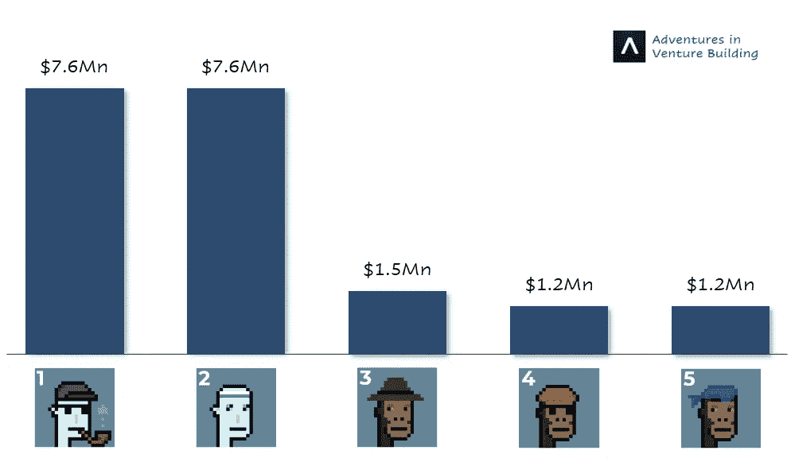
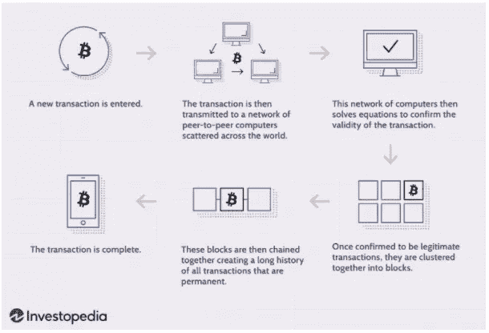
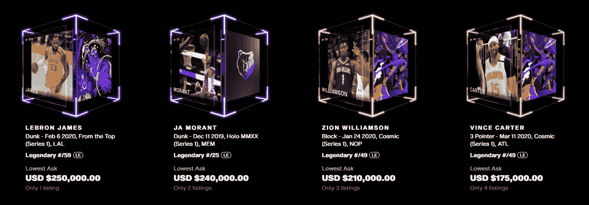
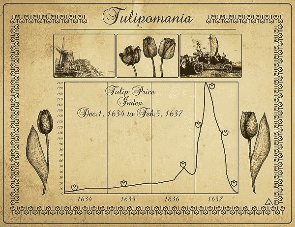
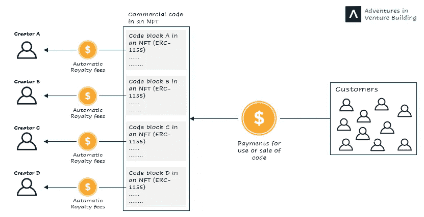
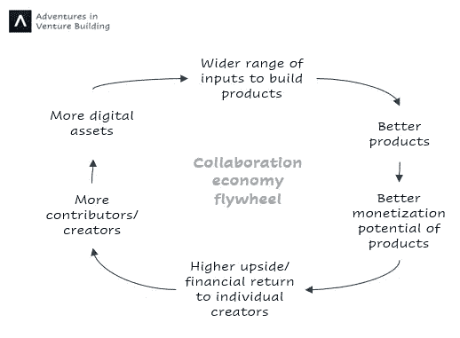
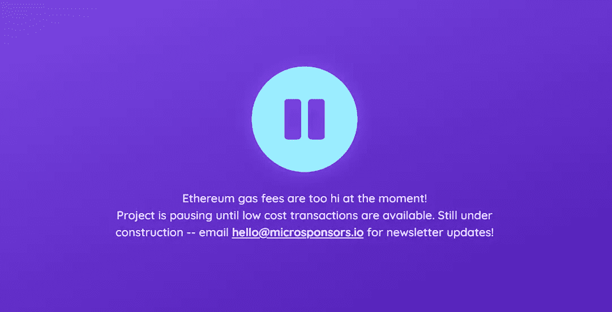

# NFTs 将如何改变我们的工作方式

> 原文：<https://medium.com/nerd-for-tech/how-nfts-will-change-the-way-we-work-adf28e6ee3c6?source=collection_archive---------5----------------------->

## NFTs 与合作经济的兴起

2017 年 6 月，马特·霍尔(Matt Hall)和约翰·沃特金森(John Watkinson)发布了 10，000 个 CryptoPunks，这是一组基于以太坊(Ethereum)构建的令牌化的 24x24 像素艺术图像。每个朋克都是独一无二的，只能由一个人正式拥有。

这些代币(或 NFT)最初是免费的，任何人都可以申请，但其价值已经爆炸，最近最贵的代币卖到了 760 万美元

CryptoPunks 销量:前 5 名

一旦你买了一个朋克，你能对他做什么？什么都没有，除了吹嘘你有一辆。当我建议我的妻子买其中一个时([最便宜的今天卖 31690 美元](https://www.larvalabs.com/cryptopunks/forsale)，她的反应是:‘**你疯了吗？**'

为了回答这个问题，让我们来探讨一下什么是 NFT，并讨论一下这种疯狂的趋势将走向何方。

# NFTs 的兴起

## 什么是 NFT？

不可替代令牌(NFT)是一种加密令牌，使用区块链技术来证明唯一数字资产的真实性和所有权。

当一项资产可以与另一项相同的资产互换时，它就是可替代的。例如，钱是一种可替代的资产，因为你不会在乎你用哪一美元购物，而我的美元相当于你的美元。

类似地，大多数数字产品(歌曲、电子书、图片)都是可替换的，因为它们可以很容易地被多次复制，用户通常不在乎他们使用哪个副本。因此，我们需要中介(平台、合同)来主张数字资产的所有权，并将其转让给另一个人。

NFT 通过在代表资产的令牌中嵌入唯一的 ID(元数据)来解决这个问题。铸造 NFT 时，它的 ID 在区块链上注册，成为它的护照，使用户能够查看和验证它的整个历史(所有权、创造者、价格)，而不需要中介。

区块链是一种数字分类账，允许通过分散的计算机网络记录交易和执行合同，而不需要中间人。下面是它的工作原理示意图(应用于比特币交易):

区块链工作原理概述

## 人气飙升

近几个月来，NFT 的受欢迎程度激增，数量惊人:

*   通过佳士得组织的拍卖，Beeple 以 6900 万美元的价格卖出了他的数字艺术收藏拼贴画，这是在世艺术家拍卖中第三贵的作品。
*   杰克·多西以 290 万美元的价格卖出了他的第一条推特
*   袜子是一种象征，它赋予主人一双独一无二的限量版袜子的权利，原价为 12 美元，现在售价为 86369 美元。

结果，几乎每个人都在赶这个潮流:马克·库班和加里·维纳查克在交易非功能性森林税，而许多名人(刘德华、肖恩·蒙德兹、列昂国王和林赛·罗韩)在制造这种税。

如今最受欢迎的用例是 [NBA Topshot](https://nbatopshot.com/) ，这是 NBA 和 Dapper Labs 之间的一项合作，旨在出售由 NFTs 支持的 NBA 精彩视频(使其稀缺并得到验证)。**最近几个月，对这些视频的需求激增**，10 万用户拥有至少一个亮点，其中最贵的(勒布朗·詹姆斯的这个[扣篮](https://nbatopshot.com/listings/p2p/a494c64e-9e93-418c-8934-f331ee47a39b+768166e3-f4bb-4395-9b48-4c545aebc95c))目前售价为 25 万美元。

NBA 前四名

拥有一个 NBA 热门集锦**并不能给你任何独家视频权**，任何人都可以在线观看和下载。此外，每个 TopShot 都有多个版本，每个版本都有不同的编号。例如，勒布朗的扣篮发行了 50 个版本；因此，50 个人实际上拥有相同的视频，但每个人都有不同的版本号，因此是唯一的 NFT。

花这么多钱买一个视频似乎很荒谬，但收藏家们认为这就像拥有一幅莫奈的画:价值不在于某人能否观看它，而在于所有权本身。对此，批评家们回答说，一幅实物画被艺术家的画笔触摸过，而一个数字文件是一系列以某种方式组织起来的 1 和 0，可以被精确复制。

这些批评家确信我们正处在一个等待破裂的巨大泡沫中。

## NFT 是在泡沫中吗？

“郁金香狂热”是历史上第一次有记录的资产泡沫，当时一些郁金香的价格上涨了 200 倍。查尔斯·麦凯在他的书 ***中描述了这些事件:非同寻常的大众错觉和人群的疯狂*** :

> 许多人突然变得富有。一个金色的诱饵诱人地挂在人们面前，他们一个接一个地奔向郁金香市场，就像苍蝇围着蜜罐一样。每个人都想象人们对郁金香的热情会永远持续下去，世界各地的富人会把郁金香送到荷兰，并且愿意出任何价钱购买。

1637 年 2 月，郁金香交易商再也找不到愿意出高价的新买家。对郁金香的需求突然崩溃，拥有者发现他们现在拥有的郁金香球茎的价值只有他们当初购买价格的一小部分。

郁金香狂热时期的郁金香价格指数

NFT 的兴起最初可能始于收藏家和粉丝试图捕捉一段数字艺术史，然而，今天发生的事情**与郁金香狂热有很大的相似之处:**

*   最近的价格飙升吸引了寻求赚钱的投机者。他们愿意购买任何 NFT，不管其内在价值如何，因为他们只关心将来以更高的价格出售。昨天，一个[单红色像素](https://twitter.com/MKBHD/status/1375231197949919232/photo/1)卖到了 90 万美元。
*   同样，数百名艺术家涌入这个空间，开始铸造 NFT，希望快速赚钱。因此，市场供过于求，每个 NFT 的独特性被淡化。

话虽如此，泡沫通常会比人们预期的时间更长，我不知道 NFT 泡沫何时会破裂，也不知道我假设的隐朋克一个月后会值多少钱。

有一点是肯定的，泡沫通常是创新的前兆，证明数字资产所有权的能力有着更广泛的用途，而不仅仅是艺术。具体来说，**NFT 将在开启协作经济方面发挥重要作用。**

# 协作经济

## 激情经济

2019 年，李锦创造了“激情经济”一词，作为互联网创业的新模式，个人通过将观众货币化，将他们的激情(即玩视频游戏或拍摄视频)转化为生计:

*   《瑞安的世界》中 8 岁的小明星瑞安·卡吉(Ryan Kaji )连续两年在 YouTube 上收入最高，2020 年收入 2950 万美元。
*   16 岁的抖音明星查理·达梅里奥(Charli D'amelio)通过该平台积累了 800 万美元的净资产。
*   《可教的》上十个最成功的创作者总共赚了超过 1 亿美元。
*   Substack 上排名前 10 的作者每年总共赚了 1500 万美元

尽管有这些数字，单个创作者的产出受到他们开发内容的能力的限制，当创作者可以轻松地跨平台相互合作，在彼此的工作基础上创造更强大的产品时，激情经济的全部潜力将得到释放。

我并不是说这种合作现在不存在。然而，它们通常由第三方(法律协议和审计员)调解，存在许多摩擦，并经常导致不一致的激励。例如，如果一个开发人员想要利用另一个开发人员的代码来创建商业软件，他/她可以通过以下两种方式之一来实现:

*   为它支付一次性费用，这不能创造长期的激励，因为软件可能成功或失败，艺术家不会得到相应的补偿。
*   签署收入分享协议，这要求律师起草法律协议，审计员检查是否进行了正确的支付。

进化后的激情经济(*姑且称之为协作经济*)将为合作伙伴关系提供一个更好的模式，在这种模式下，创作者可以通过自动收入共享机制，不受限制地跨平台无缝分享和混合他们的创作。

## NFTs 与合作经济

通过 NFTs，创作者可以在他们的作品中嵌入自动版税收取机制，无论何时使用，都可以给他们带来财务上的好处，并使他们更容易建立在彼此作品的基础上。

开发者将从这种创新中受益匪浅。他们不再通过开源代码进行合作，也不收取任何报酬，他们现在可以将自己的作品铸造成 NFT，并让所有人都可以利用和改进，因为他们知道使用他们作品的任何软件所产生的收入的一部分将自动归他们所有。

*这就好像每个开发者都会建造一个隐喻性的乐高积木，这些积木被放在一起建造一个产生回报并自动向他们公平分配版税的结构。*

具体来说，每个开发人员将把他们的代码片段铸造成 NFT (ERC1155 支持的)，这些 NFT 将被组合在一起形成商业软件，并在复合 NFT (ERC721 支持的)中铸造。每当软件被使用并产生收入时，每个开发者都会自动得到他们应得的版税，而不需要追踪他们。

代码开发—协作

同样的概念也可以应用到其他有合作关系的行业，包括音乐、研究甚至内容创作。关于这个话题的更多细节和对未来工作的更深层次的看法，请查阅帕奇·麦考密克的《T4 给人的力量》。

许多区块链项目目前正在开发中，以实现。Microsponsors.io 是一个帮助自由职业者标记他们的工作，并允许潜在雇主竞标 NFT 的工具，该工具代表了承包商的大部分时间，并保留了哪些工作可以完成的不可变记录。

当然，并不是每个项目都将或者应该采用这种分散的模型，因为一些项目最好采用更集中的操作。然而，由于个体创作者的个人工作得到了适当的补偿，他们中的许多人会选择退出大型组织，而是独立决定做什么和支持哪些项目，从而为协作经济创造了一个强化的飞轮效应。

协作经济飞轮

不幸的是，我们还没有到那一步。

## 障碍

释放 NFT 的全部力量需要它们广泛可用、易于共享、廉价且高效。今天，这个过程很复杂，有非常特殊的使用案例，消耗能量，而且昂贵。

大多数区块链使用工作证明协议来验证和确认事务的有效性。一旦交易被执行，计算机就解决复杂的谜题，并相互比赛验证它们，以换取以加密货币支付的费用。

随着加密货币的价值在 2017 年飙升，“矿工”们在全球各地建立了验证区块链交易的中心，并不断增加他们的计算能力，以提高他们赢得验证比赛的机会(我在这里过于简化了，但是)。这大大增加了区块链运营的电力消耗和碳排放。因此，如今比特币开采产生的碳排放量相当于阿根廷的碳排放量。

除了排放，铸造 NFT(即在区块链注册)和交易的费用也很高。艺术家通常要支付 100 多美元的“汽油费”来铸造一件 NFT，买家还要支付高额的交易费。这增加了铸造非功能性交易的摩擦，因为创作者被迫预先承担铸造成本，而不能保证 NFT 在未来会产生任何价值。因此，许多项目，如 [microsponsors.io](https://microsponsors.io/) ，由于高昂的以太坊气费而被搁置。

Microsponsors.io 的登陆页面

在这些问题得到解决之前，NFT 将很难扩展。幸运的是，解决方案正在路上:

*   工作证明协议的替代方案，称为利害关系证明，正在开发中。新协议用一个更简单的过程取代了解决能源密集型谜题以赢得比赛的需要，在这个过程中，你赢得比赛的机会取决于你在系统中持有多少股份(即你钱包中的硬币)，而不是你的计算能力，因此大大降低了电力需求。
*   许多费用低得多的新区块链越来越受欢迎，预计将大大降低铸造和购买 NFT 的成本。
*   新平台正在简化 NFT 的交易流程。例如，NBA TopShot 上的交易不是以加密货币进行的，而是以常规美元进行的，这使得每个人都更容易参与进来。

无论我们走向何方，未来都是令人兴奋的，权力下放运动将对我们未来的互动和工作方式产生重大影响！