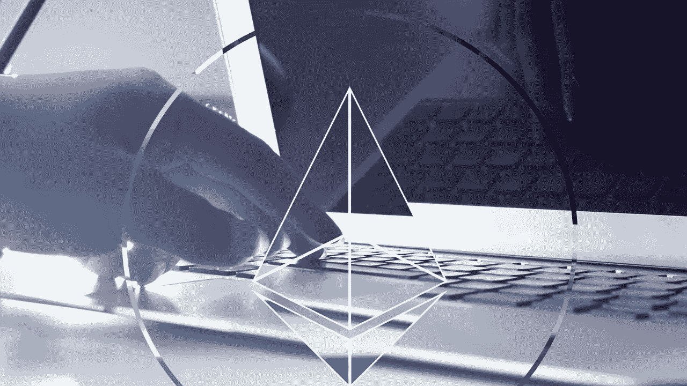

# 如何使用 Polygon 来帮助跟踪以太坊交易和平衡？

> 原文：<https://medium.com/nerd-for-tech/how-polygon-can-be-used-to-help-track-ethereum-transactions-and-balance-1e8b98d8f38e?source=collection_archive---------3----------------------->

Polygon MATIC 是以太坊区块链的一个扩展平台，允许他们互相交流。它还用于为需要分散支付系统的企业和机构构建新的以太坊区块链。因为它的主要目的之一是培育一个多链以太坊生态系统，该网络称自己为“以太坊的区块链互联网”

Polygon 很高兴地宣布推出 PoS Bridge Explorer，这是一个在线应用程序，可以轻松跟踪 Polygon PoS 网络和以太坊 mainnet 之间的交易。难怪对[多边形开发商](https://www.blockchain-council.org/certifications/certified-polygon-developer/)的需求如此巨大！

Polygon 提供了一个不可信的双向桥梁，使用户能够将资金从以太坊(存款)转移到以太坊(取款)，而不会遭受第三方风险或市场流动性限制。存款需要 7-8 分钟，取款需要 45 分钟到 3 小时，该桥支持各种标准，包括 ETH、ERC20、ERC721 和 ERC1155。

涉及合同部署的活动

合同部署活动可能是区块链项目开发的一个强有力的指标。当比较以太坊和 Polygon 的统计数据时，会发现一些异常。首先，我注意到 ERC-20 代币占多边形合约总数的比例要大得多。自 4 月份以来，Polygon 每发布 220 份其他合同，就发布一份 ERC-20 象征性合同。以太坊上每 1430 秒部署一个 ERC-20 令牌合约！事实上，多边形上经常出现同名的记号。这是由于两个因素:一些开发人员在产品中进行测试，而其他人分发伪造的令牌来欺骗消费者购买它们。低成本汽油的奇迹。

以太坊和多边形区块链上都有地址。

在以太坊和多边形上，我们可以跟踪活动地址的数量。截至 6 月 9 日，这一数字约占所有多边形地址的 34%。从 2021 年 4 月开始，我决定分析以太坊和 Polygon 上的交易，以简要了解这两个链上的这些地址在做什么。Quickswap 和 Polycat.finance 是该用户群在 Polygon 上最常使用的项目合同。Uniswap 的 V2 路由器是以太坊上最受欢迎的。

令人惊讶的是，这些重叠的地址中大约有 17000 个被装载到 Polygon 上的 Aave 中，而从未在 Ethereum 上使用过 Aave。Curve.fi 大致相差 3000 点。

收养稳定的‍

Tether 在以太坊的稳定流通中遥遥领先——的日交易量几乎是和戴总和的两倍！尽管如此，USDC 似乎是 Polygon 上的首选货币，占所有稳定币转账的一半以上。许多多边形本地 stablecoin 协议正在开发中。两个著名的例子是铁和 miMATIC。

**结束**

Polygon 被称为“以太坊的区块链互联网”它解决了以太坊目前的一些问题，包括过高的费用、糟糕的用户体验和每秒交易量(TPS)少。它还想创建一个由兼容以太坊的区块链组成的多链生态系统。

参加加密货币交易课程，成为最好的加密货币顾问。