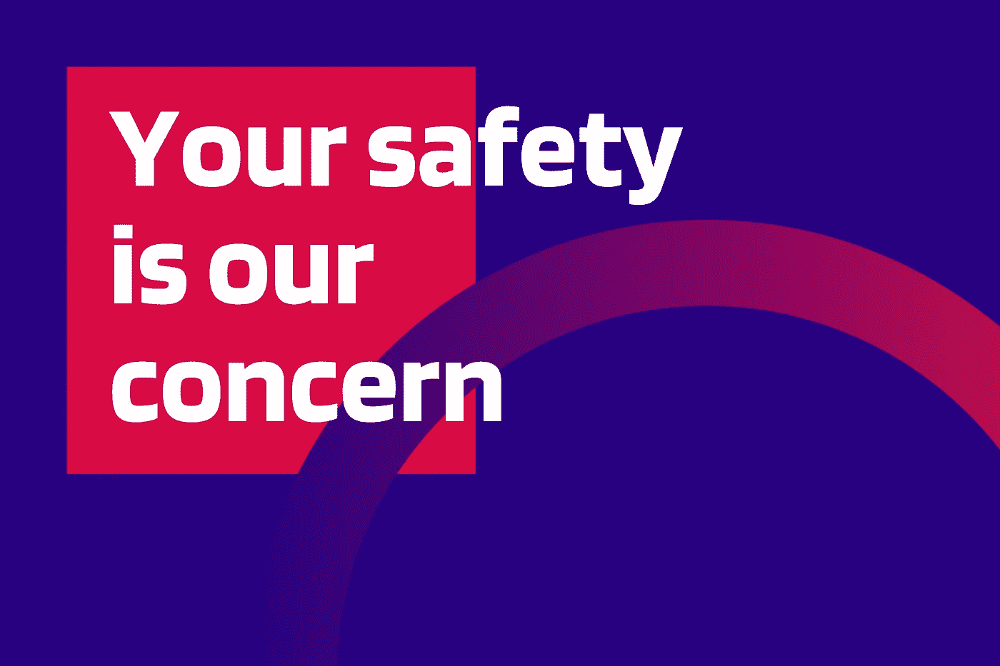
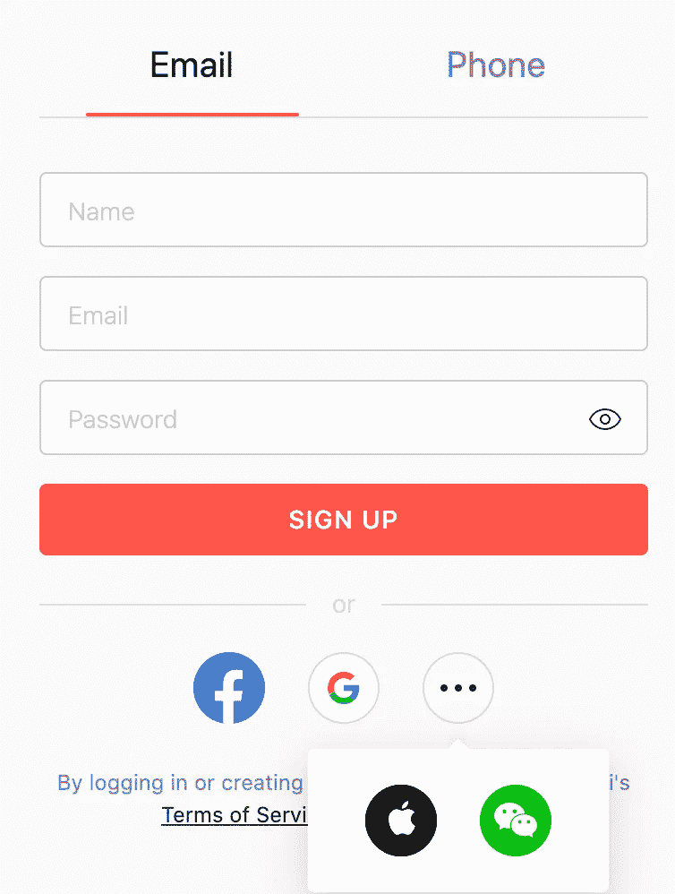

# 如何保护您的数字数据免受黑客攻击

> 原文：<https://medium.com/nerd-for-tech/how-protect-your-digital-data-from-hackers-288ebd0234b5?source=collection_archive---------4----------------------->

现在一切都是数字化的。我们需要知道如何保护所有这些数据免受黑客攻击。如果你认为我不是比尔·盖茨，我的银行账户上也没有 10 万美元，没人能黑我。你永远不知道你的数据会被如何使用，或者黑客会对你的账户做什么。这里有一些关于黑客可以利用你的电子邮件和电脑做什么的好文章。

我想指出一件非常重要的事情——你不可能得到 100%的保护。每个人都可能被黑。您的目标是提高数据的安全级别。

**报名**

我们有两种方法来完成注册。首先是填写电子邮件、密码和其他字段。第二次注册使用你的谷歌帐户或 facebook 或其他。

使用第二个选项很容易，因为您不需要创建新密码并记住它。如果您使用第二个选项，您需要在主帐户上启用 2FA。

**密码**

首先，你不能对每个网站使用相同的密码。如果有人发现了你的密码，他们就可以进入你所有的账户。这意味着他们可以在你的账户上花钱，或者给你的朋友写下流的东西，或者代表你在你的 facebook 页面上发布不好的帖子。大家都会觉得你这样做。你不想处于这种情况。

我们知道密码必须有 15 个字符，有数字，有小写和大写字母。完美的密码必须是这样的: *kdYZww7hKehXTSt* 或者 *LPT7FMxYbWZwukN* 。那些密码有问题。要记住它非常困难。

我有一个解决方案给你——密码管理器。密码管理器将您的密码存储在加密文件中。最好将密码存储在这些应用程序中，然后写在谷歌文档或其他地方。密码管理器的小列表:1Password，LastPass，keepass。现在你不需要只记住一个密码就可以访问其他人。

如果一个应用程序在你的电脑上存储了一个带密码的文件，你需要做几个拷贝，把它们放在不同的地方，其中一个必须是闪存盘(从现在开始，这个闪存盘你只能用来存储带密码的文件),如果这个文件会被删除，你有一个拷贝。

另一个记住密码的方法是造一个简单的句子。比如:
*lastwodofterminatorwerehastalavistababy*或者*HarryPotterKnowsHowToUseWand*。那些句子比这个更容易记忆。你可以自己造一个好记的句子。但是因为我们需要为不同的帐户设置不同的密码，所以我们需要创建一个系统来设置唯一的密码。

要使密码独一无二，你可以使用申请的最后两个字母，并给他们数字。比如 facebook —句子+ OK + 08。对我来说 k 看起来像 8。你的 facebook 密码看起来像:*harrypotterknowshowtousewandok 08。刚开始的时候很难记住你的系统。您可以在密码管理器中编写解释和密码。最终你会在没有帮助的情况下从你的大脑中得到一个密码。此外，至少每 1-2 年您需要更改一次密码。*

当然没人告诉你密码。实际上没有人，如果有人问你的密码，他们这样做是因为他们想知道它。

最近有人试图勒索我。这个人用我以前的密码给我写了一封信，他们试图登录我的账户。因为我改了密码，用了 2FA 他们的计划就泡汤了。

**2FA** — **双因素认证**

要登录支持 2FA 的网站，你需要一个代码，没有它你不能登录。2FA 给了你另一层安全，即使黑客有密码，没有密码他们也不能登录。代码只能从您的手机中获取。

2FA 可以像短信一样发送到你的手机上，或者你可以使用 google authenticator 这样的应用程序。该应用程序不断更新一个代码，每个代码只有 2 分钟的有效期，短信代码的有效期为 15-30 分钟，除非你会要求另一个。

我认为该应用程序更好，因为你可以看到一个启用 2FA 的网站列表，sms 要求有相同的电话号码，如果你改变了它，你会有一些问题。万一你的手机坏了或者你在设置 2FA 的时候丢失了手机，网站会给你一个恢复码。恢复代码可以让您的帐户。我建议你把它存在密码管理器里以防万一。还不如到处都有 2FA。

**钓鱼**

当你收到一封电子邮件，说你的帐户上有一个礼物，或者点击下面的链接，或者我们封锁你的帐户。你点击这个链接，然后你登录一切看起来很好，但你没有意识到你登录了一个虚假的网站，现在黑客知道你的密码。这是拥有 2FA 的另一个好理由。怎么发生的？黑客制作了一封看起来像来自 facebook 或 twitter 的电子邮件，但你没有检查电子邮件地址，对吗？你没有看到你收到了一封来自[facebook@glen.net](mailto:facebook@glen.net)的邮件，这是一个奇怪的 facebook 邮件地址。也没有注意到，网页浏览器中的网址地址是错误的，而不是 facebook.com，你有一个 facabook.com。没人检查这个对吗？
我的建议很简单——如果你不能 100%确定来源是正当的，就不要打开链接。如果这封邮件说的是真的呢？最好的方法来检查它是打开一个网页浏览器，键入一个网址或点击保存的书签，并检查通知，你会收到同样的通知。您还可以查看包含您的活动信息的操作列表:您何时登录、从哪个 ip 地址登录、您何时更改了密码。基本上所有你最近在你的账户上做的操作。如果你在那里找不到奇怪的东西，电子邮件就是假的。

**免费 wifi 点**

免费 wifi 点非常糟糕，因为在大多数情况下，它们的安全性很差。很容易黑掉使用它的人。黑客可以追踪你的活动，并在你的手机上安装一些额外的软件。避开免费 wifi 点。

**社会工程**

有时黑客会伪装成其他人，比如 twitter 支持、银行等。钓鱼就是这些技术之一。他们需要你信任他们。之后他们会让你做些事，比如帮个忙。查看网站上的内容或安装附加软件。这对你或你的公司或你的朋友来说可能是一件坏事。如果出现这种情况，你需要检查这个人说的是不是真话。你可以打电话到一家银行，问这个人是否在那里工作，你怎样才能找到他。

互联网上的信息越少越好。

现在获取某人的信息并不困难。你只需要在 facebook、twitter 或 linkedin 上找到合适的个人资料。他们可以找到你在哪里工作，你做了什么和其他东西。这些信息可能会对你不利。有人会给你写信说“嗨，我是迈克。我们一起在 ABC 公司工作，我们在 XYZ 咖啡馆举行了一次聚会”。这听起来像是真的，因为你在 ABC 公司工作，而且你也在派对上，可能你认识迈克，但是忘记了。在某些时候，迈克可以请你帮个小忙。这个忙会让你陷入困境。

从网上删除一些东西几乎是不可能的。在你把一些东西放到网上之前要三思。

**数据泄露**

与其黑一个人，不如黑一个拥有庞大数据库的服务。在这种情况下，他们将获得用户的所有信息，如电子邮件，密码，位置，历史记录等。

黑客出售所有这些数据。你的数据可能无处不在。这就是为什么对你来说，在互联网上存储更少的关于你自己的信息并建立 2FA 是很重要的。

**更新**

完美的应用是不存在的。每个应用程序都有漏洞，黑客试图找到它们并滥用它们来达到自己的目的。开发人员为他们的应用程序制作补丁来解决这个问题。如果你有最新的更新，这意味着你有一个更好的保护。老功勋不能用在你身上。

**可选提示:**

我有两个电子邮件账户，主账户用于机密信件，第二个账户用于其他邮件，这对黑客来说并不可惜。在社交网络和注册服务时注明。如果这些账户被泄露，至少非机密文件会被泄露。

如果你害怕钱会被偷，买一张虚拟卡。你可以用它支付，而不需要透露主人的姓名和主卡的详细信息。

**金丝雀令牌**

你如何识别是否有人入侵了你的电脑？你可以给他做个陷阱。在这个[网站](https://www.stationx.net/canarytokens/)上，你可以用你账户的虚假信息创建一个 doc 文件。每当有人打开这个文件时，你都会收到一个通知。您可以为不同的通知消息创建不同的链接文件。

*原载于 2021 年 1 月 19 日 http://tomorrowmeannever.wordpress.com***。**