# 纯净和不纯净的管道在角状常春藤中是如何工作的

> 原文：<https://medium.com/nerd-for-tech/how-pure-and-impure-pipes-work-in-angular-ivy-ebdfd51df932?source=collection_archive---------13----------------------->

## 通过查看它们在 Ivy 中的实现细节来理解管道是如何工作的

Samuel Sianipar 在 [Unsplash](https://unsplash.com?utm_source=medium&utm_medium=referral) 上拍摄的照片

Angular 的[管道机制](https://angular.io/guide/pipes)是 Angular 开发者日常使用的东西。有一篇优秀的[文章深入探讨了管道](https://indepth.dev/posts/1061/the-essential-difference-between-pure-and-impure-pipes-in-angular-and-why-that-matters)，文章的要点如下:

> 当 pipe 为纯时，`transform()`方法仅在其输入参数改变时被调用。默认情况下，管道是纯的。
> 如果管道有内部状态(即结果取决于状态而不是参数)，将`pure`设置为`false`。在这种情况下，即使参数没有变化，管道也会在每个变化检测周期被调用。

纯管道的另一个有趣的特性是 Angular 只创建一个纯管道实例，而不管管道在模板中使用了多少次:

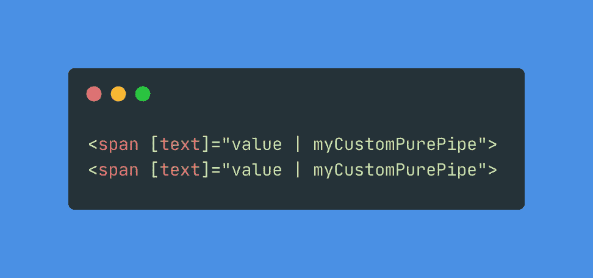

这里应该只创建一个`myCustomPurePipe`实例。

在 Ivy 出现之前，这是真的，在这篇文章中，我将深入了解这一点，看看它是否仍然适用于 Ivy。

## 设置事物

首先，让我们创建一个版本≥ 9 的新 Angular 项目，因为我们正在 Ivy 实现中探索管道。

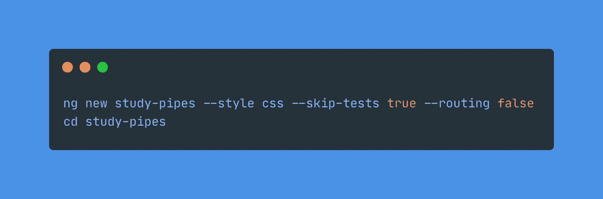

创建新 Angular 9 项目

## 创建自定义纯管道和非纯管道

接下来，我们将创建一个名为`my-custom-pure-pipe`和`my-custom-impure-pipe`的定制管道:

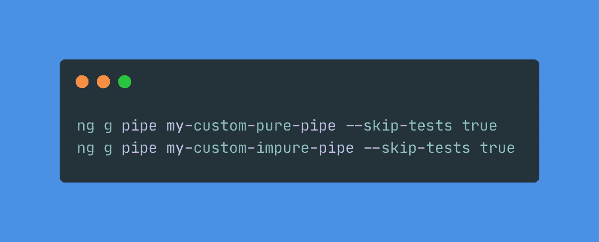

创建自定义纯管道和不纯管道

然后，像这样更改`my-custom-pure-pipe`的实现:

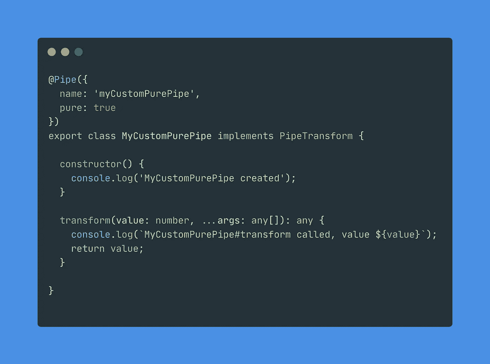

MyCustomPurePipe 代码

像这样改变`my-custom-impure-pipe`:

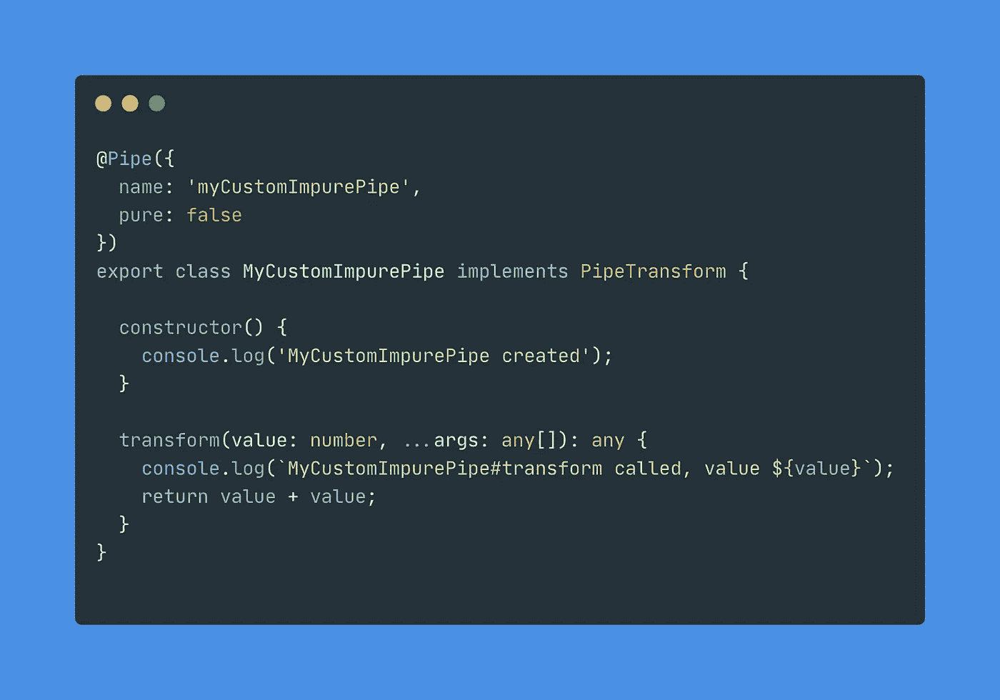

MyCustomImpurePipe 代码

基本上，这里我们只是在实例创建阶段以及在变更检测期间 Angular 调用`transform`时进行日志记录。

在`app.component.ts`中，修改代码如下:

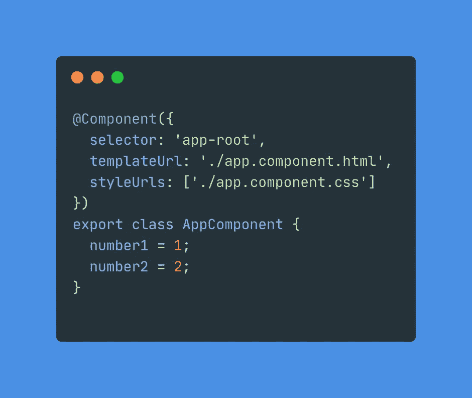

AppComponent 代码

在`angular.json`文件中，将`projects -> study-pipes -> architect -> build -> options -> aot`的`aot`选项从`true`改为`false`，禁用提前(AOT)编译。这将允许我们更容易地探索生成的代码。

现在我们已经完成了项目的设置。让我们开始我们的探索之旅。

## 探索管道

假设在`app.component.html`中我们有以下模板

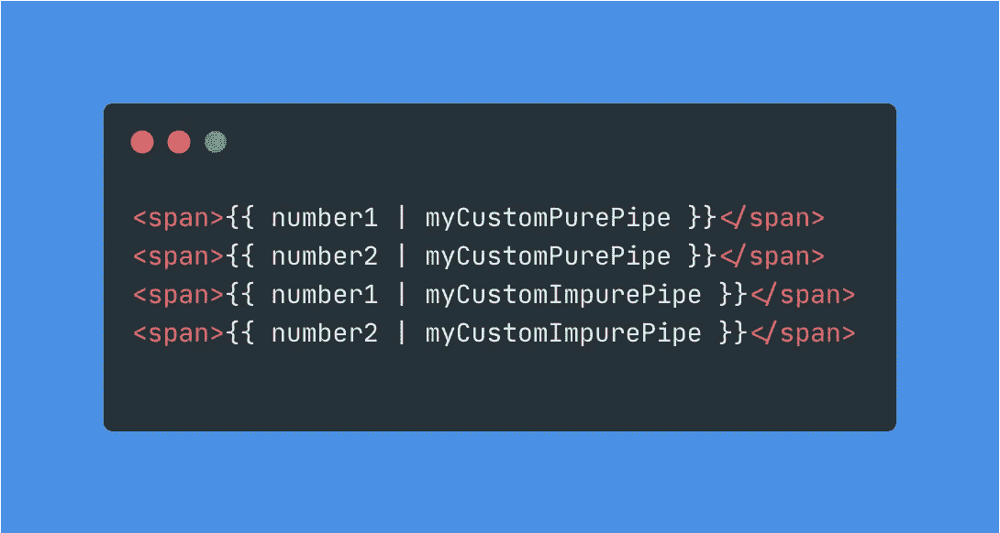

AppComponent 模板代码

让我们打开 Chrome 开发工具，在源代码选项卡中，导航到应用程序组件文件，您将看到以下代码:

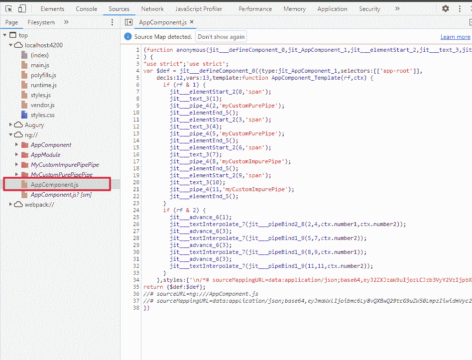

在`AppComponent_Template`内部生成的代码中有两个主要的`if`块:组件实例化过程中执行的代码`rf & 1`和变更检测逻辑`rf & 2`。

这是创作板块:

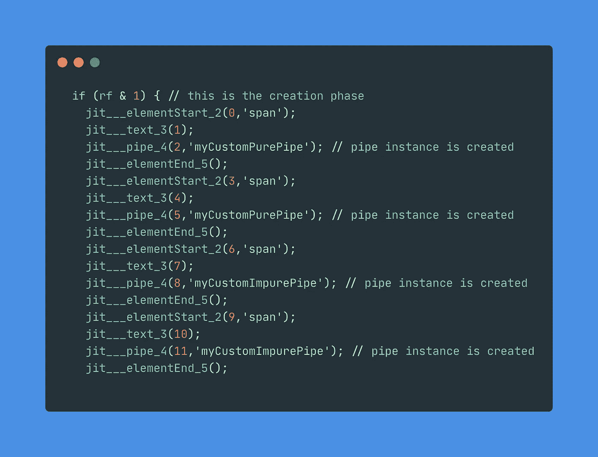

AppComponent 创建阶段代码

`jit__pipe_4`实际上是创建管道新实例的函数。因此，您可以看到我们将有 4 个管道实例。这意味着在常春藤中，每根管子都有它自己的实例，不管它是纯净的还是不纯净的。而在 View Engine 中，pure pipe 有一个共享实例。

现在让我们看一下变化检测模块:

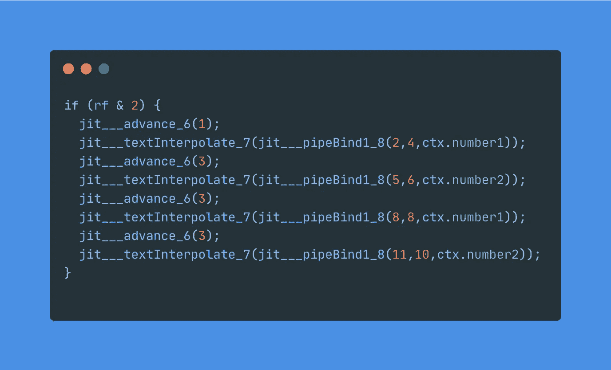

AppComponent 更改检测阶段

`jit___pipeBind1_8`是在管道上调用转换的函数。

下面是管道执行转换任务时的[代码](https://github.com/angular/angular/blob/84b8f250f9d13ba652d273e586cae2144d2ba055/packages/core/src/render3/pipe.ts#L98)。

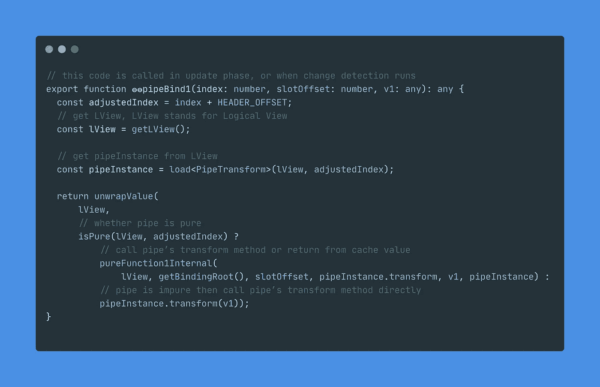

从上面的代码中，`isPure`方法将通过查看`@Pipe` decorator 中的`pure`属性来检查管道是纯的还是不纯的。

**对于不纯的管道棱角调用** `transform` **方法对每一个变化进行检测。对于纯管道的任何输入变化，它将调用** `transform` **函数。否则，它将返回一个缓存值。**

## 结论

所以，总结一下:

*   在常春藤中，每根管子都有它自己的实例，不管它是纯净的还是不纯净的。而在 View Engine 中，pure pipe 有一个共享实例。例如，在 Ivy 中，如果我在一个模板中的两个地方使用了`myCustomPurePipe`，那么就会创建两个`MyCustomPurePipe`实例。
*   在使用默认变更检测策略的组件中，当变更检测发生时，如果管道不纯，那么将调用`transform`方法。如果管道是纯的，无论从最后一次调用开始`transform`方法中的输入参数是否有任何变化，那么 transform 方法将被调用。否则，管道将返回上次转换调用的缓存值。
*   当使用不纯管道`async`时，您应该将它与 OnPush 变更检测一起使用，以避免每次变更检测时对`transform`的不必要调用。

这里有两个 StackBlitz repos 供你玩，一个是给[视图引擎](https://stackblitz.com/edit/angular-view-engine-pure-pipe?file=src/app/app.component.ts)，另一个是给 [Ivy](https://stackblitz.com/edit/angular-ivy-pure-pipe?file=src/app/app.component.ts) 。

**更新 2022.04.04** :如果你想探索 Angular Ivy 的更多方面，比如新的调试工具、新的 API 以及语言语法，我强烈推荐由 [Lars Gyrup Brink Nielsen](https://twitter.com/LayZeeDK) 和 [Jacob Andresen](https://twitter.com/jacobandresen) 所著的《用 Ivy 加速 Angular Development】一书。

感谢您的时间和愉快的编码！