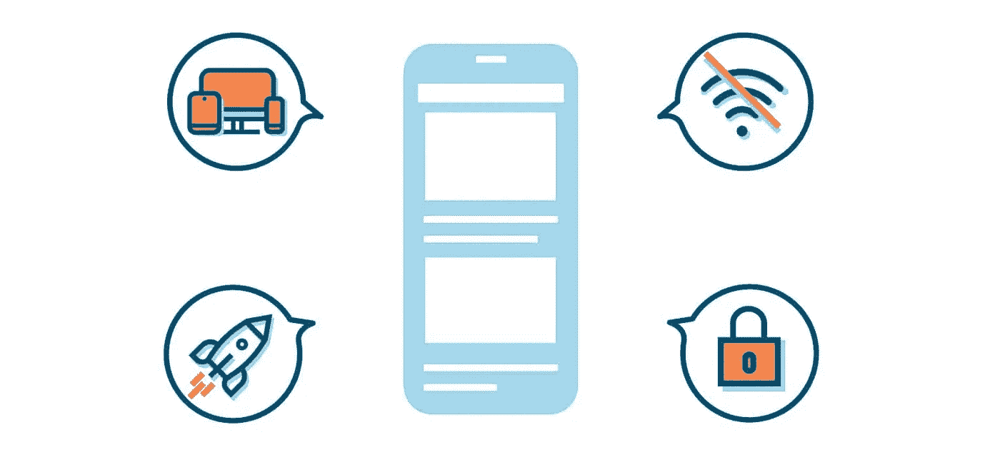
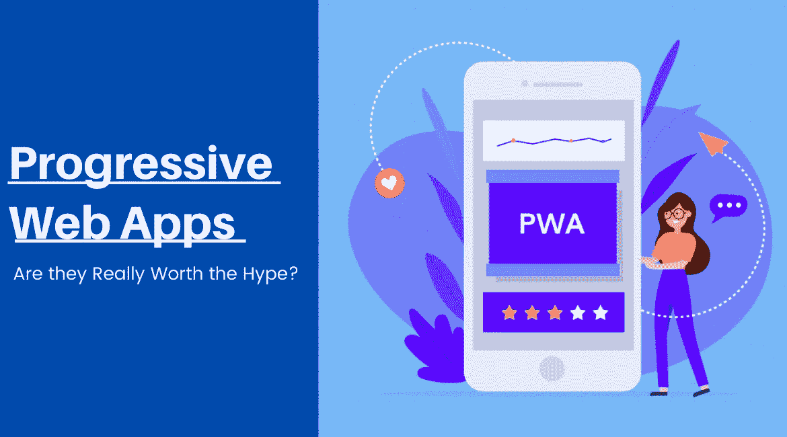

# 在当今时代，PWAs 如何改变用户体验？

> 原文：<https://medium.com/nerd-for-tech/how-pwas-transformed-user-experience-in-present-times-a606b95e4fe2?source=collection_archive---------17----------------------->

根据 Statista 的数据，2021 年全球智能手机用户数量预计将达到 38 亿。

[渐进式网络应用](https://web.dev/progressive-web-apps/)也可以在移动浏览器上运行。随着用户越来越倾向于智能手机，它们也成为了潮流。

随着网站的命运逐渐改变，事情也在快速变化。那么你是在找软件外包公司，利用 PWA 的优势吗？

# **我们先来了解一下渐进式网络应用:**

PWAs 是运行在移动浏览器上的网络应用程序。他们没有多个本机应用程序。

“它就像一个本地应用程序，但具有类似 web 应用程序的体验。”

因为时间瞬息万变，如今用户选择移动设备。这就是 PWAs 拥有更广泛的客户群的原因。如今经营网站已经过时了。

所以，如果你是一个崭露头角的企业家，想要利用定制软件开发公司的优势，你必须寻找顶尖的名字。

“渐进式”指的是在保持用户界面简洁明了的同时，提高用户参与度。**biz ness Apps 的 Andrew Gazdecki 将 PWAs 称为“移动的未来”**

你会看到越来越多的进步的网络应用程序开发公司在观望，等待获得良好的 PWA 体验。听到这个词的人会惊讶地发现，这只是一个两年前流行起来的词。

虽然网站带来了更多的流量，但它们速度较慢。原生移动应用需要多个插件和安装才能高效工作，而且它们经常存在设备兼容性问题。所以没有比 PWA 更好的选择了。

# 那么 PWA 是如何改变网络的呢？

PWA 既是概念性的，也是技术性的。从 UX 的角度来看，从“以人为本”的角度来看，技术是非常重要的。

首先，问题的关键是 PWAs 被证明是比网站更好的选择。正确的工具可以为客户带来最佳的成功率，并为外包开发 PWAs 的软件开发人员提供理由，为用户带来梦幻般的体验。

其次，网站可以吸引更多的人，并且可以很容易地安装在手机上，并发送关于所购买产品的快速通知(管理交付等)。).它们无时无刻不在，不管是在线还是离线，也不管是在什么设备上，它们将人们与网络而不是手机联系在一起。客户可以将该应用下载到他们的手机上。

它安装在手机上，可以发送关于购买产品的快速通知(管理交付等)。).它在本地、在线和离线时都可以在设备上使用，并将人们连接到网络而不是手机。

一旦客户将应用程序下载到他们的手机上(出于兴趣)，谷歌会通过永久登录他们的手机并点击手机屏幕来根据用户参与度进行提示。客户可以访问订单详情、交付详情和产品更新。

只有当内容的参与度上升时，它才会起作用，但如果他们这样做了，我们可以让他们更容易。坦率地说，PWA 应用程序开发的核心原因是在企业中吸引眼球。

坦率地说，这就是 PWA 的全部思想。这不仅仅是技术上的转变(尽管取得了巨大的进步)，甚至不是技术上的转变。相反，这完全是将概念从一个时代转换到一个新的时代。

一个进步的网络应用不仅仅是使用最新的技术。这是一个完全面向用户参与的网站，传达了一种错位的策略，可能会耗费企业和金钱。

它是获取更多用户数据的桥梁，与用户建立更好的关系——这也是为什么更好的 UX 和更好的用户界面是一个好网站的标志之一。

要么适应，要么消失，10 万页网站的时代已经结束了，也许这些天来看起来是个难题。你不觉得吗？原因之一是，在 web 和移动应用程序开发中，您会看到定制软件解决方案的大量涌现。

新一代情境化、数据驱动的用户交互已经到来。也不是推特，也不是脸书。PWAs 的时代无处不在，不再是‘精英’概念；现在这只是一个最佳实践。

## **pwa 有丰富的类似手机的功能，所以；会给你带来极大的优势**

pwa 不受浏览器或设备的限制。像网站一样，PWAs 提供:

*   通过浏览器即时访问
*   快速装载速度
*   可索引、可共享
*   pwa 具有移动应用程序的流动性和网站的功能。因此，它是两者的融合，具有丰富的功能。

从技术上讲，PWAs 是一组网页，就像一个网站。它们通过 HTML5、CSS3、JavaScript 和媒体查询呈现在浏览器上，如**谷歌浏览器。**pwa 在必要时也会使用 API 集成，就像移动应用一样。

**网站功能:**

*   推送通知
*   自我更新
*   类似 App 的界面
*   连通性独立性

**手机 App 功能:**

由于应用程序开发人员使用 React 原生框架来创建卓越的 web 功能，PWAs 可以使用移动应用程序功能，如:

*   推送通知
*   全屏功能
*   闪屏
*   离线内容

比如印度著名的购物门户网站 Flipkart，就在 PWA 中使用了所有这样的功能。

# **为什么 pwa 是最佳选择？**

## **1。pwa 没有应用商店限制**

这就是 PWA 的妙处。你不需要单独的 Android 和 iOS，因为它们托管在一个服务器上，可以是同一应用程序的不同版本。你会看到软件外包公司提供更好的服务。

因为 PWAs 托管在 web 服务器上，所以您可以跳过构建同一应用程序的不同版本。它们可以自行更新，因此用户不必手动更新。

所有这些都意味着下载和使用率的全面提高，因为用户不必担心 PWA 是否只在 Android 或 iOS 上可用。有了这些好处， [**雇佣一家定制软件开发公司**](https://www.valuecoders.com/custom-software-development-services-company) 将大大有助于找到本地应用或网站的替代品。

Flipkart Lite 注意到新客户获得量增加了 50%，其中 60%的访问者放弃了原生 PWA 应用程序。MakeMyTrip 的 PWA 使购物量增长了 150%。

## **2。PWA 比原生移动应用小 90%**

PWA 统计数据-[**PWA 软件开发**](https://www.valuecoders.com/progressive-web-app-development-company?utm_source=pwa-medium&utm_medium=d7&utm_campaign=pwa-mediumhttps://www.valuecoders.com/progressive-web-app-development-company?utm_source=pwa-medium&utm_medium=d7&utm_campaign=pwa-medium) 的最大优势在于，它们比原生移动应用更小，因为原生应用消耗内存、空间和数据。

让我们来看一些实际的例子:

**·Twitter Lite**—渐进式网络应用 Twitter Lite 是经过筛选的 PWA 示例之一，用于提高效率和客户参与度。它允许公司实现勉强 600 KB 的大小，而相比之下，Android 和 iOS 中的应用程序重量为 23.5 MB。

好的一面是，它使用更少的缓存数据和更少的媒体资源，听起来像是用户更容易使用的应用程序。

**·Pinterest**——谁能忘记 Pinterest 的效率和 PWA 的可访问性，PWA 只能达到 150 KB，相比之下，Android 为 17 MB，iOS 为 56 MB。因此，当注册人数呈指数级增长时就不足为奇了，花在 Pinterest 上的时间从移动设备上增加了 5%。

星巴克(Starbucks)——一款超渐进式网络应用，大小仅为 600 KB。随着日常用户的增加，给出为什么手机和台式机几乎一样的原因。

open sooq—open sooq 的新 PWA 只有 28.3 KB，它提高了公司的参与度，页面平均时间增加了 25%。结果，带来了 260%的潜在客户。

## **3。pwa 非常容易被发现**

通过以不同的心态对待网络项目，一个完全不同的网站，它们是很容易得到的。

好在 PWA 使用 **HTML** 来预加载内容和元标签。它使搜索引擎机器人能够以更容易的可访问性和更高的可发现性在爬行中读取和索引。

## **4。pwa 功能多样且用户友好**

渐进式网络应用程序为网络提供了分享能力，对传统的移动应用程序很有帮助。

像《T4》、《福布斯》、《金融时报》和兰蔻这样的企业已经开始采用这种方式。pwa 有能力接触到大量客户群。人们应该明白，雇佣软件开发人员将大大有助于寻求 PWA 的好处。

## **5。PWA 的平均跳出率仅为 42.86%**

根据 PWA 的统计，必须注意到渐进式网络应用的平均跳出率仅为 42.86%。相比之下，移动设备的平均跳出率约为 **60%，**平板电脑的平均跳出率约为 **49%** ，台式机的平均跳出率介于 **41%** 和 **55%** 之间。当然，这也取决于行业，因为有些行业的跳出率会比其他行业高。

这表明，平均而言，PWA 提高了用户对其他应用的参与度。这一指标与不到 3 秒的快速加载时间相结合。

这表明 pwa 正在缓慢但稳定地取代本地移动应用。

在这个范围内，很明显 **PWA 开发**比其他应用平均提高了用户参与度。这一指标，加上不到 3 秒的更快加载时间以及比移动网站更高的移动会话和页面浏览量，只能表明渐进式网络应用正在缓慢但稳步地取代原生移动应用。

## 6。pwa 是可链接的

PWAs 给你一个移动网站的基因，因为它们是高度可链接的。

PWA 的所有页面都像网站一样带有唯一的 URL。它有(离合器。Co 和是每个服务页面的深度点击网址，你可以写博客和查看地址栏。这些页面很容易在浏览器窗口打开，加入书签，并在社交网站上分享。

# **总结:**

因此，到目前为止，PWAs 通过改变网站的面貌和命运而引起了轰动。这是 PWA 区别于网站的一个重要事实。如果你正在经营一家企业，准备好迎接这样一个决定性的因素，让用户体验一如既往地精彩。

难道你不认为这是一个雇佣 [**PWA 开发者**](https://www.valuecoders.com/progressive-web-app-development-company?utm_source=pwa-medium&utm_medium=d7&utm_campaign=pwa-medium) 的绝佳机会，让你对 PWA 开发有一个公平的想法吗？因为他们会给你带来巨大的好处——那些想用 PWA 来改变他们在线业务的企业家。