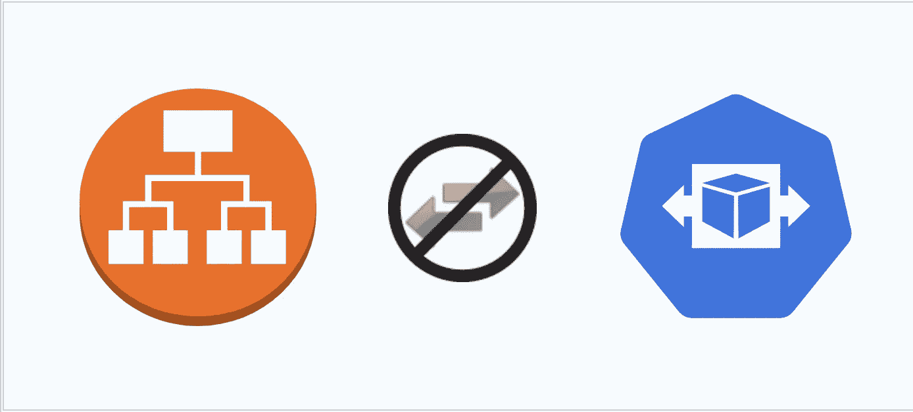
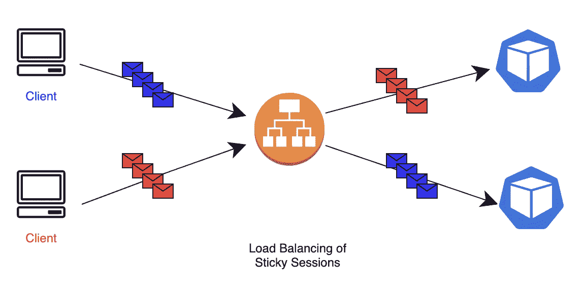
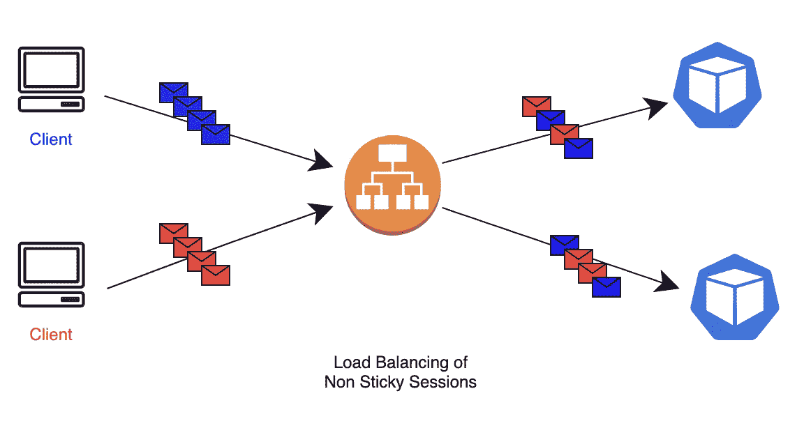
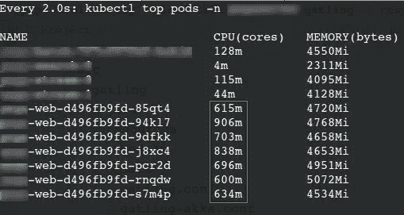
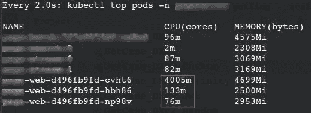

# 会话粘性如何破坏 k8s 中的自动缩放

> 原文：<https://medium.com/nerd-for-tech/how-session-stickiness-disrupts-pod-auto-scaling-in-kubernetes-17ece8e2ea4f?source=collection_archive---------1----------------------->

在孤注一掷地尝试扩展一个庞大的庞然大物时，我偶然发现了 AWS 应用程序负载平衡器(ALB)的一个有趣的限制。自动伸缩和负载平衡是两个完全不同的方面。然而，在形成有效的可扩展子系统时，协调是至关重要的。这就是粘性会话的故事，以及它们如何无情地影响负载平衡和扩展之间的关系。

这将是一个漫长而又冒险的阅读。拿起你的筹码，继续滚动。

# 入门指南

## 一个很好的先决条件

对 AWS [负载平衡](https://searchaws.techtarget.com/definition/application-load-balancer)和 Kubernetes(或 k8s)水平 pod 自动伸缩( [HPA](https://kubernetes.io/docs/tasks/run-application/horizontal-pod-autoscale/) )的合理理解将会进一步简化阅读。

如果您对这些有一些挥之不去的想法，让我浏览一下本文中使用的概念。

**库伯内特 HPA**

假设您的应用程序部署在 Amazon AWS 中，并由 Kubernetes 编排。为了应对应用服务器不断变化的负载需求，k8s HPA 会根据配置的标准(比如所有正在运行的单元的平均 CPU 利用率)在单元中进行横向扩展或纵向扩展。这样，您只需使用所需的 AWS 资源，最大限度地降低利用率，并为您使用的资源付费。

**AWS 应用负载平衡器(ALB)**

假设您为负载平衡需求配置了 AWS ALB。既然 pod 频繁扩展，ALB 必须*高效地*将负载分配给底层的 pod。负载均衡器算法达到最优并均匀分配负载至关重要。

**粘性会话**

粘性通常与会话关联性互换使用，它是负载平衡器(这里是 ALB)的一个特性，其中负载平衡算法在分配负载时考虑请求和服务器之间的相关性。换句话说，在 LB 算法的指导下，请求显示了与服务器的“亲缘关系”。

***注意:*** *在本文的上下文中，考虑 session ==来自用户会话的一系列‘n’个请求。此外，pod 和服务器可以互换使用。*

来自特定客户端的所有请求被路由到单个 pod

来自同一客户端的请求被分发到多个 pod

在服务器上维护会话状态可以优化性能的情况下，例如内存缓存，粘性会话非常有用。

**AWS-ALB 中的粘性**

为了识别粘性，ALB 在每个请求之间传递一个名为 AWSALB 的 cookie。对于没有 AWSALB cookie 的新会话，将根据配置的 LB 算法选择服务器。查看[此](https://docs.aws.amazon.com/elasticloadbalancing/latest/application/sticky-sessions.html)了解更多信息。

既然你已经熟悉了基础知识，让我们进入有趣的内容。

# **问题 1:粘性会话的平衡**

我们的应用程序有类似的 AWS-ALB 和 k8s 设置来协调伸缩需求。此外，应用程序从在内存中缓存用户的会话状态中获益匪浅，自然倾向于选择 ALB 的会话粘性。

当我对负载测试场景进行实验时，在 HPA 的上下文中，非粘性会话和粘性会话的区别是明显的。

非粘性场景:将负载分布到扩展的 pod

对于非粘性、无状态请求，当 HPA 扩展 pod 时，新创建的 pod 会分担负载。

棘手场景:将负载分布到扩展的 pod

对于粘性请求，当 HPA 由于现有单元中的负载增加而扩展单元时，不会为新单元分配任何负载，从而使新单元的扩展无效。

## 问题的严重性

如果 pod 上没有活动会话，但是来自这些会话的突发请求突然同时变得活动，该怎么办？

负载均衡器默默地将这些请求路由到“粘性”服务器，即使有其他服务器可以轻松地承担负载——最终导致死亡。

尽管负载场景模拟了我们真实世界的应用程序使用模式，但还是有点人为。它假设大多数会话都是长期存在的，创建新会话的频率相对较低。

进一步的探索引出了另一个有趣的问题。

# **问题 2:低效的负载均衡算法**

默认情况下，AWS ALB 使用**循环**算法来分发请求。它天真地通过可用的服务器循环请求，忽略了系统的负载。

现在，让我们考虑一种更“真实”的情况，在这种情况下，旧会话和新会话之间存在平衡。此外，服务器上的负载并不均匀。

由于显而易见的原因，循环赛*失败*。

## LOR 拯救了世界

AWS ALB 可以配置为使用 [**最少未完成请求**](https://aws.amazon.com/about-aws/whats-new/2019/11/application-load-balancer-now-supports-least-outstanding-requests-algorithm-for-load-balancing-requests/) 策略，而不是默认的循环策略。顾名思义，该算法在路由流量时考虑服务器正在处理的“活动”请求的数量。理论上，在服务器处理不同负载的情况下，LOR 比 RR 更有效。

一个不错的[帖子](/dazn-tech/aws-application-load-balancer-algorithms-765be2eca158)详细了解

## **但是粘性破坏了聚会——再一次**

**考虑一个假设的场景。**

我有 3 个后端服务器(有粘性会话)服务器 1，服务器 2，服务器 3。每台服务器的最大容量为 *200 个活动请求*。

将它们在特定时间点服务的活动请求(和负载)视为:

> 服务器 1: 150 (75%)个活动请求
> 
> 服务器 2: 200 (100%)个活动请求
> 
> 服务器 3:180 (80%)个活动请求

**注意** : *此时，并非所有连接到相应服务器的粘性会话都有活动请求，* ***即*** *服务器 2 可能有多个其他连接的会话，其请求当前未被服务。*

当来自新会话 session-X 的请求到达时，它应该基于 LOR 算法配置的被路由到服务器 1*，因为服务器 1 具有最少的活动请求。*

当来自粘性会话 session-N-Server2 的请求到达时，它仍然由 Server2 提供服务，这使得 LOR 无效。

> 粘性击败了负载平衡并使 HPA 无效

# 那么，我在找什么？

一种智能算法，在路由流量时，考虑与服务器**相关联的不一定处于活动状态**的粘性会话的数量。

TL；速度三角形定位法(dead reckoning)

1.  LB 应该将传入的请求路由到“附加最少总会话”的*服务器。*
2.  在服务器过载的情况下，LB 应该将粘性请求重新路由到最佳服务器，从而利用 HPA。

如果你还没有猜到，我寻找这个假设的负载平衡器的任务到此结束。

**顺便说一下:**我们已经想出了几个主意，比如拒绝应用程序中的会话和速率限制，但这些都不实用。

# 几个月后…我发现了这个。

我开始了解到 [Gloo gateway 的](https://docs.solo.io/gloo-edge/master/installation/advanced_configuration/session_affinity/)哈希环算法支持会话相似性，并在发生扩展事件的情况下增加了负载重新分配的好处(#2)。

这带有一个星号，表示会话状态需要迁移到一个新发现的服务器。这为其自身的挑战打开了一扇大门。但那是以后的事了。

# **关键外卖**

*   粘性更多的是一种“特性”而不是限制。这不符合自动缩放的原则。
*   没有解决我们所有可伸缩性需求的灵丹妙药。这都是关于同意和生活的权衡。
*   攀登巨石是一项艰巨的任务。

**接下来:**在下一篇文章中，我将讨论容器化环境中 JVM 应用程序的另一个有趣的可伸缩性限制。