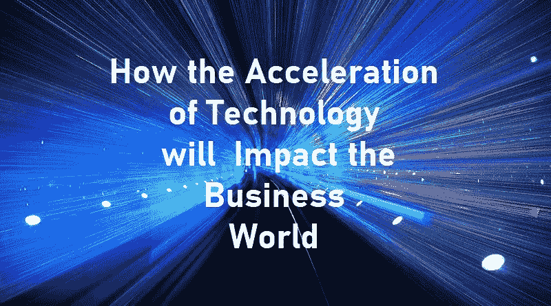

# 技术的加速发展将如何影响商业世界

> 原文：<https://medium.com/nerd-for-tech/how-the-acceleration-of-technology-will-impact-the-business-world-976b72122921?source=collection_archive---------1----------------------->

安德鲁·基里马

未来就在这里！人类正在开始一个新时代。由不可逆转的技术发展所支撑的新范式。正如未来学家和发明家雷·库兹韦尔所说，“技术正在加速发展”。库兹韦尔的“加速回报定律”已经让企业家的[彼得·h·迪亚曼蒂斯](https://www.diamandis.com/blog/future-is-faster-than-you-think)和[史蒂文·科特勒](https://www.stevenkotler.com/)相信，未来十年内技术的融合将会带来一个…