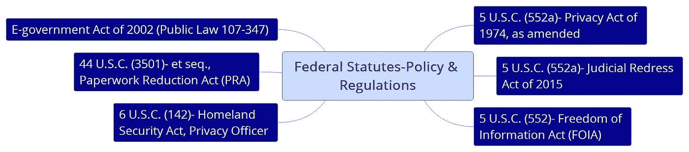
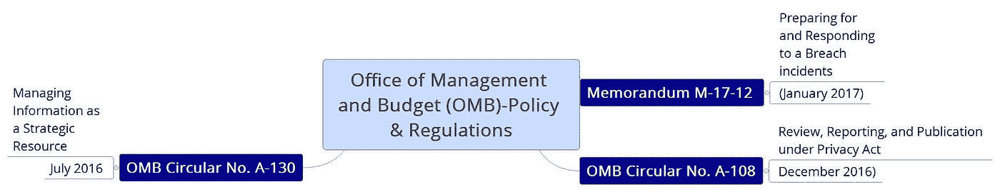
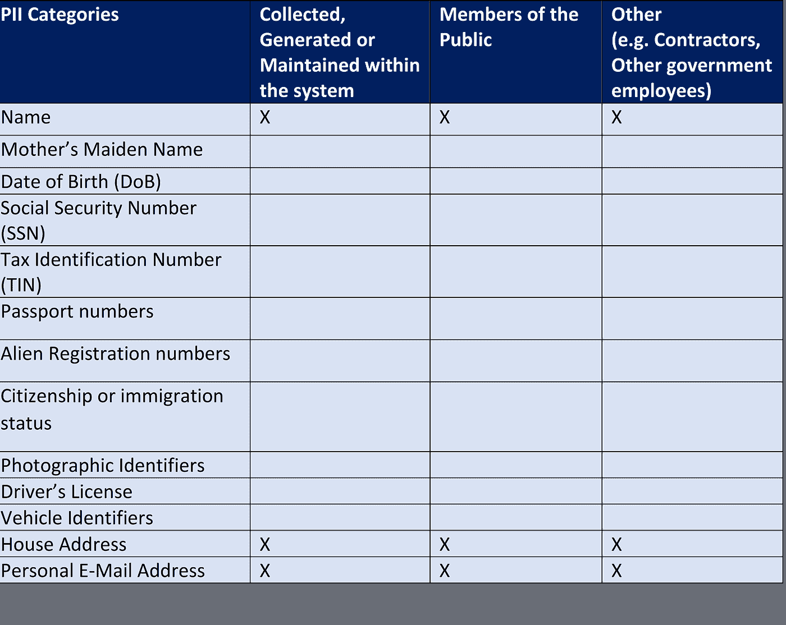
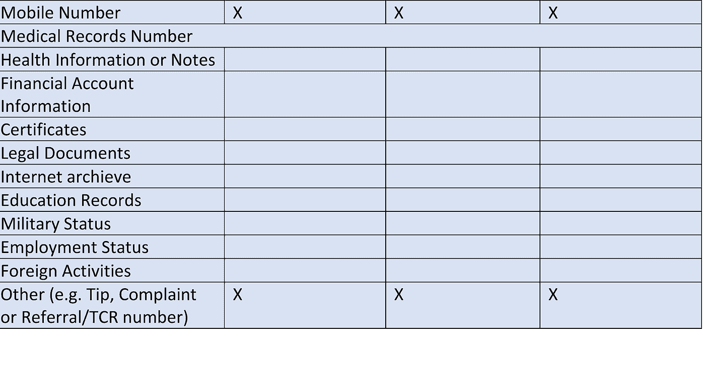
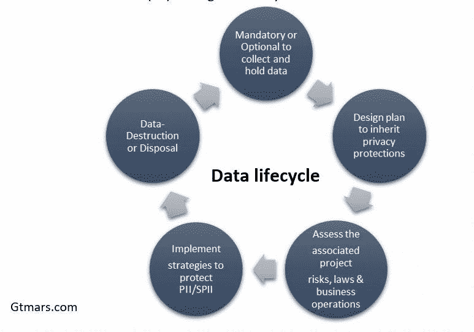
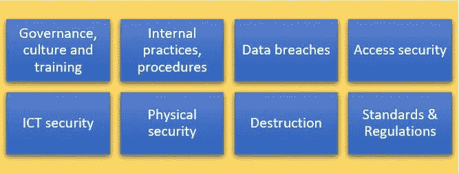
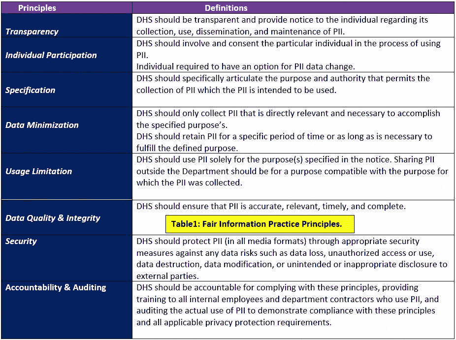
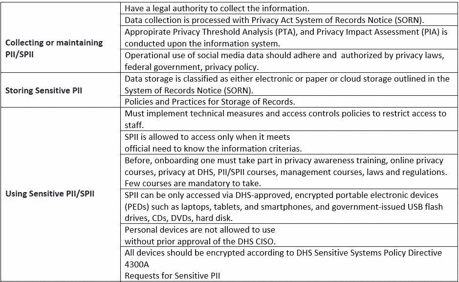
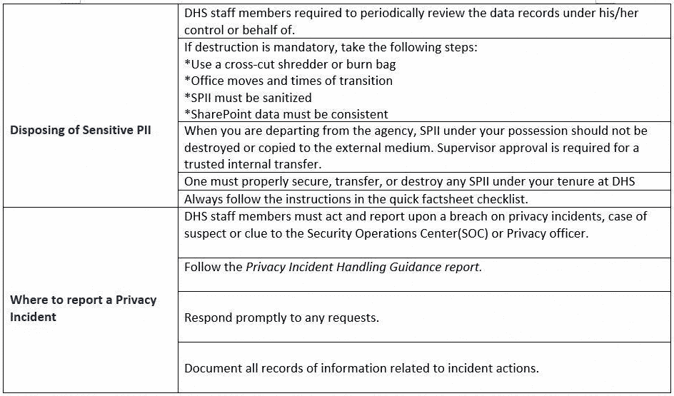

# 国土安全部(DHS)，收集、使用、保护美国公民、居民、B1/B2 游客的个人数据？

> 原文：<https://medium.com/nerd-for-tech/how-the-department-of-homeland-security-dhs-collect-use-protect-the-pii-data-of-u-s-7776e99e2611?source=collection_archive---------2----------------------->

★如今，许多政府组织一直在寻找云计算解决方案来满足他们的 IT 需求。目前，各种规模的组织越来越多地采用基于云计算的解决方案来推动核心业务价值。这主要是因为云计算的好处很多，包括增强的灵活性和可伸缩性、资源供应以及降低总开支。

**DHS 云逼近:**

★拥有成本(TCO)、耗时和上市时间。同样，发达国家和发展中国家的政府组织将政府“云优先”的方法用于说服服务部门和机构采用基于云的解决方案来支持和集中整个组织的信息共享，这是可扩展、安全且最具成本效益的方法。由于云行业的技术加速发展，传统的方法在几十年间发生了变化。政府部门专注于核心竞争力，而将 IT 服务转移给外部提供商也推动了行业对云计算的需求。因此，云改变了 IT 服务的来源、交付和推动业务价值的方式。

> ★国土安全部(DHS)**，**收集、记录、使用个人身份信息(PII)，这些信息来自美国公民、永久居民(PR)、公共雇员、服务承包商、代理机构和访客(游客)。根据国会和法律，DHS 有义务保护居住在美国境内的每一个人的 PII，以保护隐私、安全和主权。

★PII 行使处理数据应如何收集，这增加了危害的风险，如果它得到妥协。在 DHS，大多数隐私事件和事件响应都是偶然的。因此，DHS 出台了严格的指导方针，以防止未来发生更多事件。根据处理信息的敏感性，继承了特定的 DHS 政策和法规。

> ***为什么重要？***

★PII 和 SPII 的信息对于确保充分的合规性和满足隐私法案的要求更为重要。如果任何私人和公共个人，对其客户和公民的信息处理不当会对名誉造成严重损害。

> ***联邦法令:*** *经国会正式批准并成文的法律。*

图一。联邦法规-政策和法规。

图二。管理和预算办公室(OMB)-政策和法规。

> ***DHS 政策:***

★近年来，PII 个人面临的风险和威胁。PII 包含的信息允许直接或间接推断每个合法公民的身份。DHS 应采用合理的步骤来识别、保护、收集、使用、误用、数据丢失、数据窃取、未经授权的访问、数据修改、数据泄漏和数据披露。该指南侧重于如何访问数据，如数据元素、SSN、非移民数据、健康记录、种族和宗教数据、互联网数据以及与 PII 身份相关的生活方式信息。

> ***PII 和 SPII 安全:***

★当 DHS 机构确定 PII 的总体敏感性时，机构应如何根据每个数据元素的敏感性水平评估数据敏感性、数据分类、数据标签。例如，表中的数据定义了数据的敏感性方法、所需的隐私级别、安全性、PII 和 SPII。它有助于根据可合理识别的数据环境来识别特定的个人或一组个人。

> ***段:1***

图 3。个人身份信息(PII)-第 1 节。

图 4。个人身份信息(PII)-第 2 节。

> ***信息生命周期:***

★DHS 和其他联邦机构通过生命周期元素遵循个人身份信息的信息保护生命周期(PII)。

图 5。数据生命周期-国土安全部(DHS)。

★联邦机构应了解数据收集流程，包括何时、何地、如何收集数据(在线/离线)以及如何保存数据。如前所述，PII/SPII 数据可以是静态的，也可以是动态的，具体取决于数据环境，如静态数据、传输中的数据、处理中心、存储在第三方中心的数据或数据销毁。

**影响评估成功的因素:**

★如果机构没有采取合理的措施来确保数据的安全性，就可能影响这些因素。

> **(i)贵实体的性质**
> 
> **(二)数据敏感度的大小**
> 
> **(iii)数据泄露的后果**
> 
> **(四)安全影响，以及**
> 
> **(五)数据隐私**

**★步骤与策略:8**DHS 安保措施

收集 PII 数据时要采取和考虑的适当安全措施。

图 6。PII-DHS 的八项安全措施。

**公平信息实践原则(FIPP):**

★DHS 定义了 8 项 FIPP 原则，以加强该机构的隐私、合规、政策和程序的信息原则，管理 PII 和 SPII 的收集，以实现 DHS 的愿景和使命。

表 1。公平信息实践原则。

**为什么我们还需要知道:**

★美国**隐私法**授权机构个人保护和使用 PII，以满足其**工作职责**的必要、目的和任务需要。它允许代理机构根据 **552a(b)(1)** 使用、披露和保护数据。

★在《隐私法》中，很少有信息披露不涵盖一般个人，很少有披露需要安全许可才能访问某些信息。要获取这些数据，您应该询问监管机构的官员，以确定 PII/SPII。

图 7。**美国隐私法-关于 PII/SPII 的第 552a(b)(1)条。**

图 8。**美国隐私法-关于 PII/SPII 的第 552a(b)(1)条。**

**图 9。美国隐私法-关于 PII/SPII 的 552a(b)(1)。**

DHS 的重要使命:保护国家免受我们所面临的威胁！！！

本文内容不使用任何 DHS 的图片，也不介绍、修改 DHS 的数据收集政策。它仅代表美国、非居民和访美游客的 DHS 隐私和数据收集标准。

— — — — — — — —结尾— — — — —

> **别忘了查看这些文章的** *⬇️最好的小镇*😉
> 
> [***如何禁用你浏览器上的谷歌搜索数据活动、广告个性化、搜索历史、搜索设置？***](/faun/how-to-disable-your-google-search-data-activity-ad-personalization-search-history-search-e713948cf1ae)
> 
> [***微软针对软件开发人员的 12 大安全软件开发生命周期(SSDL)实践&安全团队？***](/faun/microsofts-top-12-secure-software-development-lifecycle-ssdl-practices-for-software-developers-f54176667fb5)
> 
> [***如何永久关闭或禁用导致高 CPU 使用率的 Microsoft 兼容性遥测服务？***](/faun/how-can-i-permanently-turn-off-or-disable-the-microsoft-compatibility-telemetry-task-to-prevent-aa9f0a264295)
> 
> [***如何在您的组织中创建漏洞管理安全团队、角色&职责？***](/faun/how-to-create-a-vulnerability-management-team-work-flow-chart-process-roles-and-be3eb1bad0d3)
> 
> [***软件开发人员 14 大 OWASP 安全编码实践***](/faun/top-14-owasp-secure-coding-practices-for-software-developers-5daef14734eb)
> 
> [***国土安全部(DHS)如何收集、使用、保护美国公民、居民、B1/B2 游客的个人数据？***](https://gtmars.medium.com/how-the-department-of-homeland-security-dhs-collect-use-protect-the-pii-data-of-u-s-7776e99e2611)
> 
> [什么是密码学中的 HMAC 消息认证系统？如何在 cryptool2.1 开源软件上部署？](/faun/what-is-hmac-message-authentication-system-in-cryptography-f385d1480642)
> 
> [风险管理概述&将风险管理整合到 SDLC 中](/@gtmars/risk-management-overview-integration-of-risk-management-into-sdlc-ae48de24b743)
> 
> [员工终端安全内部调查-模板](/@gtmars/employees-endpoint-security-internal-survey-template-61a16480a08)

**Quote of the day:** 井の中の蛙、大海を知らず(I no naka no kawazu, taikai wo sirazu)

**解说:**井底之蛙，不知沧海桑田

感谢阅读！

祝你有愉快的一天！