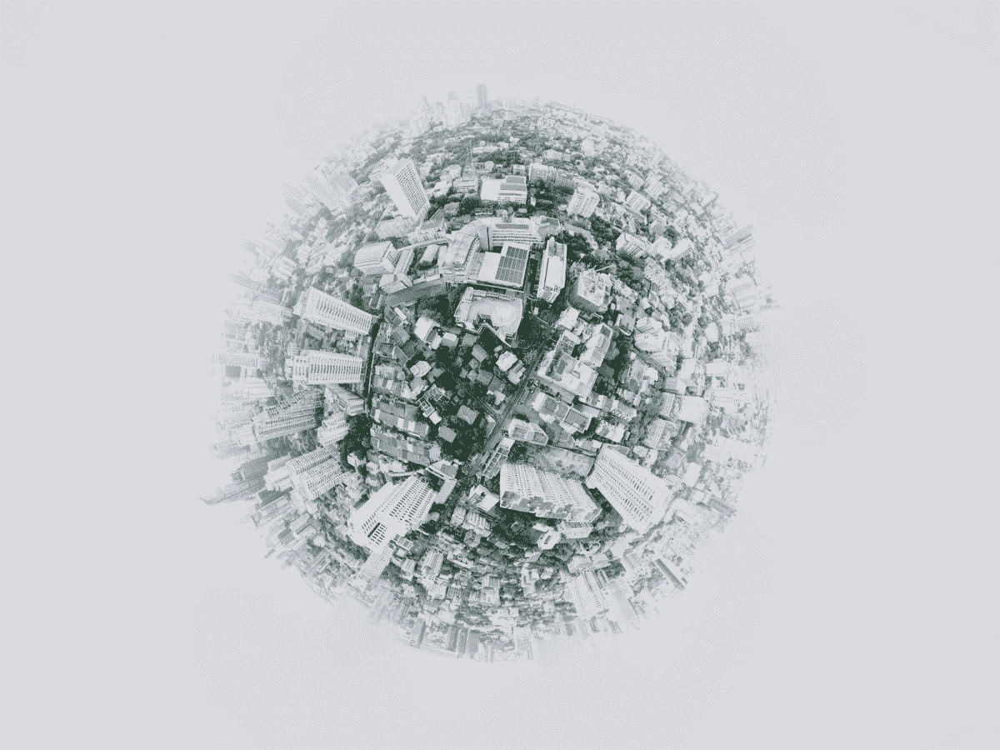

# 病毒时代是如何迫使我们为生存而奋斗，活在当下的

> 原文：<https://medium.com/nerd-for-tech/how-the-viral-times-are-forcing-us-to-struggle-for-existence-and-live-for-the-moment-54644ef1688c?source=collection_archive---------32----------------------->

我们生活在一个非常时期。一方面，病毒及其许多毒株和变种让我们对自己的生活感到恐惧，更糟糕的是，迫使我们四处乞讨，从医院的病床和氧气到食物和日常生活的基本必需品。另一方面，我们生活在一个僵尸般的状态中，这是由于媒体无情的攻击和我们的小工具不断的碰撞。事实上，两者的共同点是传播的病毒性，病毒和数字媒介世界使我们从一个危机到另一个危机，而不考虑我们的言行的长期影响。

以过去一周加密货币如何疯狂波动为例。如果伊隆·马斯克的一条推文可以创造或摧毁加密百万富翁的财富，那么市场对病毒式社交媒体驱动的新闻的反应方式就有很大问题。当我们在脸书和推特上发布我们吐出的无意义的胆汁时，我们甚至在想我们在“激情时刻”在做什么吗？

冠状病毒让我们争夺我们的日常需求，而技术不是救世主，而是“人类情感的杀手”。此外，虽然我们可以在没有可怕病毒的情况下生活(事实上，从这场噩梦中走出来)，但无论我们如何努力，我们都不能没有我们的小工具。如果这是对成年人的影响，想象一下未来的公民现在正在经历什么，因为他们的成长岁月是在孤立和过度依赖技术的情况下度过的。

我不是勒德分子。技术确实创造了奇迹，而且仍然是解决困扰我们的许多“疾病”的灵丹妙药(无论是字面上还是比喻上)。为了证明这一点，看看大批热心公益的公民如何在社交媒体上团结起来，关注从安排医院床位到为救援宠物寻找家园的一切事情。在这个疫情时代，没有什么比科技拯救我们的方式更能证明科技的力量了。

然而，我更大的观点是，我们需要退后一步，从时代的疯狂病毒式发展中休息一下。无论是病毒还是社交媒体帖子，我们都不能继续表现得好像“没有明天”，而是要专注于如何更好地度过危机。此外，随着第三次浪潮的预测，我们必须深挖长期，因此，不能让短期主义支配我们的生活。当然，这是少数人的特权，因为大多数人无论如何都被锁定在命运中，为生存而进行的痛苦斗争排除了任何更高需求之类的崇高思想。

因此，我们要做的是确保我们融入可持续的生活实践，并专注于缓慢而稳定地建设我们的生活大厦，为所有人带来改变。毕竟，是我们对无止境增长的痴迷和我们对征服自然的傲慢让我们走到了今天。所以，我们至少可以做的是停止“扮演上帝”,取而代之的是，更“人性化”地对待彼此，更重要的是，对待自己。

*最初发表于*[*【https://rammohansusarla.substack.com】*](https://rammohansusarla.substack.com/p/how-the-viral-times-are-forcing-us)*。*