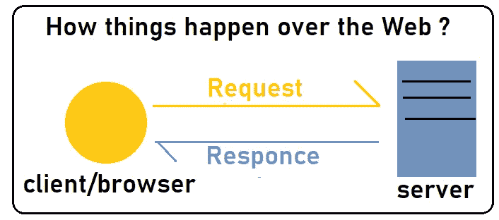
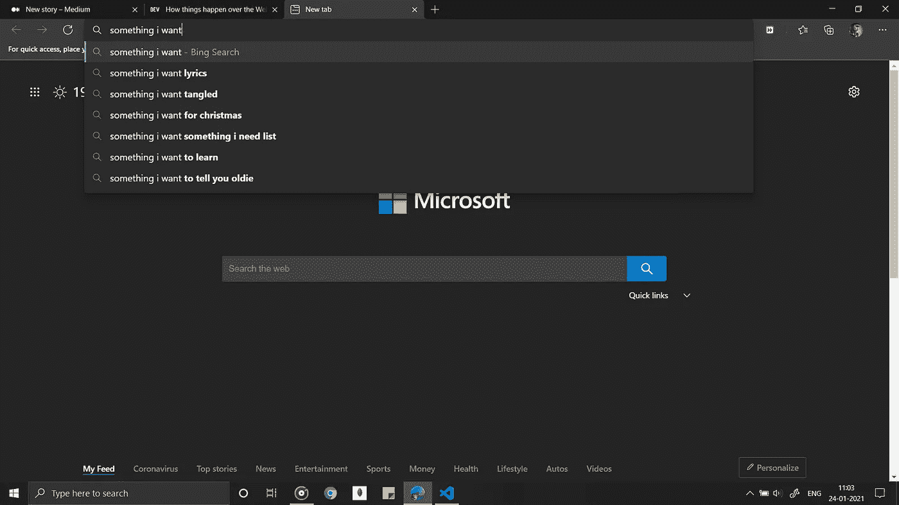
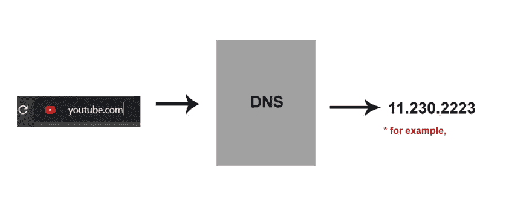
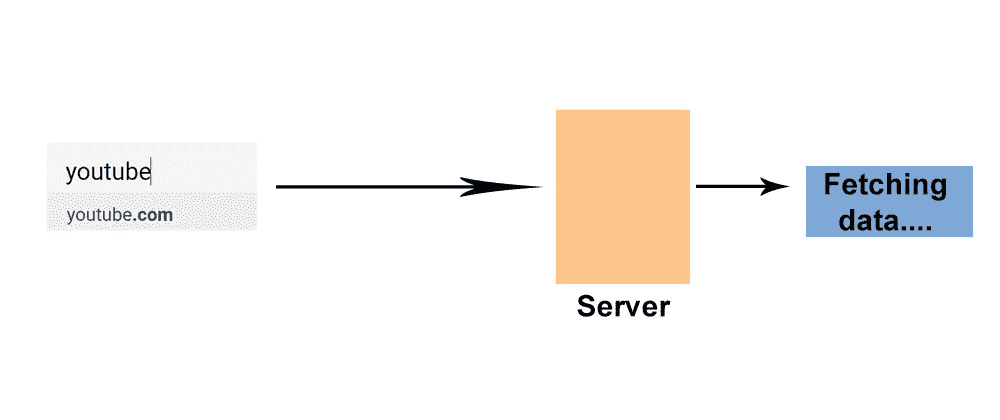
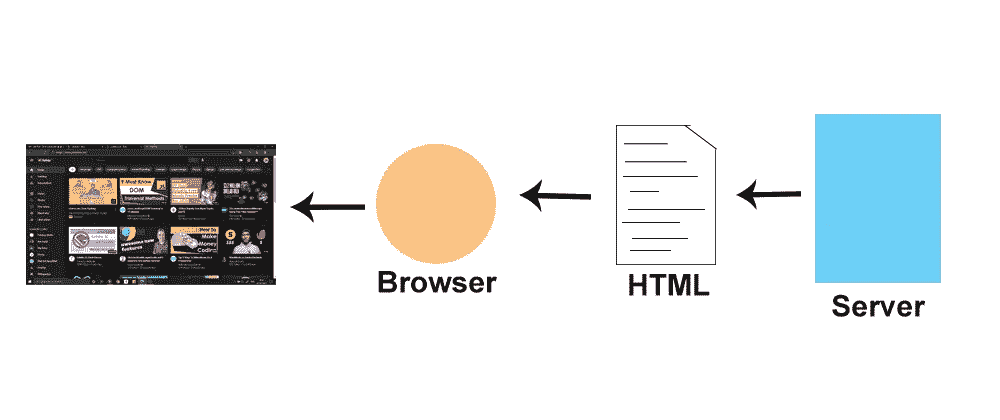

# 网络上的事情是如何发生的

> 原文：<https://medium.com/nerd-for-tech/how-things-happen-over-web-860adc0cc889?source=collection_archive---------3----------------------->

你好。因此，正如你所知道的，你可以开始你的网站开发之旅。

如果你还没有，看看下面的故事👇

 [## 2021 年开始网络开发

### 如果你想在 2021 年开始网络开发，你可能会非常不知所措🙄。

thesarveshprajapati.medium.com](https://thesarveshprajapati.medium.com/starting-web-development-in-2021-105d43940613) 

所以，我们在哪里！

是的，关于 web，有几件事你需要知道！🌞

人们已经看到，随着时间的推移，人们访问网络的方式正在发生变化
。

众所周知，要访问网络，我们需要一个网络浏览器。
但是❔的浏览器是如何工作的呢

虽然有很多浏览器，比如

*   铬
*   火狐浏览器
*   旅行队
*   歌剧
*   微软 Edge

所以，如果你曾经打开过浏览器，你可以看到一个通常被称为搜索栏的`address bar`。

在地址栏里，你搜索你想冲浪的东西。

随机搜索

所以你在搜索栏里输入，比如这里输入我想要的东西🥊一开始，在几秒钟，有时是几毫秒的时间里，幕后发生了一些事情。

击中终点

按下**回车**后，浏览器会从 **DNS 或域名服务器中获取你在地址栏中输入的任何 IP 地址。**

搜索 YouTube 域名的 IP 地址

在 DNS 中，每个域都以唯一的 IP 地址的形式存储，浏览器**向 IP 地址请求**，服务器根据请求通过**标准协议给出**响应**。**

> **听起来很傻！🙄。让我们深入探讨一下**

一旦**客户端**向**服务器**发出请求，首先在客户端和服务器之间建立一个连接，称为 **TCP/IP** 。

客户端和服务器之间的请求和响应

现在，一旦建立了连接，就可以向服务器发出请求了。

服务器软件用不同的语言编写，如:

*   Java 语言（一种计算机语言，尤用于创建网站）
*   大蟒
*   节点 js
*   ASP.NET

但是他们都试图达到相同的目标。

他们根据你的请求从服务器上获取数据并把数据给你。

数据可能在 **HTML** 、 **XML** 或 **JSON** 中。

但是为了简单起见，我们假设数据在 **HTML** 中。

从服务器获取数据

但是你没有请求一个 **HTML** 页面，对吧。🦉

这就是**浏览器**的用武之地。🦸‍♂️

如果服务器给你可视化的页面，这可能要花很多时间。

因此，它以`HTML` `CSS`和`JS`的格式给你数据，浏览器将这些数据转换成**视觉渲染页面**，仅仅在一瞬间的第二个⌚.

你的页面已经准备好供你欣赏了。🎉

祝贺

# 把东西包起来:

浏览器不仅可以帮助你上网冲浪，还可以通过跟踪你的活动、限制错误、保密信息、使用缓存加快浏览速度等等来简化你的工作。

所以，感谢你阅读这篇文章。请随意评论你的观点。

祝你愉快。

拜拜