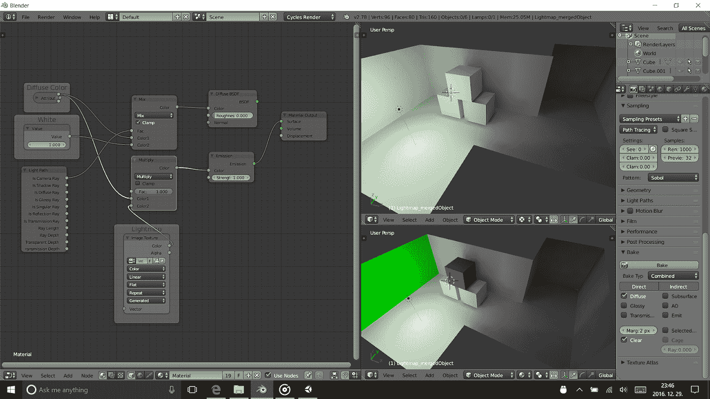
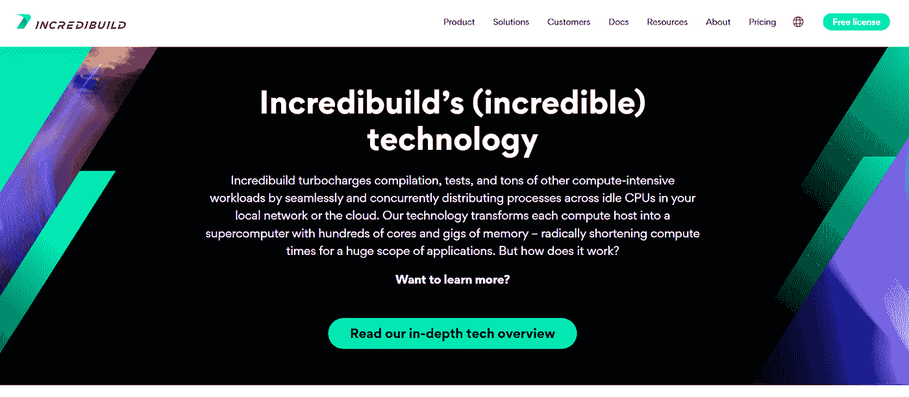
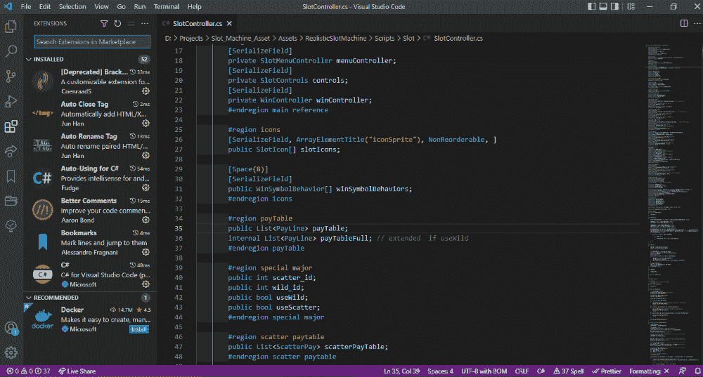

# 如何加速 C++游戏的开发

> 原文：<https://medium.com/nerd-for-tech/how-to-accelerate-development-for-c-games-11ba290a955b?source=collection_archive---------5----------------------->

在过去的几十年里，随着个人电脑的发展，游戏市场已经从少数人的兴趣发展到价值数十亿的市场。随着时间的推移，对游戏的需求越来越大，对高质量游戏的需求也空前高涨。即使可玩的游戏感觉很快，很令人愉快，但导致它的过程已经变得令人厌倦。

随着游戏范围的增加，构建一个项目所需的时间也增加了，这反过来又拖慢了开发进程。那么，我们该如何解决呢

[照片](https://unsplash.com/photos/z0Lr-6fA2R8)

# 什么加速发展？

在任何游戏工作室中，CPU 的数量可以从几个到几百个，并且在任何给定的时间，空闲 CPU 的数量也更多。所有这些空闲的 CPU 相当于数百个(如果不是数千个)未使用的内核，这些内核可以在 Incredibuild 的帮助下使用，Incredibuild 可以远程利用空闲 CPU 中的所有内核，而不会影响它们的工作。这个过程通过分配工作负载，大大减少了游戏构建时间。

这反过来有助于最大限度地利用有限的专家人力资源，满足歇斯底里的发布截止日期，更快地找到并修复错误，并实现经济高效的云采用。

# 什么变得更快？

## 汇编

通过在不同的空闲 CPU 上分配工作负载，现有硬件的使用得到了最大化，构建时间和游戏编译缩短了多达 [90%](https://www.incredibuild.com/case-studies/ninja-theory) 而无需任何硬件升级。

## 着色器编译

着色器编译所花费的时间从高端 CPU 的轻微不便到低端 CPU 的数小时等待时间不等。Incredibuild 与虚幻 IDE 的着色器编译紧密集成，以帮助[提升着色器编译](https://www.incredibuild.com/case-studies/undead-labs)的性能。

## 资产创造

游戏资产包括游戏的所有方面，从角色、环境和徽标到背景音乐、特效和音效，这些都需要各种渲染和编辑应用程序。Incredibuild 有助于将游戏烹饪时间缩短一半。

## 数据操作

目前大多数游戏工作室使用[数据操作](https://www.analyticsvidhya.com/blog/2021/05/data-science-in-gaming-industry/)来开发描述性和可预测的模型，用于评估和可视化服务性能和用户转化数据，以找到提高用户参与度和用户保留率的方法。这需要处理大量数据。Incredibuild 将数据和格式转换、压缩、编码和打包时间从几小时缩短到几分钟。

## 纹理处理

随着游戏范围的增加，需要处理的纹理数据量也大幅增加。对于游戏中的大地形关卡，纹理处理可能需要几个小时才能完成。Incredibuild 可以将图像处理和压缩时间减少 90%以上，有助于游戏工作室的时间管理。

## 光照贴图烘焙

[来源](https://blender.stackexchange.com/questions/16394/baking-only-light-maps-in-cycles)

当你使用动态照明来照亮你的场景时，硬件的成本是非常昂贵的。Incredibuild 将光照贴图烘焙从 1 小时缩短到 10 分钟，包括光照中间件预计算任务和完整的 C++源代码构建。

## 跨平台开发和移植

跨平台开发通常更复杂。Incredibuild 通过消除平台专用解决方案的复杂性，减少了所有平台的游戏构建时间。Incredibuild 显著加快跨平台代码构建速度提高了 8 倍。

# 那么，我们如何加速发展呢？

在项目开始之前，有很多事情需要考虑，如游戏故事，流派，主题等。一个有商业游戏的成熟工作室已经有了它的发展周期，但是一个新的工作室呢？

下面列出了一些通用技巧，可以有效地设计游戏并加快游戏开发过程:

## 获得最好的工具

一些 ide 关注原型，而另一些则关注设计等等。每一个在不同方面都比另一个好。根据项目的不同，您应该选择符合您需求的最佳工具。时刻关注市场上的新工具，看看它们是否能提高你的表现。

我发现一个经常帮助我的免费工具是 [Incredibuild](https://www.incredibuild.com/technology) 。它通过在本地网络或远程空闲 CPU 云中分布进程，而不影响本地计算机的进程，来加速编译、测试和大量其他计算机密集型工作负载。根据本地网络中空闲的计算机数量，该过程允许用户使用数百个内核。

有了 Incredibuild，使用 Incredibuild 无需改变您的工具、流程或工作方式。它将为您的工作负载增加额外的计算能力。

此外，不同风格的操作系统可以协同工作。同样，您不需要在远程计算机上安装任何东西，如果远程计算机安装了 Visual Studio 2015，它可以无缝地用于加速本地主机的 Visual Studio 2019 编译。

另一个可以用来加快开发过程的工具是 VS 代码。这是一个轻量级和强大的源代码编辑器，为您的日常开发。

它比传统的 IDE(如 Visual Studio)快得多，并且能够与各种游戏引擎(如 Unity、Unreal、Godot 等)一起工作。使其成为高效游戏开发的理想选择。它还可以根据需要，在编辑器中现成的扩展的帮助下变得更加高效。 [Unity](https://code.visualstudio.com/docs/other/unity) ，[虚幻](http://jollymonsterstudio.com/2018/11/02/unreal-c-with-visual-studio-code/)的安装指南

## 原型

当你开始一个项目时，你不能准确地评估一个游戏概念的质量，以获得游戏可能是什么的具体感觉。所以最好的做法是首先开始游戏原型制作，而不是直接进入游戏开发。

## 精益文档

当项目越来越大时，通读大文档往往是一件麻烦的事情。所以，最好专注于向每个队友传达关键信息。同时使用图片和文本也是一种很好的做法，因为图片比长长的段落更具描述性，也使文档更容易理解。

## 运行测试

通常，做事有不同的方式，各有利弊。因此，最好将所有可用的解决方案原型化，以可视化的方式展示给队友/客户，并与他们进行讨论，而不是在一份文档中进行讨论。它有助于向客户直观地展示结果，特别是如果他们不是来自游戏行业，并减少无用的聊天。

## 研究

在一天开始的时候做研究通常是最好的做法，这样你就有一套当天的计划。这可以让你专注于任务。

## 学习编码

如果你在一个团队项目中工作而不需要编码，那么即使你不需要，也最好学习编码。它允许您更好地与您的开发人员交流，并自己测试您的想法，这消除了开发人员翻译文档并根据您的输入进行迭代的需要。

## 处理较小的迭代

在一个游戏中总有一系列的特性需要在迭代中完成，但是最好将这些迭代分成更小的几个。这样，您可以更快地完成每个迭代，并从您的同行那里获得评审，以确保您走在正确的方向上。

## 分析学

最好在项目早期使用分析来获得玩家行为的数据，以便从一开始就适当地平衡游戏。而且，它在整个项目中以及游戏发布后都是相关的。

## 使用占位符

在游戏的整个开发过程中，设计会发生变化，原型也会发生变化。因此，最好在开发周期的早期使用占位符，这样就不会浪费时间等待完整的内容。

# 结论

要加速 C++游戏的开发，就要遵循一个合适的开发周期。这个工具和 Incredibuild 这样的工具可以帮助您获得更快的开发周期和更高的迭代频率，提高产品质量、上市时间和客户满意度，同时显著降低成本。