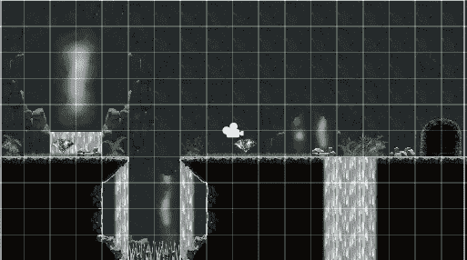
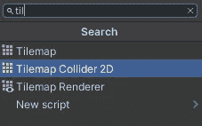
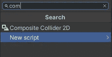
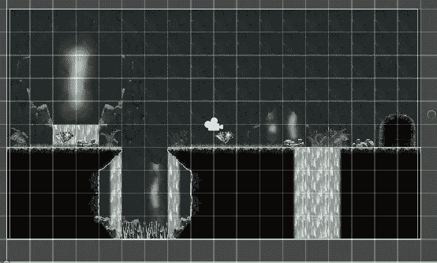

# 如何添加 Tilemap 碰撞器

> 原文：<https://medium.com/nerd-for-tech/how-to-add-a-tilemap-collider-3fc7aa1ee0c9?source=collection_archive---------9----------------------->

2D 手机游戏

**目的:**在棋盘上增加一个碰撞器，确保玩家能够在地面上移动

因此，要开始，选择地面 tilemap 或玩家将在其上移动的那一个，然后选择添加组件并搜索 tilemap 对撞机 2d 并选择该组件。

然后您会得到这样的东西，这不是我们想要的。我们希望我们的对撞机只在瓷砖表面。

因此，我们向 tilemap 添加了另一个组件，称为 composite 对撞机 2d，它也将添加刚体组件，因为它需要刚体才能工作。

然后在 tilemap 对撞机 2d 组件中启用“使用方式”复合，您可以在场景视图中看到对撞机现在只变成了表面。

