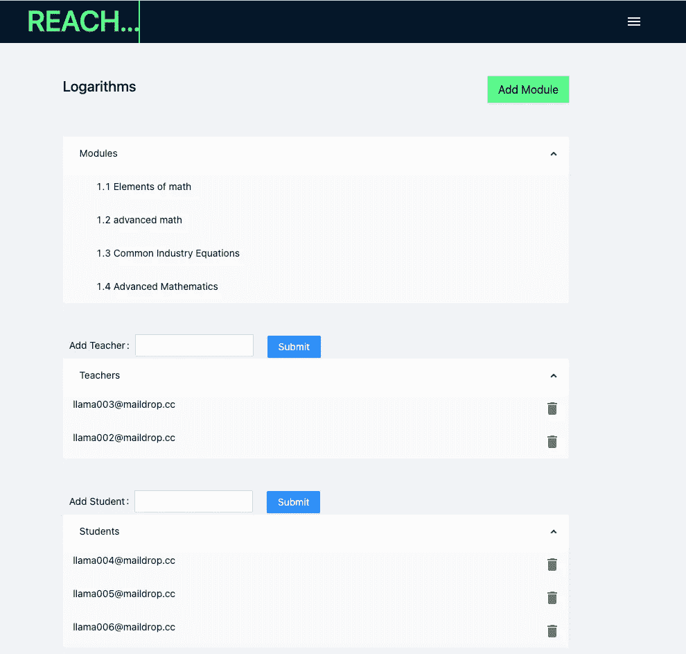
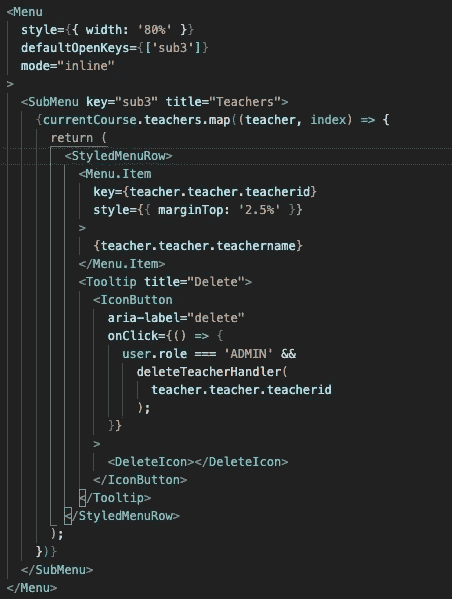

# 如何给你的 React 应用程序添加一个吸引人的下拉菜单

> 原文：<https://medium.com/nerd-for-tech/how-to-add-an-engaging-dropdown-menu-to-your-react-applications-93baba58a3bc?source=collection_archive---------21----------------------->

在 Lambda 学校的最后一个月，我开始着手一个有趣的项目，叫做 Reach LMS。据利益相关方称:

> Reach LMS 是一个为发展中国家设计的开源学习管理系统。Reach 使组织能够向任何人提供教育和培训，无论他们是在市中心使用笔记本电脑工作，还是在偏远的村庄使用太阳能翻盖手机工作。

换句话说，Reach 扩大了教育的范围，让那些不太幸运的人能够获得有价值的信息。

因为没有代码可以构建，所以我和我的团队负责构建这个系统的基础组件和关系。这包括决定我们将拥有什么类型的用户角色，他们可以与应用程序进行什么样的交互，以及他们是如何相互关联的。这自然带来了一些问题:我们如何让我们的应用程序对翻盖手机有足够的响应能力？有哪些可用的选项？我们如何构建这个应用程序，以便将来可以轻松扩展？

# 我们在 1 个月内建立了一个学习管理系统

到达 LMS 程序页面

经过一个月的努力工作，我们能够完成一个最小可行产品(MVP ),我们的涉众对此感到满意。我们的 MVP 有三个用户角色:管理员、教师和学生。这些角色的权限越来越大，从最低权限的学生到最高权限的管理员。借助 Reach LMS，公司现在有机会创建项目、课程和模块。他们将能够在线分享他们的信息，营造一个无缝、易用的学习环境。

我对这个项目的主要贡献是在 React.js 中创建的前端。我负责在 React 框架上进行构建，制作多个组件，创建 redux 基础，并处理整个应用程序的样式。我的贡献大部分是布局、组件、状态管理，除非你是软件开发人员，否则很难认出来。我做的一个困难的贡献是模块页面上的下拉菜单。

带有下拉菜单的模块页面

我想用一种简单明了的方式展示我们的信息。说到这里，我想到了一个下拉菜单。您在这里看到的样式是表单的 Ant 设计和下拉菜单的 Material-UI。我能够顺利地实现下拉菜单，但是遇到了一个严重的错误，我们的删除功能不能正常工作。我能够通过与我们的后端通信并让他们在每次成功删除后发送更新的列表来克服这个问题。这允许我将收到的响应复制到存储在 redux 中的本地状态中。总的来说，我们能够制作一个动态的添加/删除模块页面。

材料界面的下拉菜单代码

# 实际应用

目前，Reach LMS 是一个功能齐全的网络应用程序，可供希望创建自己的在线课程的用户使用。管理员用户将能够创建自己的程序、课程和模块。他们还可以使用每个课程页面上的交互式下拉菜单为每个课程添加教师和学生。这是一个关于课程页面用户界面的短片:

# 反思与未来努力

从这里开始，我们希望 Lambda School 的另一个团队接手我们的绿地项目，并在我们现有的基础上继续发展。由于我们从零开始，我们花了大部分时间来构建应用程序的基础和框架，没有太多时间来开发特性。我希望看到的一些未来功能是服务器端渲染+离线管理，电子邮件注册，文件和视频上传选项，以及学生提交管理。我看到的一些技术挑战是随着用户群的增长扩展这个应用程序，并找到保持有效运行时间的方法。我们构建它时考虑了可扩展性，但内存问题是不可避免的。我在 Lambda 学校的同事和导师都喜欢我们的项目，并给予了高度赞扬。就我个人而言，我真的很喜欢和我的团队一起工作，并为我们所发运的产品感到无比自豪。我希望这个项目能帮助我获得作为软件工程师的第一份工作，并给我机会继续开发有益于他人的酷应用程序。