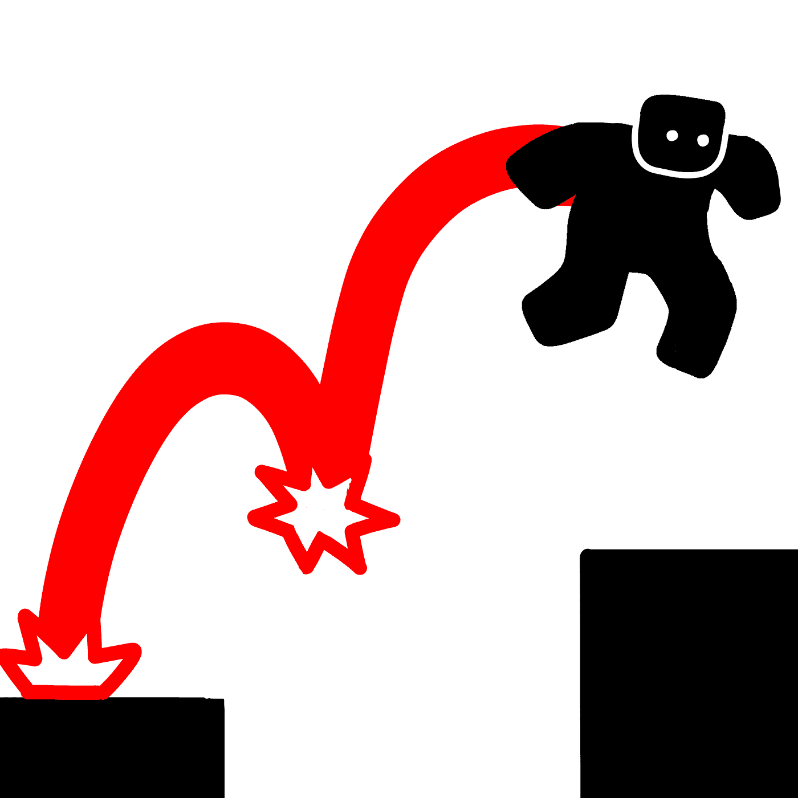
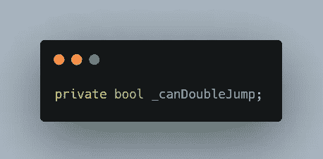
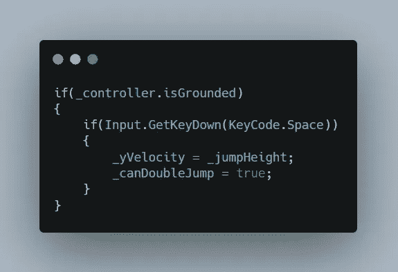
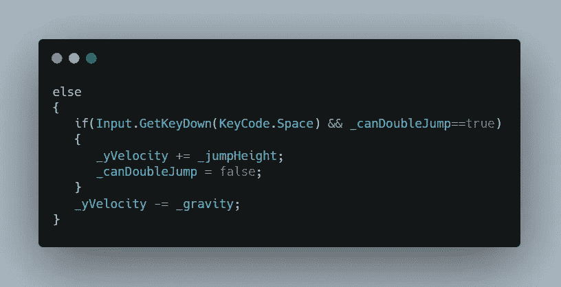
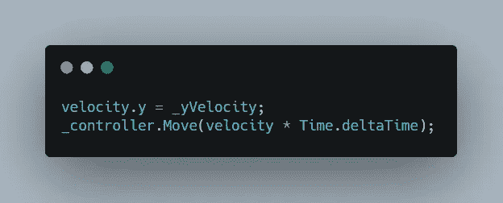
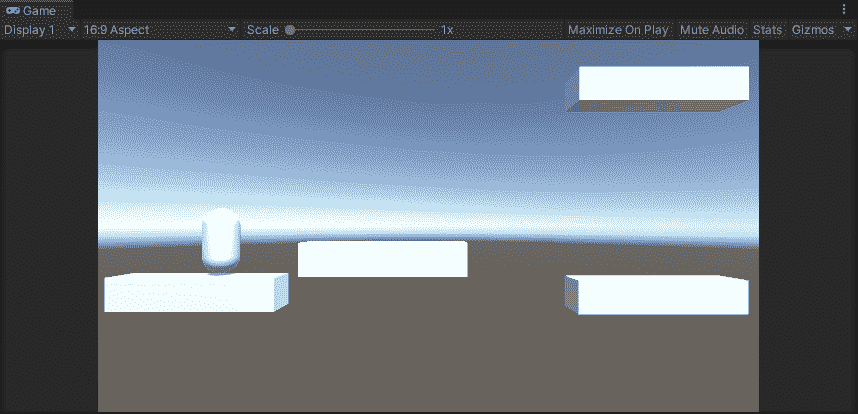

# 如何在你的游戏中加入双跳

> 原文：<https://medium.com/nerd-for-tech/how-to-add-double-jump-to-your-game-510832874f29?source=collection_archive---------17----------------------->

2.5D 游戏开发

目标:允许我们的玩家双人跳跃

我们已经在前一篇文章中创建了玩家移动和跳跃，所以现在让我们的玩家能够在空中再次跳跃。

首先定义一个 bool 变量，它将限制玩家在空中跳跃一次以上。

更新玩家在地面上的双跳为真，这样玩家在地面上后可以一直进行双跳。

然后当玩家在空中时更新脚本，如果按下空格键，允许另一次跳跃。为了不允许玩家在一次跳跃设置中进行多次双跳，请将 can double jump 变量设置为 false。

这是允许玩家根据玩家输入移动和跳跃的代码。

这就是双跳的样子。您可以更改跳跃高度变量，使双跳更加明显。