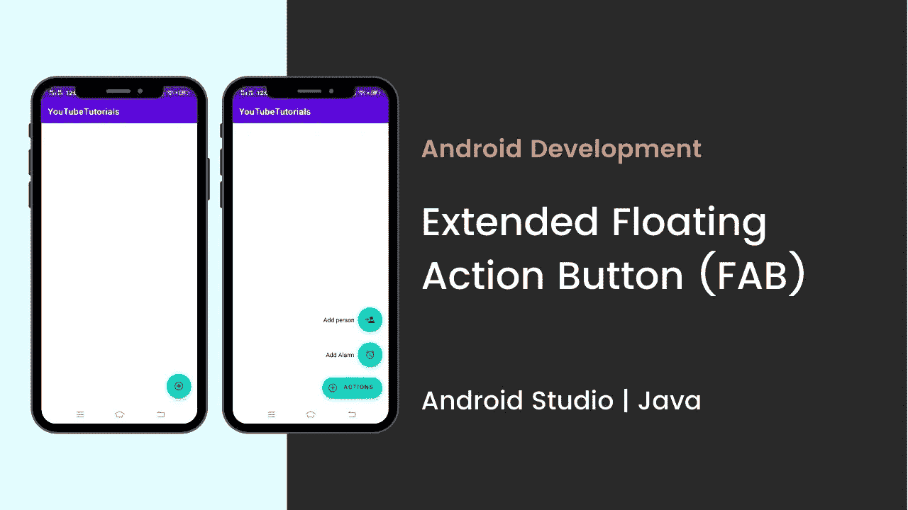
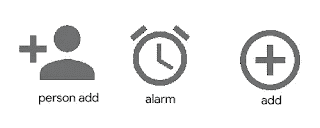

# 如何在 Android | Android Studio | Java 中添加扩展浮动动作按钮

> 原文：<https://medium.com/nerd-for-tech/how-to-add-extended-floating-action-button-in-android-android-studio-java-481cc9b3cdcb?source=collection_archive---------0----------------------->



**如何在 Android | Android Studio | Java 中添加扩展浮动动作按钮？**

在本教程中，我们将在 android 中创建一个扩展的浮动操作按钮。浮动动作按钮(FAB)执行屏幕上的主要或最常见的动作。它出现在所有屏幕内容的前面，通常呈圆形，中间有一个图标。

扩展浮动动作按钮是 Android 中新引入的带有材质组件库的类。

SDK 28 或 Android P 引入了 Material Components。它是支持设计库的超集，有许多新的添加和改进。在本教程中，我们将创建一个扩展的浮动操作按钮。

所以，让我们开始创建扩展 FAB。

**在开始创作之前，让我们看看你将会看到什么。**

# 步骤 1:添加依赖项

确保在你的 build.gradle **app** 文件中添加材质设计依赖。

```
implementation 'com.google.android.material:material:1.3.0'
```

# 第二步:添加可绘制文件

在设计主 XML 文件之前，首先，导入可绘制文件。下面是我在项目中使用的可绘制文件。



# 步骤 3:设计 XML 文件

现在，设计主 XML 文件，添加被设置为父 FAB 的扩展浮动操作按钮，并添加子 FAB。作为一个儿童晶圆厂，我用了两个晶圆厂。

父 FAB:活动

子 FAB 1:警报

子工厂 2:人员

```
<?xml version="1.0" encoding="utf-8"?>
<androidx.constraintlayout.widget.ConstraintLayout xmlns:android="http://schemas.android.com/apk/res/android"
    xmlns:app="http://schemas.android.com/apk/res-auto"
    xmlns:tools="http://schemas.android.com/tools"
    android:layout_width="match_parent"
    android:layout_height="match_parent"
    tools:context=".MainActivity"
    android:background="@color/white"
    tools:ignore="HardcodedText"> <!--This will be the parent Floating Action Button-->
    <com.google.android.material.floatingactionbutton.ExtendedFloatingActionButton
        android:id="@+id/add_fab"
        android:layout_width="wrap_content"
        android:layout_height="wrap_content"
        android:layout_gravity="end"
        android:layout_marginEnd="16dp"
        android:layout_marginBottom="16dp"
        android:backgroundTint="@color/black"
        android:text="Actions"
        android:textColor="@color/white"
        app:icon="@drawable/add"
        app:iconTint="@color/white"
        app:layout_constraintBottom_toBottomOf="parent"
        app:layout_constraintEnd_toEndOf="parent" /> <!--Floating action button for add alarm-->
    <com.google.android.material.floatingactionbutton.FloatingActionButton
        android:id="@+id/add_alarm_fab"
        android:layout_width="wrap_content"
        android:layout_height="wrap_content"
        android:layout_marginBottom="24dp"
        android:backgroundTint="@color/black"
        app:fabSize="normal"
        app:tint="@color/white"
        app:layout_constraintBottom_toTopOf="@+id/add_fab"
        app:layout_constraintEnd_toEndOf="@+id/add_fab"
        app:srcCompat="@drawable/alarm"
        android:contentDescription="@string/app_name" /> <!--Action name text for the add alarm button-->
    <TextView
        android:id="@+id/add_alarm_action_text"
        android:layout_width="wrap_content"
        android:layout_height="wrap_content"
        android:layout_marginEnd="8dp"
        android:text="Add Alarm"
        app:layout_constraintBottom_toBottomOf="@+id/add_alarm_fab"
        app:layout_constraintEnd_toStartOf="@+id/add_alarm_fab"
        app:layout_constraintTop_toTopOf="@+id/add_alarm_fab" /> <!--Floating action button for add person-->
    <com.google.android.material.floatingactionbutton.FloatingActionButton
        android:id="@+id/add_person_fab"
        android:layout_width="wrap_content"
        android:layout_height="wrap_content"
        android:layout_marginBottom="24dp"
        android:backgroundTint="@color/black"
        app:fabSize="normal"
        app:tint="@color/white"
        app:layout_constraintBottom_toTopOf="@+id/add_alarm_fab"
        app:layout_constraintEnd_toEndOf="@+id/add_alarm_fab"
        app:layout_constraintStart_toStartOf="@+id/add_alarm_fab"
        app:srcCompat="@drawable/person"
        android:contentDescription="@string/app_name" /> <!--Action name text for the add person button-->
    <TextView
        android:id="@+id/add_person_action_text"
        android:layout_width="wrap_content"
        android:layout_height="wrap_content"
        android:layout_marginEnd="8dp"
        android:text="Add Person"
        app:layout_constraintBottom_toBottomOf="@+id/add_person_fab"
        app:layout_constraintEnd_toStartOf="@+id/add_person_fab"
        app:layout_constraintTop_toTopOf="@+id/add_person_fab" /></androidx.constraintlayout.widget.ConstraintLayout>
```

# 步骤 4:添加功能

现在，在主 JAVA 文件中添加扩展 FAB 的功能，并在子 FAB 中添加 click listener。

```
public class MainActivity extends AppCompatActivity {
 FloatingActionButton mAddAlarmFab, mAddPersonFab;
    ExtendedFloatingActionButton mAddFab;
    TextView addAlarmActionText, addPersonActionText; // to check whether sub FABs are visible or not
    Boolean isAllFabsVisible; @Override
    protected void onCreate(Bundle savedInstanceState) {
        super.onCreate(savedInstanceState);
        setContentView(R.layout.*activity_main*); mAddFab = findViewById(R.id.*add_fab*);
        mAddAlarmFab = findViewById(R.id.*add_alarm_fab*);
        mAddPersonFab = findViewById(R.id.*add_person_fab*); addAlarmActionText = 
                findViewById(R.id.*add_alarm_action_text*);
        addPersonActionText = 
                findViewById(R.id.*add_person_action_text*); // Now set all the FABs and all the action name
        // texts as GONE
        mAddAlarmFab.setVisibility(View.*GONE*);
        mAddPersonFab.setVisibility(View.*GONE*);
        addAlarmActionText.setVisibility(View.*GONE*);
        addPersonActionText.setVisibility(View.*GONE*); // make the boolean variable as false, as all the
        // action name texts and all the sub FABs are
        // invisible
        isAllFabsVisible = false; // Set the Extended floating action button to
        // shrinked state initially
        mAddFab.shrink(); // We will make all the FABs and action name texts
        // visible only when Parent FAB button is clicked So
        // we have to handle the Parent FAB button first, by
        // using setOnClickListener you can see below
        mAddFab.setOnClickListener(
                new View.OnClickListener() {
                    @Override
                    public void onClick(View view) {
                        if (!isAllFabsVisible) { // when isAllFabsVisible becomes
                            // true make all the action name
                            // texts and FABs VISIBLE.
                            mAddAlarmFab.show();
                            mAddPersonFab.show();
                            addAlarmActionText
                                    .setVisibility(View.*VISIBLE*);
                            addPersonActionText
                                    .setVisibility(View.*VISIBLE*); // Now extend the parent FAB, as
                            // user clicks on the shrinked
                            // parent FAB
                            mAddFab.extend(); // make the boolean variable true as
                            // we have set the sub FABs
                            // visibility to GONE
                            isAllFabsVisible = true;
                        } else { // when isAllFabsVisible becomes
                            // true make all the action name
                            // texts and FABs GONE.
                            mAddAlarmFab.hide();
                            mAddPersonFab.hide();
                            addAlarmActionText
                                    .setVisibility(View.*GONE*);
                            addPersonActionText
                                    .setVisibility(View.*GONE*); // Set the FAB to shrink after user
                            // closes all the sub FABs
                            mAddFab.shrink(); // make the boolean variable false
                            // as we have set the sub FABs
                            // visibility to GONE
                            isAllFabsVisible = false;
                        }
                    }
                }); // below is the sample action to handle add person
        // FAB. Here it shows simple Toast msg. The Toast
        // will be shown only when they are visible and only
        // when user clicks on them
        mAddPersonFab.setOnClickListener(
                new View.OnClickListener() {
                    @Override
                    public void onClick(View view) {
                        Toast.*makeText* (MainActivity
                                        .this, "Person Added",
                                        Toast.*LENGTH_SHORT*).show();
                    }
                }); // below is the sample action to handle add alarm
        // FAB. Here it shows simple Toast msg The Toast
        // will be shown only when they are visible and only
        // when user clicks on them
        mAddAlarmFab.setOnClickListener(
                new View.OnClickListener() {
                    @Override
                    public void onClick(View view) {
                        Toast.*makeText* (MainActivity
                                        .this, "Alarm Added", 
                                        Toast.*LENGTH_SHORT*).show();
                    }
                });
    }
}
```

# 输出:

# 你可以在 YouTube 上关注我:

Golap 酒吧招待

# 此外，请访问网站/博客

[www.gbandroidblogs.com](https://www.gbandroidblogs.com/)

# 在 Instagram 上关注我

[安卓应用开发者](https://www.instagram.com/androidapps.development.blogs/)

# 跟着我去脸书

[GBAndroidBlogs](https://www.facebook.com/androidapps.development.blogs)