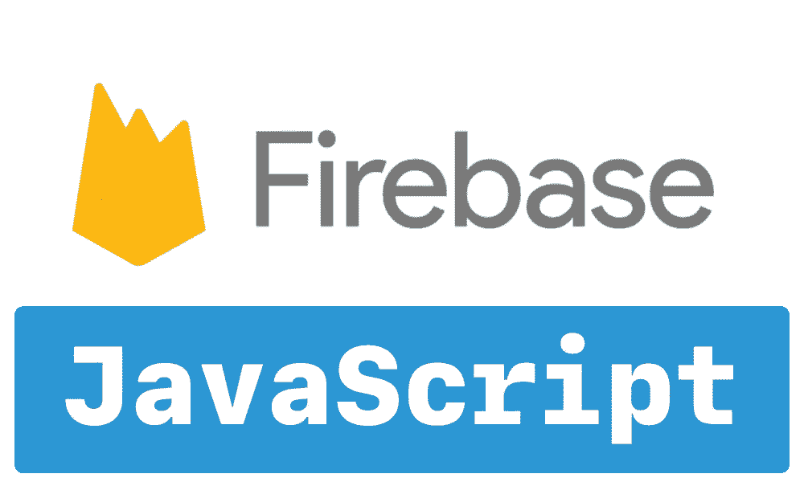

# 如何将 Firebase 添加到 Javascript 项目中

> 原文：<https://medium.com/nerd-for-tech/how-to-add-firebase-to-your-javascript-project-1cb998b51856?source=collection_archive---------6----------------------->

## 在 web 应用程序中使用和实现 Firebase Javascript SDK 的指南。



随着我越来越深入地创建自己的 web 应用程序和项目，Firebase 多次被认为是最好的后端服务之一。它为开发者提供各种工具和服务，帮助他们开发优质应用，扩大用户群，并赚取利润。Firebase 建立在 Google 的基础设施上，被归类为 NoSQL 数据库程序，它将数据存储在类似 JSON 的文档中。

# 先决条件

1.  确保您安装了首选的代码编辑器或 IDE。
2.  使用您的 Google 帐户登录 Firebase

如果你还没有一个 JavaScript 项目，但仍然想尝试一个 Firebase 产品，你很幸运。Firebase 让你很容易测试他们的产品，你可以下载他们的[快速启动样本](https://firebase.google.com/docs/samples)！

# 1.创建一个 Firebase 项目

在将 Firebase 添加到您的 JavaScript 应用程序之前，您需要创建一个 Firebase 项目来连接到您的应用程序。

1.  在 [Firebase 控制台](https://console.firebase.google.com/)中，点击**添加项目**，然后选择或输入一个**项目名称**。
2.  如果您正在创建新项目，您可以编辑**项目 ID** 。Firebase 会自动为您的 Firebase 项目分配一个唯一的 ID。**答*Firebase 为您的 Firebase 项目提供资源后，您不能更改您的项目 ID。***
3.  点击**继续**。
4.  *(可选)*您可以使用以下任何 Firebase 产品为您的项目设置 Google Analytics:

*   [Firebase Crashlytics](https://firebase.google.com/docs/crashlytics)
*   [火情预测](https://firebase.google.com/docs/predictions)
*   [Firebase 云消息传递](https://firebase.google.com/docs/cloud-messaging)
*   [Firebase 应用内消息](https://firebase.google.com/docs/in-app-messaging)
*   [Firebase 远程配置](https://firebase.google.com/docs/remote-config)
*   [Firebase A/B 测试](https://firebase.google.com/docs/ab-testing)

出现提示时，选择使用现有的 [Google Analytics 帐户](https://support.google.com/analytics/answer/1009618?ref_topic=3544906&authuser=0)或创建一个新帐户。如果您选择创建一个新帐户，请选择您的[分析报告位置](https://firebase.google.com/docs/projects/locations)，然后接受您项目的数据共享设置和谷歌分析条款。

***您可以随时在设置项目设置的*** [***集成***](https://console.firebase.google.com/project/_/settings/integrations) ***选项卡中设置 Google Analytics。***

5.点击**创建项目**，Firebase 将自动为您的 Firebase 项目提供资源。当该过程完成时，您将被带到 Firebase 控制台中 Firebase 项目的概述页面。

# 2.向 Firebase 注册您的应用程序

有了 Firebase 项目后，您可以将您的 web 应用程序添加到其中。

1.  在 [Firebase 控制台的项目总览页面](https://console.firebase.google.com/)中间，点击 **Web** 图标( **< / >** )启动设置。
2.  输入你的应用名称。该名称是一个内部标识符，仅在 Firebase 控制台中对您可见。
3.  *(可选)*为您的 web 应用程序设置 Firebase 托管。如果你愿意的话，你可以稍后再进行设置。你也可以在你的[项目设置](https://console.firebase.google.com/project/_/settings/general/)中随时将你的 Firebase Web 应用链接到一个托管站点。Firebase 主机不是您在 web 应用程序中使用 Firebase 产品所必需的****。****
4.  ****点击**注册 app** 。****

# ****3.添加 Firebase SDKs 并初始化 Firebase****

****Firebase 为大多数 Firebase 产品提供了 JavaScript 库，包括远程配置、FCM 等等。您可以将任何可用的[库](https://firebase.google.com/docs/web/setup#available-libraries)添加到您的应用中。****

****如何将 Firebase SDKs 添加到您的 Web 应用程序取决于您是否为您的应用程序使用 Firebase 主机，您的应用程序使用什么工具(如模块捆绑器)，或者您是否正在配置 Node.js 应用程序。如需在这些选择中获得更多帮助，请参见将 Web SDKs 添加到您的应用程序的[方法](https://firebase.google.com/docs/web/learn-more#ways-to-add-web-sdks)。****

****出于这个博客的目的，我将深入研究如何用 npm 添加 Firebase:****

1.  ****安装 Firebase JavaScript SDK:****

*   ****如果您还没有一个`package.json`文件，那么通过从您的 JavaScript 项目的根目录运行以下命令来创建一个:****

```
**npm init**
```

*   ****安装`firebase` npm 包，并通过运行以下命令将其保存到您的`package.json`文件中:****

```
**npm install --save firebase**
```

****2.要仅包括[特定 Firebase 产品](https://firebase.google.com/docs/web/setup#libraries-bundle)(如身份验证和云 Firestore)，`import` Firebase 模块:****

```
**// Firebase App (the core Firebase SDK) is always required and must be listed first
import firebase from "firebase/app";// If you are using v7 or any earlier version of the JS SDK, you should import firebase using namespace import
// import * as firebase from "firebase/app"

// If you enabled Analytics in your project, add the Firebase SDK for Analytics
import "firebase/analytics";

// Add the Firebase products that you want to use
import "firebase/auth";
import "firebase/firestore";**
```

****3.在您的应用程序中初始化 Firebase:****

```
**// TODO: Replace the following with your app's [Firebase project configuration](https://firebase.google.com/docs/web/setup#config-object)
// For Firebase JavaScript SDK v7.20.0 and later, `measurementId` is an optional fieldconst firebaseConfig = {
  // ...
};

// Initialize Firebase
firebase.initializeApp(firebaseConfig);**
```

****如果你以前没有配置过 Firebase 应用程序，你可能会有点困惑。****

****要在应用程序中初始化 Firebase，您需要提供应用程序的 Firebase 项目配置。您可以随时[获得您的 Firebase 配置对象](https://support.google.com/firebase/answer/7015592)。****

****下面是启用了所有必要服务的配置对象的格式:****

```
**// For Firebase JavaScript SDK v7.20.0 and later, `measurementId` is an optional fieldvar firebaseConfig = {
  apiKey: "API_KEY",
  authDomain: "PROJECT_ID.firebaseapp.com",
  databaseURL: "https://PROJECT_ID.firebaseio.com",
  projectId: "PROJECT_ID",
  storageBucket: "PROJECT_ID.appspot.com",
  messagingSenderId: "SENDER_ID",
  appId: "APP_ID",
  measurementId: "G-MEASUREMENT_ID",
};**
```

****下面是一个带有*示例*值的配置对象:****

```
**// For Firebase JavaScript SDK v7.20.0 and later, `measurementId` is an optional fieldvar firebaseConfig = {
  apiKey: "AIzaSyDOCAbC123dEf456GhI789jKl01-MnO",
  authDomain: "myapp-project-123.firebaseapp.com",
  databaseURL: "https://myapp-project-123.firebaseio.com",
  projectId: "myapp-project-123",
  storageBucket: "myapp-project-123.appspot.com",
  messagingSenderId: "65211879809",
  appId: "1:65211879909:web:3ae38ef1cdcb2e01fe5f0c",
  measurementId: "G-8GSGZQ44ST"
};**
```

# ****5.开始之前了解更多信息****

****如果您想了解更多关于 Firebase 的信息，下面是一些有用的链接:****

*   ****探索[示例 Firebase 应用](https://firebase.google.com/docs/samples)。****
*   ****通过 [Firebase Web Codelab](https://codelabs.developers.google.com/codelabs/firebase-web/) 获得实践经验。****
*   ****探索 GitHub 中的[开源代码。](https://github.com/firebase/firebase-js-sdk)****
*   ****查看 Firebase JavaScript SDK 的[支持环境](https://firebase.google.com/docs/web/environments-js-sdk)。****
*   ****使用额外的 Firebase 维护的开源库来加速您的开发，如 [AngularFire](https://firebaseopensource.com/projects/angular/angularfire2/) 、 [RxFire](https://github.com/firebase/firebase-js-sdk/tree/master/packages/rxfire#rxfire) 和 [FirebaseUI for web](https://firebaseopensource.com/projects/firebase/firebaseui-web/) 。****
*   ****准备启动你的应用程序:****

****在谷歌云控制台中为你的项目设置[预算提醒](https://firebase.google.com/docs/projects/billing/avoid-surprise-bills#set-up-budget-alert-emails)。****

****在 Firebase 控制台中监控 [*使用和计费*仪表板](https://console.firebase.google.com/project/_/usage)，以获得您的项目在多个 Firebase 服务中的总体使用情况。****

****查看 [Firebase 启动清单](https://firebase.google.com/support/guides/launch-checklist)。****

# ****6.将 Firebase 添加到已经存在的应用程序中****

****如果您想将 Firebase 服务添加到您已经存在的应用程序中，这里有一些有用的链接:****

*   ****用 [Firebase Hosting](https://firebase.google.com/docs/hosting) 托管你的应用。****
*   ****用[认证](https://firebase.google.com/docs/auth/web/start)设置用户认证流程。****
*   ****用[云火石](https://firebase.google.com/docs/firestore/quickstart)或[实时数据库](https://firebase.google.com/docs/database/web/start)存储数据，比如用户信息。****
*   ****使用[云存储](https://firebase.google.com/docs/storage/web/start)存储文件，如照片和视频。****
*   ****通过[性能监控](https://firebase.google.com/docs/perf-mon/get-started-web)深入了解应用的性能问题。****
*   ****使用[云功能](https://firebase.google.com/docs/functions/callable#call_the_function)触发在安全环境中运行的后端代码。****
*   ****使用[云消息](https://firebase.google.com/docs/cloud-messaging/js/client)发送通知。****

****如果您正试图在项目中实现和使用 Firebase，我希望这篇博客对您有所帮助。如果你正在寻找更多的信息或者你被卡住了，谷歌在这里有关于 Firebase 的惊人而详细的文档:[https://firebase.google.com/docs](https://firebase.google.com/docs)****