# 如何给树莓派添加光线和温度传感器

> 原文：<https://medium.com/nerd-for-tech/how-to-add-light-and-temperature-sensors-to-raspberry-pi-a1e0c7d6d37f?source=collection_archive---------2----------------------->

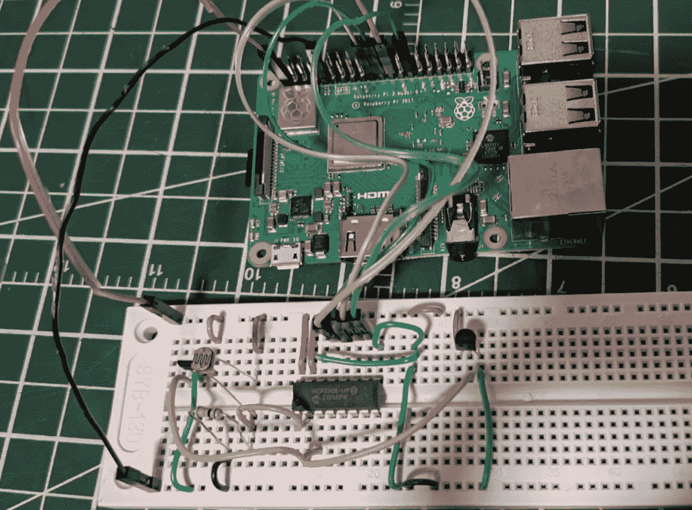

最近我正在用 Raspberry Pi 做一个小的硬件项目。我想用树莓 Pi 3 B+做室内监听。它应该能检测亮度，在天快黑的时候开灯；它还应该能够在室温过低时提醒我关窗。因此，需要光传感器和温度传感器。

# 选择传感器

一般来说，添加传感器有两种方式:购买预建的传感器模块或用零件自己构建传感器。

预建传感器非常容易使用，如果您只是想添加传感器而不考虑太多，这是更好的选择。但就我而言，我更愿意用零件制造自己的传感器，因为我可以学到一些电子学知识，并获得一些经验，以利于我未来的项目。所以我决定制造自己的传感器。

传感器其实很简单。首先，我们需要一个组件根据环境输出电压。这个电压是模拟的，所以我们需要一个 ADC 将模拟信号转换成数字信号。就是这样。

## 光敏感元件

对于光传感器，我选择了 [Adafruit 161 光电池](https://www.adafruit.com/product/161)。这是一个非常便宜的光敏电阻(0.95 美元)，Adafruit 提供了一个[的伟大教程](http://learn.adafruit.com/photocells)。还有，[有一篇很棒的文章是关于如何搭配树莓派](https://maker.pro/raspberry-pi/tutorial/how-to-read-an-ldr-sensor-with-raspberry-pi-using-mcp3008)使用的。

亮度(照度)的单位是[勒克斯](https://en.wikipedia.org/wiki/Lux)。维基百科有一个很棒的表格解释了照度和勒克斯。根据该表，我的用例属于 20-100 勒克斯之间的范围，因此 161 光电池完全没问题。此外，由于我不关心准确的照度值，并且我没有办法测量它，所以我不需要传感器来提供准确的值。

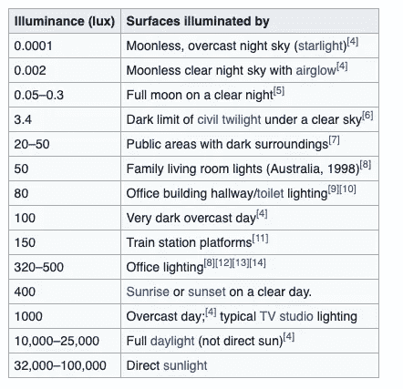

对勒克司的直观解释

光电池需要一个**下拉**电阻。典型的连接是这样的:

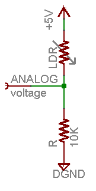

[数据手册](https://cdn-learn.adafruit.com/downloads/pdf/photocells.pdf)还演示了如何计算下拉电阻。在我的使用案例中，环境光为 10~100 勒克斯，光电池电阻在 10kω~ 1.5kω之间，因此 10kω下拉电阻完全合适。

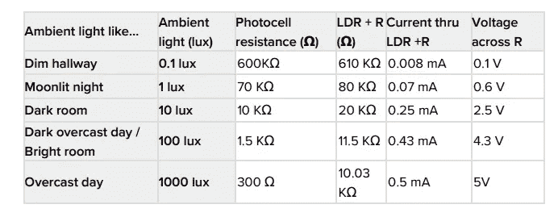

采用 5V 电源和 10kΩ下拉电阻时光电池电阻与光的关系。来源:[数据表](https://cdn-learn.adafruit.com/downloads/pdf/photocells.pdf)

## 温度传感器

对于温度传感器，我选择了德州仪器的 [LMT86](https://www.ti.com/product/LMT86) 。这种传感器也很便宜(不到 1 美元)。

我没有选择著名的 LM35，因为我不知道什么时候买的零件。但是从[数据表](https://www.ti.com/lit/ds/symlink/lmt86.pdf)来看，LMT86 似乎完全符合我的需求:

*   快速热时间常数，典型值 10s
*   非常精确:典型值 0.4℃
*   宽温度范围:-50℃至 150℃

从数据手册中的图 9 可以看出，只要大于 2.7V，输出电压几乎与电源电压无关，由于树莓 Pi 提供的是 3.3V，这意味着我们不需要考虑电压差，用常数公式就可以得到温度。

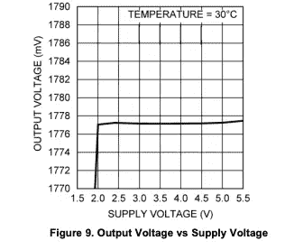

LMT86 响应“几乎”是线性的，它确实有轻微的伞抛物线形状。数据手册在表 3 中提供了精确的查找表。它还提供了一个**不太精确的**抛物线方程

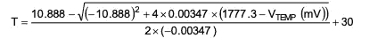

然而，这个等式需要平方根运算。虽然对我的应用程序来说没问题，因为 Raspberry Pi 是 USB 驱动的，但这在低功耗设备上可能会有问题。[另一个公式适合消耗更少功率的线性回归](/@tarlanahad/obtaining-better-accuracy-for-lmt87-temperature-sensor-by-using-polynomial-regression-b753b8cc9cc9)，这在某些情况下可能是有用的。

由于我用的是 Raspberry Pi，使用查找表不是问题，所以我选择了最准确的表方法。我创建了一个包`lmt8x` ( [GitHub](https://github.com/charlee/python-lmt8x) )来使查找更容易。您可以使用以下命令在 Raspberry Pi 上安装此软件包:

```
pip install lmt8x
```

数据手册中有一些重要信息需要了解。

首先，不同封装的引脚配置不同。在低压/LPM 组件(LMT86LP、LMT86LPM)中，中心销在外面，而在液化石油气组件(LMT86LPG)中，左销在外面。连接时要小心——错误的连接可能会损坏您的传感器！

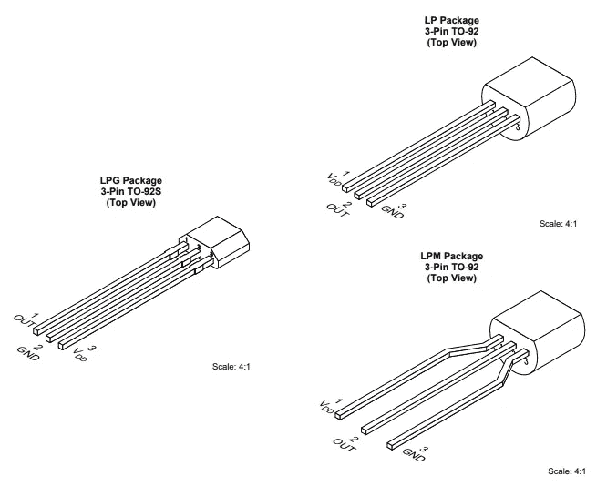

液化石油气，低压，LPM 有不同的引脚配置

另一件事是“热时间常数”。这是一个衡量温度传感器对真实温度响应速度的指标。尽管 LMT86 具有快速热时间常数，但它仍然需要大约 40 秒才能响应正确的温度。实验时请记住这一点——不要在系统启动后立即使用数据！


LMT8x 系列具有快速的热时间常数，但仍需要大约 40 秒才能返回正确的温度。

# 模数转换

由于 161 和 LMT86 都有模拟输出，而 Raspberry PI GPIO 只能处理数字输入，因此我们需要一个 ADC(模数转换器)将信号转换为数字数据。一种常用的 ADC 是 [MCP3008](https://www.adafruit.com/product/856) ( [数据表](https://cdn-shop.adafruit.com/datasheets/MCP3008.pdf))，它具有 10 位分辨率(输出范围从 0~1024)和 8 个输入通道。

MCP3008 支持两种模式:单端模式和差分模式(参见[数据表](https://cdn-shop.adafruit.com/datasheets/MCP3008.pdf)表 5–2)。在这个应用中，我只需要从传感器读取数据，所以单端模式已经足够好了。

数据手册还在“5.0 串行通信”部分解释了如何从 MCP3008 读取数据。但幸运的是，Adafruit 提供了一个驱动程序`adafruit-circuitpython-mcp3xxx`，所以我们不必遵循时钟序列。

Adafruit 还有一个很棒的[教程](https://learn.adafruit.com/reading-a-analog-in-and-controlling-audio-volume-with-the-raspberry-pi/overview?view=all)以及关于如何使用 MCP3008 的 Python 代码，所以我在这里省略了细节，只展示了一些图表供参考。


MCP3008 引脚配置

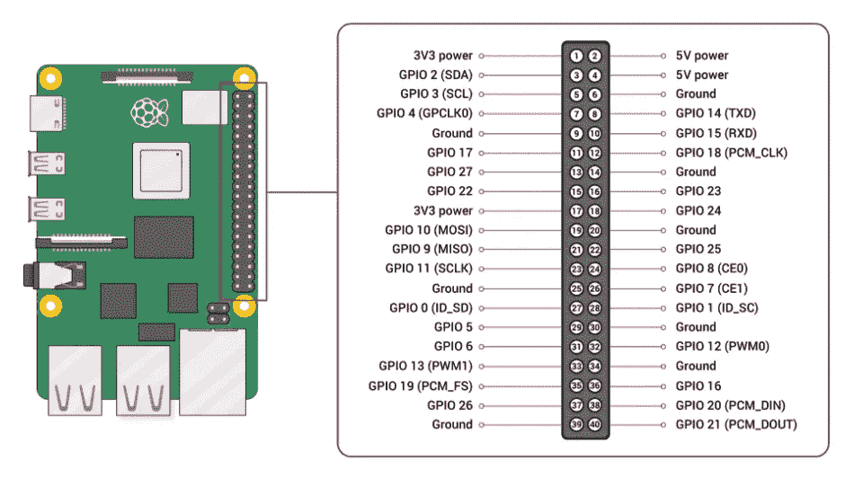

树莓 Pi 3 B+ GPIO 定义

因此，连接应该是(从 MCP3008 到 Raspberry Pi):

*   VDD → 3V3(引脚 1)
*   VREF → 3V3(引脚 1)
*   AGND → GND(针脚 9、25、39)
*   CLK → SCLK(引脚 23)
*   DOUT → MISO(引脚 21)
*   德国→ MOSI(引脚 19)
*   CS/SHDN →任何 GPIO 引脚
*   DGND → GND(针脚 9、25、39)

# 组装原型

现在，我们只需将光电池和温度传感器连接到 MCP3008 的 CH0、CH1 引脚，然后将 MCP3008 连接到 Raspberry Pi。这是一个简单的示意图:

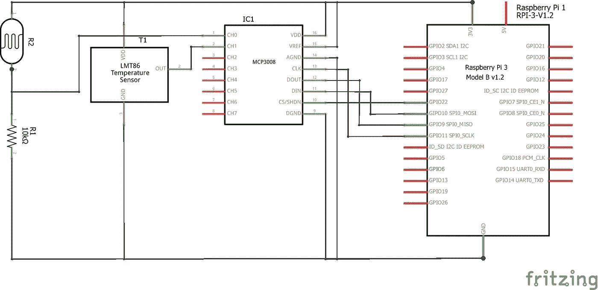

MCP3008 使用光电池和温度传感器的原理图

这里，我将 CS 引脚连接到 Raspberry Pi 上的`GPIO22`引脚。因此，我必须在代码中使用`board.D22`。此外，Raspberry Pi 有许多冗余引脚(例如，引脚 6、9、14、20、25…都是 GND)，您可以使用任何方便的引脚。

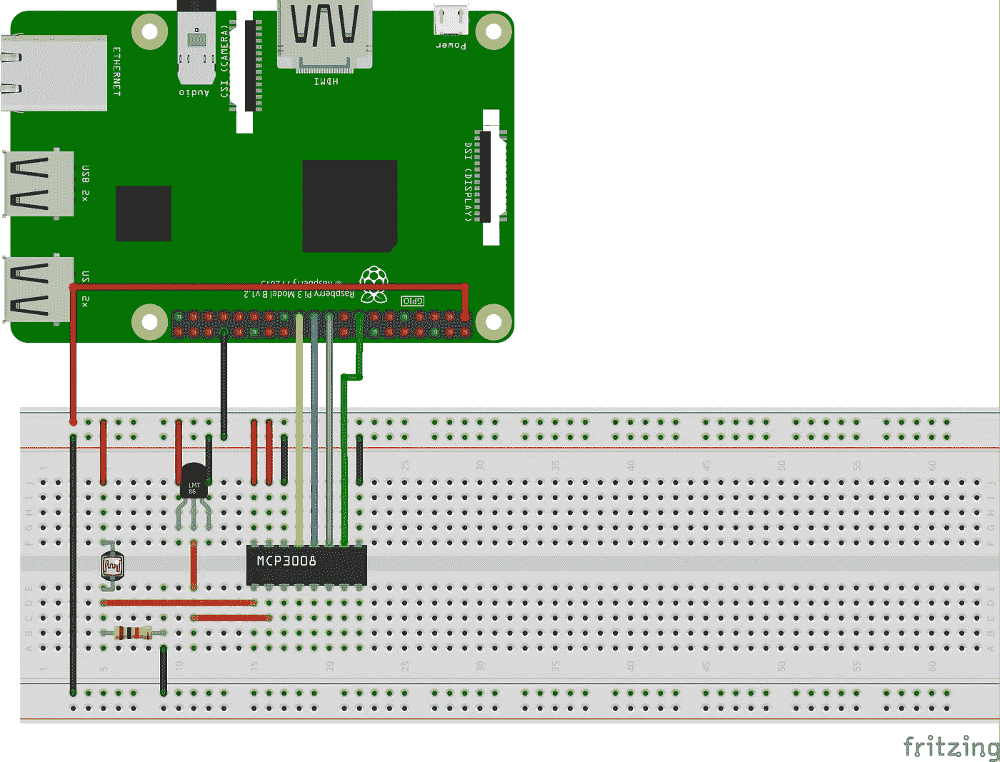

带 Raspberry Pi 的试验板连接

在我的实际实验中，我添加了另一个温度传感器 LMT87LPG，以比较两个不同模型的结果。因此，光电池连接到 CH0，而 LMT87 连接到 CH1，LMT86 连接到 CH2。


实际的联系。注意，我还添加了另一个温度 LMT87(在第 3、4、5 列)。

在仔细检查了连接之后，我创建了以下代码来测试传感器(我使用的是 Python 3):

```
import os
import math
import time
import busio
import digitalio
import board
import adafruit_mcp3xxx.mcp3008 as MCP
from adafruit_mcp3xxx.analog_in import AnalogIn
from lmt8x import lmt87_v2t, lmt86_v2t# create the spi bus
spi = busio.SPI(clock=board.SCK, MISO=board.MISO, MOSI=board.MOSI)# create the cs (chip select)
cs = digitalio.DigitalInOut(board.D22)# create the mcp object
mcp = MCP.MCP3008(spi, cs)# create an analog input channel on pin 0
chan0 = AnalogIn(mcp, MCP.P0)# create an analog input channel on pin 0
chan1 = AnalogIn(mcp, MCP.P1)
time.sleep(0.01)
chan1 = AnalogIn(mcp, MCP.P1)chan2 = AnalogIn(mcp, MCP.P2)
time.sleep(0.01)
chan2 = AnalogIn(mcp, MCP.P2)while True:
    print('light: %d, %.3fV\t\tlmt87: %d, %.3fC\t\tlmt86: %d, %.3fC' % (
        chan0.value, chan0.voltage,
        chan1.value, lmt87_v2t(chan1.voltage * 1000),
        chan2.value, lmt86_v2t(chan2.voltage * 1000),
    ))
    time.sleep(1)
```

安装依赖项:

```
pip install adafruit-blinka adafruit-circuitpython-mcp3xxx lmt8x
```

运行此脚本:

```
python mcp3008-test.py
```

我们可以看到，LMT87 和 LMT86 的结果确实有一点差异(约 0.3℃)，但这是可以接受的，我打算使用两者的平均值。我还试图盖住光传感器，并用手指触摸温度传感器。明显的电压/温度变化

可以从结果中观察到(下面截图中的红框)，表明传感器工作正常。

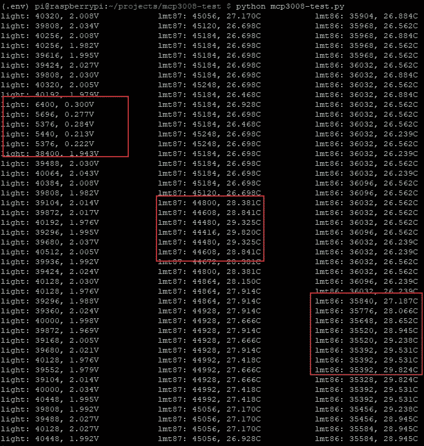

# 焊接 PCB

我购买了一些性能板，以便创建一个可用的产品超越试验板。我费了很大劲才把 PCB 放进我的树莓皮盒子里。perf 板不是完美的尺寸，所以我不能简单地使用树莓 Pi 上的螺丝孔来固定 PCB。最简单的方法是将 40 引脚接头焊接到 PCB 上，然后简单地将接头插入 GPIO 引脚。不是很稳定，但已经足够好了。但如果我这样做，PCB 将离外壳边缘太远，并且不可能将传感器放置在外壳外部来拾取正确的数字！

我最终采用的解决方案是制作一个独立的 ADC 板和一个传感器板——ADC 板有一个 40 引脚接头，将插入 GPIO 引脚并留在外壳内，而传感器板有所有三个传感器，将放在外壳外，并通过跳线连接到 ADC 板。这不是一个完美的解决方案，但至少对我有效。

所以我为 ADC 板设计了一个新的设计。PCB 看起来像这样:

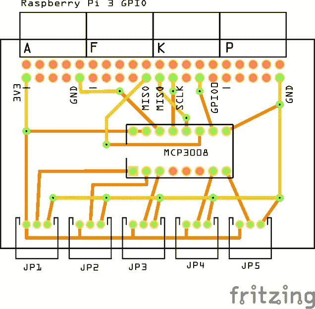

我的 ADC 板的 PCB 设计。黄色痕迹在顶层，橙色痕迹在底层。

一些注意事项:

*   40 引脚接头(顶部)焊接到底层，因此所有走线必须从顶层连接。同样，JP1~JP5 和 MCP3008 芯片焊接到顶层，因此走线必须从底层连接。
*   在原理图中，我使用 GPIO0(引脚 27)而不是 GPIO22，只是为了使布线更容易。代码需要相应更改:`cs = digitalio.DigitalInOUt(board.D0)`
*   MCP3008 支持 8 个通道，但只使用了 5 个通道。没有足够的空间容纳 8 个 3 引脚接头。
*   我把一个 VCC 和一个 GND 的每个连接器，这使得焊接更加困难。[部分产品](https://www.tindie.com/products/cburgess129/10-bit-adcvms-board-hat-for-raspberry-pi-v21/)使用普通 VCC 和 GND 引脚。后来，我觉得可能没有必要有多个 VCC 和 GND，共同的 VCC 会容易得多。

传感器板非常简单，我没有创建 PCB 设计。

最终产品看起来是这样的( [Reddit 线程](https://www.reddit.com/r/raspberry_pi/comments/mlt2wa/after_the_adc_i_made_the_sensors_today/)):

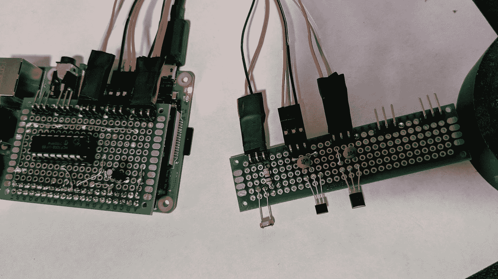

安装在 Raspberry Pi 上的 ADC 板(左)和传感器板(右)。请忽略电容器——它们没有被正确使用。有关详细信息，请参见“可能的改进”部分。

# 可能的改进

事实上，我的实验有一些缺陷，可以进一步改进。因为我手里没有必要的零件，而且我对目前的结果很满意，所以我会保持目前的设置，等我拿到所有的零件后再回来。

## MCP3008 的旁路电容

在 [MCP3008 数据表](https://cdn-shop.adafruit.com/datasheets/MCP3008.pdf)的第 6.4 节“布局考虑”中:

> 该器件应始终使用一个旁路电容，并应尽可能靠近器件引脚放置。建议旁路电容值为 1μF。

看起来我需要两个 1μF 电容用于 MCP3008 的 VCC 和 VREF 引脚。

## 温度传感器的滤波电容器

[LMT86 数据表](https://www.ti.com/lit/ds/symlink/lmt86.pdf)9.2.1.1“设计要求”中提到

> 当 ADC 对采样电容充电时，它需要来自 LMT86 温度传感器和许多运算放大器等模拟源输出的瞬时电荷。增加一个电容 C_FILTER 就可以轻松满足这一要求。

这是数据手册中的数字:

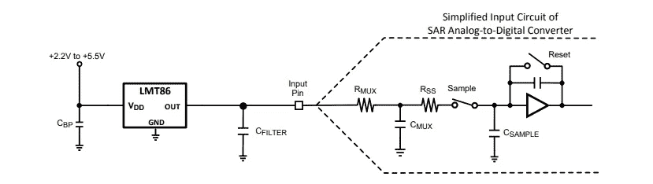

于是我查了一下 [MCP3008 数据表](https://cdn-shop.adafruit.com/datasheets/MCP3008.pdf)发现了以下数据。

*   开关电阻:1000ω([第 4 页](https://cdn-shop.adafruit.com/datasheets/MCP3008.pdf)
*   样本电容:20pF ( [第 4 页](https://cdn-shop.adafruit.com/datasheets/MCP3008.pdf))
*   分辨率:10 位
*   采样时间:1 / 100000Hz ( `adafruit_blinka`驱动[源](https://github.com/adafruit/Adafruit_Blinka/blob/master/src/adafruit_blinka/microcontroller/generic_linux/spi.py#L14)

基于[这一页的公式](https://www.maximintegrated.com/en/design/technical-documents/app-notes/5/571.html)，取`R_out = 1kΩ`，我们有`(R_on + R_out) * C_sample = (1000 + 1000) * 20e-12 = 4e-8`，和`1 / resolution * T_sample = 0.1 * (1 / 100000) = 1e-6`，公式成立。所以很可能我的设计中不需要使用 C_FILTER。但无论如何，我给每个温度传感器增加了一个 100nF 的电容。

不幸的是，我的设计可能是错误的:基于 [Reddit 线程](https://www.reddit.com/r/raspberry_pi/comments/mlt2wa/after_the_adc_i_made_the_sensors_today/gtp7wla?utm_source=share&utm_medium=web2x&context=3)，电容应该尽可能靠近 ADC 引脚。在我的例子中，我应该为每个输入引脚放置一个电容，即使是光传感器。这个电容还可以滤除走线和电线拾取的噪声。

## 使用帽子延伸套件

从[的一个 Reddit 帖子](https://www.reddit.com/r/raspberry_pi/comments/mknr9m/i_created_an_adc_for_raspberry_pi_w_mcp3008_can/)中，我了解到 Adafruit 有一个“ [Perma-Proto HAT](https://www.adafruit.com/product/2310) 工具包，非常适合这样的项目。我肯定会在我的下一个项目中尝试这样做。大声呼喊 [Antal_z](https://www.reddit.com/r/raspberry_pi/comments/mknr9m/i_created_an_adc_for_raspberry_pi_w_mcp3008_can/gthv0ct?utm_source=share&utm_medium=web2x&context=3) 提供这个！

# 结论

基本上，这就是如何使用模拟传感器与树莓派。与预先构建的传感器相比，我更喜欢这种方式，因为我可以完全控制传感器的工作方式。在亚马逊上很难找到模拟传感器。

这是一个非常基础的项目，来自一个对电容器知之甚少的电子爱好者。我希望这个帖子可以为想做类似项目的人提供一些信息，并请评论任何建议。

感谢阅读！