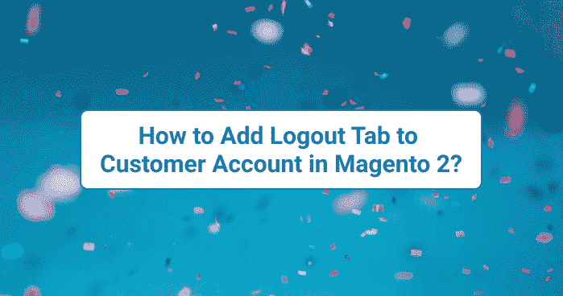
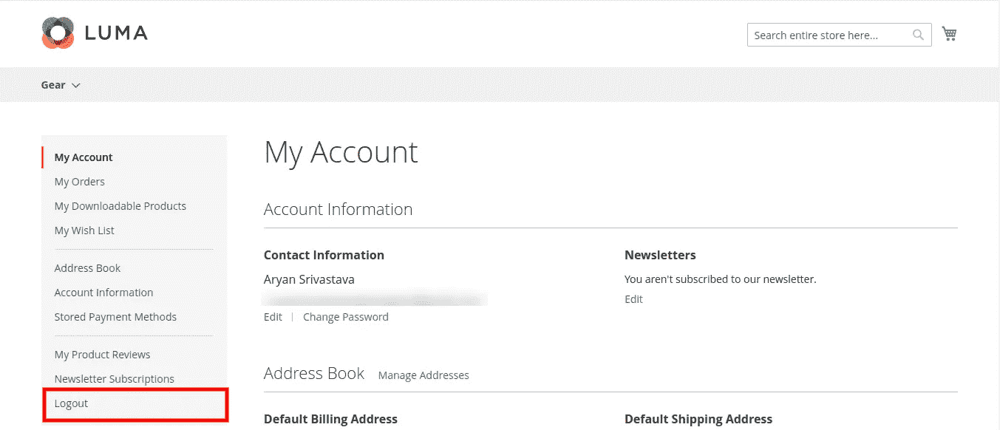
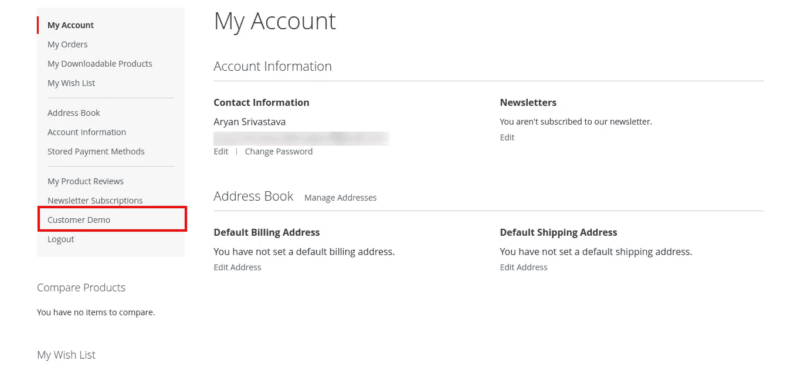

# 如何在 Magento 2 中给客户账号添加注销标签？

> 原文：<https://medium.com/nerd-for-tech/how-to-add-logout-tab-to-customer-account-in-magento-2-51b1d2ad612e?source=collection_archive---------8----------------------->



如何在 Magento 2 中给客户账号添加注销标签？

在这篇文章中，我将解释如何添加**注销标签**到客户账户。大多数用户会在客户帐户仪表板中搜索该链接。我们可以将**注销/退出**添加到客户账户。

**你可能也会感兴趣:**

1.  [如何在 Magento 2 中按自定义属性显示产品？](https://desssigner.in/how-to-display-products-by-custom-attribute-in-magento-2/)

我们开始吧

您需要在***/app/design/frontend/<Vendor>/<theme>/Magento _ Customer/layout/***下添加***Customer _ account . XML***

我的情况是:

***/app/设计/前端/雅利安/教程/Magento _ Customer/layout/***

雅利安= >供应商

教程= >主题

内容为***customer _ account . XML***

```
<?xml version="1.0"?>
<page xmlns:xsi="[http://www.w3.org/2001/XMLSchema-instance](http://www.w3.org/2001/XMLSchema-instance)" layout="2columns-left" xsi:noNamespaceSchemaLocation="urn:magento:framework:View/Layout/etc/page_configuration.xsd">
    <body>
        <referenceBlock name="customer_account_navigation">
            <block class="Magento\Framework\View\Element\Html\Link\Current" name="customer.account.logout">
               <arguments>
                   <argument name="label" xsi:type="string" translate="true">Logout</argument>
                   <argument name="path" xsi:type="string">customer/account/logout</argument>
               </arguments>
           </block>
       </referenceBlock>
   </body>
</page>
```

一旦在你的主题中添加了文件，请刷新缓存:

```
$ php bin/magento c:f
```

输出:



注销链接

# 如何向客户仪表板添加自定义链接？

如果您想向客户仪表板添加自定义链接/选项卡，您可以轻松完成。让我们看看如何添加自定义链接。

例如，我想添加**客户演示**选项卡，该选项卡将重定向到 URL 客户演示。

在你的主题中编辑***customer _ account . XML***。

```
<?xml version="1.0"?>
<page xmlns:xsi="[http://www.w3.org/2001/XMLSchema-instance](http://www.w3.org/2001/XMLSchema-instance)" layout="2columns-left" xsi:noNamespaceSchemaLocation="urn:magento:framework:View/Layout/etc/page_configuration.xsd">
    <body>
        <referenceBlock name="customer_account_navigation">
            <block class="Magento\Framework\View\Element\Html\Link\Current" name="customer.demo" before="customer.account.logout">
               <arguments>
                   <argument name="label" xsi:type="string" translate="true">Customer Demo</argument>
                   <argument name="path" xsi:type="string">customer-demo</argument>
               </arguments>
           </block>
       </referenceBlock>
   </body>
</page>
```

清除缓存

```
$ php bin/magento c:f
```

输出:



客户仪表板的自定义选项卡

# 如何从客户账户中删除标签？

从客户帐户仪表板中删除现有选项卡非常简单。我们只需要删除我们的***customer _ account . XML***中的那个块

```
<referenceBlock name="name of the block" remove="true" />
```

例如，让我们删除上面添加的**客户演示**选项卡。

```
<referenceBlock name="customer.demo" remove="true" />
```

现在，清除缓存以查看更改。

希望这篇文章能帮助您理解如何向客户帐户仪表板添加链接。如果您有任何疑问，您可以直接发邮件到[**【aryansrivastavadesssigner@gmail.com】**](mailto:aryansrivastavadesssigner@gmail.com)询问我，或者在这里 联系我 [**。**](https://desssigner.in/contact/)

如果你想要一个现场会议，请直接在 LinkedIn 上联系我，我会在周末安排一个在线会议。

如果你喜欢这篇文章，你可以给我买杯咖啡[给我买杯咖啡](https://www.buymeacoffee.com/aryansrivastava)。

*原载于 2021 年 8 月 8 日*[*https://desssigner . in*](https://desssigner.in/how-to-add-logout-tab-to-customer-account-in-magento-2/)*。*