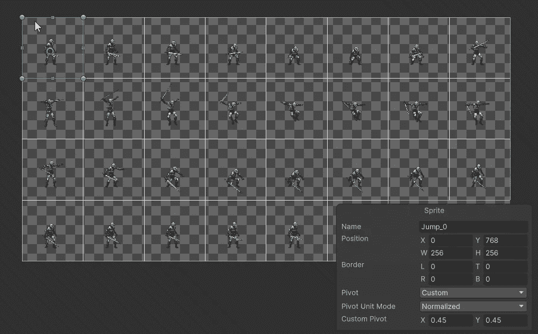

# 如何在 Unity 中调整精灵的枢轴点

> 原文：<https://medium.com/nerd-for-tech/how-to-adjust-the-pivot-point-for-sprites-in-unity-c7c7af4b412e?source=collection_archive---------0----------------------->

## Unity 快速提示

## //修复碰撞器和动画的怪异问题。

Unity 中显示轴心点的精灵编辑器

当我们在游戏中与 2D 精灵一起工作时，我们有时会遇到奇怪的小怪癖。我最近遇到了一个问题，它阻止了我的球员跳跃，尽管他显然符合我的脚本条件。