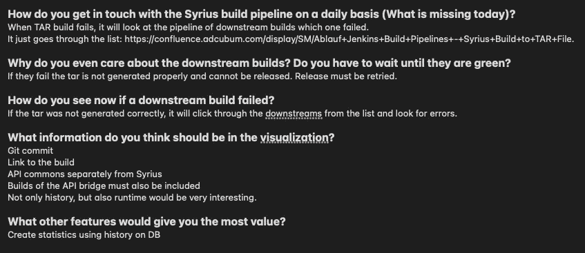

# 如何进行客户访谈

> 原文：<https://medium.com/nerd-for-tech/how-to-approach-customer-interviews-79eb623e0db3?source=collection_archive---------7----------------------->

照片由 [Maranda Vandergriff](https://unsplash.com/@mkvandergriff?utm_source=medium&utm_medium=referral) 在 [Unsplash](https://unsplash.com?utm_source=medium&utm_medium=referral) 上拍摄

这个星期我得到了一个新项目，我应该从头到尾负责这个项目。因为只有一个非常模糊的项目应该是什么样子的描述，我不得不与我们的客户做一些采访。在我的特殊情况下，我们的客户也是开发人员，他们处理业务代码。

我将这篇文章分成三个不同的副主题:

*   准备
*   做采访
*   评估答案

# 准备

首先，面试最重要的是准备。你必须首先确定你想从客户那里了解什么。之后，您可以为它创建开放式问题。

就我而言，我想知道他们对当前的解决方案是否有问题或不便，以及他们是否会从新项目中受益。

这是一个很短的问题，如果我就像现在这样问，答案只会是“是”和“不是”。这是一个糟糕的策略，因为我既不知道他们想在这个新项目中拥有什么功能，也不知道最初是什么导致了这些不便。

为了解决这个问题，我们需要从这个问题中形成开放式问题。开放式问题是指没有指定可能答案的问题。他们应该以这样的话开头:“**为什么”、“怎么样”、“什么”、“描述一下”、“给我讲讲……”**或**“你觉得**……”

在我的例子中，我从基本问题中产生的问题是:

*   **在日常工作中，您如何与当前的解决方案互动？**
*   **根据当前的解决方案，您日常工作中的难点是什么**？
*   **描述**在您看来，新解决方案需要哪些功能。
*   **告诉我关于**这个新的解决方案会如何影响你的工作。

# 做采访

既然你已经准备好了面试问题，我们可以开始面试了。

通常情况下，最好预留一个有足够余量的时间段，这样如果讨论时间比计划的长，你就不必紧张。

当你开始面试时，介绍你自己，以及你想了解的话题。也许受访者认识到他在所要求的领域没有经验，或者在我的情况下甚至不需要旧的解决方案，那么他为什么要使用新的解决方案。

在这些初始步骤之后，你可以开始问你的开放式问题。如果受访者在之前的问题中给了你答案，你不必问所有的问题。问题的顺序没那么重要。

对话应该尽可能自然。如果受访者难以回答问题，你可以用更简单的方式重新表述，或者问一些后续问题，引导他朝着正确的方向前进。

# 评估答案

现在你已经得到了所有的答案，是时候对它们进行评估了。

这些是我在一次采访中记下的笔记:

首先，我根据笔记创建了人物角色，代表我采访的每一组人。

然后，我查看了角色，并为我的项目创建了功能性和非功能性需求。通过这种方式，我确切地知道不同的客户群想要什么，并且我能够对一些需求进行比其他需求稍微重一点的权衡。

# 反射

## 什么进展顺利

在我看来，面试本身进行得相当不错。有时我需要打断受访者，如果他们逐渐消失得太多了。我想我从这次经历中学到了很多，看到问题的措辞如何影响答案是很有趣的。

## 什么需要改进

开始时，我不确定我应该如何完成这项任务。我很难找到合适的人来做采访。在我和我的团队讨论之后，越来越多的名字出现了，我可以在面试中使用它们。下一次，我会直接向我的 PO 询问这类信息，因为他的人脉比我广得多。