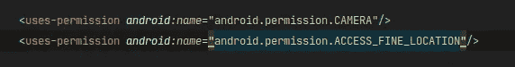
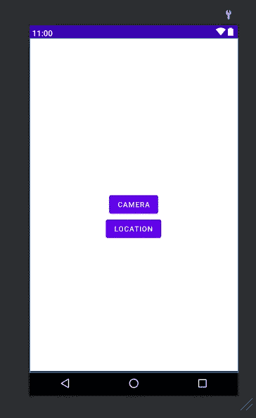

# 如何在 android 中请求权限

> 原文：<https://medium.com/nerd-for-tech/how-to-ask-for-permissions-in-android-f806cc17eebf?source=collection_archive---------11----------------------->

请求权限有一些简单的步骤。我们在本文中讨论它们，我们也在代码中使用 android 最佳实践。如果你对安卓权限一窍不通，就去查查 [](https://errorcrasher.in/things-about-android-permissions/) 上的东西[安卓权限](https://errorcrasher.in/things-about-android-permissions/)的文章。

所以没有任何日常，我们开始编码。

这里我们创建了一个需要相机和位置许可的应用程序。如果你愿意，你可以要求一些小小的改变。

# 步骤 1:向应用程序清单添加权限



*<用途-权限>* 标签用于声明不同的权限。

```
<manifest ...>
    <uses-permission android:name="android.permission.CAMERA"/>
    <uses-permission android:name="android.permission.ACCESS_FINE_LOCATION"/>
    <application ...>
        ...
    </application>
</manifest>
```

# 步骤 2: XML 设计

我把它设计的很简单，如果你想的话，你可以按照你的风格来设计。



```
<**RelativeLayout** xmlns:android="http://schemas.android.com/apk/res/android"
    xmlns:tools="http://schemas.android.com/tools"
    android:layout_width="match_parent"
    android:layout_height="match_parent"
    tools:context=".MainActivity"> <**Button**
        android:**id="@+id/btn_Cam"**
        android:layout_width="wrap_content"
        android:layout_height="wrap_content"
        android:text="@string/camera"
        android:layout_centerInParent="true"/>
    <**Button**
        android:**id="@+id/btn_Loc"**
        android:layout_width="wrap_content"
        android:layout_height="wrap_content"
        android:text="@string/location"
        android:layout_below="@+id/btn_Cam"
        android:layout_centerHorizontal="true"
        />
</**RelativeLayout**>
```

# 步骤 3:在 Kotlin 中请求许可代码

```
**private fun CheckForPermissions(Permission:String,Name:String,RequestCode:Int)**
    {
        if(Build.VERSION.SDK_INT>= Build.VERSION_CODES.M)
        {
            when{
                ContextCompat.checkSelfPermission(applicationContext,Permission)== PackageManager.PERMISSION_GRANTED->{
                    Toast.makeText(applicationContext,"$Name permission is granted",Toast.LENGTH_SHORT).show()
                }
                shouldShowRequestPermissionRationale(Permission) -> showDialog(Permission,Name,RequestCode) else-> ActivityCompat.requestPermissions(this, arrayOf(Permission),RequestCode)
            }
        }
    } **private fun showDialog(permission: String, name: String, requestCode: Int)** {
        val builder = AlertDialog.Builder(this) builder.apply {
            setMessage("Permission to access your $name is required to use this app")
            setTitle("Permission Required")
            setPositiveButton("ok"){dialog,which ->
                ActivityCompat.requestPermissions(this@MainActivity, arrayOf(permission),requestCode)
            }
        }
        val dialog =builder.create()
        dialog.show() }
```

## 代码解释

*   在这里，我们创建了一个名为 **CheckForPermissions** ()的方法，它有 3 个参数

(1) **权限**:即 ***字符串*** ，(2) **名称**:即 ***字符串*** ，(3) **请求码**:即 ***整数*** )

*   现在，我们必须检查设备的版本，它应该比棉花糖更大

```
**if(Build.VERSION.SDK_INT>= Build.VERSION_CODES.M)**{}
```

*   现在，在**中，当**条件出现时，我们检查是否已经授予许可，如果是，则显示授予的祝酒按摩许可

```
**when{ ContextCompat.checkSelfPermission(applicationContext,Permission)== PackageManager.PERMISSION_GRANTED->{
Toast.makeText(applicationContext,"$Name permission is granted",Toast.LENGTH_SHORT).show()
}**
```

*   **shouldshowrequestpermissionrational()—**该方法用于检查用户是否被拒绝权限，该方法只调用一次，在这里您可以显示一个教育用户界面，以便用户可以理解为什么需要该权限。这里我们显示一个对话框让用户了解流程。如果用户再次没有授予权限，那么下次系统便不会显示任何提示

```
**shouldShowRequestPermissionRationale(Permission) -> showDialog(Permission,Name,RequestCode)**
```

*   现在我们只向用户显示接受许可的提示

```
**else-> ActivityCompat.requestPermissions(this, arrayOf(Permission),RequestCode)**
```

*   现在代码的下一部分只是为了创建一个对话框，如果你想做别的事情，你可以试试别的

```
**private fun showDialog(permission: String, name: String, requestCode: Int) {** **}**
```

# 步骤 4:创建 ButtonClick 方法和请求代码变量

这里我们为请求代码创建 2 个变量

```
val **Find_Location_RQ** =101 // Request code Can be anything But
val **Camera_RQ** =102        // Deffrent to each other._______________________________________________________________**private fun  buttonTaps()**
    {
        **btn_Cam.setOnClickListener** {
            *CheckForPermissions*(android.Manifest.permission.CAMERA,"Camera",Camera_RQ)
        }
        **btn_Loc.setOnClickListener** {
            *CheckForPermissions*(android.Manifest.permission.ACCESS_FINE_LOCATION,"Location",Find_Location_RQ)
        }
    }
```

在 **onCreate( )** 方法中调用 **buttonTaps( )** 方法，以便每当有人点击按钮时我们检查权限。

```
override fun **onCreate**(savedInstanceState: Bundle?) {
        super.onCreate(savedInstanceState)
        setContentView(R.layout.activity_main) **buttonTaps()**

    }
```

# 最终输出:-

检查此链接的结果:-

[*https://error crasher . in/WP-content/uploads/2021/05/screen recorder-2021-05-09-13-55-11-1780 . MP4*](https://errorcrasher.in/wp-content/uploads/2021/05/Screenrecorder-2021-05-09-13-55-11-1780.mp4)