# 如何在 Visual Studio 代码中自动格式化 HCL Terraform 代码

> 原文：<https://medium.com/nerd-for-tech/how-to-auto-format-hcl-terraform-code-in-visual-studio-code-6fa0e7afbb5e?source=collection_archive---------0----------------------->

## 不要再使用“terraform fmt”

**在我们开始之前**

> *-你将需要 Visual Studio 代码编辑器。你可以在下面下载。* [*Visual Studio 代码*](https://code.visualstudio.com/)

安装哈希公司 Terraform

📝打开 Visual Studio 代码并导航到扩展。

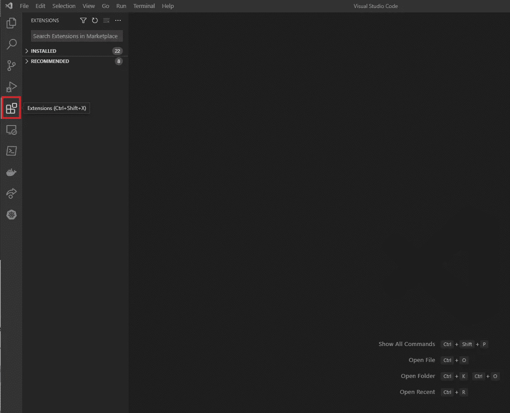

📝在搜索栏中，键入“HashiCorp ”,并在出现时选择 HashiCorp Terraform。

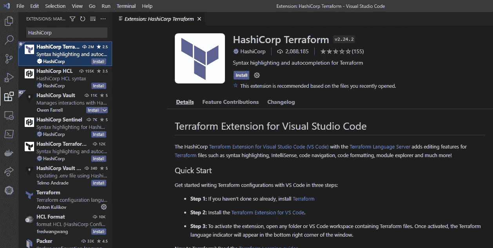

📝单击安装

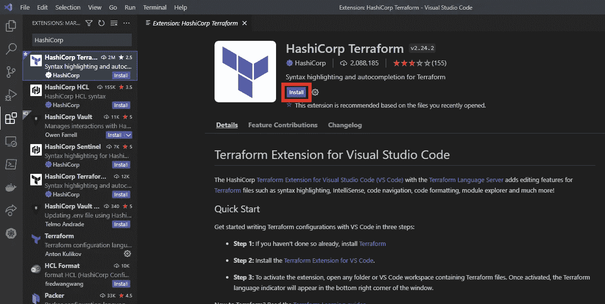

安装完成后，它应该看起来像这样👇🏽

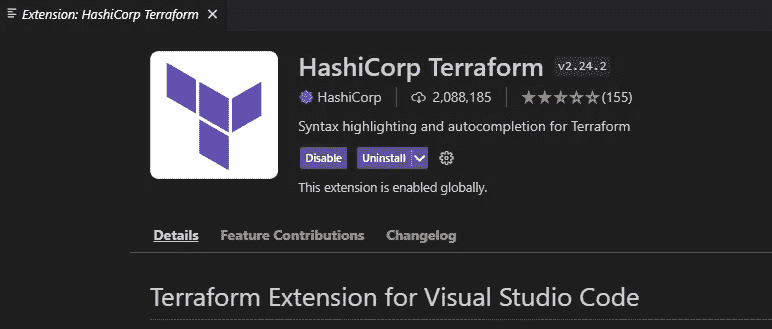

📝导航到文件->首选项->设置

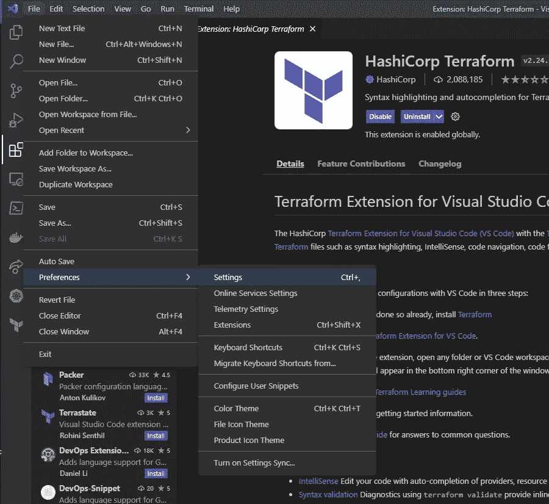

📝在搜索设置中键入“格式”。

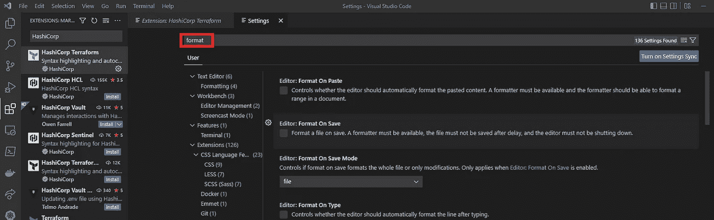

📝单击文本编辑器

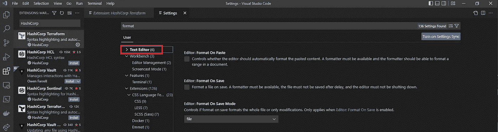

📝保存时启用格式

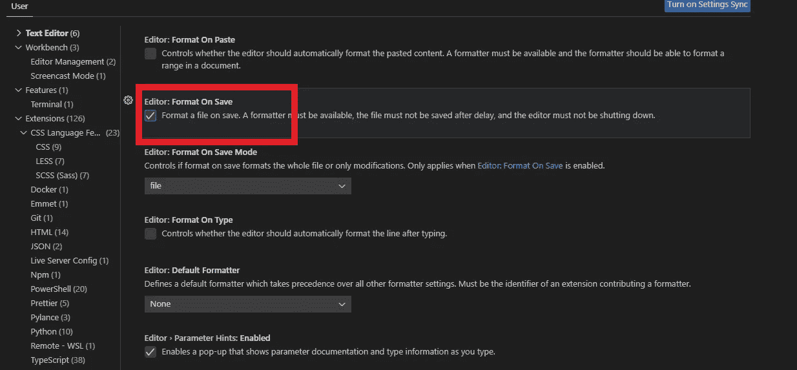

📝在默认格式化程序下选择 HashiCorp Terraform

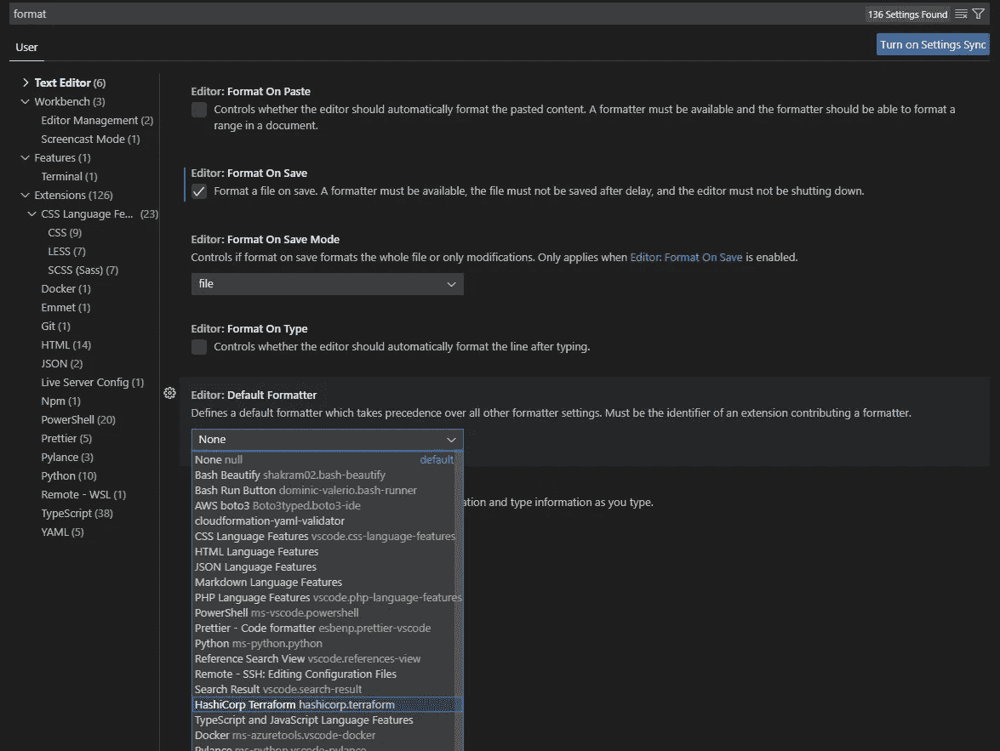

📝关闭设置和扩展窗口，然后单击资源管理器

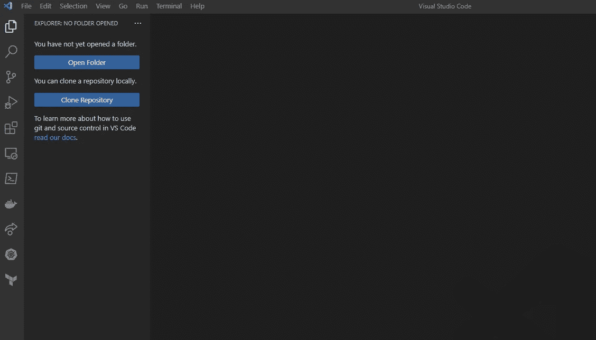

**确认自动格式化工作。**

> 如果你已经有了你的 Terraform 代码，那么导入它，做一个小的改变，然后撤销它，然后点击保存，看看这个魔术。每当您保存更改时，自动套用格式将起作用。

> 请允许我演示一下

📝单击打开文件夹，然后选择一个空文件夹。(创建一个用于测试目的。)

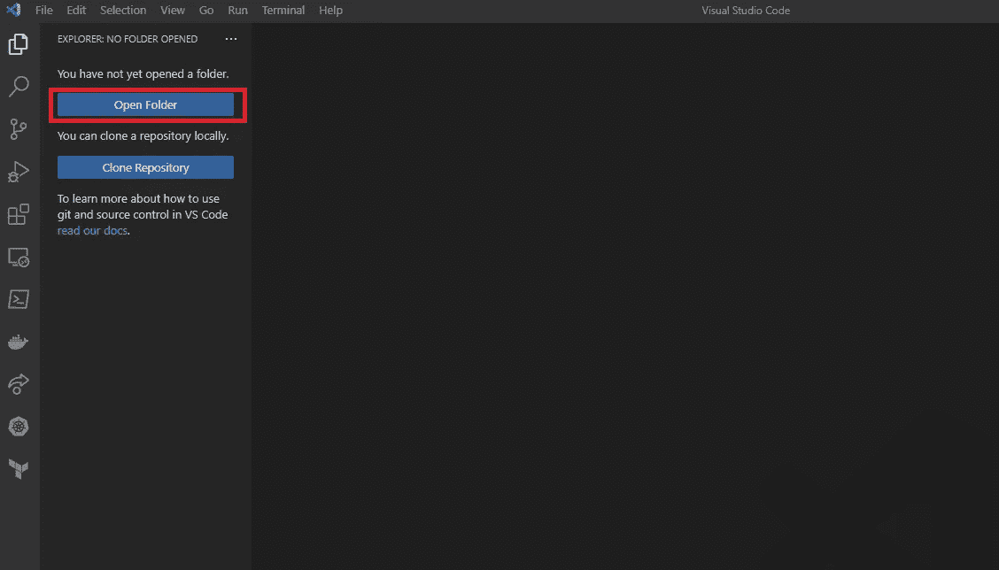

如果提示您信任文件夹中文件的作者，请单击“是”。

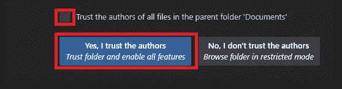

📝通过右键单击“资源管理器”面板并选择“新建文件”来创建新文件

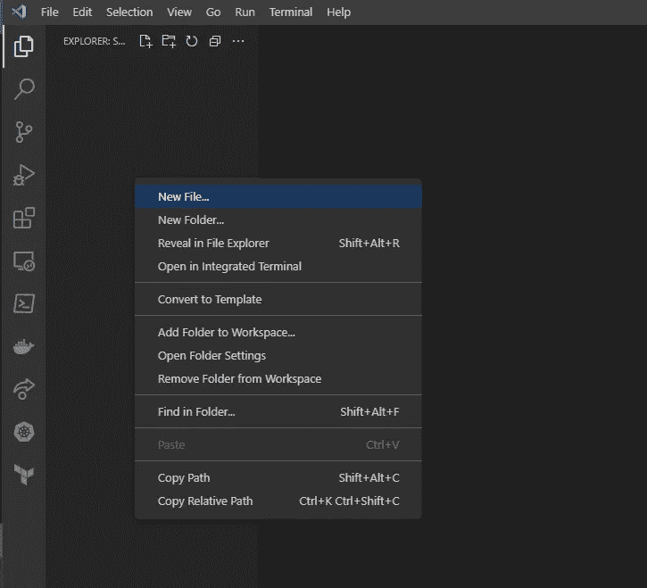

📝键入以结尾的名称。法国南部（French Southern Territories 的缩写）

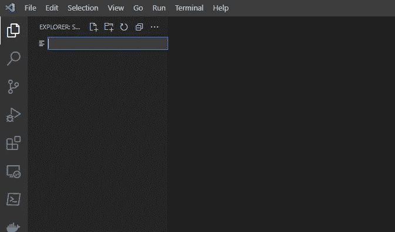

Sample.tf

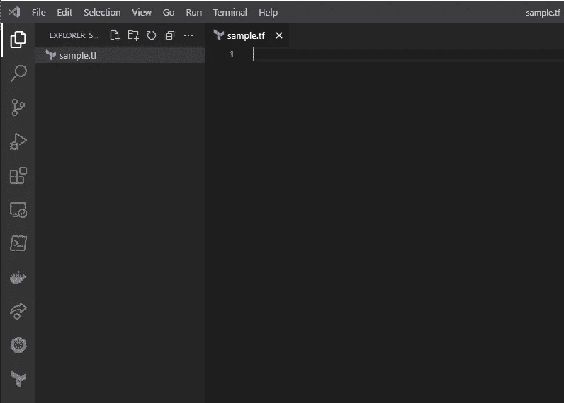

> 请注意，文件现在有了 terraform 徽标，这表明扩展到目前为止工作正常。

📝将以下示例代码复制并粘贴到您的可视代码中。

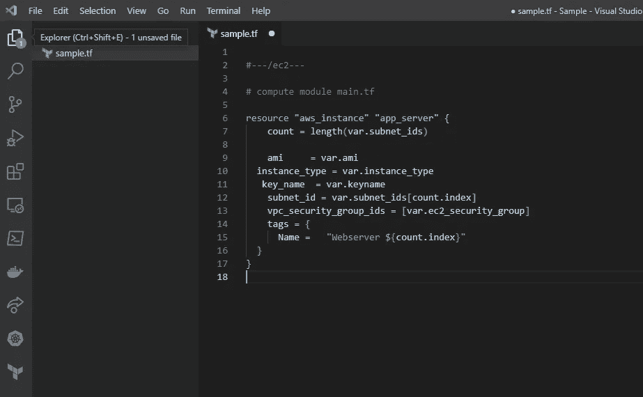

> 粘贴这段代码被认为是对文件的更改，所以当我单击 Save…

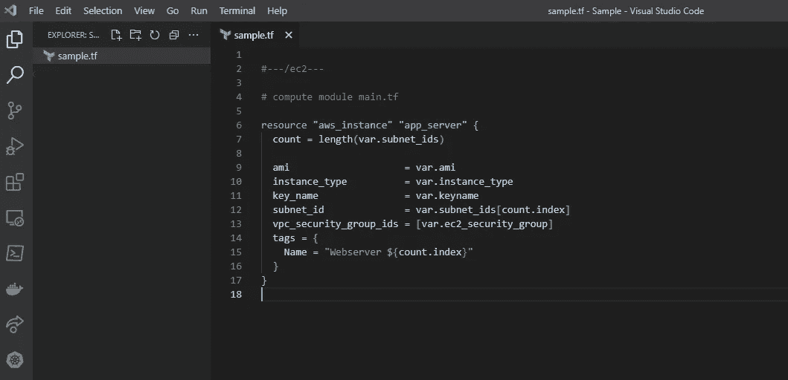

漂亮的 Terraform 代码！！😍😍不需要 fmt