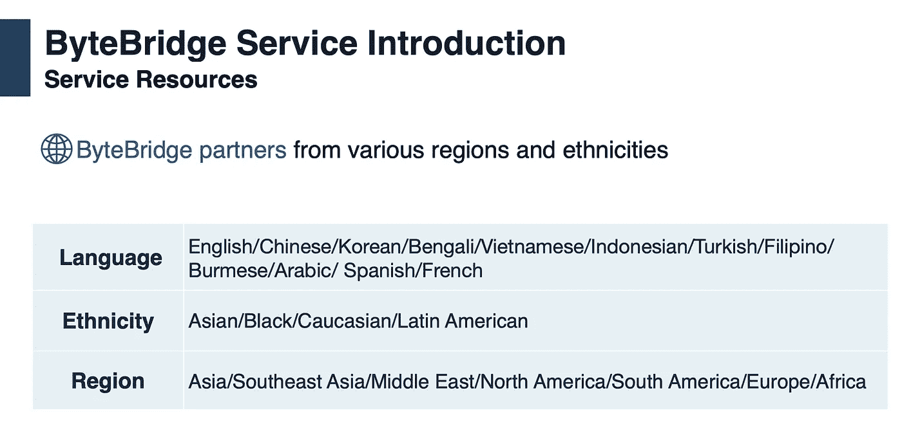

# 如何避免 AI 开发中的数据偏差？

> 原文：<https://medium.com/nerd-for-tech/how-to-avoid-the-data-bias-in-ai-development-9808e5dea9da?source=collection_archive---------8----------------------->

[https://www.thomas.co/resources/type/hr-blog](https://www.thomas.co/resources/type/hr-blog/how-remove-unconscious-bias-your-recruitment-process)

有偏差的数据会导致有偏差的结果，这是 AI 发展的简单事实。然而，所有方法都可能无意中在 AI 模型中引入偏差，情况变得复杂得多。例如，客户正在构建一个语音识别模型，可能用于汽车。声音本身有不同的声调、口音、填充词、语法(更不用说不同的语言和方言)。假设语音识别模型适用于不同人口统计和背景的驾驶员，则客户需要不同的数据来代表每种情况。

许多人工智能公司已经愿意购买数据集。他们开发了早期的引擎，希望能在短时间内以低成本快速进入市场。数据集的缺点是它已经可用，不能轻易更改。**因此，它并不是专门为某个特定场景**而优化的。

在开发自然语言理解引擎或语音识别的早期阶段，使用现有数据集是一种完美的方式。后期针对特殊场景进行修改时，需要补充定制数据。例如，如果客户收集的大部分数据是男性声音，语音识别模型往往很难识别女性声音。

市场上主流的基于语音的产品都有这个问题，因为算法模型在训练阶段没有得到足够的数据类型。因此，该公司面临的挑战是如何组织一个完整的数据集来涵盖所有情况，包括边缘情况。

## **韩国双人对话语音采集案例研究**

**客户需求**:数百小时的韩语语音对话数据采集

**项目介绍**:围绕给定主题的两人互动对话(A:主题相关机构客服，B:客户)。

**内容:**客户对话聊天

**时长:**每次对话 15 分钟

**采集者年龄要求:**18-60 岁

**录音要求:**在安静的环境下录音，保证清晰的通话录音

在数据收集方面，字节桥拥有丰富的海外资源，覆盖亚洲、东南亚、中东、北美、南美、欧洲、非洲等地区。在短时间内，我们可以根据要求找到数千名收集人员。

根据要求，我们聚集了一定数量的韩国参与者进行电话录音，记录了包括航空、农业、送货服务、金融、银行、健康等多个话题。，并按要求完成记录。

## NLP 服务

我们在电子商务、零售、搜索引擎、社交媒体等领域提供不同类型的自然语言处理。我们的服务包括语音分类、情感分析、文本识别和文本分类(聊天机器人相关性)。

ByteBridge 与全球 30 多个不同的语言社区合作，现在提供[数据收集和文本注释服务](https://tinyurl.com/2p88dwye)，涵盖语言包括**英语、中文、西班牙语、韩语、孟加拉语、越南语、印度尼西亚语、土耳其语、阿拉伯语、俄语等**。

# 结束

将您的数据标注任务外包给[字节桥](https://tinyurl.com/2p88dwye)，您可以更便宜、更快速地获得高质量的 ML 训练数据集！

*   无需信用卡的免费试用:您可以快速获得样品结果，检查输出，并直接向我们的项目经理反馈。
*   100%人工验证
*   透明和标准定价:[有明确的定价](https://www.bytebridge.io/#/?module=price)(包含人工成本)

为什么不试一试呢？