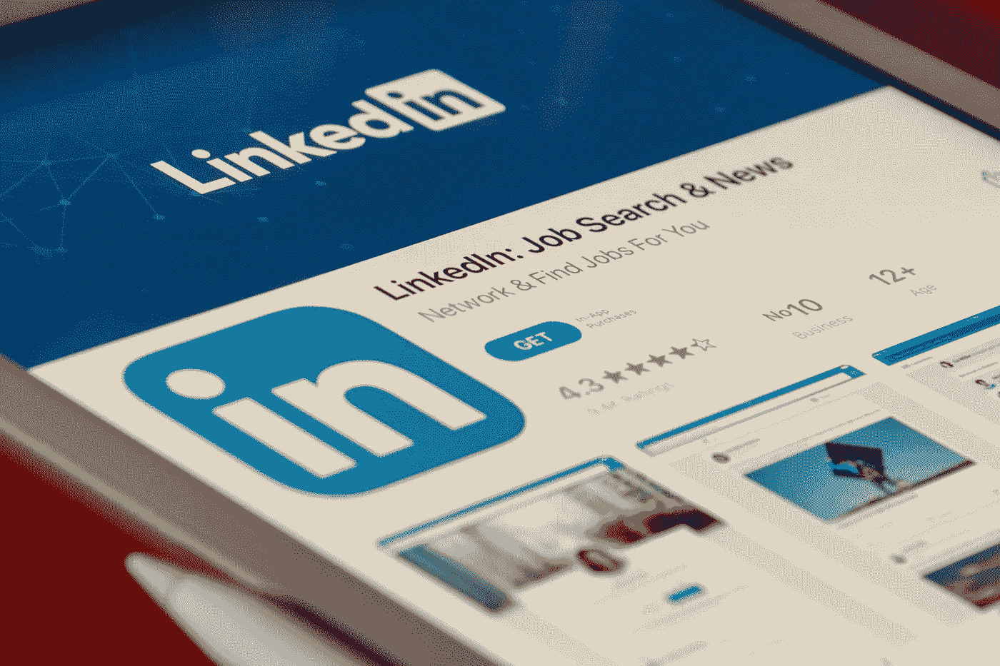

# 如何成为一名数据科学家

> 原文：<https://medium.com/nerd-for-tech/how-to-become-a-data-scientist-905c0430f7dc?source=collection_archive---------0----------------------->

## 成为数据科学家的路线图

网站电子表格背景

就业市场很艰难。你正在寻找一个新的机会，但是知道从哪里开始会很有挑战性。有很多选择，你需要确保你在正确的时间进入了正确的领域。在本文中，我将教你成为当今世界的数据科学家所需要知道的一切，以及如何最好地开始你的旅程！我们将讨论数据科学家拥有哪些技能等话题。他们使用什么技术？他们是如何管理时间的？更重要的是，你如何成为一名数据科学家？

**什么是数据科学？**

数据科学是统计分析、机器学习和其他数据分析方法的应用，用于理解、预测和改进业务绩效、产品和服务。

数据科学不仅仅是从不同来源收集数据。它涉及应用科学方法解决业务问题，使用数据进行预测并采取行动，为客户或企业带来更好的结果。数据科学家还致力于构建可供其组织中的其他人使用的模型，如希望根据手头最佳可用信息做出决策的经理。

**数据科学家需要什么技能？**

*   编程技能:数据科学家需要能够使用不同的编程语言和工具，包括 Python、R 和 SAS。
*   统计学:你需要统计学概念的知识，如概率分布、回归分析、假设检验和随机变量。
*   数据可视化:这对于向可能不理解统计学或编程语言语法的非技术同事或客户传达您的发现非常重要。您应该能够使用 Tableau 软件或 Matplotlib (Python)、D3 (JavaScript)和 ggplot2 (R)等工具创建引人注目的数据可视化。
*   沟通:对于数据科学专业人员来说，拥有出色的沟通技巧，在与客户或该领域不同专业水平的同事开会时清楚地解释他们的发现也是至关重要的。

**我如何免费成为一名数据科学家？**

如果您想以学习数据科学为职业，或者只是想开始学习并了解事物是如何工作的，许多资源都是免费的。以下是一些建议:

*   使用在线教程和课程:今天在互联网上学习数据科学有许多不同的选择，从个别课程，如 [Coursera 的数据科学专业](https://www.coursera.org/specializations/jhu-data-science) ( [Coursera](https://www.coursera.org/) 是一个教育平台，提供各种学科的课程，包括机器学习)到 MOOCs(大规模开放在线课程)，这些课程通常提供免费访问，但有时对完成证书收费。你可以在 YouTube 视频上找到很多有用的信息，比如这个[学习数据科学教程——由](https://www.youtube.com/watch?v=ua-CiDNNj30) [Freecodecamp](https://www.freecodecamp.org/) 提供的初学者完整课程。以及像维基百科这样的其他学习平台。

桌面上的在线社区

*   加入在线社区和论坛:人们讨论数据科学话题，如该领域从业者使用的编程语言和框架(如 Python)。虽然这些社区不一定是专门为初学者准备的，但它们可能有一些资源，如专家撰写的文章，这些文章可以帮助指导你的学习过程，同时引导你朝着具体的目标前进——并非所有分享知识的人都是出于利他主义；许多人这样做是因为他们相信帮助别人会让他们自己走向更大的成功！

下面是几个在线社区的快速列表，可以帮助您开始学习:

1.  [卡格尔](https://www.kaggle.com/)

Kaggle 是一个由 300 多万数据科学家、机器学习工程师和其他专业人士组成的社区，他们共享数据集，创建协作项目，并参加竞赛以解决数据科学挑战。

2. [Reddit](https://www.reddit.com/)

Reddit 是一个几乎可以阅读任何主题的一站式平台——有超过 4.3 亿活跃用户和 120 万个社区或子社区。每个数据科学家都应该加入的一些顶级子主题是[r/数据科学](https://www.reddit.com/r/datascience/)、[r/数据有益](https://www.reddit.com/r/dataisbeautiful/)和[r/机器学习](https://www.reddit.com/r/MachineLearning/)。

3. [IBM 数据科学社区](https://community.ibm.com/community/user/datascience/home)

IBM 数据科学社区提供了源源不断的最新内容，包括用于讨论和协作的特色博客和论坛。该社区提供对最新白皮书、网络广播、演示和研究的访问，所有这些都是由全球数据科学家创建的。

4.[数据科学学会](https://www.datasciencesociety.net/)

数据科学协会是全球数字数据爱好者的社区。我们喜欢分享我们的知识、经验和对所有数据事物的见解。我们的目标是帮助人们在数据科学行业建立成功的职业生涯。因此，我们创建了一个由志同道合的专业人士组成的国际网络，他们分享我们对数据和数字见解的热情。

5.[数据探索](https://www.dataquest.io/)

Dataquest 有一个由数据科学学生组成的社区，他们帮助他人解决问题。训练有素的主持人和其他学习者总是在场回答问题或提供建议。如果您在某项任务中遇到困难、遇到平台问题、需要建议或希望获得项目反馈，社区是您的首选资源。

**从何说起？**

MOOC 是一个大规模的开放式在线课程，这是一个学习平台，允许你在不攻读完整学位的情况下获得一些数据科学方面的经验。这也是找到导师和社区来帮助你了解这个领域的最好地方。

打开代码文件的笔记本电脑

你必须对 Python 或 R 之类的编程语言有所了解，但不要担心——许多 MOOCs 是专门为没有正式计算机科学学位的人设计的。如果你已经知道如何编程，并且想要比在线课程更高级的东西，也有很多在线社区，专家们可以在那里见面并相互分享他们的专业知识。

一旦你准备好了你在数据科学领域的第一份工作，现在会有很多机会，部分原因是像谷歌这样的大科技公司仅今年就招聘了数千名员工！所以去吧:趁其他人还没跟上，趁现在还有时间，今天就开始寻找吧！

**我需要学习哪些技术？**

要成为一名数据科学家，你需要学习多种编程语言和软件工具。其中包括:

*   计算机编程语言
*   稀有
*   结构化查询语言
*   Hadoop (Hadoop 是一个编程平台，允许数据科学家分析大量非结构化数据。)

此外，你需要了解以下技术:机器学习、自然语言处理(NLP)、人工智能(AI)和数据挖掘。如果你有兴趣更深入地了解这些概念，请查看 Udacity 的机器学习纳米学位项目。

**管理你的时间**

作为一名数据科学家，您每天都要处理和分析大型数据集。这需要你有条理，有效率，充分利用时间。

管理好你的时间是很重要的，这样你就可以完成待办事项清单上的所有事情，而不会感到不知所措或压力过大。以下是一些有效管理时间的建议:

*   根据重要性(和紧急程度)对任务进行优先排序。一定要把更多的时间花在重要和紧急的任务上，而不是花在不重要但不紧急的任务上。
*   如果可能的话，留出连续的工作时间；这将让你在处理大项目或多步骤流程时更加专注，如构建原型、运行模拟等。，这通常需要不间断的关注才能成功完成。

沙漏

*   别忘了睡觉！作为一名数据科学家，保持健康和高效是至关重要的——但如果有一天由于最后期限的临近而无法入睡，也不必太担心；只是尽量不要让这些成为习惯！

**作为一名数据科学家，我如何构建投资组合？**

大多数数据科学家是因为他们的技能而被聘用的，而不是他们的经验。这意味着，你可能会与那些已经作为数据科学家工作了两三年的人竞争，并且有一个投资组合来证明这一点。你能做些什么来使自己与其他候选人区分开来？

*   创建自己的项目，使用机器学习解决问题。你不需要雇主给你工作；网上有很多机会，让任何人都可以组织一个项目并展示他们的能力(查看我们的列表，在那里你可以找到合适的挑战)。
*   在您的投资组合网站上包括代码样本、演示文稿或仪表板截图。如果这些例子展示了对特定工具的熟悉，比如像 scikit-learn 或 TensorFlow 这样的 Python 库，这也是有帮助的；这将有助于展示技术知识和面试能力！

**寻找数据科学家的第一份工作**

现在你已经获得了一些数据科学技能和经验，是时候通过找一份数据科学家的工作来使用它们了。我们将看看您需要采取哪些步骤来找到您作为数据科学家的第一份工作。

首先:如果你还没有这样做，确保你有一个在线的存在。这意味着在 LinkedIn 和 Twitter 上创建账户，通过适当的 SEO 建立自己的网站，并将其托管在 [GitHub](https://github.com/) 或 [Bitbucket](https://bitbucket.org/) (首选 GitHub)，甚至只是在 [Stack Overflow](https://stackoverflow.com/) 上创建一个账户。这将是你在数据科学家群体中变得更加引人注目的第一步。

接下来，你应该开始找工作了！有几个很好的网站可以让你找到寻找新人才的公司发布的工作，比如 [Indeed](https://www.indeed.com/) 、 [Glassdoor](https://www.glassdoor.com/index.htm) 和 [LinkedIn Jobs](https://www.linkedin.com/jobs/) 。当你申请这些工作时，确保你的简历和求职信是专门为每个招聘职位量身定做的；否则，他们就不会从那些懒得定制申请的申请者中脱颖而出。

Linkedin 求职

最后，不要忘记建立关系网！获得聘用的最佳方式是，当有人认识其他需要新员工的人，然后他们会传递你的信息，因为他们对你评价很高。如果这发生在你申请工作之前呢？那就更好了！

**数据科学家需求量很大，可以在任何地方工作。**

*   数据科学家需求量很大。正如我们所看到的，数据科学家的职位数量正在增加，而且这种增长有望继续。
*   数据科学家可以在任何地方工作。这种灵活性非常适合那些想要远程工作或经常出差的人。
*   数据科学家可以按照自己的时间表工作，并选择他们想要从事的项目，所以如果你不是喜欢每天在办公室工作的人，并且你不太关心你正在做的项目，只要它有趣，这可能是一个很适合你的项目！

**结论**

对于热爱数学和技术的人来说，数据科学是一条很好的职业道路。这也是在家工作赚钱的好方法。无论您是刚刚开始您的旅程，还是已经从事数据科学多年，我们希望这篇文章能够让您了解成为一名数据科学家需要什么！

如果你想了解更多关于成为一名数据科学家到底需要什么的信息，可以看看我们关于在科技行业起步的类似技能的其他博客帖子。如果你最终像我们一样热爱这个职业呢？我们可以帮忙！请立即联系我们，让我们知道如何支持您在 support@prajix.com 的目标:)

**什么是 Prajix？**

对你来说，掌握编码世界的最好方法是把这个世界放在你的指尖。我们的使命是让世界各地的开发者通过在线协作来彻底改变我们希望拥有的未来。

我们允许开发人员在我们的平台上创建或加入项目想法，他们可以在我们的协作室中找到志同道合的个人进行团队合作。

我们正努力将全世界最有价值的程序员、编码员和开发人员的网络集中到一个地方，创建一个技术发电站，帮助全球的个人和社区。

如果你对此感兴趣或者你想了解更多，请访问我们的网站:【https://www.prajix.com