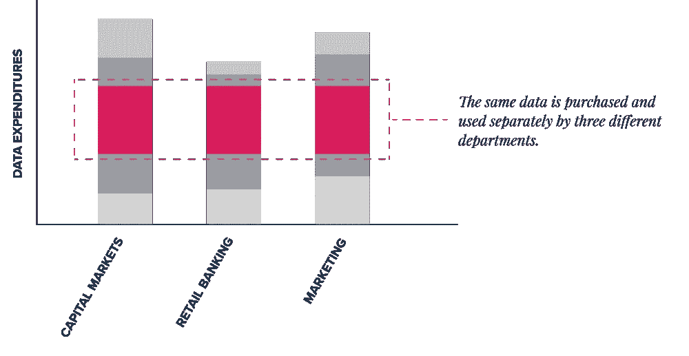
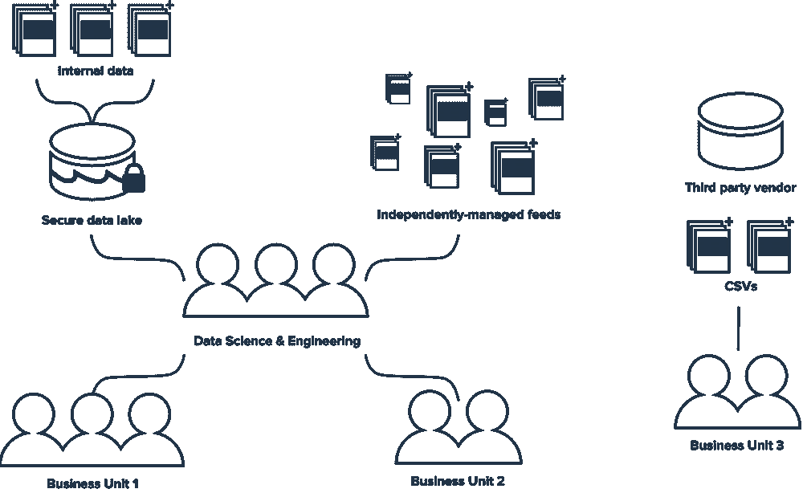

# 如何构建数据策略—第 1 部分:数据审计

> 原文：<https://medium.com/nerd-for-tech/how-to-build-a-data-strategy-part-1-the-data-audit-b81197e06ba9?source=collection_archive---------3----------------------->

> 这是 how to 系列的第一部分，该系列共分四部分，深入探讨了如何为您的组织开发端到端的数据策略，以解决数据生命周期每个阶段的数据问题。

数据作为“秘密武器”的问题在于它是保密的，即使是在同一个组织的团队之间。它存储在不同的地方，由不同的人管理，在很大程度上，没有“处理数据”的标准方法，无论是通过访问、转换还是共享。

对于许多公司来说，数据生态系统跨越数百个独立、孤立的单元，甚至难以想象单一的真实来源。如果对您使用的数据和使用方式没有清晰的了解，就不可能知道您的数据操作会更加有效和高效。

第一步必须是建立基准—组织需要对其数据资产和流程进行审核。

## 首先，什么是数据审计？

数据审计将使公司能够更好地了解他们在所有团队和部门中使用的数据，以及这些数据的使用情况，并获得组织数据生态系统的单一视图。

成功的公司像管理图书馆一样管理他们的数据资产，而不是每个业务单位(类型)都是独立的，需要有一种标准的方法来组织数据(书籍),以便:

1.  没有相同/略有不同的事物的多个副本；
2.  没有多余的购买；
3.  整个组织有一个通用的访问标准；
4.  有一种方法可以评估组织使用和需要的所有东西；和
5.  有一条清晰的发展道路。

一旦您了解了您所拥有的内部和外部数据资产，将它们与您的数据和业务战略中的预期结果保持一致(以及 [**是的，两者是关联的**](https://blog.thinkdataworks.com/adapt-or-die-why-your-business-strategy-is-failing-your-data-strategy) )将成为一个更可衡量和更有效的过程。

## 如何进行数据审计

[这个前瞻性过程的一个关键部分是评估你当前的状态。](https://www.forbes.com/sites/bernardmarr/2019/03/13/why-every-company-needs-a-data-strategy-for-2019/)

这种数据审计将使您能够了解您的基线，以便您可以实现可扩展的数字化转型。

**1。数据:你在用什么，缺什么？** 了解您的组织正在消耗哪些数据可能是一项挑战，因为数据存在于任何地方，并且每个团队的工作方式可能略有不同。在没有意识到的情况下，许多组织为相同的数据支付了多次费用，因为这些数据被没有共同目标的不同业务部门使用。这种情况比您想象的更常见，如果没有集中的计划，您可能会在一个组织中发现来自同一个供应商的多个许可证实例。发现这些重叠是通过简化采购节省成本和提高效率的重要机会。

了解您拥有哪些数据的另一面是揭示生态系统中的缺口，您可能会系统地遗漏重要类型的数据。目光短浅是很常见的——不可能看到和使用所有的数据，但是有办法看到你当前的策略哪里不足，哪里有最大的改进机会。

除了发现新数据，从更多来源提取数据还可以通过增加样本量来强化您的解决方案。如果数据只来自一个来源，会有引入偏见的巨大风险，但是通过使来源多样化，您的组织可以从更广泛的范围中受益。

**2。工具:你如何看待你的数据生态系统？** 您的组织可能已经通过与不同供应商的关系获得了(不止)一些工具和平台来对您的数据进行分类。但是，由于它们都是相互独立的，所以它们不会给你一个单一的视图，让你可以评估组织使用和需要的一切。

统一的中央数据访问点是构建可随数据增长而扩展的新组织系统的关键组成部分。评估和整合您的工具的价值有着实实在在的投资回报。

正如 [**麦肯锡强调的**](https://www.mckinsey.com/~/media/McKinsey/Industries/Electric%20Power%20and%20Natural%20Gas/Our%20Insights/Building%20a%20great%20data%20platform/Building-a-great-data-platform-final.pdf) ，“一个平台充当所有数据的中央存储库，将它们提炼为单一的真实来源，并支持将数据转化为商业价值的复杂数字和高级分析程序的扩展”(图表)。

**3。度量:您如何管理数据治理？** [**Safegraph 注释**](https://www.safegraph.com/blog/data-as-a-service-bible-everything-you-wanted-to-know-about-running-daas-companies) ，“随着公司越来越依赖数据，真相将变得更加重要。如果你在用数据对未来进行预测，那么代表过去的数据需要高度准确。”在您大致了解了您的组织有什么数据和没有什么数据之后，您需要确定如何衡量您正在使用的数据的质量。

您的组织如何评估数据？ [**数据质量**](https://www.dataversity.net/what-is-data-quality/) 数据集的完整程度、新鲜度、唯一性、有效性以及**来源等因素。无论您采用何种指标和方法，关键是在整个组织中采用一致的方法，清晰地概述您获得的数据如何帮助您实现业务目标。定期评估您的数据有助于更好地降低风险、节约成本，并获得清晰、现实的 KPI。**

****4。人物:你是如何管理你最有价值的资产的？** 记住你的数据和数据工程过程背后都有人类。创造力和组织技能对于将数据从静态资产转化为推动关键业务决策的分析和见解至关重要。**

**了解整个组织中处理数据的所有参与者以及他们的部署方式，将有助于您深入了解数据策略的可扩展性。将新数据引入您的组织需要什么？一旦开始，谁负责管理它？**

****

**如果这看起来很熟悉，不要难过——你并不孤单。调查查找和使用数据的工作，了解如何帮助您的数据科学部门提高工作效率。**

**将人员引入审计流程将有助于您了解整个组织中与数据打交道的所有人员，以及他们在支持成功的数据策略中的角色。**

## **那么，数据审计对你有什么帮助呢？**

*   ****了解成本** —供应商提供的数据集的价格标签并不能准确代表数据的最终成本。彻底的数据审计揭示了将数据引入您的生态系统花费了多少时间、精力和金钱。**
*   ****差距和重叠** —通过对您获得的所有数据的清晰概述，您将能够更好地发现数据采购和数据科学工作中的冗余，以及您的数据获取策略中的盲点。在现有数据上花费更少意味着可以重新分配预算，将更多数据投入到更强大的解决方案中。**
*   ****正式化审计流程** —这种审计不应该是一次性的，找到审计流程中的痛点与任何其他结果一样有价值。了解了解组织的外部数据价值需要什么，并了解如何改进这一过程，对您的整体数据战略大有裨益。**

**查看您的数据资产及其使用情况是将您的数据转变为企业战略支柱的关键第一步。对下一步有兴趣吗？请继续关注本系列的第二部分，我们将深入探讨如何降低效率并整合整个组织的记录。**

**想了解有关协调业务和数据战略的更多信息吗？**

**[**请求咨询我们的数据专家**](https://meetings.hubspot.com/eugene?__hstc=82057097.c44170329b0f6a24ca43003f609ef893.1609787358702.1615304959659.1615315779227.131&__hssc=82057097.25.1615315779227&__hsfp=2940426566) 或 [**浏览**](https://marketplace.namara.io/?__hstc=82057097.c44170329b0f6a24ca43003f609ef893.1609787358702.1615304959659.1615315779227.131&__hssc=82057097.25.1615315779227&__hsfp=2940426566) 解决方案就绪数据的最大目录，以确定 [**ThinkData 的技术**](https://www.thinkdataworks.com/products/namara) 如何推进您的项目。**

***原载于***。****