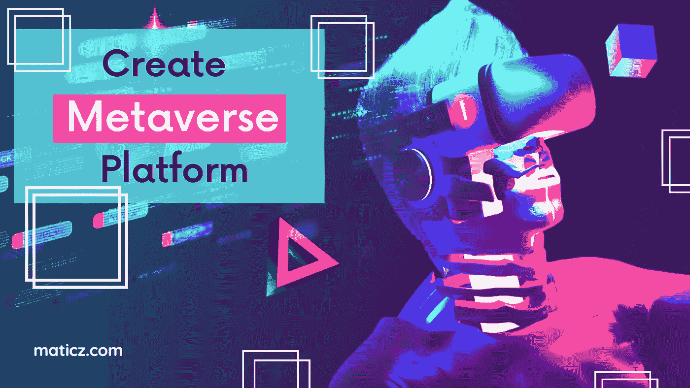

# 如何从零开始建立一个元宇宙？—出和出导轨

> 原文：<https://medium.com/nerd-for-tech/how-to-build-a-metaverse-from-scratch-the-out-and-out-guide-967f230a241d?source=collection_archive---------2----------------------->

如何创建元宇宙

一个元宇宙术语在虚拟空间中被高度提升。此后，脸书首席执行官马克·扎克伯格将公司更名为 META 脸书。企业家正在推动元宇宙技术向前发展。

你想了解这些虚拟技术吗？

如果有，继续看这篇文章！

让我们朝着如何发展你自己的元宇宙前进

简单地说，元宇宙是增强现实和虚拟现实技术与三维全息未来学的结合。

# 元宇宙商业的好处

各种垂直行业和现代技术的不变虚拟世界体验的承诺，肯定会给你的元宇宙网站带来更好的质量和重要的利益。

1.通过在虚拟世界中体验真实生活来重塑任何类型的业务。

2.大幅放大企业修饰

3.为您的用户提供更好的体验和交互

4.区块链——让您的元宇宙业务获得双倍动力。

5.元宇宙是游戏行业的平台，在虚拟世界中提供最佳的用户体验。

元宇宙商业的更多优势。踏入百万美元的虚拟世界技术相关业务，然后统治虚拟世界。为您的用户提供引人入胜的互动。因此，通过推出自己的元宇宙平台，成为百万美元商业磁石之一。

那么，让我们更深入地了解一下*如何从零开始打造元宇宙*

# [如何创造元宇宙？](https://bit.ly/3GLa8p1)

步骤 1:确定元宇宙的相关用例

第二步:设计你的元宇宙平台的用户界面和用户体验(UI/UX)。

步骤 3:为智能合约开发代码

步骤 4:将 IPFS 连接到元宇宙平台

第五步:建立元宇宙数据库

第六步:确保核心的 AI 和 VR 能力是安全的。

步骤 7:元宇宙平台部署

步骤 8:通过连接到客户端的服务器，使测试版可用。

第九步:启动你的元宇宙，让它 24/ 7 可用

Web3 时代看起来就像一些冒险者喜欢创造一个元宇宙世界，抓住新的机会和创造力，为创业公司和企业级公司开拓市场。你为什么在等？创建自己的 Metvaerse 网站