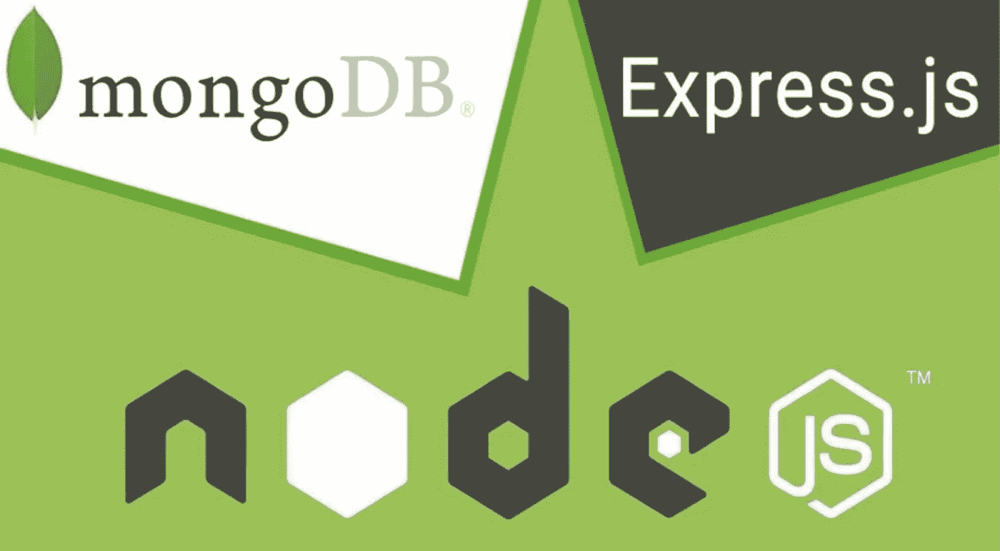
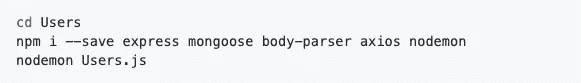
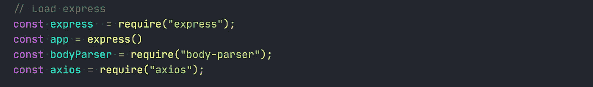
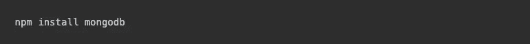
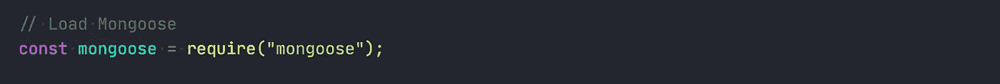
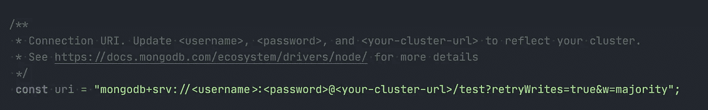
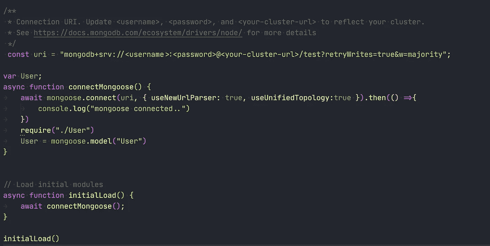
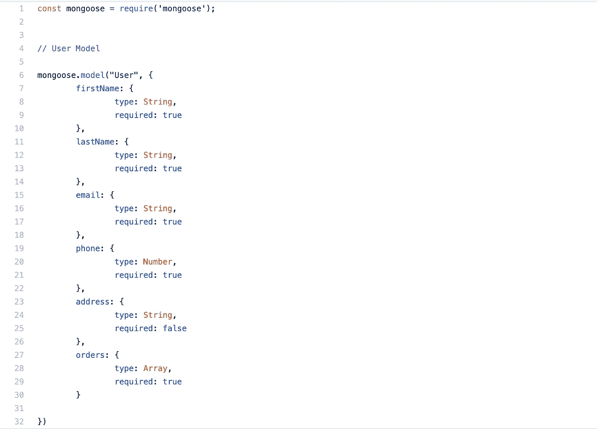
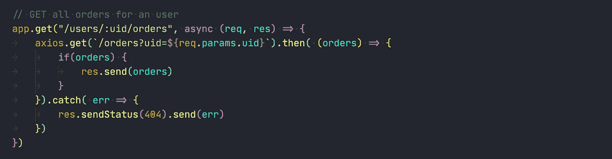
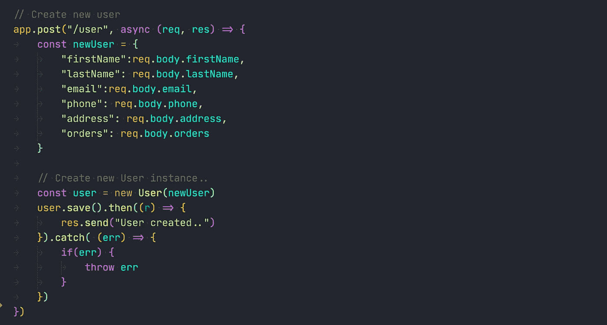

# 如何用 NodeJs，Express，MongoDB 搭建一个微服务

> 原文：<https://medium.com/nerd-for-tech/how-to-build-a-microservice-with-nodejs-express-and-mongodb-73737b6fa868?source=collection_archive---------1----------------------->

我们大多数人都经历过这样的困难时期，你有一个大规模的应用程序，它有一堆特性、API 集成、数据库连接等等。新的特性和更新发布了，当然你需要修复错误和维护代码。

构建这个真实世界的应用程序需要动态编程，应用程序的规模会不受控制地增长。

这种整体模式很难缩小或简化应用程序。因此，为了流畅地运行应用程序，有必要将庞大的同构结构转换成小而独立的程序。当 NodeJs 应用程序构建在**微服务上时，类似的复杂性可以毫不费力地解决，**node . js 生态系统更是如此。

因此，我将向您展示如何构建微服务…

> 这个博客只是对如何构建服务的一个概述，请访问 https://github.com/Nomercy10/ecommerce-micro-services获得一个全功能的工作微服务演示。

在我们的示例中，我们将构建两个微服务， ***用户&订单。*** 想法很简单，用户下单。我们用所有需要的细节创建订单，等等。

以下是这些微服务将具备的功能列表

## 用户

*   获取所有用户
*   获取用户
*   创建新用户
*   按用户标识删除用户

## 命令

*   获取所有订单
*   获得订单
*   为用户获取订单
*   为用户创建新订单
*   取消订单
*   为用户删除订单

# 技术

*   [Node.js](https://nodejs.org/) :后端的事件化 I/O
*   [Express](http://expressjs.com/) : Fast node.js 网络 app 框架
*   MongoDb:一个面向现代应用的 NoSql 数据库

在构建这些微服务时，我们将为每个微服务创建单独的文件夹。每个文件夹都将安装自己的 package.json 和节点模块。

让我们开始吧…

# 装置

创建`Users`文件夹并安装以下依赖项

用户安装的依赖项

关于依赖关系的信息

*   ***body-parser****:**它是一个 Node.js 体解析中间件，在你的处理程序之前在中间件中解析传入的请求体，在* `req.body` *属性下可用。*
*   ***axios*** *:一个基于 promise 的 HTTP 客户端，用于浏览器和节点 Js。*
*   ***nodemon*** *:一个用于 Node Js 开发的工具，因为它提供了对任何文件更改的热重装。*
*   ***mongose****:一个 MongoDB 对象建模工具，设计用于在异步环境中工作。*

# 发展

在`/Users`文件夹中创建`Users.js`，这个文件将是我们进入用户微服务的入口点。

加载依赖项

加载依赖项

# 安装 MongoDB Node.js 驱动程序

MongoDB Node.js 驱动程序允许您在 Node.js 应用程序中轻松地与 MongoDB 数据库进行交互。为了连接到数据库并执行本快速入门系列中描述的查询，您将需要该驱动程序。

如果没有安装 MongoDB Node.js 驱动程序，可以用下面的命令安装。

# 创建一个免费的 MongoDB Atlas 集群并加载样本数据

接下来，您需要一个 MongoDB 数据库。开始使用 MongoDB 最简单的方法是使用 Atlas，它是 MongoDB 的完全托管的数据库即服务。

[转到 Atlas](https://www.mongodb.com/cloud/atlas) 并在空闲层创建一个新集群。概括地说，集群是一组存储数据库副本的节点。一旦创建了您的层，[加载示例数据](https://docs.atlas.mongodb.com/sample-data/)。

# 获取集群的连接信息

最后一步是为集群连接做准备。

在[图集](https://www.mongodb.com/cloud/atlas)中，导航到您的集群，点击**连接**。将出现群集连接向导。

向导会提示您将当前 IP 地址添加到 IP 访问列表中，并创建一个 MongoDB 用户(如果您还没有这样做的话)。请务必记下您为新 MongoDB 用户使用的用户名和密码，因为您将在后面的步骤中需要它们。

接下来，向导将提示您选择一种连接方法。选择连接您的应用程序。当向导提示您选择驱动程序版本时，请选择 Node.js 和 3.6 或更高版本。复制提供的连接字符串，因为您将在下一节中使用。

有关如何访问连接向导并完成上述步骤的更多详细信息，请参见[官方文档](https://docs.atlas.mongodb.com/connect-to-cluster/)。

# 从 Node.js 应用程序连接到数据库

现在一切都设置好了，是时候编码了！让我们编写一个 Node.js 脚本，它连接到您的数据库并列出集群中的数据库。

# 导入 mongoose 客户端

`mongoose`客户端将用于连接到 MongoDB 数据库。这是一个 MongoDb 实例，用于连接到一个集群，访问该集群中的数据库，并关闭到该集群的连接。

之后我们要做的第一件事是为我们的连接 URI 创建一个常量。连接 URI 是您在上一节中在 Atlas 中复制的连接字符串。粘贴字符串时，不要忘记将`<username>`和`<password>`更新为您在上一节中创建的用户的凭证。连接字符串包含一个`<dbname>`占位符。

**注意:**您在连接字符串中提供的用户名和密码与您的 Atlas 凭据不同。

连接字符串 URI

现在我们有了 URI，我们可以创建一个 MongoDB 的实例

MongoDB 客户机的初始化和加载全局实例

# 数据库模型

现在我们已经建立了连接，让我们继续创建 MongoDB 数据模型。我们将使用`mongoose.model`
[模型](https://mongoosejs.com/docs/api.html#model-js)是从`Schema`定义编译而来的奇特构造函数。一个模型的实例被称为[文档](https://mongoosejs.com/docs/documents.html)。模型负责从底层 MongoDB 数据库创建和读取文档。

# 蜜蜂

为了避免这篇博客太长而无法阅读，我将只展示两个 API。您可以创建我提到的其他功能，也可以创建任意多的功能。

*获取用户 API 的所有订单*

正如您在上面看到的，当我们触发“/users/:uid/”订单时，我们对 orders 微服务进行外部 API 调用，并调用“/orders？uid= "。通过这种方式，我们可以在微服务之间进行交流，共享数据。

*创建新的用户 API*

在上面的例子中，我们正在创建一个新用户。首先，我们用来自请求体的响应创建一个 newUser 对象。
然后我们创建一个新的“用户”实例，一个 MongoDB 数据模型用户实例&将“新用户”传递给它。

我们现在可以使用。save()属性将数据保存到 MongoDB。因为它是一个基于承诺的属性，所以我们可以使用`.then`来执行我们想要的操作。

**注意:**注意:我在这里没有展示如何为订单创建微服务，因为它非常简单，类似于我们为用户微服务所做的工作。如果你还需要了解如何实现，请访问我在博客开头提到的 github repo 链接。

> PS:这是我的第一个技术博客，如果你觉得我应该补充一些我遗漏的东西，请留下评论，或者如果你喜欢，请鼓掌。

谢谢你！

编码快乐！