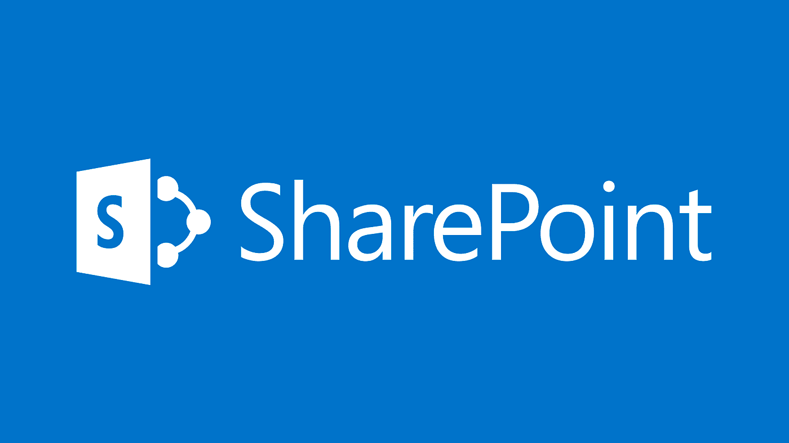
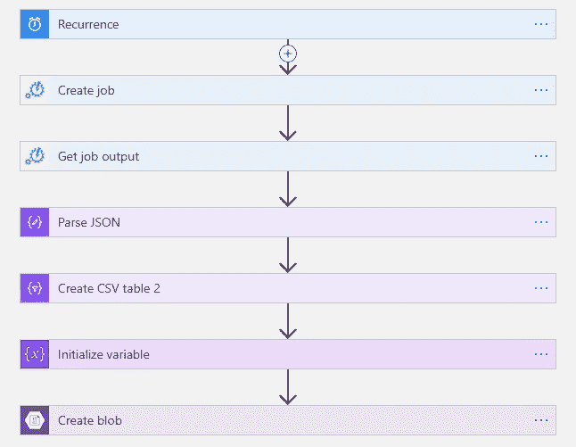
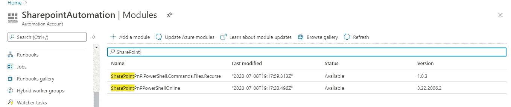
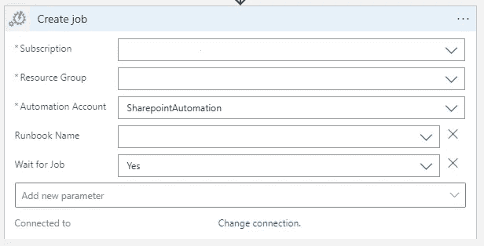
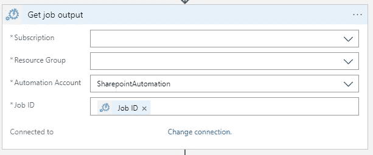
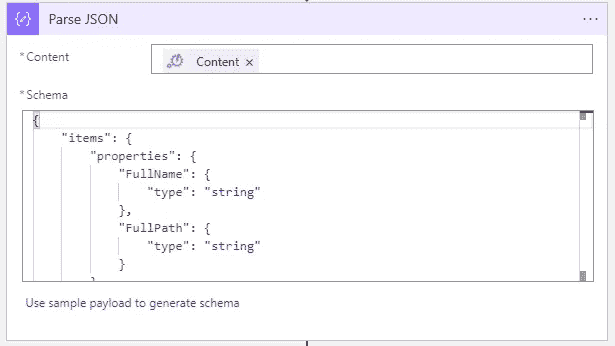
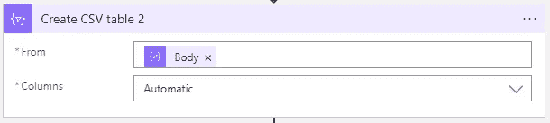
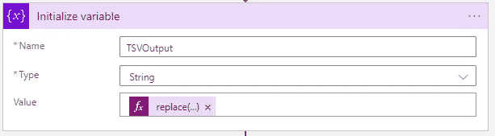
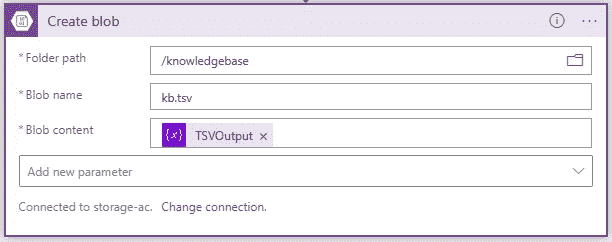
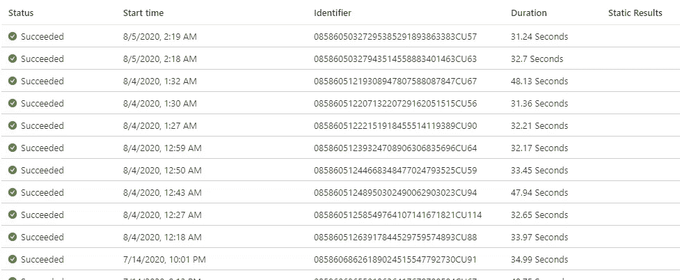

# 如何用 Sharepoint、QnA Maker 和 Logic Apps 构建微软团队聊天机器人—第一部分

> 原文：<https://medium.com/nerd-for-tech/how-to-build-a-microsoft-teams-chatbot-with-sharepoint-qna-maker-and-logic-apps-part-i-7ecf594cf718?source=collection_archive---------0----------------------->

## 一个聊天机器人，当被询问有关 SharePoint 网站中的文件时，它返回文件信息。



# 第 1 部分:从 Sharepoint 网站获取嵌套文件夹路径和详细信息



逻辑应用流程

## Powershell 操作手册代码

此脚本扫描 SharePoint 文件夹及其子文件夹，并返回信息。

```
#Connect to SPO
$sitename = "[https://xxxx.sharepoint.com/sites/xxxx/](https://kuharan.sharepoint.com/sites/NewSite/)"
$username = "[xxxx@xxxx.onmicrosoft.com](mailto:kuharan@kuharan.onmicrosoft.com)"
$password = "xxxx"
$encpassword = convertto-securestring -String $password -AsPlainText -Force
$cred = new-object -typename System.Management.Automation.PSCredential -argumentlist $username, $encpassword
Connect-PnPOnline -Url $sitename -Credential $cred #Target multiple lists 
$allLists = Get-PnPList | Where-Object {$_.BaseTemplate -eq 101}#Store the results
$results = @()
foreach ($row in $allLists) {
    $allItems = Get-PnPListItem -List $row.Title -Fields "FileLeafRef"

    foreach ($item in $allItems) {
            $results += New-Object psobject -Property @{
                FullName            = $item["FileLeafRef"]
                FullPath            = "[https://xxxx.sharepoint.com](https://kuharan.sharepoint.com)"+$item["FileRef"].replace(" ","%20")
            }
    }
}#Export the results
$results | ConvertTo-Json
```

## 您也可以尝试其他领域:

```
$allItems = Get-PnPListItem -List $row.Title -Fields "FileLeafRef", "SMTotalFileStreamSize", "FileDirRef", "FolderChildCount", "ItemChildCount"

    foreach ($item in $allItems) {
            $results += New-Object psobject -Property @{
                FileType          = $item.FileSystemObjectType 
                RootFolder        = $item["FileDirRef"] 
                LibraryName       = $row.Title
                FullName            = $item["FileLeafRef"]
                FullPath            = "[https://xxxx.sharepoint.com](https://kuharan.sharepoint.com)"+$item["FileRef"].replace(" ","%20")
                FolderSizeInMB    = ($item["SMTotalFileStreamSize"] / 1MB).ToString("N")
                NbOfNestedFolders = $item["FolderChildCount"]
                NbOfFiles         = $item["ItemChildCount"]
            }
    }
```

为了运行这个 PowerShell 脚本，我必须在 automation 帐户中安装这两个模块。



创造一份工作



获取作业输出

## 解析 JSON



解析 JSON

下面是活动的输入模式

```
{
    "items": {
        "properties": {
            "FullName": {
                "type": "string"
            },
            "FullPath": {
                "type": "string"
            }
        },
        "required": [
            "FullName",
            "FullPath"
        ],
        "type": "object"
    },
    "type": "array"
}
```

## 创建 CSV

创建 CSV 表。



创建 CSV 表

## 皈依 TSV 教

为什么？ *QnA 制造商要求*



用制表符替换逗号

## 动态表达式代码

```
replace(body('Create_CSV_table_2'),',','    ')
```

## 创建一个斑点



存储帐户

当它运行时，它是绿色的:)



逻辑应用输出

接下来，

# 第 2 部分:QnA maker 服务和聊天机器人

# 第 3 部分:团队部署

# 第 4 部分:实现自动化！

敬请期待！