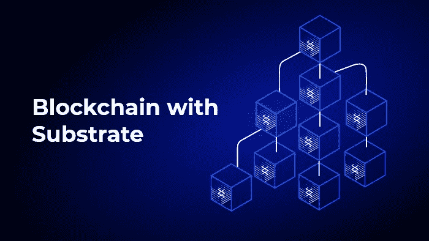

# 如何用底物建立区块链的存在性证明？

> 原文：<https://medium.com/nerd-for-tech/how-to-build-a-proof-of-existence-blockchain-with-substrate-48b47732b08c?source=collection_archive---------3----------------------->

基底是一个允许用户创建自定义区块链的框架。这与传统的[区块链开发](https://www.leewayhertz.com/blockchain-development-company/)形成对比，后者要求你开发对等网络、JSON RPC 层、共识算法和其他特性。该框架为您提供了企业就绪型软件，您可以根据自己的需求进行定制。

为了说明使用 Substrate 进行开发的简单性，让我们尝试构建一个证明存在的区块链。但在此之前，让我们简单了解一下[底物](https://www.leewayhertz.com/substrate-development-services/)和存在性共识。

# 什么是基质？

Substrate 是一个开源的模块化框架，可以扩展和修改以构建像 Polkadot 这样的可互操作的区块链网络。这是一个软件开发工具包(SDK ),旨在为开发人员提供区块链的所有基本元素，让他们专注于为您的链提供创新功能的逻辑。以下属性使 Substrate 在所有其他分布式分类帐平台中脱颖而出。

*   **开放** —整个底层架构和工具包都可以在开源许可下获得。Substrate 的核心元素使用 json-RPC 和 libp2p 等开放协议，让您可以自由创建自己的区块链架构。基质也有一个活跃的、支持的和有益的社区，为其生态系统做出贡献。随着社区的发展，您可以向您的区块链添加更多功能。
*   **灵活—** 许多区块链平台都有紧密相连的子系统，难以分离。建立在其他区块链的叉子上的链条可能有不明显的耦合，使得很难断开。该基板可用于创建一个定制的区块链，可以适应您的需求，它也可以随着他们的需求变化而增长。
*   **面向未来的** —该基板采用模块化设计，非常灵活。基底状态转换逻辑是一个 WebAssembly 对象，是一个独立的 WebAssembly 运行时。您的节点可能被授权修改运行时，从而导致网络运行时升级。无分叉更新是可能的，因为节点不需要采取任何行动来使用新的运行时。您网络的运行时协议可能会逐渐变化，也可能会急剧变化，以满足您用户的需求。
*   **可互操作—** 许多区块链系统提供非常有限的互操作性，跨共识消息允许所有基于基板的区块链进行通信。副链可以连接到基底上，以共享中继链的安全性，也可以通过连接到它们来创建自治网络。

# 什么是存在证明？

顾名思义，存在证明就是记录和提供某些数据或实体存在的证据。它的工作方式非常简单，让你对 PoE 有了更多的了解。可以将时间戳和签名附加到数字实体上，以提供存在的证明，这样做是为了让授权的查看者可以看到记录的创建日期和时间。

# 你如何使用衬底构建一个证明存在的区块链？

该模块用于存储在线分发的存在证明文件。

# 范围

该模块允许用户提交文件存在的证明。这种存在的证明也可以用来确定所有者的软措施。文件不会直接上传到区块链；文件摘要被创建并存储在链上，包括上传日期和请求者。

任何有源文件的人都可以生成相同的摘要，并检查链上存在的证据。

# 属国

**特质**

这个模块依赖于`Currency`特征的实现。这可以通过底物运行时模块库(SRML)平衡模块来完成。

**模块**

这个模块依赖于 SRML 时间戳模块。

# 怎么做安装？

## 运行时 Cargo.toml

要将模块添加到运行时，需要将以下内容添加到运行时的 Cargo.toml 文件中:

[依赖关系. poe]

默认功能=假

package = '存在证明'

git = '[**GitHub—substrate-developer-hub/Substrate-Proof-of-Existence:建立在 Parity 的 Substrate 上的存在证明区块链**](https://github.com/substrate-developer-hub/substrate-proof-of-existence.git) **'**

完成上述步骤后，更新运行时的 std 特性，将其包含在该模块中。

标准= [

…

Poe/标准'，

]

## 运行时间

## [图书馆——铁锈箱之家](http://lib.rs/)

要实现其特征，您应该执行以下操作:

运行时的 impl Poe::Trait {

类型货币=余额；

类型 Event =事件；

}

然后，将它包含在您的 construct_runtime 中！宏:

POE:POE::{模块，调用，存储，事件 <t>}，</t>

您可以通过运行以下命令来查看本模块的参考文档:

货物单据-未结

# 最后的想法

如你所见，Substrate 允许你用最少的努力创建定制的区块链。[衬底](https://www.leewayhertz.com/substrate-development-services/)提供了创建一个节点所需的所有基础设施，SRML 提供了一套预建工具，您可以将它们添加到您的区块链中。