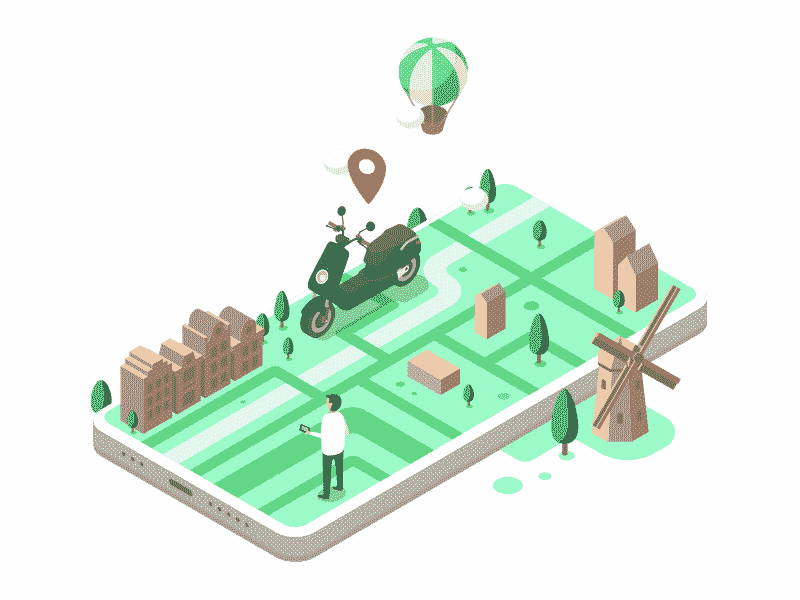

# 如何打造 Lime 这样的代步车共享 App

> 原文：<https://medium.com/nerd-for-tech/how-to-build-a-scooter-sharing-app-like-lime-fdf5c86496df?source=collection_archive---------5----------------------->

大多数汽车公司正在转向电动汽车，以减少对环境的负面影响。让我们来看看如何建立一个像 lime 一样的滑板车共享应用程序来拯救我们的地球。

# 为什么代步车共享 app 这么受欢迎？

以下是 Lime 等代步车共享应用如此受欢迎的一些原因。

## 价格

顾客接受不昂贵的趋势。与优步、Ola 或 Lyft 一起租代步车比出租车便宜。乘坐小型摩托车的费用大约为 2-3 美元，而乘坐出租车的费用为 25 美元。

## 乐趣

根据一项调查，28%的人选择骑电动滑板车，因为这比共乘出租车更有趣。

## 环境友好的

汽车排放的气体会影响我们的环境，而电动滑板车依靠电力运行。电动滑板车是环保型交通工具。

## 没有交通堵塞

滑板车是避免交通堵塞和快速到达目的地的最佳方式之一。

## 非常适合短途旅行

滑板车是短距离的完美选择。使用滑板车共享应用程序更便宜也更快。

# 滑板车共享应用的工作原理

大多数摩托车共享应用程序都使用相同的算法。代步车共享应用程序的工作主要依赖于打车应用程序开发公司。以下是电动滑板车共享应用程序的工作原理:

1.下载应用程序

2.创建个人资料，填写付款详细信息，然后登录

3.搜索附近的滑板车

4.通过扫描二维码解锁滑板车

5.骑行结束后，安全停车并上锁

# Lime 等电动滑板车共享应用的功能

以下是开发电动滑板车共享应用时必须包含的重要功能列表:

## 注册和登机

注册用户只使用该应用程序。添加此功能有助于您的客户了解它的工作原理。

## 地图集成

地图集成允许用户寻找附近的滑板车。此功能有助于找到到达目的地的最短路线。

## 二维码扫描仪

二维码扫描仪是开始和结束旅程最安全的方式之一。用户需要扫描二维码才能解锁或锁定。Lime 使用 iOS 和 Android 平台的扫描仪 SDK。

## 付酬制度

一个内置的支付系统允许顾客为滑板车付款。你可以集成像 Stripe，PayPal，Braintree 等支付模式。

## GPS 跟踪系统

实时跟踪帮助客户定位电动滑板车。它允许管理员跟踪滑板车，并收集那些需要维护。

## 智能锁

要通过二维码解锁滑板车，请添加支持物联网的锁定系统。踏板车需要集成微控制器。

## 乘坐历史

该功能允许用户跟踪乘坐情况。需要游乐设备统计数据来衡量客户游乐设备的效率。

## 预订

预订系统允许客户预订电动滑板车。你可以为你的家人，朋友，亲戚等预订一个滑板车共享应用程序。

## 社交媒体整合

社交媒体账户是吸引你的客户和客户群的最佳方式之一。它允许他们分享他们的骑行细节和情感。

## 推送通知

推送通知有助于与客户沟通，发送折扣、优惠和特别活动等信息。

# 像 Lime 一样建立你的滑板车共享应用程序需要多少钱

## 用户应用成本估算

➡ **特色:**报名

**发育时间:** 2 周

**费用:**1000 美元到 2000 美元

➡ **特色:**地图整合

**开发时间:1** 周

**成本:**1500 美元至 2500 美元

➡ **功能:** GPS 跟踪

**开发时间:1** 周

**成本:【1,000 美元到 2000 美元**

➡ **功能:**支付方式整合

**开发时间:1** 周

**费用:**1500 美元到 2000 美元

➡ **功能:**二维码扫描仪

**开发时间:1** 周

成本:1000 到 2000 美元

➡ **特点:**锁定&解锁滑板车

**开发时间:1** 周

**费用:**1000 美元到 2500 美元

➡ **特色:**社交媒体整合

**发育时间:**1–5 天

**成本:** $500 — $900

➡ **特色:**在线订票系统

**开发时间:2** 周

**成本:**1500 美元到 2000 美元

➡ **特色:**乘车统计

开发时间:2–5 天

**成本:**:800-1000 美元

➡ **功能:**推送通知

开发时间:2–5 天

成本:800-1000 美元

➡ **功能:** ID 验证

发育时间: 2 周

成本:1000 美元到 2500 美元

## 管理应用成本估算

➡ **特色:**核心特色

**发育时间:**3–5 周

成本:3，000 美元到 7，000 美元

➡ **功能:**支付管理系统

发育时间: 1 周

成本:1000 美元到 1500 美元

➡ **功能:**分析

**开发时间:**1–3 周

**成本:**1500 美元到 2000 美元

➡ **功能:**客户管理系统

**开发时间:** 1 周

成本:1000 美元到 2500 美元

➡ **功能:**滑板车管理系统

开发时间:2 周

成本:1000 美元到 2500 美元

上面提到的构建电动滑板车共享应用程序的信息可能需要 900 个小时。

# 临终遗言

日益严重的污染增强了人们的环保意识。如今，人们更加关注环境问题。

环保驾驶的概念越来越多，领先的汽车制造商制造了更多的电动和环保汽车。