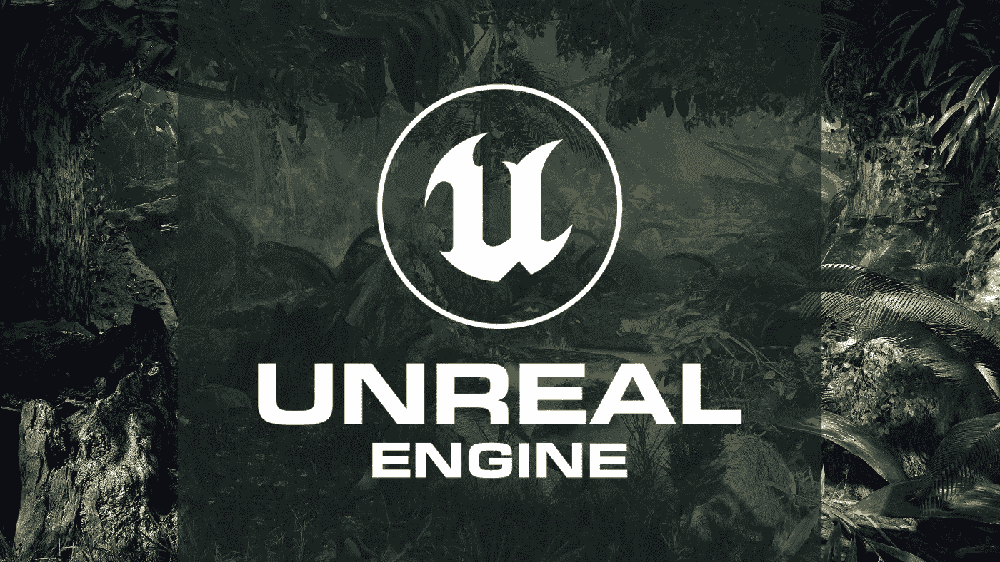

# 如何使用虚幻引擎构建虚拟世界

> 原文：<https://medium.com/nerd-for-tech/how-to-build-a-virtual-world-using-unreal-engine-206122d57669?source=collection_archive---------2----------------------->

虚幻引擎是由美国视频游戏和软件开发公司 Epic Games 于 1998 年开发的游戏开发引擎。最初，它是为第一人称射击游戏开发的。它现在被用来创建各种 2D 和 3D 游戏，如第三人称射击游戏，大型多人在线游戏等。

虽然它是作为一个游戏引擎开发的，但它现在广泛用于电影、现场活动、建筑、自动化、制造业等。

## 选择虚幻引擎进行开发的好处

[虚幻引擎](https://www.leewayhertz.com/unreal-engine-development-services/)是一个 100%开源的平台，提供逼真的图形质量，并提供指导指南和技术文档来指导创作者，使其对用户友好。

***资产和样本***

该平台提供了各种资源、样本和模板来帮助游戏开发者设计和制作更有趣的游戏。

***真实感图形***

虚幻引擎的内置工具使任何人都可以像超能力者伪造真实世界环境一样创建和设计更逼真和高质量的内容。

***自由使用***

像多玩家工具、蓝图、模板、资产和虚幻引擎插件这样的内置系统都是免费使用的。

***专业支持***

如果开发人员在构建项目时遇到任何问题，他们可以从虚幻引擎中各个领域的高级专家组成的专业团队中获得帮助。

***不断升级***

新的引擎版本和其他更新经常发布，增加新的功能和增加平台的可行性。

## 如何用虚幻引擎构建虚拟世界？

Unreal Engine 提供了一个完整的工具、资源和媒体框架集合，您可以使用它来创建简单到复杂、优化且有吸引力的虚拟现实项目，而无需编写脚本。

使用虚幻引擎，让我们了解如何建立一个虚拟世界，并把它与光，树叶等各种元素的生活。

## 安装虚幻引擎

以下是下载和安装虚幻引擎的步骤:

1.  **下载并安装 Epic 游戏启动器(EGL)**

打开 Unreal Engine 的下载页面，并根据项目特定的要求选择合适的许可证类型。有两种类型的许可证可用，它们是

*   *发布——适合基于游戏的项目*
*   Creators——它适用于游戏以外的项目。

现在，选择下载选项，这将打开一个启动器安装程序。根据操作系统的设置指定保存位置。下载完成后运行安装程序。

**2。注册或登录 Epic Games 帐户**

使用您的电子邮件或其他受支持的社交媒体帐户详细信息创建一个 Epic Games 帐户。如果您已经有帐户，请登录。

**3。安装虚幻引擎**

一旦你在 Epic Game Launcher 上创建了一个帐号，你就可以安装一个虚幻引擎了。为此，请参考以下步骤:

*   “虚幻引擎”选项卡的左侧有许多选项。从中选择“虚幻引擎”，点击安装即可开始。
*   然后选择选项按钮，从给定的选项中选择并安装引擎组件。选择组件后，单击应用。
*   选择安装选项。安装后，点击启动按钮进入虚幻引擎。

## 创建新项目

下载并安装虚幻引擎后，您可以继续创建新项目。请按照以下步骤继续操作:

1.  点击“新项目类别”并根据您的项目需求从不同的可用类别中进行选择。例如，如果您想设计一所房子，您可以选择“建筑”选项。
2.  为您的 VR 项目选择一个模板，然后从可用模板中单击下一步。
3.  将打开一个项目设置页面来设置质量和性能级别。然后，选择目标平台。
4.  从多个下拉菜单中选择 Blueprint 下拉菜单，该菜单提供了两个选项——在 Unreal 编辑器中创建您的 VR 项目或使用编程方法用 C++创建项目。
5.  打开最高质量下拉菜单，显示两个选项-最高质量或可缩放 3D 或 2D。如果您的项目是为游戏机或计算机设计的，请选择最高质量。如果您的项目支持移动电话，请选择可缩放 3D 或 2D。
6.  根据您的项目从桌面/控制台下拉列表中选择一个选项。
7.  现在，如果您没有任何基本资产，请打开“带入门内容”下拉列表，并从可用的两个选项中选择“带入门内容”。
8.  然后，移动到禁用光线跟踪。选择“启用光线跟踪”以在项目中启用实时显示访问。
9.  最后，为项目选择一个存储位置，并给出一个合适的名称。单击创建项目完成。

## 用虚幻引擎构建虚拟世界

本教程将指导你[用虚幻引擎](https://www.leewayhertz.com/how-to-build-a-virtual-world-using-the-unreal-engine/)构建一个 3D 虚拟世界。按照给定的步骤创建一个类似于此图的 3D 房间:

**所需设置**

虚幻引擎安装完成后，屏幕上会出现一个项目浏览器。从项目的多个类别中选择相关选项，然后单击“下一步”。

1.  选择空白模板，然后单击下一步。
2.  从下一页的不同下拉选项中，选择蓝图和带有起始内容设置的。现在，通过提及位置并给项目命名来创建项目。

**浏览视窗**

创建项目后，转到虚幻编辑器中的视口。在“视口”中，可以使用资源和示例层级进行所有层级构建。

**创造新的关卡**

1.  从虚幻编辑器中打开“文件”菜单选项，并选择“新级别”选项。
2.  点击空级别选项，然后点击放置演员。VR 项目中的演员是像几何或灯光这样的元素。从“放置演员”选项中选择几何体，最后选择一个长方体。
3.  现在，通过拖动将长方体放置到标高视点中。
4.  在编辑器窗口右下方的“细节”面板中，将“位置”和“旋转”设置为 0。同样，将比例设置为 4x4x0.1
5.  从“放置演员”部分的“灯光”选项卡中，将平行光拖放到地板上。
6.  将 Z 轴从过渡工具拖动到 gizmo(小部件),远离地板表面。
7.  从位于“放置演员”面板内的“视觉效果”选项卡中选择并拖放一个大气雾。该步骤将天空添加到现有的关卡，并照亮该关卡。
8.  从 Place Actors 门户选择并拖放玩家开始。
9.  选择“放置演员”面板下的“体积”,并将“轻质量重要性”体积拖放到该级别。这个动作可以帮助你控制灯光效果和调节气氛。
10.  现在，转到内容，并选择 StarterContent。点击道具，拖拽 SM_TableRound 到关卡。
11.  再次按照上面相同的步骤，但是这一次，从道具选项中拖放 SM_Chair 到关卡。
12.  通过按 e 键访问旋转工具。

**编辑被安置的演员**

当执行元被放置到它们的级别中时，您可以按照给定的步骤，根据您的项目需求定制执行元的属性:

1.  左键单击视口并选择平行光演员。
2.  从“灯光”类别的“细节”面板中启用大气日光。

**运行构建流程。**

您可以参考以下步骤调整照明质量和其他功能:

1.  从主工具栏中选择 Build 选项旁边的下拉箭头。
2.  选择您喜欢的照明质量设置。
3.  构建过程完成后，您可以查看项目的最终外观。
4.  您可以在主工具栏的播放按钮上检查编辑器的进度。

**最后一步**

您应该测试项目的各种功能，并在编辑器中执行构建级别照明和播放的常见操作。

# 结论

随着娱乐行业的繁荣和太多人将时间和金钱投入到该行业，虚幻引擎也越来越受欢迎。它为企业和企业家开辟了一条新的道路，探索各种可能性，通过这个[现实生活启发的 3D 世界](https://www.leewayhertz.com/unreal-engine-development-services/)推动他们的业务向前发展。需要一个专门的虚幻开发者团队来使这项技术在商业中发挥其全部潜力。