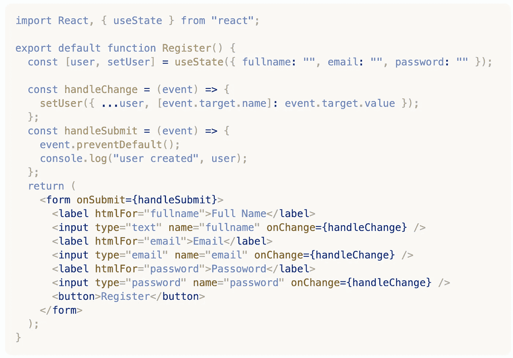
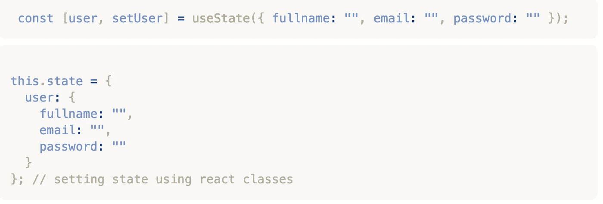

# 如何使用 React 钩子处理多个表单输入

> 原文：<https://medium.com/nerd-for-tech/how-to-build-forms-with-multiple-input-fields-using-react-hooks-677da2b851aa?source=collection_archive---------0----------------------->

表单可以被认为是 web 应用程序的主干。如果没有表单，你如何从用户那里获得信息？是的，现在有一些可以轻松构建表单的库(一个很好的库是 Formik ),但是了解如何在 React 中从头开始创建表单是有益的，这相当容易。

# **受控和非受控输入**

HTML 表单的默认操作是刷新页面，这会导致您丢失所有数据。使用 React，我们使用 javascript 来处理我们访问用户输入的数据的方式。

在 HTML 中，*<input><textarea>*等表单类型一般会处理自己的状态，并根据用户输入进行更新。让 DOM 为您处理用户输入被称为**非受控输入。**

受控输入让 React 为你处理状态，因为它是可变的。React 将此状态存储在 *state* 属性中，并且只能使用固态更新。因此，呈现表单的 React 组件现在可以控制后续用户输入时表单会发生什么。

有关受控输入的更多信息→ [查看此处](https://reactjs.org/docs/forms.html)

# **用 UseState 处理表单中的多个输入字段**

在大多数情况下，我们需要用户输入不止一个字段。为了演示这一点，让我们创建一个注册表单。

[http://www . agirl . codes/how-to-build-forms-with-multi-input-fields-using-react-hooks](https://www.agirl.codes/how-to-Build-Forms-with-multiple-input-fields-using-React-Hooks)

让我们从头开始

**状态** →这里我们用**使用状态钩子**声明状态， ***用户*** 代表我们插入到**使用状态**中的对象，**设置用户**将被用来更新状态。如果您熟悉 React 类，

[http://www . agirl . codes/how-to-build-forms-with-multi-input-fields-using-react-hooks](http://www.agirl.codes/how-to-build-forms-with-multiple-input-fields-using-react-hooks)

***handleChange*** →在我们的 ***handleChange*** 函数中，我们使用 ***setUser*** 来更新 ***user*** 状态。我在 ***setUser*** 中传播 ***user*** 对象，如果你不这样做， ***setUser*** 只会更新最后一个属性，也就是 ***密码*** ，所以我们必须通过添加它们来保留其他属性状态。

我们用****e【event . target . name】:event . target . value***告诉 ***setUser*** 函数根据名称更新什么属性。*

*现在存储在**状态**的**用户**数据可以根据需要传递给不同的组件。*

> *event.preventdefault()用于防止页面重新呈现*

# ***可访问性非常重要***

*由于它的常见用法，确保表单易于被所有用户理解和交互是非常重要的。不注意可访问性会减少残疾用户与您的网站表单交互的机会。小小的改变可以带来很大的不同；*

*在我们的表单中，我们使用了最佳实践，并添加了可访问的；*

*   *包括描述表单控件用途的每个输入字段的标签*

*要深入了解如何让你的网站具有可访问性，请阅读更多关于 w3.org 的文章*

# ***确保验证用户输入***

*不应该跳过验证，因为你不应该相信用户会输入正确的信息。选项是使用内置的 HTML 验证，自己编写一个或者使用验证模式。任何选项都可以，我推荐使用像 Yup 这样的验证模式，因为它使得为输入字段编写验证变得容易。这里有一篇文章的中级链接，解释了为什么需要它以及如何使用它进行表单验证。*

> *[React 中的 Yup 对象验证介绍](/@rossbulat/introduction-to-yup-object-validation-in-react-9863af93dc0e)*

*现在您已经了解了如何使用 React 挂钩构建表单，您可以选择使用表单助手或 React 挂钩来构建表单。*

*注册表单的代码可以在这里找到 [codesandbox.io](https://codesandbox.io/s/how-to-build-forms-with-multiple-input-fields-using-react-hooks-2c7dt?file=/src/styles.css)*

*关于如何构建具有多个输入字段的表单的更深入的初学者指南— [使用 useState 钩子构建 React 表单的完整指南](https://www.agirl.codes/complete-guide-build-react-forms-with-usestate-hook)*