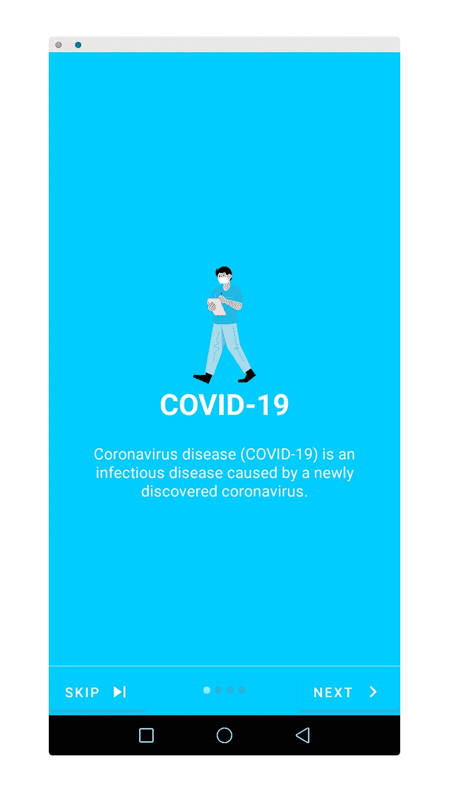

# 如何为你的应用程序创建简介滑块

> 原文：<https://medium.com/nerd-for-tech/how-to-build-intro-slider-for-your-app-1dfd55e82b17?source=collection_archive---------0----------------------->

让我们看看如何为您的 android 应用程序创建一个介绍滑块。

试映

让我们一步一步来完成这个最终屏幕。

像往常一样创建一个新的 android 项目，并将应用程序命名为 Intro Slider。

请*从这里下载*您想要的图片:

【https://drive.google.com/open? id = 1f 7 geywlnbctnefynex 7 rjgadizgud 7 p 4

首先进入 **colors.xml** 文件，添加所需的颜色:

现在，转到 **styles.xml** 并添加以下内容以避免应用程序崩溃:

之后，将以下内容添加到 **dimens.xml** 文件中，如果它不存在，则创建一个。

现在，我们需要将下面几行添加到 **strings.xml** 文件中:

这是我们希望在滑块的每个屏幕上显示的文本。此外，我们需要添加一个图像显示在屏幕上。所以，下载四张图片，把它们放在 drawable 文件夹中，或者使用上面给出的链接下载图片。现在我们需要为简介滑块创建布局文件。让我们将该活动命名为 **WelcomeActivity** 。但是在我们创建布局之前，我们需要创建每个滑块布局，如下所示:

1.  **welcome_slide1.xml**

**2。welcome_slide2.xml**

**3** 。 **welcome_slide3.xml**

**4。welcome_slide4.xml**

现在，让我们创建 **activity_welcome.xml**

现在，我们还需要注意，WelcomeActivity 只需要运行一次。因此，我们将使用 **SharedPreferences** 来保存状态，并检查应用程序是否第一次运行。如果是，我们将显示 WelcomeActivity，否则我们将继续进行**主活动**。

让我们创建一个名为**PrefManager.java**的类。

现在，我们需要转到**WelcomeActivity.java**并添加以下内容:

现在，我们需要做的最后一件事是将这个 **WelcomeActivity** 作为启动器活动。因此，在 **AndroidManifest.xml** 文件中进行相应的更改，如下所示:

现在，哇！我们已经准备好运行我们的应用程序，您应该能够看到类似这样的内容:

简介滑块的预览

希望你喜欢阅读这篇文章！

如果您有任何疑问，请在下面的**评论**部分发帖。在 [LinkedIn](https://www.linkedin.com/in/vaidhyanathansm/) 上与我联系。此外，如果你想看看我开发的惊人的应用程序集，别忘了查看[谷歌 Play 商店](https://play.google.com/store/apps/developer?id=Programmers+Gateway)。

更多了解我[这里](https://vaidhyanathansm.tech/)。

话虽如此，感谢阅读我的文章和*快乐编码！*