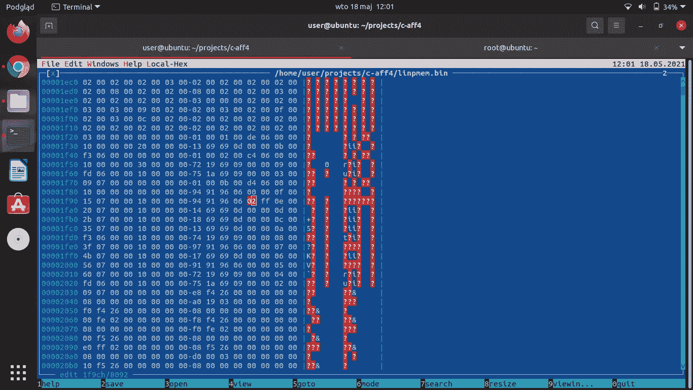

# 如何为红帽 7 构建 linpmem

> 原文：<https://medium.com/nerd-for-tech/how-to-build-linpmem-for-red-hat-7-48010cb96948?source=collection_archive---------18----------------------->

Red Hat 7.9 最初发布于 2013 年，拥有 10 年的长期支持，在 2.17 版中使用 GNU C 库。基于 Debian 构建并于 2019 年发布的 Linpem 二进制文件使用 glibc 2.25 和 2.27 的符号。这个二进制文件不能在 Red Hat 7.9 上运行

好消息是供应商在 git 仓库[https://github.com/Velocidex/c-aff4](https://github.com/Velocidex/c-aff4)中提供了 README.linux，我们可以在 Ubuntu 上创建一个静态二进制文件。

首先，让我们将代码库与最新的库对齐(并禁用对&string[0]进行操作以写入字节并覆盖非预期内存区域的缓存——真的很可怕):

```
diff — git a/aff4/aff4_file.cc b/aff4/aff4_file.cc
index 64c6ca3..1eb3a05 100644
 — — a/aff4/aff4_file.cc
+++ b/aff4/aff4_file.cc
@@ -96,66 +96,7 @@ AFF4Status CreateIntermediateDirectories(DataStore *resolver, std::string dir_na
 }

 AFF4Status FileBackedObject::ReadBuffer(char * data, size_t * length) {
- // If we’re trying to read larger than a cache block, then we skip the cache
- if (*length > cache_block_size) {
- return _ReadBuffer(data, length);
- }
-
- // Save current position
- const auto startpos = readptr;
-
- // Calculate block number
- const auto bn = startpos / cache_block_size;
-
- // Calculate block offset
- const auto offset = startpos % cache_block_size;
-
- // If there’s an overlap, then skip the cache
- if (offset + *length > cache_block_size) {
- return _ReadBuffer(data, length);
- }
-
- // Search the cache for a block
- const auto block = read_cache.find(bn);
- if (block != read_cache.end()) {
- // We’ve got a cache hit!
- const auto & block_data = block->second;
-
- // Copy data to buffer
- *length = block_data.copy(data, *length, offset);
-
- // Adjust the read pointer
- readptr += *length;
-
- return STATUS_OK;
- }
-
- // We’ve got a cache miss
-
- // Read a block of data
- std::string block_data(cache_block_size, 0);
- size_t read = cache_block_size;
- readptr = bn * cache_block_size;
- RETURN_IF_ERROR(_ReadBuffer(&block_data[0], &read));
- block_data.resize(read);
-
- // Copy data to buffer
- *length = block_data.copy(data, *length, offset);
-
- // Adjust the read pointer
- readptr = startpos + *length;
-
- // If the cache is full then remove a random block from the cache
- if (read_cache.size() == cache_block_limit) {
- auto el = read_cache.begin();
- std::advance(el, rand() % cache_block_limit);
- read_cache.erase(el);
- }
-
- // Add block to cache
- read_cache.emplace(bn, std::move(block_data));
-
- return STATUS_OK;
+ return _ReadBuffer(data, length);
 }

diff — git a/aff4/aff4_imager_utils.cc b/aff4/aff4_imager_utils.cc
index dc3ab49..3841c4c 100644
 — — a/aff4/aff4_imager_utils.cc
+++ b/aff4/aff4_imager_utils.cc
@@ -179,18 +179,6 @@ AFF4Status BasicImager::ProcessArgs() {

 AFF4Status BasicImager::handle_logging() {
- if (Get(“logfile”)->isSet()) {
- std::vector<spdlog::sink_ptr> sinks = resolver.logger->sinks();
-
- auto new_sink = std::make_shared<spdlog::sinks::simple_file_sink_mt>(
- GetArg<TCLAP::ValueArg<std::string>>(
- “logfile”)->getValue());
- sinks.push_back(new_sink);
-
- resolver.logger = std::make_shared<spdlog::logger>(
- “”, sinks.begin(), sinks.end());
- }
-
 int level = GetArg<TCLAP::MultiSwitchArg>(“debug”)->getValue();
 switch(level) {
 case 0:
diff — git a/aff4/aff4_symstream.cc b/aff4/aff4_symstream.cc
index 77ae7be..5db766e 100644
 — — a/aff4/aff4_symstream.cc
+++ b/aff4/aff4_symstream.cc
@@ -6,6 +6,7 @@
 */

 #include “aff4/aff4_symstream.h”
+#include <climits>

 namespace aff4 {

diff — git a/aff4/libaff4-c.cc b/aff4/libaff4-c.cc
index c2576bb..e43e630 100644
 — — a/aff4/libaff4-c.cc
+++ b/aff4/libaff4-c.cc
@@ -17,7 +17,7 @@
 #include <memory>

 #include <spdlog/spdlog.h>
-#include <spdlog/sinks/sink.h>
+#include <spdlog/sinks/base_sink.h>

 #include “aff4/aff4_errors.h”
 #include “aff4/lexicon.h”
@@ -34,9 +34,9 @@ public:
 }

 // populate our message struct
- char* str = new char[msg.raw.size()+1];
- std::strncpy(str, msg.raw.data(), msg.raw.size());
- str[msg.raw.size()] = ‘\0’;
+ char* str = new char[msg.payload.size()+1];
+ std::strncpy(str, msg.payload.data(), msg.payload.size());
+ str[msg.payload.size()] = ‘\0’;

 AFF4_Message* m = new AFF4_Message{msg.level, str, nullptr};

@@ -66,22 +66,24 @@ LogHandler& get_log_handler() {
 return log_handler;
 }

-class LogSink: public spdlog::sinks::sink {
+template<typename Mutex>
+class LogSink: public spdlog::sinks::base_sink<Mutex> {
 public:
 virtual ~LogSink() {}

- void log(const spdlog::details::log_msg& msg) override {
+ void sink_it_(const spdlog::details::log_msg& msg) override {
 // trampoline to our thread-local log handler
 get_log_handler().log(msg);
 }

- void flush() override {}
+ void flush_() override {}
 };

 static std::shared_ptr<spdlog::logger> setup_c_api_logger() {
 spdlog::drop(aff4::LOGGER);
- auto logger = spdlog::create(aff4::LOGGER, std::make_shared<LogSink>());
+ using LogSinkDefault = LogSink<std::mutex>;
+ auto logger = spdlog::create<LogSinkDefault>(aff4::LOGGER);
 logger->set_level(spdlog::level::err);
 return logger;
 }
diff — git a/aff4/libaff4.cc b/aff4/libaff4.cc
index 48fd089..af5d73b 100644
 — — a/aff4/libaff4.cc
+++ b/aff4/libaff4.cc
@@ -34,6 +34,8 @@ specific language governing permissions and limitations under the License.
 #include <cstring>
 #include <iostream>
 #include <iomanip>
+#include “spdlog/spdlog.h”
+#include “spdlog/sinks/stdout_color_sinks.h”

 namespace aff4 {

@@ -632,14 +634,9 @@ std::vector<std::string> split(const std::string& s, char delim) {

 std::shared_ptr<spdlog::logger> get_logger() {
 auto logger = spdlog::get(aff4::LOGGER);
-
 if (!logger) {
- if (!spdlog::details::os::in_terminal(stderr)) {
- return spdlog::stderr_logger_mt(aff4::LOGGER);
- }
- return spdlog::stderr_color_mt(aff4::LOGGER);
+ logger = spdlog::stderr_color_mt(“stderr”); 
 }
-
 return logger;
 }
```

现在我们需要用 README.linux 创建一个构建脚本:

```
#/bin/bash
export PREFIX=/tmp/build/static/
mkdir -p $PREFIX
export CXXFLAGS=”-I$PREFIX/include”
export PKG_CONFIG_PATH=”$PREFIX/lib/pkgconfig/”echo “Please make sure deb-src entries are uncommented in /etc/apt/sources.list”
echo “If not yet, please press Ctrl+C now.”
sleep 5
echo “OK. Starting….”
apt-get install gcc g++ make automake autoconf libtool libboost-dev dpkg-dev autopoint cmake curlif [ ! -f $PREFIX/lib/libuuid.a ] ; then
 echo “Processing uuid-dev — — — — — — -”
 apt-get source uuid-dev
 cd util-linux-*
 autoreconf — install — force
 ./configure — prefix=$PREFIX — enable-static LDFLAGS=”-L$PREFIX/lib -static -static-libstdc++ -static-libgcc” \
 — enable-libuuid — disable-all-programs — disable-python — disable-bash-completion
 echo “#undef HAVE_GETRANDOM” >> ./config.h
 make install -j4 || exit 1
 cd ..
fiif [ ! -f $PREFIX/lib/libz.a ]; then
 echo “Processing zlib1g — — — — — — — -”
 apt-get source zlib1g
 cd zlib-*/
 ./configure — prefix=$PREFIX — static
 make install || exit 1
 cd ..
fiif [ ! -f $PREFIX/lib/libraptor2.a ]; then
 echo “Processing libraptor2-dev — — — “
 apt-get source libraptor2-dev
 cd raptor2-*/
 ./configure — prefix=$PREFIX — enable-static — without-www LDFLAGS=”-L$PREFIX/lib -static -static-libstdc++” — enable-serializers=”turtle ntriples” — enable-parsers=”turtle ntriples”
 make -j4 install || exit 1
 cd ..
fiif [ ! -f $PREFIX/lib/libpcre.a ]; then
 echo “Processing libpcre — — — — — — -”
 [[ -f /usr/bin/aclocal-1.15 ]] || ln -s /usr/bin/aclocal /usr/bin/aclocal-1.15
 [[ -f /usr/bin/automake-1.15 ]] || ln -s /usr/bin/automake /usr/bin/automake-1.15
 apt-get source libpcre3
 cd pcre3-*/
 ./configure — prefix=$PREFIX — enable-static LDFLAGS=”-L$PREFIX/lib -static -static-libstdc++”
 make -j4 install || exit 1
 cd ..
fiif [ ! -f $PREFIX/lib/libpcrecpp.a ]; then
 echo “Processing libpcre++-dev — — — “
 apt-get source libpcre++-dev
 cd libpcre++-0.9.5/
 ln -s /usr/bin/libtool libtool
 ./autogen.sh
 ./configure — prefix=$PREFIX — enable-static LDFLAGS=”-L$PREFIX/lib -static -static-libstdc++”
 make install || exit 1
 cd ..
fiif [ ! -f $PREFIX/lib/libyaml-cpp.a ]; then
 echo “Processing libyaml — — — — — — -”
 apt-get source libyaml-cpp-dev
 cd yaml-cpp-*/
 cmake -DCMAKE_INSTALL_PREFIX:PATH=$PREFIX . && make all install || exit 1
 cd ..
fiif [ ! -f $PREFIX/lib/libsnappy.a ]; then
 echo “Processing libsnappy — — — — — “
 apt-get source libsnappy-dev
 cd snappy-*/
 cmake -DCMAKE_INSTALL_PREFIX:PATH=$PREFIX . && make all install || exit 1
 cd ..
fiif [ ! -f $PREFIX/lib/liburiparser.a ]; then
 echo “Processing liburiparser — — — -”
 apt-get source liburiparser-dev
 cd uriparser-*/
 ./configure -DBUILD_SHARED_LIBS=OFF -DCMAKE_INSTALL_PREFIX=$PREFIX — enable-static — without-gflags LDFLAGS=”-L$PREFIX/lib -static -static-libstdc++” -DURIPARSER_BUILD_TESTS=OFF -DURIPARSER_BUILD_DOCS=OFF
 make -j4 install || exit 1
 cd ..
fiif [ ! -f $PREFIX/lib/libspdlog.a ]; then
 echo “Processing libspdlog — — — — -”
 apt-get source libspdlog-dev
 cd spdlog-*/
 cmake -DCMAKE_INSTALL_PREFIX:PATH=$PREFIX . && make all install || exit 1
 cd ..
fiif [ ! -f $PREFIX/lib/liblz4.a ]; then
 echo “Processing LZ4 — — — — — — — -”
 export LZ4_VERSION=1.8.3
 curl -L [https://github.com/lz4/lz4/archive/v${LZ4_VERSION}.tar.gz](https://github.com/lz4/lz4/archive/v${LZ4_VERSION}.tar.gz) -o lz4-${LZ4_VERSION}.tar.gz
 tar xvzf lz4-${LZ4_VERSION}.tar.gz
 cd lz4-${LZ4_VERSION}/lib
 make -j4 install || exit 1
 rm $PREFIX/lib/liblz4.so*
 cd ..
fiif [ ! -f $PREFIX/lib/libfmt.a ]; then
 echo “Processing fmt — — — — — — — “
 apt-get source libfmt-dev
 cd fmt*/
 cmake -DFMT_DOC=OFF -DFMT_TEST=OFF -DCMAKE_INSTALL_PREFIX=/tmp/build/static/ . && make all install || exit 1
 cd ..
fiecho “Done! — — — — — — — — — — — -”
```

在我们完成之后。我们可以执行文件配置，然后生成:

```
./configure — prefix=$PREFIX — enable-static LDFLAGS=”-L$PREFIX/lib -L$PREFIX/libexec -lfmt” — enable-static-binaries && make && make install
```

我们最终应该得到完全静态的可执行文件:

```
user@ubuntu:~/projects/c-aff4$ ldd tools/pmem/linpmem
 linux-vdso.so.1 (0x00007ffe877c7000)
 libpthread.so.0 => /lib/x86_64-linux-gnu/libpthread.so.0 (0x00007fb45319e000)
 libc.so.6 => /lib/x86_64-linux-gnu/libc.so.6 (0x00007fb452fb4000)
 /lib64/ld-linux-x86–64.so.2 (0x00007fb453458000)
```

我们需要删除 glob symbol 版本 GBLIC_2.27:

```
user@ubuntu:~/projects/c-aff4$ ./../patchelf-0.12.20200827.8d3a16e/src/patchelf — clear-symbol-version glob — output linpmem.bin tools/pmem/linpmemuser@ubuntu:~/projects/c-aff4$ nm -D ./linpmem.bin | grep GLIBC_2.27
user@ubuntu:~/projects/c-aff4$ nm -D ./linpmem.bin | grep GLIBC_2.25
user@ubuntu:~/projects/c-aff4$ nm -D ./linpmem.bin | grep glob
 U glob
 U globfree@@GLIBC_2.2.5
user@ubuntu:~/projects/c-aff4$ nm -D ./tools/pmem/linpmem | grep glob
 U glob@@GLIBC_2.27
 U globfree@@GLIBC_2.2.5
```

快好了。我们需要通过十六进制编辑器 hte 禁用孤立版本符号 2.27，并使用 Elfxx_Vernaux 中 vna_flags 的 readelf (1f28 + 70 + 6)显示的正确偏移量:

```
Version needs section ‘.gnu.version_r’ contains 3 entries:
 Addr: 0x0000000000001f28 Offset: 0x001f28 Link: 33 (.dynstr)
 000000: Version: 1 File: ld-linux-x86–64.so.2 Cnt: 1
 0x0010: Name: GLIBC_2.3 Flags: none Version: 11
 0x0020: Version: 1 File: libpthread.so.0 Cnt: 2
 0x0030: Name: GLIBC_2.3.2 Flags: none Version: 9
 0x0040: Name: GLIBC_2.2.5 Flags: none Version: 3
 0x0050: Version: 1 File: libc.so.6 Cnt: 11
 0x0060: Name: GLIBC_2.14 Flags: none Version: 15
 **0x0070: Name: GLIBC_2.27 Flags: WEAK Version: 14**
 0x0080: Name: GLIBC_2.4 Flags: none Version: 13
 0x0090: Name: GLIBC_2.8 Flags: none Version: 12
 0x00a0: Name: GLIBC_2.3 Flags: none Version: 10
 0x00b0: Name: GLIBC_2.3.4 Flags: none Version: 8
 0x00c0: Name: GLIBC_2.17 Flags: none Version: 7
 0x00d0: Name: GLIBC_2.7 Flags: none Version: 6
 0x00e0: Name: GLIBC_2.11 Flags: none Version: 5
 0x00f0: Name: GLIBC_2.3.2 Flags: none Version: 4
 0x0100: Name: GLIBC_2.2.5 Flags: none Version: 2
root@ubuntu:~# readelf -V /home/user/projects/c-aff4/linpmem.bin
```

字段 vna_flags 设置为 0x2 表示弱版本(参见:[https://ref specs . Linux foundation . org/LSB _ 3 . 0 . 0/LSB-PDA/LSB-PDA . junk/sym version . html](https://refspecs.linuxfoundation.org/LSB_3.0.0/LSB-PDA/LSB-PDA.junk/symversion.html))。



十六进制编辑器很酷

让我们运行它:

```
root@rh7[~] # /tmp/linpmem.bin — format map -dd -m -o /root/memdump.zip -c zlib
/tmp/linpmem.bin: /lib64/libc.so.6: weak version `GLIBC_2.27' not found (required by /tmp/linpmem.bin)
2021–05–18 10:20:15 I Setting compression zlib
2021–05–18 10:20:15 I Imaging memory
2021–05–18 10:20:15 W Output file /root/memdump.zip will be truncated.
2021–05–18 10:20:15 I Will write in AFF4 map format.
2021–05–18 10:20:15 I Processing /proc/kcore
2021–05–18 10:20:15 I Will parse /proc/iomem
2021–05–18 10:20:15 I System RAM 1000–1000
2021–05–18 10:20:15 I System RAM 100000–100000
2021–05–18 10:20:15 I System RAM 100000000–100000000
2021–05–18 10:20:15 I Found range 1000/9e000 @ ffff91a240001000/11a240003000
2021–05–18 10:20:15 I Found range 100000/bfefa000 @ ffff91a240100000/11a240102000
2021–05–18 10:20:15 I Found range 100000000/139a00000 @ ffff91a340000000/11a340002000
2021–05–18 10:20:16 I Reading 2000000 32 MiB (42 MiB/s)
2021–05–18 10:20:17 I Reading 4000000 64 MiB (32 MiB/s)
2021–05–18 10:20:18 I Reading 6000000 96 MiB (32 MiB/s)
2021–05–18 10:20:19 I Reading 8000000 128 MiB (32 MiB/s)
…
2021–05–18 10:24:20 I Adding /proc/iomem as file:///proc/iomem
2021–05–18 10:24:20 I Adding /proc/kallsyms as file:///proc/kallsyms
2021–05–18 10:24:20 I Writing Centeral Directory for 610 members.
```

有用！