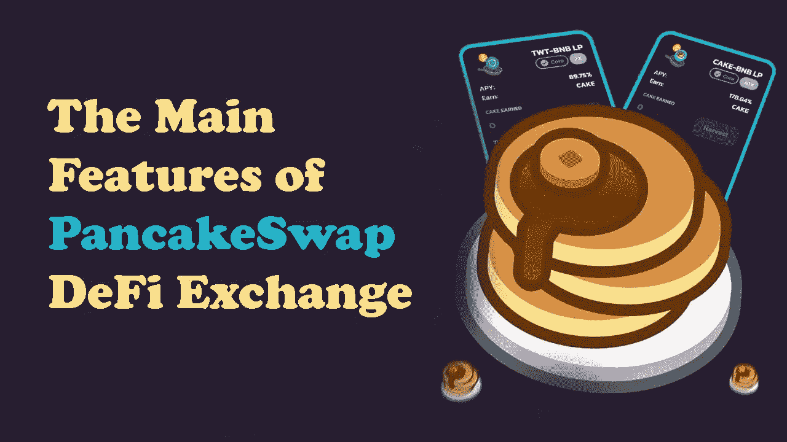
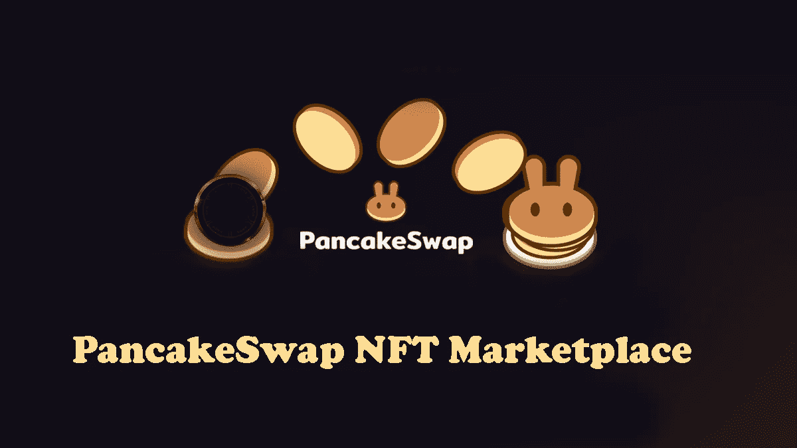
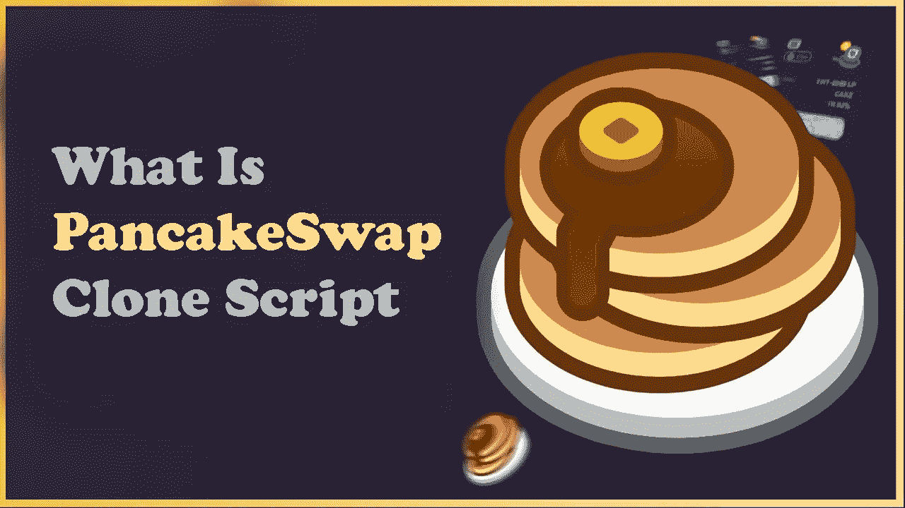
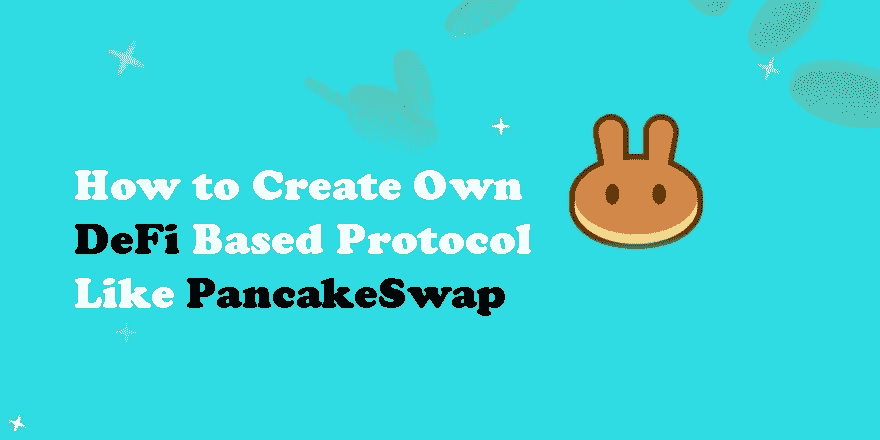

# 如何构建 PancakeSwap？

> 原文：<https://medium.com/nerd-for-tech/how-to-build-pancakeswap-9dda4202cdca?source=collection_archive---------6----------------------->

分散式第三代交换机越来越受欢迎，这要归功于它们向用户提供的激励。PancakeSwap 就是这样一个 DEX，所以在本文中，我们将告诉您它是什么以及它是如何工作的。

还有，我们将讲述一下 [***翻盘克隆剧本***](https://radindev.com/pancakeswap-clone-script/) ，以及它的特点！

# **什么是 PancakeSwap？**

PancakeSwap 是一个分散的交换平台，允许在币安智能链(BSC)内交换现有代币，而不会在任何时候失去资产的托管权。

其运作基于一系列分布在 BSC，币安区块链上的自动化智能合同。

## 【PancakeSwap 是如何工作的？

为了使 DEX 上存在流动性或资金，它们必须由用户贡献。这是通过代币对之间的流动性池来完成的，这要求其他用户通过他们的代币添加流动性，以便能够交易代币。

对于许多用户来说，PancakeSwap 最有趣的部分是它提供的各种功能。在 PancakeSwap 上，用户可以利用以下产品:

糖浆池

产量农场

首次农业发行(IFOs)

彩票

NFT 收藏

预测市场

# **PancakeSwap DeFi Exchange 的主要特点**

## **自动化市场(AMM)**

该指数基于自动做市(AMM)系统，这是一种用户可以在不失去代币所有权的情况下为交易所增加流动性的机制。换句话说，它的工作原理如下:

删除订单簿，在那里你必须找到一个卖家来出售你想买的代币和你想卖的代币。

用户通过基于智能合约创建流动性池来添加令牌供其他用户使用。

它允许交易者自由交易代币，代币持有者出借代币，并因增加流动性而获得奖励。

## **抽奖**

PancakeSwap 平台上最独特的产品之一是每 12 小时一次的 PancakeSwap 彩票。玩彩票给用户赢得蛋糕的机会。一张 PancakeSwap 彩票的价格大约相当于 5 美元的蛋糕，但如果你一次购买超过 100 张，就可以享受折扣。

## **PancakeSwap 的市场 NFT**

不可替换令牌(NFT)是存储在区块链上的独特数字资产。由于其独特的性质，NFT 是一种越来越流行的为艺术品、音乐和其他形式的数字文件等对象赋值的方法。

在 PancakeSwap NFT 市场上，你可以购买“煎饼收藏品”以及由收藏品所有者列出的其他 NFT。然后，所有者可以持有、展示并可能交换这些 NFT。反过来，NFT 收藏的创作者可以从随后的销售中获得版税。要将你的收藏放入 NFT 市场，你需要通过谷歌表格申请。

除了市场，PancakeSwap 还提供 NFT 简介。这些个人资料允许您使用以前购买的 NFT 作为您的个人资料图片，选择一个名字，并有可能加入一个团队。作为团队的一员，您将能够参加特殊活动，获得蛋糕、NFT 和成就等奖励。

## **首次农业发行(IFO)**

初始农场优惠(IFO)允许您在新的 PancakeSwap 代币公开发行前添加后立即获得这些代币。你交换(或“承诺”)你的蛋糕 BNB LP 令牌为新的项目令牌。在[的 PancakeSwap](https://pancakeswap.finance/) ，ifo 是限时活动，每次持续一小时。PancakeSwap 建议在 IFO 发行前提前准备好你的蛋糕 BNB LP 代币。一旦 IFO 上线，你就可以参与销售了。有两种销售你可以参与。第一种是基本销售，限制每个用户的购买量，但购买代币不收取佣金。第二种是无限销售，提供少量佣金，但购买金额没有限制。

## **在 PancakeSwap 上下注**

如果农业似乎有点太具挑战性，PancakeSwap 赌注是一种更简单的方式来赚取代币，并为 PancakeSwap 的现金池做出贡献。

不像农业，需要你先赚取 LP 硬币，只需要一种类型的令牌就可以开始通过赌注赚取。通过同意将代币锁定在现金池中一段时间，您将获得其他代币形式的利息奖励。大多数池允许下注和赚取额外的蛋糕，但也有一些特殊的池允许下注或赚取其他代币。在代币已经被下注一段时间之后，可以通过提取流动性(未下注)来收集这些奖励。

在下注时，您可以选择使用自动蛋糕池或手动蛋糕池。有了自动蛋糕糖浆池，您的赌注将自动拨你，让你放松和赚取代币。如果你对低努力的被动收入感兴趣，这是一个很好的选择。现在你可能已经猜到了，手动蛋糕池是相反的。这个糖浆池需要用户收集或拨蛋糕，所以需要多做一点工作。

## **如何使用 PancakeSwap？**

该平台可以通过 Metamak，TrustWallet，MathWallet，币安链钱包和其他钱包访问。一个很好的选择是 Metamaks，它允许你快速方便地添加 BSC 区块链，这样你就可以从你的浏览器访问以太坊和币安区块链。您也可以通过手机访问 PancakeSwap 应用程序。

我们在克隆脚本中开发了所有这些功能，与 PancakeSwap 完全相同。请在本文的其余部分继续关注我们，以了解关于我们的 pancake swap 克隆脚本开发的更多信息。

现在让我们一起来看看 PancakeSwap 克隆脚本是什么，以及它是如何工作的。

# **什么是 PancakeSwap 克隆脚本？**

PancakeSwap 克隆脚本完全响应，并提供了出色的用户体验。集成了各种功能，如加密货币钱包注册、令牌选择、容差设置、根据用户需求更改 UI 的交换或池化、额外信息按钮分析、不和谐、赌注、代码、农场以及 PancakeSwap 克隆软件等。PancakeSwap Clone 是一个完全准备好的分散式 exchange 币安智能链支持的 PancakeSwap 克隆脚本，用于协助推出 PancakeSwap 等 DEX 平台。

## **PancakeSwap 克隆脚本的特点**

令牌交换/交换

除去 KYC

优化培训

通往可持续发展的道路

匿名交易

闪存交换

自己保管代币

灵活性令牌交换

高度安全

轻松配对。

高效的智能合同。

多钱包整合。

交易成本低。

高回报。

## **如何创建自己的基于 DeFi 的协议，如 PancakeSwap？**

去我们的 PancakeSwap 克隆界面。

连接您的钱包

选择您想要交换的代币。

选择您想要兑换的令牌。

点击交换。

在弹出窗口中预览交易。

确认钱包中的交易请求。

## **Pancakeswap 克隆脚本的优势**

Pancakeswap 克隆脚本有许多显著的优点，以下是 Pancakeswap 克隆的一些常见优点:

为交换 ERC20 令牌提供了简单的选项

新代币提供了对流动性池的直接访问。

建立一个任何人都完全负担得起的基于流动性的交易所。

通过向流动性池提供资金来获取利润的能力。

100%分散式网络，没有第三方的参与

## **哪里有最好的煎饼互换克隆脚本？**

我们 Radin-是一家为各种业务领域提供加密货币兑换软件解决方案的提供商，拥有超过 6 年的经验，为企业在随需应变行业取得成功提供了良好的开端。我们在服务各种规模的企业方面经验丰富——从初创企业到大型组织；我们的产品能够在更大程度上支持业务扩展。在为企业管理每一项运营的解决方案中引入可靠性和可扩展性，我们成功地满足了客户的期望。

我们是我们领域的专家，你会从我们的第一次交流中体会到。你不信任我们？今天就来体验吧。

## **遗言**

现在您已经了解了 PancakeSwap，告诉我们您是否会使用这个 exchange 克隆脚本？请告诉我们你对此的看法。

我们希望您现在已经获得了回答“什么是 PancakeSwap 克隆脚本？”这个问题所需的所有信息。PancakeSwap 成为近年来最受欢迎的 dex 之一并不奇怪。我不知道你怎么想，但我们非常期待下一步会有什么新功能出现！