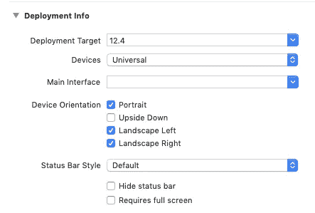
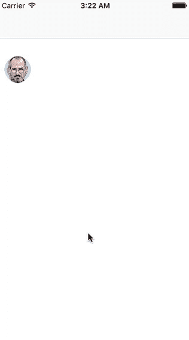
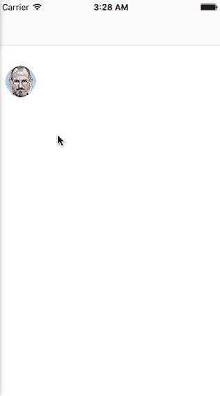
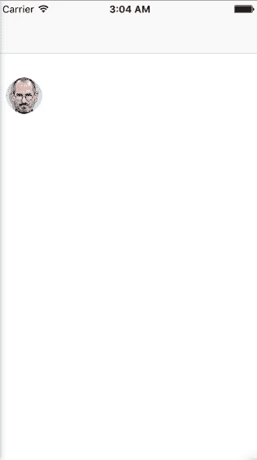

# 如何在 Swift 中构建滑出式菜单？

> 原文：<https://medium.com/nerd-for-tech/how-to-build-slide-out-in-swift-7f2ef0188aa?source=collection_archive---------1----------------------->

当你被要求构建 **Slide Out** 时，你想到的第一件事就是在你的项目中桥接 **SWRevealViewController** ，但是等等。

你以前有没有想过如何从头开始构建**滑动菜单**？

在本文中，我们将学习如何构建滑出式应用程序，所以让我们深入代码。

首先，确保你像那样从**主界面**中移除了**主界面**。

然后跳转到 **AppDelegate** ，在**difinishlaunchingwithoptions**中，你需要使用**窗口**参数来显示我们将在 **ViewController** 中写入的内容。

然后进入 **ViewController** 文件，将 **ViewController** 超类改为**UICollectionViewController**，我们需要将**视图**和**集合视图**设置为**白色**颜色。

让我们创建 **imageView** ，我们将在点击时使用它来显示**滑出**。

然后创建 **handleSlideOut** 函数，通过调整 **x** 框架，当点击 **imageView** 时，将**集合视图**从左向右移动。

然后给**的 profilemageView** 添加约束。

之后在**视图中调用该函数加载**

现在我们需要创建继承自**n object**的 **SlideOutView** 类，并创建名为 **showSlideOut** 的新函数。

在这个函数中，我们将把**动画**添加到**集合视图**中，首先创建一个名为 **blackView** 的变量，并添加 **backgroundColor** 和 **alpha** 以在点击 **profileImageView** 时出现。

返回到 **ViewController** 文件，创建 **slideOutView** 作为闭包。

通过这个闭包，你可以用它作为引用来调用 **showSlideOut** 函数，并将其添加到 **handleSlideOut** 函数中。

现在点击 **profileImageView** 可以显示 **blackView** 动画。

所以，是时候创建 **slideOutViewer** 在左侧显示了。
返回 **SlideOutView** 类，创建 **slideOutViewer** 闭包，设置 **backgroundColor** 为白色。

因此跳转到 **showSlideOut** 函数，并添加 **slideOutViewer** 引用，使用**帧**将 **slideOutViewer** 置于屏幕外，然后使用**动画**将 **x 帧的原点**设置为**零点**以显示之后的 **slideOutViewer** 。

当你运行你的应用程序时，你会看到**在点击图片时滑出**。

但是，怎样才能把**藏起来滑出**？

答案是当点击**黑屏**时，应该隐藏**滑出**。

那么，你怎样才能做到呢？

我们需要返回到 **showSlideOut** 函数，并将 **UITapGestureRecognizer** 添加到 **blackView** 中。

现在，让我们创建这个函数。

在这个函数中，我们将通过将 **x 帧的原点**设置为-250 来隐藏 **slideOutViewer** ，并通过在 **animate** 函数中将 alpha 设置为零来隐藏 **blackView** 。

隐藏了 **slideOutViewer** 之后，现在是时候通过转到 **ViewController** 文件，创建 **dismissView** 函数，并将**集合视图**的 x 和 y **帧**设置为**零**来将**集合视图**放回原处。

现在要在两个视图之间建立一个连接，你需要首先在 **SlideOutView** 类中创建一个 **ViewController** 的引用，我们把它命名为 **homeViewController** 。

使用该引用调用我们在 **ViewController** 文件中创建的 **dismissView** 函数，并将其添加到 **DismissSlideOut** 函数中。

返回到 **ViewController** 文件，并在 **slideOutView** 闭包中添加这一行，以将关于 **ViewController** 文件的所有信息提供给我们之前创建的 **homeViewController** 引用。

就是这样。

现在轮到你建立自己的了。

看看一个[项目](https://github.com/ahmedelserafy7/Slide-Out)。